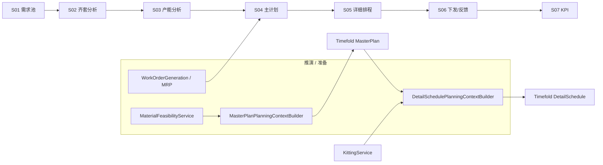
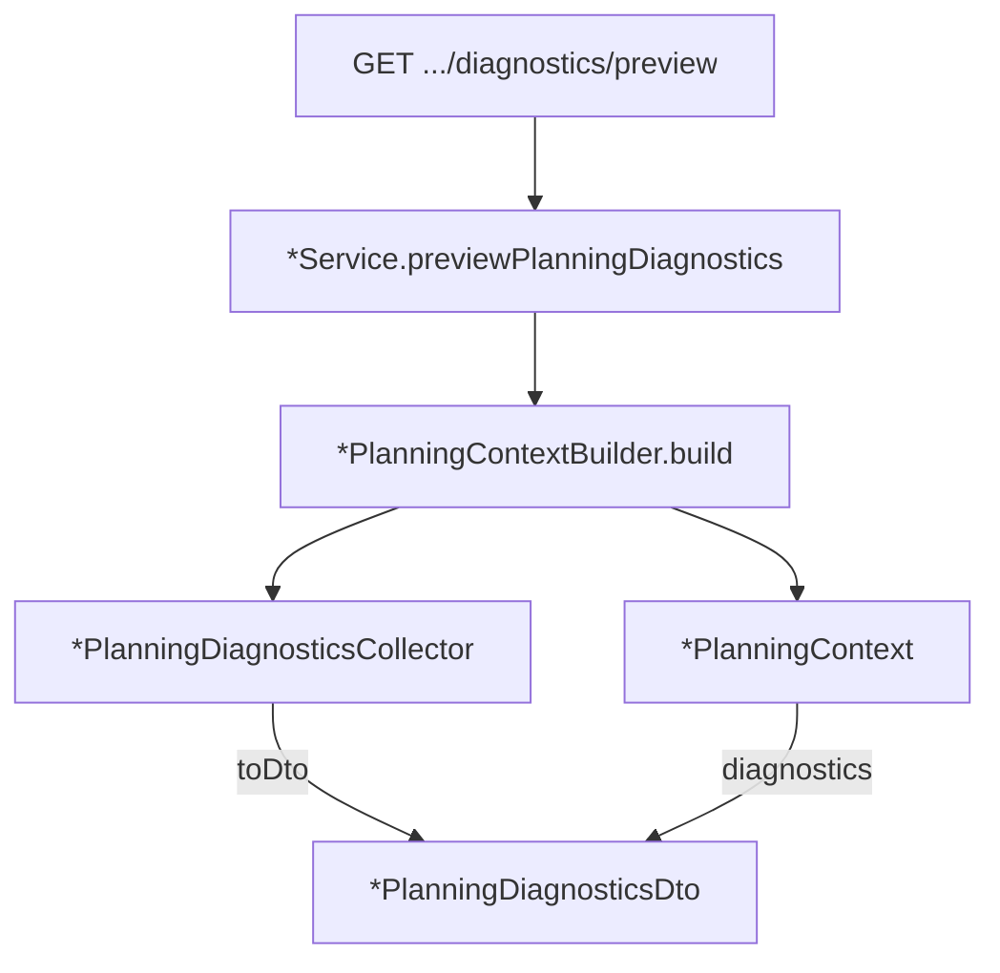

# APS 推演层架构说明

本文描述 Plant Operation Plan 中 **确定性推演层** 与 **Timefold 选优层** 的分工，以及 S04 主计划 / S05 详细排程的代码落点。与流水线总览见 [architecture.md](./architecture.md)；BOM/MRP/工单见 [master-plan-bom-routing.md](./master-plan-bom-routing.md)。

---

## 1. 设计原则

| 层次 | 职责 | 典型输出 |
|------|------|----------|
| **推演层**（`com.plantops.scenario.planning`） | 对象实例关系 + 确定性计算：MRP 物料、齐套、可行域、工序展开、主计划契约 | `*PlanningContext`（不含得分） |
| **选优层**（Timefold） | 在候选域内搜索：槽位分配（S04）、产线排序（S05） | `MasterPlanSchedule` / `DetailSchedule` + Score |
| **服务层**（`*Service`） | 编排求解、持久化、API、Gantt/产能视图 | `planVersionId`、DTO |

**核心约定：**

- Timefold **只在需要选优时**调用（S04 槽位、S05 产线/顺序）。
- 物料可行性（S04）与齐套（S05）在推演阶段 **预计算**，以 Problem Fact 或实体字段注入求解器。
- 主计划粒度为 **工序级**（`product_resource` 路由 → 多条 `OrderAllocation`），资源键为 **`resourceId`**（非 `lineId`）；详细排程在 **`lineId`** 上排分钟级顺序。
- 主计划对详细排程输出 **软契约**（工序窗口 + 目标资源），由 `ScheduleContractSettings` 加权。

---

## 2. 流水线与推演插入点



| 步骤 | 服务 | 推演 / 求解 |
|------|------|-------------|
| S01 | `DemandService` | 需求池（销售订单行） |
| S02 | `KittingService.compute()` | 订单行级齐套报告（持久化） |
| S03 | `CapacityService` | 负荷/利用率（可读主计划结果） |
| S04 | `MasterPlanService` | **推演** → `MasterPlanPlanningContext` → **Timefold** |
| S05 | `DetailScheduleService` | **推演** → `DetailSchedulePlanningContext` → **Timefold** |
| 编排 | `PlanningOrchestrator` | 串联 S01–S05；可选排程后反馈滚动刷新主计划 |

---

## 3. 包结构：`com.plantops.scenario.planning`

```
planning/
├── InventorySnapshot.java                   # 期初库存快照
├── MaterialPlanningContext.java             # S04/S05 共享物料上下文
├── MaterialPlanningContextBuilder.java
├── MasterPlanOperationPrecedenceBuilder.java  # 工序先后边
├── MasterPlanPlanningContext.java           # S04 推演快照
├── MasterPlanPlanningContextBuilder.java    # S04 P0–P4
├── MasterPlanAllocationBuilder.java         # 工单 → OrderAllocation（含 FINITE 拆段）
├── MasterPlanProblemMapper.java             # Context → MasterPlanSchedule
│
├── DetailSchedulePlanningContext.java       # S05 推演快照
├── DetailSchedulePlanningContextBuilder.java
├── DetailScheduleAssignmentBuilder.java     # 工单 → OperationAssignment
├── MasterPlanContractLoader.java            # 主计划版本 → 工序契约
├── DetailScheduleProblemMapper.java         # Context → DetailSchedule
├── SimulationProfileService.java            # Session 推演配置 CRUD / 快照
│
├── simulation/
│   ├── SimulationPipeline.java              # full / incremental 编排
│   ├── DetailScheduleTimingKernel.java      # Session 与 Timefold shadow 共用赋时内核
│   ├── SimulationRuleRegistry.java          # Timing / Closure / Validation 规则开关
│   ├── timing/                              # 换型、工艺链、日历、反馈冻结等赋时规则
│   ├── closure/                             # 增量波及闭包规则
│   └── validation/                          # 推演后违背扫描
│
└── diagnostics/
    ├── PlanningDiagnosticCodes.java
    ├── MasterPlanPlanningDiagnosticsCollector.java
    └── DetailSchedulePlanningDiagnosticsCollector.java
```

**诊断 DTO：** `api/dto/planning/`（见 §8.3）。

**服务委托关系：**

```java
// MasterPlanService
MasterPlanPlanningContext ctx = planningContextBuilder.build(strategy, objectives, overlay);
MasterPlanSchedule problem = problemMapper.toSchedule(ctx);

// DetailScheduleService
DetailSchedulePlanningContext ctx = planningContextBuilder.build(masterPlanVersionId);
DetailSchedule problem = problemMapper.toSchedule(ctx);
```

---

## 4. S04 主计划推演（P0–P4）

### 4.1 阶段说明

| 阶段 | 内容 | 主要类 |
|------|------|--------|
| **P0 事实装载** | 规划起点、`TimeSlot` 时隙、MRP 物料闭合库存、BOM 依赖边、最早可行下界 | `TimeslotHorizonService`, `MaterialFeasibilityService`, `WorkOrderTimingService.buildMasterPlanBounds()` |
| **P1 工单筛选** | 可排程（非取消）、冻结窗口内跳过、工艺非空、需求优先级/锁定 | `WorkOrderScheduleContext`, `ScheduleFeedbackService`, `BusinessRuleScopeService` |
| **P2 工序展开** | 按 `product_resource` 逐步生成 `OrderAllocation`；`FINITE_CAPACITY` 按日产能拆段 | `MasterPlanAllocationBuilder`, `ProductRoutingSteps` |
| **P3 可行域** | 每分配 `eligibleTimeSlots`：资源匹配 + 反馈 overlay + 最早可行槽位（无可行则回退全槽位，软惩罚） | `WorkOrderTimingBoundsContext`, `MasterPlanCapacityOverlay` |
| **P4 投影求解** | `MasterPlanProblemMapper` → Timefold | `MasterPlanConstraintProvider` |

### 4.2 规划实体：`OrderAllocation`

- **一条记录 = 工单 × 工序 ×（可选）拆段**。
- **ID 格式**：`{workOrderNo}@OP{operationSeq}_{operationOrdinal}#{segmentIndex}`  
  - `operationOrdinal`：同序号工序在路由中的循环下标，保证 planningId 唯一。  
  - `segmentIndex`：跨天拆段序号。
- **资源**：`resourceId`（`ProductionResourceEntity` + 日历汇总产能）。
- **硬约束示例**：资源匹配、槽位产能、BOM 上下游顺序、（软）物料可行、（软）最早可行开始、（软）交期延迟。
- **串行路由**：当前 P1 假定同工单工序 **严格串行**；并行工序不在主计划展开，留待预处理或额外 precedence 边（见 §7）。

### 4.3 物料可行性（MRP）

- **构建**：`MaterialFeasibilityService.prepareContext()` → `MaterialFeasibilityContext`（按日闭合库存 + BOM 快照）。
- **使用**：`MasterPlanConstraintProvider.materialFeasibleOnSlot`（硬约束）；与 `MaterialFeasibilityEvaluator` 共用判定逻辑。
- **与齐套区别**：主计划看 **时间维度上的物料闭合**；详细排程齐套看 **当前库存池能否满足工单**（见 S05）。

### 4.4 最早可行时间

- **计算**：`WorkOrderTimingService`（关键件 max 并行备料、采购提前期规则、子工单上游交付）。
- **下界**：`WorkOrderTimingBoundsContext` 注入主计划；违反最早可行开始为 **高惩罚软约束**（交期不可达仍排产，付延期成本）。

---

## 5. S05 详细排程推演（P0–P4）

### 5.1 阶段说明

| 阶段 | 内容 | 主要类 |
|------|------|--------|
| **P0 事实装载** | 排程锚点、`ScheduleContractSettings`、主计划工序契约、开线决策 | `MasterPlanContractLoader`, `LineOpeningDecisionEntity` |
| **P1 产线域** | `ScheduleLine`（`lineId` / `resourceId` / 是否开线 / 班产能） | `ProductionLineEntity` |
| **P2 齐套推演** | 全局库存池顺序消耗 → `OperationAssignment.kittingEligible` | `KittingService.checkAndConsumeWorkOrderKitting` |
| **P3 工序展开** | 同工单逐步 `OperationAssignment`；写入主计划契约字段 | `DetailScheduleAssignmentBuilder` |
| **P4 绑定规则** | 并行工序、连续生产等 **硬约束预处理**（绑定组） | `ParallelOperationBindingService`, `ContinuousProductionBindingService` |

### 5.2 规划实体：`OperationAssignment`

| 字段 | 来源 | 约束作用 |
|------|------|----------|
| `kittingEligible` | P2 齐套推演 | 标记是否齐套；未齐套仍可上产线 |
| `earliestStartMinute` | P2 + `kitting_lock_t_hours` | 未齐套时最早开工推后（分钟，相对锚点） |
| `mpContractStartDate` / `mpContractEndDate` / `mpContractResourceId` | P0 主计划契约 | 软约束 + `ScheduleTimingUtil` 最早开工等待 |
| `mpTargetEndDate` | 契约或工单末槽回退 | 软约束：相对主计划偏差 |
| `pinned` | 订单排程锁定 + 规则项目启用 | 硬约束：固定产线 |
| `line` / `startMinute` | **Timefold 决策变量** | 选优结果 |

**赋时**：求解后 `ScheduleTimingUtil.applyLineStartTimes` 按产线 cursor 顺序填分钟级开始/结束（含契约开始日等待）。

### 5.3 主计划 → 详细排程契约

`MasterPlanContractLoader.load(planVersionId)`：

- 解析 `master_plan_allocation.allocation_id` 中的 `@OP{seq}_{ord}#`。
- 同工单同工序多段合并为 `startDate = min(slotDate)`，`endDate = max(slotDate)`。
- 无工序级契约时，按工单末槽 + 工序序号回退 `mpTargetEndDate`。

### 5.4 推演层统一预览 API（S05）

`POST /api/v1/planning/detail-schedule/preview`（`DetailSchedulePlanningPreviewRequest`）在**同一套** `DetailSchedulePlanningContext` 上工作：

| 模式 | 请求 | 行为 |
|------|------|------|
| 仅推演 | 默认（`solve=false`） | P0–P4 + 全部工序候选，无产线/时间 |
| 初始可行态 | `seedInitialQueues=true` | `ProblemMapper` 种子队列 + `LineChainTimingUtil` 赋时，**不**调用 Timefold |
| 内存求解 | `solve=true` | Context → `DetailSchedule` → Timefold → 赋时；结果反写到同一批 `OperationAssignment` |
| 正式排程 | `solve=true` & `persist=true` | 同上并落库，等价于 `POST .../detail-schedule/solve` |

`GET .../detail-schedule/diagnostics/preview` 保留为轻量诊断；新接口返回 `DetailSchedulePlanningPreviewDto`（诊断 + 产线 + 工序 + 可选 score/版本号）。

前端入口：**主计划 → 推演诊断** 页「运行推演预览」。

### 5.5 主计划推演层统一预览 API（S04）

`POST /api/v1/planning/master-plan/preview`（`MasterPlanPlanningPreviewRequest`）在**同一套** `MasterPlanPlanningContext` 上工作：

| 模式 | 请求 | 行为 |
|------|------|------|
| 仅推演 | 默认（`solve=false`） | P0–P4 + 分配候选，无槽位 |
| 内存求解 | `solve=true` | Context → `MasterPlanSchedule` → Timefold；结果反写到同一批 `OrderAllocation` |
| 正式主计划 | `solve=true` & `persist=true` | 同上并落库，等价于 `POST .../master-plan/solve` |

可选 `feedbackCutoff` 构建反馈产能 overlay（与滚动刷新主计划一致）。`GET .../master-plan/diagnostics/preview` 仍保留为轻量诊断。

### 5.6 SchedulingSession 与增量推演（已实现）

计划员工作流：**创建 Session → 手动改（可选）→ 增量推演 / 全量重算 → 校验 → 确认发布**；**不**默认调用 Timefold（主动优化见 `optimize`）。详细规则见 [detail-schedule-simulation-layer.md](./detail-schedule-simulation-layer.md)。

| 类 | 职责 |
|----|------|
| `SchedulingSession` / `SchedulingSessionStore` | 内存工作副本（8h TTL） |
| `DetailScheduleSessionService` | create / get / simulate / optimize / confirm |
| `DetailScheduleSessionMutation` | `SessionStepPatchDto`：改产线、队列顺序、锁定 |
| `SimulationPipeline` | `fullSimulate` / `incrementalSimulate` 编排；`DetailScheduleSimulationEngine` 仅作 REST/测试兼容门面 |
| `DetailScheduleTimingKernel` | Session 显式赋时与 Timefold shadow 共同委托的链式赋时内核 |
| `SimulationProfileService` / `SimulationProfileResolver` | 解析 Session profile 快照、当次 `ruleOverrides`、`feedbackCutoff` |
| `ScheduleValidationService` / `ValidationPipeline` | 硬/中约束校验（工艺链、并行对、连续生产、齐套未分配等） |
| `ProductionTaskService` | confirm 时 upsert `RELEASED` + `planning_conflict` |

**规则启用顺序**：规则类型必须先在业务规则页启用（`BusinessRuleScopeService.isDetailScheduleEnabled`），再由 `simulation_profile.config_json` 或当次 `ruleOverrides` 控制。Profile 默认 JSON 关闭 Phase 3 扩展规则：

```json
{
  "timing": {
    "maxRoutingIterations": 16,
    "rules": {
      "factory-calendar": { "enabled": false },
      "feedback-freeze": { "enabled": false }
    }
  },
  "incremental": {
    "rules": {
      "batch-continuous": { "enabled": false }
    }
  },
  "validation": { "blockConfirmOnHard": false }
}
```

**REST**（`ScheduleSessionResource`）

| 方法 | 路径 | 说明 |
|------|------|------|
| POST | `/api/v1/planning/schedule-sessions` | 从 `masterPlanVersionId` 创建 Session；可传 `simulationProfileId`，创建时快照 profile |
| GET | `/api/v1/planning/schedule-sessions/{id}` | 查看 Session 快照 |
| GET | `/api/v1/planning/schedule-sessions/{id}/operations/{operationId}/candidate-lines` | 查询单工序可选产线 |
| PATCH | `/api/v1/planning/schedule-sessions/{id}/steps` | 手动 patch + **增量推演**（等价于 simulate + patches） |
| POST | `/api/v1/planning/schedule-sessions/{id}/simulate` | 增量或全量推演 + 校验 |
| POST | `/api/v1/planning/schedule-sessions/{id}/optimize` | **主动** Timefold |
| POST | `/api/v1/planning/schedule-sessions/{id}/confirm` | 落库 `plan_version` + RELEASED 生产任务 |
| GET/POST | `/api/v1/planning/simulation-profiles` | 列出 / 保存推演 profile |
| GET/DELETE | `/api/v1/planning/simulation-profiles/{profileId}` | 查看 / 删除指定 profile |

**`SimulateScheduleSessionRequest`**

| 字段 | 含义 |
|------|------|
| `stepPatches` | 手动调整（改线 / 顺序 / 锁定） |
| `affectedOperationIds` | 增量种子（无 patch 时指定波及起点） |
| `fullReschedule` | `true` 时全量链式重算；默认无种子则全量 |
| `simulationProfileId` | 当次推演切换 profile；为空时使用 Session 创建时快照 |
| `ruleOverrides` | 当次覆盖规则开关，例如 `{ "factory-calendar": { "enabled": true } }` |
| `feedbackCutoff` | ISO 日期；启用 `feedback-freeze` 时构造冻结索引 |

**Phase 3 扩展规则**

| ruleTypeId | 插件类型 | 作用 |
|------------|----------|------|
| `factory-calendar` | `TimingRule` | 按资源日历与班次窗口 snap 开工时间 |
| `feedback-freeze` | `TimingRule` + `ValidationRule` | cutoff 前冻结反馈工序保持原计划开工 |
| `batch-continuous` | `AffectedClosureRule` + `ValidationRule` | 增量闭包纳入同批次同线工序，并校验批次插队 |

增量模式从种子扩展：**工艺后继**、**并行配对**、**同产线队列后缀**、以及启用后的 **批次连续**，再由 `DetailScheduleTimingKernel` 全局收敛赋时（返回 `recalculatedOperationIds`）。响应附带 `appliedRules` 与最终 `simulationProfileId`，便于排查本次推演实际生效的规则。

若 profile 设置 `validation.blockConfirmOnHard=true`，`confirm` 会重新全量校验，存在 HARD 级违背时返回 400，不落库发布。

**前端**：**生产排程**页 Session 推演面板 + 甘特/列表「Session 推演」视图；**推演诊断**页保留预览入口。

---

## 6. Timefold 边界一览

| 项目 | 主计划 S04 | 详细排程 S05 |
|------|------------|--------------|
| **Solution** | `MasterPlanSchedule` | `DetailSchedule` |
| **Planning Entity** | `OrderAllocation` | `ScheduleLine` |
| **Value Range** | `TimeSlot`（按资源） | `OperationAssignment`（`operationRange`） |
| **决策变量** | `timeSlot` | `assignedOperations` list-variable；`OperationAssignment.line` 为 inverse shadow |
| **Problem Facts** | 物料上下文、BOM 边、相邻槽位对、overlay、timing bounds、目标权重 | 契约权重、换型索引、工序流转索引、锚点日、班产能 |
| **不在求解器内** | 工单生成、MRP 闭合、工艺展开、eligible 过滤 | 齐套标记、契约加载、并行/连续绑定 |

---

## 7. 规则与配置

### 7.1 规则项目级启用范围

`BusinessRuleScopeEntity` + 前端 `BusinessRuleScopePanel`：**主计划 / 排程** 开关在 **规则类型** 层级（换型、齐套/BOM、采购提前期等），不在单条规则条目上。

`BusinessRuleScopeService.isMasterPlanEnabled(ruleTypeId)` / `isDetailScheduleEnabled(...)` 供推演与约束加载使用。

### 7.2 策略与场景

- **主计划策略**：`MasterPlanStrategyConfigService`（产能模式 `UNCONSTRAINED` / `FINITE_CAPACITY` + 目标权重 JSON）。
- **排程契约**：`ScheduleContractConfigService` → `ScheduleContractSettings`（`weight_mp_early` / `weight_mp_late` 等）。
- **场景 / 规则版本**：`PlanningScenarioService`、`RuleSetVersionService`；流水线运行前可 `applyToWorkspace`。

---

## 8. 扩展点（已识别、未完全实现）

### 8.1 主计划并行工序（已实现）

**同工序多资源（可替代 + 优先级）**：

- `product_resource` 中相同 `sequenceNo` 的多行表示该工序可在多台资源上加工，**不是**并行也不是硬互斥。
- 字段 `resourcePriority`（数值越小越优先）决定占用顺序；主计划每道工序只生成 **一条** `OrderAllocation`，`allowedResourceIds` 含全部备选资源。
- 硬约束：分配槽位资源必须在 `allowedResourceIds` 内；软约束 `Prefer higher priority resource` 优先高优先级资源，高优先级满负荷时可落到备选。

**并行工序（不同料号同槽）**：

1. **串行工序先后**：`MasterPlanOperationPrecedenceBuilder` 为同工单相邻工序生成 `OperationPrecedenceEdge`；`operationSerialPrecedence` 硬约束。
2. **并行工序同槽**：`MasterPlanParallelBindingService` + `parallelOperationsSameSlot`（配对料号同槽，与上节「同工序多资源」无关）。**拆段同步**：同一 `segmentIndex` 的拆段各自成组（`groupId#S{n}`），不再只绑首段。
3. **孤儿 / 无交集回退**：见 `parallelOrphan`、`ALLOC_PARALLEL_NO_COMMON_SLOT`。
4. **规则开关**：`BusinessRuleScopeService.isMasterPlanEnabled(PARALLEL_OPERATIONS)`。

**诊断**：`parallelOperationGroups`、`parallelOperationOrphans`、`parallelSlotIntersections`、`parallelSlotIntersectionFallbacks`、`operationPrecedenceEdges` 写入 S04 推演诊断。

**仍留 S05 细排独有逻辑**：分钟级同起同止、产线锁定（并行配对规则）；同工序多资源 + 优先级已与 S04 对齐（`allowedResourceIds` + 软约束 `Prefer higher priority resource`）。

### 8.2 统一库存快照（已实现）

**现状**：流水线运行中 `MaterialPlanningContextBuilder` 一次构建 `InventorySnapshot`，S04 `MaterialFeasibilityService` 与 S05 `KittingService` 只读同一期初库存池。

| 类 | 职责 |
|----|------|
| `InventorySnapshot` | 不可变期初库存（`InventoryEntity` 汇总） |
| `MaterialPlanningContext` | S04/S05 共享引用 + `inventorySnapshotId` |
| `MaterialPlanningContextBuilder` | 工作区库存一次加载 |

**诊断**：S04/S05 诊断 DTO 均带 `inventorySnapshotId`；同一流水线运行中两者 ID 一致即表示推演一致。

**仍分离的部分**：S04 另做按日 MRP 闭合（需求/供给时序）；S05 做顺序齐套消耗（可变池副本）。BOM 关键件规则仍分 `criticalForMasterPlan` / `criticalForDetailSchedule`。

### 8.3 推演层可观测性

推演可观测性在 **Timefold 求解之前** 采集：与 `*PlanningContextBuilder` 的 P0–P4 同一次遍历，零额外 I/O。用于回答「某工单为何未进入候选」「某工序分配为何无 eligible 槽位」「齐套/主计划契约如何影响 S05」——**不跑 30s 求解**即可预览。

#### 8.3.1 设计目标

| 问题类型 | 典型用户疑问 | 诊断手段 |
|----------|--------------|----------|
| 工单被跳过 | 甘特/主计划里看不到某 WO | `issues` 中 `severity=SKIP` + `reasonCode` |
| 分配被丢弃 | 有工艺但无槽位 | `ALLOC_NO_RESOURCE_SLOTS` + 计数 `orderAllocationsDroppedNoSlots` |
| 时窗降级 | 有槽但早于「最早可行开始」 | `ALLOC_TIMING_FALLBACK`（仍进候选，靠软约束惩罚） |
| 齐套 | 未齐套仍可排产，最早开工推后 | `WO_KITTING_SHORT` / `operationsKittingIneligible` |
| 契约缺失 | 偏离主计划 | `OP_MP_TARGET_FALLBACK` vs `operationsWithMpContract` |

**不在本阶段覆盖：** ~~Timefold 得分分解~~（已实现，见 §8.3.10）；求解后未选中的槽位原因仍需结合推演诊断解读。

#### 8.3.2 数据模型

```
com.plantops.api.dto.planning/
├── PlanningDiagnosticIssue          # 单条样本
├── MasterPlanPlanningDiagnosticsDto # S04 快照
└── DetailSchedulePlanningDiagnosticsDto # S05 快照
```

**`PlanningDiagnosticIssue`**

| 字段 | 含义 |
|------|------|
| `severity` | `SKIP`（未进入 replannable 候选）\| `WARN`（进入候选但有风险）\| `INFO` |
| `reasonCode` | 稳定机器码，见 `PlanningDiagnosticCodes` |
| `workOrderNo` | 关联工单 |
| `entityId` | 工序分配 ID / operationId（可空） |
| `message` | 人类可读说明（含资源、日期等上下文） |

**快照 DTO 公共字段：** `computedAt`、`counters`（聚合计数）、`issues`（最多 100 条样本）、`issuesTruncated`。

S04 额外：`capacityStrategy`、`overlayActive`（是否启用反馈 overlay 过滤槽位）。

S05 额外：`masterPlanVersionId`（契约加载来源）。

#### 8.3.3 采集架构



- **Collector**（`com.plantops.scenario.planning.diagnostics`）：Builder 单线程、`LinkedHashMap` 计数 + `ArrayList` issue；`recordSkip` 同时递增 skip 计数器；issue 达上限后只设 `issuesTruncated=true`。
- **Context 挂载**：`MasterPlanPlanningContext.diagnostics()` / `DetailSchedulePlanningContext.diagnostics()` 与 slots、allocations 同级，求解路径 `buildProblem()` 同样构建，后续可写入 pipeline run 日志。

#### 8.3.4 S04 采集点（`MasterPlanPlanningContextBuilder`）

| P 阶段 | 采集动作 | reasonCode / counter |
|--------|----------|----------------------|
| P0 | 时隙数、BOM 边数 | `timeSlotCount`, `bomDependencyEdgeCount` |
| P1 | 每 WO 扫描 | `workOrdersScanned` |
| P1 | 不可排程 / 冻结 / 无工艺 / 无分配 | `WO_*` → 对应 `workOrdersSkipped*` |
| P2 | 成功展开 | `workOrdersWithAllocations`, `orderAllocationsCandidate` |
| P3 | 锁定分配 | `orderAllocationsLocked` |
| P3 | 资源无槽 → **丢弃** | `ALLOC_NO_RESOURCE_SLOTS`, `orderAllocationsDroppedNoSlots` |
| P3 | 时窗回退 → **保留** | `ALLOC_TIMING_FALLBACK`, `orderAllocationsTimingFallback` |
| P4 | 进入 Timefold 的分配数 | `orderAllocationsReplannable` |

**P3 过滤逻辑（与诊断一致）：**

```text
base = slots 中 resourceId 匹配 ∧ overlay 未占用
若 base 为空 → 丢弃分配（SKIP issue）
feasible = base 中 slotAllowed(wo, slot)（最早可行下界）
若 feasible 为空 → eligibleTimeSlots = base + WARN（软约束惩罚）
否则 → eligibleTimeSlots = feasible
```

#### 8.3.5 S05 采集点（`DetailSchedulePlanningContextBuilder`）

| P 阶段 | 采集动作 | reasonCode / counter |
|--------|----------|----------------------|
| P0 | 主计划契约条数 | `masterPlanContractsLoaded` |
| P1 | 产线总数 / 开线数 | `scheduleLinesTotal`, `scheduleLinesOpened` |
| P2 | 齐套失败 | `WO_KITTING_SHORT` → `operationsKittingIneligible` |
| P3 | 工序契约 vs 末槽回退 | `operationsWithMpContract` / `OP_MP_TARGET_FALLBACK` |
| P4 | 绑定扫描 | `parallelPairedOperations`, `parallelOrphanOperations`, `continuousProductionOperations` |

#### 8.3.6 reasonCode 速查

| reasonCode | 层 | 含义 |
|------------|-----|------|
| `WO_NOT_SCHEDULABLE` | S04/S05 | 取消单或无有效交期 |
| `WO_FROZEN_THROUGH_CUTOFF` | S04 | 反馈截止日前已冻结 |
| `WO_NO_ROUTING` | S04/S05 | 无 `product_resource` 工艺 |
| `WO_NO_ALLOCATIONS` | S04 | 工艺步骤未解析到 resourceId |
| `ALLOC_NO_RESOURCE_SLOTS` | S04 | 分配被丢弃（无可用槽） |
| `ALLOC_TIMING_FALLBACK` | S04 | 时窗回退到全 base 槽 |
| `WO_KITTING_SHORT` | S05 | 齐套池不足 |
| `OP_MP_TARGET_FALLBACK` | S05 | 无工序级契约，用工单末槽作目标 |

#### 8.3.7 REST API

**主计划预览（不求解）：**

```http
GET /api/v1/planning/master-plan/diagnostics/preview?strategyId={optional}
```

**详细排程预览：**

```http
GET /api/v1/planning/detail-schedule/diagnostics/preview?masterPlanVersionId={optional}
```

服务入口：

- `MasterPlanService.previewPlanningDiagnostics(strategyId)` — 解析策略、延展日历、空 overlay 构建 context。
- `DetailScheduleService.previewPlanningDiagnostics(masterPlanVersionId)` — 加载契约与开线决策后构建 context。

**响应示例（S04 片段）：**

```json
{
  "computedAt": "2026-05-30T10:15:00",
  "capacityStrategy": "FINITE_CAPACITY",
  "overlayActive": false,
  "counters": {
    "workOrdersScanned": 120,
    "workOrdersSkippedNotSchedulable": 3,
    "orderAllocationsCandidate": 840,
    "orderAllocationsReplannable": 812,
    "orderAllocationsDroppedNoSlots": 28,
    "orderAllocationsTimingFallback": 15
  },
  "issues": [
    {
      "severity": "WARN",
      "reasonCode": "ALLOC_TIMING_FALLBACK",
      "workOrderNo": "WO-MRP-1-2411498-6-20260619-2",
      "entityId": "WO-MRP-1-2411498-6-20260619-2@OP10_0#0",
      "message": "无「不早于最早可行开始」槽位，回退全部 45 个槽位并由软约束惩罚"
    }
  ],
  "issuesTruncated": false
}
```

#### 8.3.8 解读工作流

1. 看 **counters 漏斗**：`scanned` → `withAllocations` → `candidate` → `replannable`；差值即被 P1/P3 吃掉的数量。
2. 若 `replannable < candidate`，查 `droppedNoSlots` 与 `timingFallback`。
3. 在 **issues** 中按 `workOrderNo` 过滤具体 WO；`issuesTruncated=true` 时仅见前 100 条，以 counter 为准。
4. S05：若 `operationsKittingIneligible > 0`，工序仍进 Problem 但 **硬约束** 禁止上产线；与 S04 物料可行（软约束）不同。

#### 8.3.9 后续扩展

- ~~将 `context.diagnostics()` 写入 `PlanningPipelineRun` 各 step 的 metadata~~（已实现：`diagnostics_json` + 运行日志摘要）
- ~~反馈滚动场景：`preview` 增加 `feedbackCutoff` + overlay 参数~~（已实现：`GET .../diagnostics/preview?feedbackCutoff=`）
- ~~前端：`PlanningDiagnosticsPanel` 已接入 **计划运行** / **生产排程** / **计划分析** 页~~
- ~~选优层约束 explain / score 分解（P4）~~（见 §8.3.10）

#### 8.3.10 选优层得分分解（已实现）

对已持久化的主计划 / 详细排程版本，在不重跑 Timefold 求解的前提下，恢复规划实体赋值并调用 `SolutionManager.explain()`，返回约束级得分与匹配样本。

| 类 | 职责 |
|----|------|
| `PlanningScoreExplainService` | 编排 restore + explain |
| `MasterPlanSolutionRestorer` | 按策略重建 context，按 `allocationId` 恢复 `timeSlot` |
| `DetailScheduleSolutionRestorer` | 按 `masterPlanVersionId` 重建 context，恢复 `line` / `startMinute` |
| `PlanningScoreExplainer` | `ScoreExplanation` → DTO（匹配样本截断） |

**REST**

```http
GET /api/v1/planning/master-plan/{versionId}/score-explanation
GET /api/v1/planning/detail-schedule/{versionId}/score-explanation?masterPlanVersionId={mpId}
```

细排 explain 需传入契约来源主计划版本（`PlanVersionEntity` 未存该关联）。

**前端**：计划分析 → 诊断 Tab →「选优层得分分解」面板（`PlanningScoreExplanationPanel`）。

**解读**：先看 `hardScore` 是否为 0；非零硬约束见 `constraintTotals` 中 `hardScore != 0` 的行；软约束优化目标见 `softScore` 分解。`matchesTruncated=true` 时仅展示部分匹配样本。

### 8.4 编排层显式化

`PlanningOrchestrator` 在 S04/S05 求解前显式 `buildPlanningContext`，写入诊断日志与 `diagnostics_json`；Timefold 求解通过 `solveWithPlanningContext` 投影已构建上下文。

### 8.5 订单推演链（已实现）

基于 `MasterPlanPlanningContext` + 可选 `DetailSchedulePlanningContext`，对单条销售订单行生成 **不求解** 的全链可视化数据。

| 类 | 职责 |
|----|------|
| `OrderPlanningChainService` | 构建双 Context + peg 拓扑 |
| `OrderPlanningChainProjector` | eligible 槽时间窗、`planningSignals`、S05 齐套/契约信号 |
| `OrderPlanningChainDto` | REST 出参 |

**REST**

```http
POST /api/v1/planning/order-chain/preview
```

**前端**：主计划 → 计划分析 → **订单推演**（`/master-plan/analysis/order-chain`）

与 `FulfillmentPeggingService` 满足链的区别：时间窗来自 **推演 eligible 槽** 而非 lead-time 启发式；可选 `baselineMasterPlanVersionId` 与求解结果对比。

---

## 9. 关键文件索引

| 主题 | 路径 |
|------|------|
| S04 推演入口 | `scenario/planning/MasterPlanPlanningContextBuilder.java` |
| S04 求解入口 | `scenario/MasterPlanService.java` |
| S04 约束 | `solver/masterplan/MasterPlanConstraintProvider.java` |
| S05 推演入口 | `scenario/planning/DetailSchedulePlanningContextBuilder.java` |
| S05 求解入口 | `scenario/DetailScheduleService.java` |
| S05 约束 | `solver/detailschedule/DetailScheduleConstraintProvider.java` |
| 物料 MRP | `scenario/MaterialFeasibilityService.java` |
| 主计划并行工序 | `scenario/MasterPlanParallelBindingService.java` |
| 齐套 | `scenario/KittingService.java` |
| 工单交期/优先级 | `scenario/WorkOrderScheduleContext.java` |
| 时间窗 / 最早可行 | `scenario/WorkOrderTimingService.java` |
| 流水线 | `scenario/PlanningOrchestrator.java` |
| REST | `api/PlanningResource.java` |
| 推演诊断 DTO | `api/dto/planning/` |
| 推演诊断采集 | `scenario/planning/diagnostics/` |
| 订单推演链 | `scenario/planning/OrderPlanningChainService.java` |
| Session / 增量推演 | `scenario/DetailScheduleSessionService.java`, `scenario/planning/simulation/SimulationPipeline.java`, `scenario/planning/simulation/DetailScheduleTimingKernel.java` |
| 推演 Profile | `scenario/planning/SimulationProfileService.java`, `api/SimulationProfileResource.java`, `persistence/entity/SimulationProfileEntity.java` |
| 生产任务 | `scenario/execution/ProductionTaskService.java`, `api/ScheduleSessionResource.java` |

---

## 10. 修订记录

| 日期 | 说明 |
|------|------|
| 2026-05-30 | 初版：S04/S05 推演层分包、P0–P4、Timefold 边界、扩展点 |
| 2026-05-30 | §8.3 推演可观测性：Collector、API、reasonCode、解读工作流 |
| 2026-05-30 | §8.3.10 选优层得分分解：SolutionManager explain API + 前端面板 |
| 2026-06-02 | §5.6 Session + 增量推演 + 生产任务 RELEASED 发布 |
| 2026-07-27 | §3/§5.6 更新 SimulationProfile、Phase 3 扩展规则、共享赋时内核与 confirm 阻断策略 |
