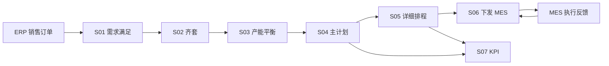
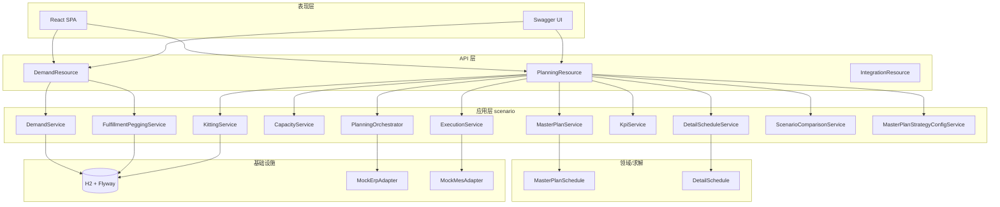
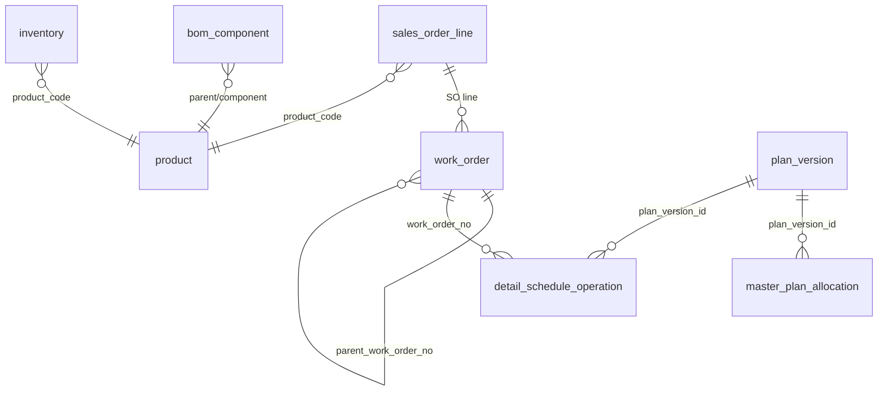

# 工厂运营计划系统（Plant Operation Plan）— 项目完整文档

> **⚠️ 已归档（2026-06-10）** — 本文档已停用。请使用现行 [SDD.md](../SDD.md)（[sdd/](../sdd/) 分章）与 [PDD.md](../PDD.md)。

| 项目 | 说明 |
|------|------|
| 名称 | Plant Operation Plan |
| 版本 | 1.0.0-SNAPSHOT |
| 代码路径 | `plant-operation-plan/` |
| 文档日期 | 2026-05-27 |
| 最近更新 | 主计划策略体系、场景选择器、产能均衡目标、导航与结果页重构 |

---

## 目录

1. [项目概述](#1-项目概述)
2. [业务蓝图](#2-业务蓝图)
3. [功能设计](#3-功能设计)
4. [详细技术方案](#4-详细技术方案)
5. [部署方案](#5-部署方案)
6. [运维与扩展](#6-运维与扩展)
7. [附录](#7-附录)

---

## 1. 项目概述

### 1.1 建设目标

面向**单工厂**的高级计划与排程（APS），将销售需求、物料齐套、粗能力、主计划、详细排程、执行反馈与 KPI 串成一条可运行的计划链路。核心优化能力由 **Timefold Solver** 提供（S04 主计划、S05 详细排程），其余场景以规则引擎与持久化服务实现。

### 1.2 范围边界

| 在范围内 | 不在范围内（当前版本） |
|----------|------------------------|
| 单工厂、多产线、瓶颈资源主计划 | 多工厂网络计划 |
| H2 内存库 + Flyway 演示数据 | 生产级 PostgreSQL 集群（可扩展） |
| ERP/MES Mock 集成 | 真实 SAP/MES 连接器 |
| React 业务前端（S01–S07） | 移动端、多租户 |

### 1.3 技术栈总览

| 层级 | 技术 |
|------|------|
| 后端运行时 | Java 21、Quarkus 3.17.5 |
| 优化引擎 | Timefold Solver 1.15（Community） |
| 持久化 | Hibernate ORM Panache、Flyway、H2 |
| API | REST + JSON、SmallRye OpenAPI |
| 前端 | React 18、TypeScript、Vite 6、React Router 7、gantt-task-react |
| 构建 | Maven Wrapper、npm |

### 1.4 仓库结构

```text
PlantOperationPlan/                    # 工作区根目录
├── 工厂计划*.md                        # 业务方法论文档（场景卡片，只读参考）
└── plant-operation-plan/              # 可运行工程
    ├── pom.xml
    ├── mvnw / mvnw.cmd
    ├── src/main/java/com/plantops/
    │   ├── api/                       # REST 资源
    │   ├── api/dto/                   # 对外 DTO
    │   ├── scenario/                  # S01–S07 场景服务
    │   ├── solver/                    # Timefold 模型与约束
    │   ├── persistence/entity/        # JPA 实体
    │   ├── integration/               # ERP/MES 端口
    │   ├── config/                    # 求解器、参数、主计划策略
    │   └── sample/                    # 示例数据加载
    ├── src/main/resources/
    │   ├── application.properties
    │   ├── db/migration/              # Flyway V1–V10
    │   ├── sample-data/factory-demo.json
    │   └── META-INF/resources/        # 前端生产构建产物
    ├── frontend/                      # React 源码
    └── docs/
        ├── architecture.md
        ├── PROJECT_DOCUMENTATION.md   # 本文档
        └── superpowers/specs/...
```

---

## 2. 业务蓝图

### 2.1 价值链与计划层次



计划时间粒度由粗到细：

| 层次 | 场景 | 决策内容 |
|------|------|----------|
| 需求层 | S01 | 订单优先级、交期、满足链（库存/工单追溯） |
| 物料层 | S02 | 关键料齐套、缺料原因 |
| 能力层 | S03 | 负荷桶、超载、开线建议 |
| 主计划层 | S04 | 瓶颈资源时间槽、订单分配、开线决策 |
| 排程层 | S05 | 产线工序顺序、换线时间、缺口建议 §H |
| 执行层 | S06 | 计划下发、事件驱动重排 R0–R3 |
| 绩效层 | S07 | OTIF、利用率、计划版本对比 |

### 2.2 场景卡片（S01–S07）

#### S01 — 需求满足

- **输入**：销售订单行（产品、数量、交期、优先级、锁定标记）。
- **输出**：订单需求满足列表、KPI 汇总、选中订单的**满足追溯链**。
- **满足链语义**（pegging，非时间表）：
  - 销售订单可由**成品库存**或**根工单**满足；
  - 工单由 **BOM 子件** 满足：子件优先匹配**子工单**（`parent_work_order_no`），否则**原材料库存**，否则**缺料**。
- **业务价值**：计划员看清「这单货从哪来」，而不是仅看工序时间。

#### S02 — 齐套

- 按 BOM 关键料与可用库存（扣减预留）逐单计算 `KITTING_OK` / `SHORTAGE`。
- 结果持久化至 `kitting_result`，供 S04 过滤可排订单。

#### S03 — 产能平衡

- 按资源×日期×班次聚合需求分钟与可用分钟，计算利用率与超载标记。
- 启发式给出产线开线建议（人数、原因）。

#### S04 — 主计划（Timefold）

- 将齐套通过的订单分配到瓶颈资源**时间槽**（`TimeSlot`）。
- 持久化：`plan_version`、`master_plan_allocation`、`line_opening_decision`。
- 输出：计划版本号、得分、分配明细。

#### S05 — 详细排程（Timefold + 后处理）

- 在已开线产线上为工单工序分配产线（求解器），再**后处理**计算 `startMinute` / `endMinute`（含换线 30 分钟）。
- 持久化：`detail_schedule_operation`；可选缺口建议 `shortage_recommendation`。

#### S06 — 执行闭环

- **下发**：将详细排程版本标记下发至 MES（Mock）。
- **事件**：设备停机、缺料、加急、小延误等 → 映射重排级别 R0–R3 并触发对应流水线。

| 级别 | 典型事件 | 行为 |
|------|----------|------|
| R0/R1 | 小延误 | 记录影响，不自动重算 |
| R2 | 设备/缺料 | 保留主计划，重算详细排程 |
| R3 | 订单加急 | 重算齐套 + 主计划 + 详细排程 |

#### S07 — KPI

- 汇总计划绩效指标（如交付率、超载率等，见 `KpiService`）。
- 支持两版计划得分与影响摘要对比。

### 2.3 角色与界面

前端采用**左侧导航 + 主内容区**布局，按「主计划 / 生产排程」分组：

| 导航分组 | 页面 | 用途 |
|----------|------|------|
| 首页 | `/` | 总览入口 |
| 主数据管理 | `/master-data` | 产品、BOM、工艺、资源等主数据 |
| **主计划 · 配置** | | |
| 计划参数 | `/master-plan/parameters` | 规划窗、时栅、班次等全局参数 |
| 优化目标 | `/master-plan/objectives` | **主计划策略**列表：产能模式 + 软目标权重 |
| 业务规则 | `/business-rules` | 业务约束与规则维护 |
| 业务数据 | `/master-plan/business-data` | 订单、库存、工单等业务数据 |
| 计划运行 | `/master-plan/plan-run` | 选择策略并运行主计划流水线 |
| **主计划 · 结果** | | 页面标题上方展示**场景选择器** |
| 需求满足 | `/master-plan/demand` | S01 订单满足与追溯链 |
| 产能平衡 | `/master-plan/capacity` | S03 资源×班次负荷热力甘特 |
| 物料需求 | `/master-plan/material` | S02 物料滚算与缺料 |
| 生产工单 | `/master-plan/work-orders` | 工单生成、下发与满足链 |
| 场景对比 | `/master-plan/scenario-comparison` | 多场景 KPI 柱状对比 |
| **生产排程** | `/scheduling/*` | 排程参数、齐套、详细排程、场景对比 |
| 需求跟踪 | `/demand-tracking` | 订单交付跟踪 |

| 角色 | 主要界面 |
|------|----------|
| 计划员 | 计划运行、需求满足、产能平衡、生产工单、场景对比 |
| 物料计划 | 物料需求、满足链中的库存/缺料 |
| 生产主管 | 产能平衡、生产工单下发 |
| 管理层 | 场景对比、需求跟踪 |

### 2.4 核心业务对象（领域语言）

| 对象 | 说明 |
|------|------|
| 销售订单行 | 需求最小单元 |
| 工单 | 生产任务；`parent_work_order_no` 表示上游工单满足本工单 |
| BOM | 父件 → 子件用量 |
| 库存 | 库位×物料，可用量 = 在手 − 预留 − 质检冻结 |
| 计划版本 | 主计划 / 详细排程每次求解生成独立版本号；主计划版本关联 **strategyId / strategyName** |
| 主计划策略 | 命名配置包：产能模式（无限/有限）+ 一组软优化目标权重；运行时可选用 |
| 计划场景 | 一次主计划求解产出的 `planVersionId`，可在结果页间切换查看 |
| 满足链节点 | 销售订单 / 工单 / 库存 / 缺料 |
| 满足边 | 供应方 → 需求方（`INVENTORY_PEG` / `WORK_ORDER_PEG`） |

---

## 3. 功能设计

### 3.1 功能清单

| 编号 | 功能 | 后端 | 前端路由 |
|------|------|------|----------|
| F01 | 需求满足查询与 KPI | `GET /demand/demand-pool`、`/summary` | `/#/master-plan/demand` |
| F02 | 订单满足链追溯 | `GET .../fulfillment-chain` | `/#/master-plan/demand` |
| F03 | 订单导入 | `POST /demand/import` | （API/Swagger） |
| F04 | 物料需求计算 | `POST /kitting/compute` | `/#/master-plan/material` |
| F05 | 产能平衡分析 | `POST /capacity/analyze?masterPlanVersionId=` | `/#/master-plan/capacity` |
| F06 | 主计划求解/查询 | `POST/GET .../master-plan/*` | 计划运行 + 场景选择器 |
| F07 | 详细排程求解 | `POST .../detail-schedule/solve` | `/#/scheduling/detail-schedule` |
| F08 | 工单下发 | `POST /planning/dispatch` | `/#/master-plan/work-orders` |
| F09 | 事件与重排 | `POST /events`、`/planning/reschedule` | （API） |
| F10 | KPI 与版本对比 | `GET /kpi/report`、`/planning/compare` | `/#/demand-tracking` |
| F11 | 主计划流水线 | `POST /planning/pipeline-runs` | `/#/master-plan/plan-run` |
| F12 | ERP/MES 联调 Mock | `GET /integration/*` | — |
| F13 | **主计划策略 CRUD** | `GET/POST/PUT/DELETE .../master-plan/strategies` | `/#/master-plan/objectives` |
| F14 | **场景列表与对比** | `GET /planning/scenarios`、`/scenarios/compare` | `/#/master-plan/scenario-comparison` |
| F15 | **场景选择器** | 复用 F06/F14 场景 API | 四个结果页 `PageHeader` |

> 旧路由（如 `/#/demand`、`/#/pipeline`）保留重定向至新路径，见 `App.tsx`。

### 3.2 S01 需求满足界面设计

布局（视口内分栏滚动）：

```text
┌─────────────┬──────────────────────────┐
│  关键 KPI   │   销售订单列表（可选中）    │
│             ├──────────────────────────┤
│             │  满足关系列表              │
│             │  满足链甘特图（业务节点）   │
└─────────────┴──────────────────────────┘
```

- 甘特图**仅显示业务节点**（销售订单、工单、库存、缺料），无「需求/直接满足」抽象泳道。
- 箭头依赖：上游供应节点 → 被满足节点。

### 3.4 主计划策略（优化目标页）

「优化目标」页实质为**主计划策略**管理，将原先分散的产能模式与目标权重合并为可命名、可复用的策略包。

**策略结构**

| 字段 | 说明 |
|------|------|
| `id` / `name` | 策略标识与显示名称 |
| `capacityStrategy` | `UNCONSTRAINED`（无限产能）或 `FINITE_CAPACITY`（有限产能、跨天拆段） |
| `objectives[]` | 软优化目标：启用开关 + 权重 |
| `isDefault` | 默认策略；计划运行页未指定时选用 |

**软优化目标（`MasterPlanObjectiveCatalog`）**

| ID | 名称 | 说明 |
|----|------|------|
| `minimize_lateness` | 最小化延期 | 完成晚于交期按延期天数惩罚 |
| `prioritize_high_priority` | 高优先级靠前 | 高优先级订单倾向靠前时栅 |
| `locked_orders_prefer_earlier` | 锁定订单靠前 | 冻结窗内订单尽量排在前段 |
| `balance_adjacent_slot_loading` | **产能均衡** | 同一资源相邻时间槽负荷尽量接近，避免陡增/陡降 |

**持久化**

- 策略 JSON 存于 `system_parameter.param_id = 'master_plan_strategies'`（CLOB）。
- 每次求解/流水线运行将 `strategy_id`、`strategy_name` 写入 `plan_version` 与 `planning_pipeline_run`。

**操作**：新建、重命名、复制、删除、设为默认；保存后立即生效于下次求解。

### 3.5 计划场景与场景选择器

**场景** = 一次主计划求解产生的 `planVersionId`，附带策略名、产能模式、得分、生成时间等元数据（`PlanningScenarioDto`）。

**场景选择器（`ScenarioSelector`）**

- 通过 `PlanContext` 全局维护 `scenarios`、`selectedScenarioId`；启动时从 localStorage 恢复上次选中场景。
- 下拉展示：`planVersionId · strategyName`；右侧策略 pill + 刷新按钮。
- **仅出现在四个计划结果页**的 `PageHeader`（`showScenarioSelector={true}`）：
  - 需求满足、产能平衡、物料需求、生产工单
- 配置类页面（计划参数、优化目标、业务规则、业务数据、计划运行）及场景对比页**不展示**全局场景选择器；场景对比页使用左侧多选列表。

**场景联动**

| 页面 | 联动行为 |
|------|----------|
| 产能平衡 | 切换场景 → `POST /capacity/analyze?masterPlanVersionId=` 重算负荷 |
| 需求满足 / 物料需求 / 生产工单 | 切换场景 → 各 API 带 `masterPlanVersionId` 重载；满足链甘特使用场景内主计划分配时间 |
| 计划运行 | 运行完成后 `refreshScenarios()`，新场景进入列表 |
| 场景对比 | 列表展示 `strategyName`；勾选多场景对比 Score、产能、排产 KPI |

**产能平衡页 UI**：已移除页内「主计划策略」下拉、「运行主计划」「重新分析」按钮；分析完全随顶部场景切换自动触发。

### 3.6 状态与枚举

**齐套状态**：`KITTING_OK`、`SHORTAGE`

**主计划产能模式**：`UNCONSTRAINED`、`FINITE_CAPACITY`

**满足链节点类型**：`SALES_ORDER`、`WORK_ORDER`、`INVENTORY`、`SHORTAGE`

**满足边类型**：`INVENTORY_PEG`、`WORK_ORDER_PEG`、`SHORTAGE_PEG`

**订单满足汇总**：`ON_TRACK`、`PLANNED`、`PENDING`、`AT_RISK`

**事件类型（示例）**：`MES_DELAY`、`MES_SCRAP`、`NEW_ORDER`、`MATERIAL_SHORTAGE`、`EQUIPMENT_DOWN`、`ORDER_EXPEDITE`、`MINOR_DELAY`

---

## 4. 详细技术方案

### 4.1 逻辑架构



### 4.2 包结构约定

| 包 | 职责 |
|----|------|
| `com.plantops.api` | JAX-RS 资源，无业务逻辑 |
| `com.plantops.api.dto` | 稳定 JSON 契约（Java record） |
| `com.plantops.scenario` | 用例服务，事务边界 |
| `com.plantops.solver.*` | Timefold `@PlanningSolution` / `@PlanningEntity` |
| `com.plantops.persistence.entity` | Panache 实体 |
| `com.plantops.integration.*` | 六边形端口适配器 |
| `com.plantops.config` | CDI 生产者（双 SolverManager） |

### 4.3 数据模型（ER 概要）



**Flyway 迁移**

| 版本 | 文件 | 内容 |
|------|------|------|
| V1 | `V1__schema.sql` | 全业务表 |
| V2 | `V2__sequences.sql` | H2 序列（PanacheEntity） |
| V3 | `V3__planning_extensions.sql` | 工单父子、计划扩展 |
| V4 | `V4__routing_metadata.sql` | 工艺路线元数据 |
| V5 | `V5__work_order_dispatch.sql` | 工单下发状态 |
| V6 | `V6__master_plan_capacity_strategy.sql` | 主计划产能策略字段 |
| V7 | `V7__planning_pipeline_run.sql` | 流水线运行记录 |
| V8 | `V8__planning_pipeline_run_seq.sql` | 流水线序列表 |
| V9 | `V9__pipeline_run_execution_log.sql` | 运行日志 |
| V10 | `V10__master_plan_strategies.sql` | 策略 CLOB、`strategy_id/name` 于 plan_version / pipeline_run |

### 4.4 满足链对象结构（API）

```json
{
  "salesOrderNo": "SO-001",
  "salesOrderLineNo": 10,
  "productCode": "FG-100",
  "overallStatus": "PLANNED",
  "nodes": [
    {
      "nodeId": "so-SO-001-10",
      "nodeType": "SALES_ORDER",
      "label": "销售订单 SO-001-10",
      "depth": 0,
      "quantity": 500
    },
    {
      "nodeId": "inv-FG-100-1",
      "nodeType": "INVENTORY",
      "label": "库存 · FG-100",
      "depth": 1,
      "quantity": 80
    },
    {
      "nodeId": "wo-WO-001",
      "nodeType": "WORK_ORDER",
      "label": "工单 · WO-001",
      "depth": 1,
      "quantity": 420
    }
  ],
  "edges": [
    { "fromNodeId": "inv-FG-100-1", "toNodeId": "so-SO-001-10", "pegType": "INVENTORY_PEG" },
    { "fromNodeId": "wo-WO-001", "toNodeId": "so-SO-001-10", "pegType": "WORK_ORDER_PEG" }
  ]
}
```

**构建算法**（`FulfillmentPeggingService`）：

1. 创建销售订单节点（depth=0）。
2. `pegDemand(demander, product, qty, depth)`：
   - 扣减可用库存 → 库存节点 + 边；
   - 剩余需求 → 解析工单（SO 用根工单；工单用 `parentWorkOrderNo` 子工单）；
   - 展开工单 BOM，对每个关键子件递归 `pegDemand`；
   - 无法满足 → `SHORTAGE` 节点 + 边。
3. 内存维护库存扣减池，避免重复分配。

### 4.5 Timefold 求解设计

**为何不用 `timefold-solver-quarkus`**

工程内存在两个 `@PlanningSolution`（主计划 + 详细排程），Quarkus 扩展仅允许单一方案。采用 `SolverProducers` 手工注册两个 `SolverManager`。

**S04 主计划**

| 类型 | 类 | 说明 |
|------|-----|------|
| Solution | `MasterPlanSchedule` | 槽位列表、订单分配列表 |
| Entity | `OrderAllocation` | 决策变量：分配到的 `TimeSlot` |
| 约束 | `MasterPlanConstraintProvider` | 交期、优先级、产能硬约束；软约束含延期、优先级、锁定靠前、**相邻槽位负荷均衡** |
| 策略注入 | `MasterPlanStrategyConfigService.ResolvedStrategy` | 求解前解析产能模式与目标权重 |

**S05 详细排程**

| 类型 | 类 | 说明 |
|------|-----|------|
| Solution | `DetailSchedule` | 产线范围、工序列表 |
| Entity | `OperationAssignment` | 决策变量：产线；时间由 `assignStartTimes()` 后处理 |
| 约束 | `DetailScheduleConstraintProvider` | 顺序、换线、班次容量等 |

### 4.6 全链路编排

`PlanningOrchestrator.runFullPipeline()` 顺序：

```text
需求满足 → 物料需求 → 粗能力 → 主计划求解 → 详细排程求解(带主计划版本) → 下发 → KPI
```

数据为空时自动加载 `factory-demo.json`。

### 4.7 前端技术方案

| 项 | 方案 |
|----|------|
| 路由 | HashRouter（`/#/...`），避免刷新 404 |
| API | `fetch` + Vite 开发代理 `/api` → `:8080` |
| 状态 | `PlanContext`：主计划/排程版本、**场景列表与选中场景**、localStorage 持久化 |
| 场景 UI | `ScenarioSelector` + `PageHeader.showScenarioSelector`（默认 false） |
| 甘特 | `gantt-task-react`；满足链用 `dependencies` 表示 pegging |
| 生产构建 | `npm run build` → `src/main/resources/META-INF/resources` |

### 4.8 集成端口

```java
public interface ErpPort {
    List<DemandPoolEntryDto> fetchOpenOrderLines();
}

public interface MesPort {
    // 下发、反馈轮询（Mock 实现）
}
```

替换真实 ERP/MES 时：新增 `@ApplicationScoped` 实现类，通过 CDI 覆盖 Mock。

### 4.9 配置项

| 键 | 默认 | 说明 |
|----|------|------|
| `quarkus.http.port` | 8080 | HTTP 端口 |
| `quarkus.datasource.jdbc.url` | H2 内存 | 数据源 |
| `plantops.sample-data.enabled` | true | 启动加载演示数据 |
| `quarkus.http.cors.origins` | `http://localhost:5173` | 前端开发跨域 |

### 4.10 测试策略

- `PlantOperationPlanResourceTest`：RestAssured 端到端，触发 S04/S05 求解并断言 HTTP 200。
- 单元测试可针对 `FulfillmentPeggingService`、`KittingService` 扩展（当前以集成为主）。

---

## 5. 部署方案

### 5.1 环境要求

| 组件 | 版本要求 |
|------|----------|
| JDK | 21（推荐 Eclipse Temurin） |
| Node.js | 18+（仅构建前端时需要） |
| 内存 | 开发 ≥ 4GB；求解时建议 ≥ 8GB |
| OS | Windows / Linux / macOS |

**无需全局 Maven**：使用 `mvnw.cmd` / `./mvnw`。

**PowerShell 脚本策略**：若 `npm` 报执行策略错误，使用 `npm.cmd` 或 `frontend/*.cmd`。

### 5.2 开发环境部署

**终端 1 — 后端**

```powershell
cd d:\AILab\PlantOperationPlan\plant-operation-plan
.\mvnw.cmd quarkus:dev
```

- API：http://localhost:8080  
- Swagger：http://localhost:8080/q/swagger-ui  

**终端 2 — 前端（热更新）**

```powershell
cd d:\AILab\PlantOperationPlan\plant-operation-plan\frontend
.\install.cmd
.\dev.cmd
```

- UI：http://localhost:5173  

### 5.3 生产一体包部署（推荐演示/内网）

将前端打入 Quarkus 静态资源，单进程对外服务：

```powershell
cd d:\AILab\PlantOperationPlan\plant-operation-plan\frontend
.\build.cmd

cd ..
.\mvnw.cmd package -DskipTests
java -jar target\quarkus-app\quarkus-run.jar
```

访问：http://localhost:8080/#/

> `quarkus package` 生成 `target/quarkus-app/`，含 `lib/`、`app/`、`quarkus-run.jar`。

### 5.4 配置覆盖（生产）

创建 `application-prod.properties` 或通过环境变量：

```properties
# 示例：PostgreSQL
quarkus.datasource.db-kind=postgresql
quarkus.datasource.jdbc.url=jdbc:postgresql://db-host:5432/plantops
quarkus.datasource.username=plantops
quarkus.datasource.password=${DB_PASSWORD}

plantops.sample-data.enabled=false

quarkus.http.cors.origins=https://aps.example.com
```

启动：

```bash
java -jar quarkus-run.jar -Dquarkus.profile=prod
```

### 5.5 容器化部署（参考）

**Dockerfile 多阶段示例思路**

1. 阶段 `node`：`frontend` 下 `npm ci && npm run build`  
2. 阶段 `maven`：复制前端产物到 `META-INF/resources`，`mvnw package -DskipTests`  
3. 阶段 `runtime`：`eclipse-temurin:21-jre`，复制 `quarkus-app/`，暴露 8080  

**Kubernetes 要点**

- Deployment：1 副本起步，求解 CPU 建议 limit ≥ 2  
- Service：ClusterIP 8080  
- Ingress：路径 `/` 指向服务；注意 SPA 使用 Hash 路由无需服务端 rewrite  
- 健康检查：`/q/health`（Quarkus 标准）

### 5.6 网络与端口

| 端口 | 用途 |
|------|------|
| 8080 | Quarkus HTTP（API + 静态前端） |
| 5173 | 仅开发态 Vite |

### 5.7 数据持久化说明

当前默认 **H2 内存库**，进程退出数据丢失。生产必须：

1. 切换 PostgreSQL / Oracle 等；  
2. 关闭 `plantops.sample-data.enabled`；  
3. 通过 ERP 接口或 `POST /demand/import` 灌入主数据。

---

## 6. 运维与扩展

### 6.1 日志与诊断

- Quarkus 开发模式控制台输出 Timefold 求解日志（阶段耗时、best score）。
- 求解超时可在 `SolverProducers` 中调整 `terminationSpentLimit`。

### 6.2 常见问题

| 现象 | 处理 |
|------|------|
| `mvn` 无法识别 | 使用 `.\mvnw.cmd` |
| `npm.ps1` 禁止脚本 | 使用 `npm.cmd` 或 `frontend\dev.cmd` |
| 满足链无上游工单 | 确认已重启后端以加载 V3 迁移与更新后的 `factory-demo.json` |
| 甘特无数据 | 先选中订单；检查 `/fulfillment-chain` 返回 |
| 产能页切换场景无变化 | 确认 `POST /capacity/analyze?masterPlanVersionId=` 传入选中场景 ID |
| 场景列表为空 | 先在「计划运行」选择策略并运行流水线 |
| 策略保存不生效 | 重启后检查 `system_parameter.master_plan_strategies`；保存后需重新求解 |

### 6.3 扩展建议

1. **ERP**：实现真实 `ErpPort`，定时同步订单。  
2. **MES**：`MesPort` 回写工序实绩，驱动 S06 事件。  
3. **满足链**：接入预留库存、采购在途、替代料。  
4. **排程**：恢复完整 chained 工序变量（当前为产线分配 + 后处理时间）。  
5. **权限**：在 Quarkus 增加 OIDC / JWT。  

---

## 7. 附录

### 7.1 REST API 一览

**需求（DemandResource）**

| 方法 | 路径 | 说明 |
|------|------|------|
| GET | `/api/v1/demand/demand-pool` | 需求满足订单列表 |
| GET | `/api/v1/demand/demand-pool/summary` | KPI |
| GET | `/api/v1/demand/demand-pool/{so}/{line}/fulfillment-chain` | 满足链 |
| POST | `/api/v1/demand/import` | 导入订单 |

**计划（PlanningResource）**

| 方法 | 路径 | 说明 |
|------|------|------|
| POST | `/api/v1/kitting/compute` | 物料需求/齐套 |
| POST | `/api/v1/capacity/analyze?masterPlanVersionId=` | 产能平衡（可选按场景版本） |
| POST | `/api/v1/planning/master-plan/solve?strategyId=` | 主计划求解（策略优先于 legacy capacityStrategy） |
| GET | `/api/v1/planning/master-plan/result/{versionId}` | 主计划结果 |
| POST | `/api/v1/planning/detail-schedule/solve?masterPlanVersionId=` | 详细排程 |
| POST | `/api/v1/planning/dispatch` | 下发 |
| POST | `/api/v1/events` | 计划事件 |
| POST | `/api/v1/planning/reschedule` | 重排 |
| GET | `/api/v1/kpi/report` | KPI |
| POST | `/api/v1/planning/pipeline-runs` | 启动主计划流水线（body: `strategyId`） |
| GET | `/api/v1/planning/pipeline-runs/{runId}` | 流水线状态与日志 |
| POST | `/api/v1/planning/pipeline-runs/{runId}/execute` | 执行流水线 |
| GET | `/api/v1/planning/scenarios?limit=` | 场景列表 |
| POST | `/api/v1/planning/scenarios/compare` | 多场景 KPI 对比 |
| GET | `/api/v1/planning/compare?from=&to=` | 两版本对比（legacy） |

**主计划策略（MasterPlanStrategyResource）**

| 方法 | 路径 | 说明 |
|------|------|------|
| GET | `/api/v1/planning/master-plan/strategies` | 策略列表 |
| GET | `/api/v1/planning/master-plan/strategies/by-default` | 当前默认策略详情 |
| GET | `/api/v1/planning/master-plan/strategies/{id}` | 策略详情 |
| POST | `/api/v1/planning/master-plan/strategies` | 新建策略 |
| PUT | `/api/v1/planning/master-plan/strategies/{id}` | 更新策略 |
| POST | `/api/v1/planning/master-plan/strategies/{id}/duplicate` | 复制策略 |
| DELETE | `/api/v1/planning/master-plan/strategies/{id}` | 删除策略 |

**集成（IntegrationResource）**

| 方法 | 路径 | 说明 |
|------|------|------|
| GET | `/api/v1/integration/erp/orders` | Mock ERP 订单 |
| GET | `/api/v1/integration/mes/status` | Mock MES 状态 |

### 7.2 示例数据场景（SO-001）

- 订单 500 件 FG-100。  
- 库存 80 件 FG-100 → 库存满足 80。  
- 工单 WO-001 满足剩余 420。  
- WO-001 需要 SFG-50 → 子工单 WO-001-SFG。  
- WO-001 需要 RM-B → 库存；WO-001-SFG 需要 RM-A → 库存。

### 7.3 相关文档

| 文档 | 路径 |
|------|------|
| 快速启动 | `README.md` |
| 架构摘要 | `docs/SDD.md`、`docs/sdd/`（历史见 `docs/archive/`） |
| 设计摘要 | `docs/superpowers/specs/2026-05-25-plant-operation-plan-design.md` |
| **帕累托扫描模式（v1 设计）** | `docs/pareto-scan-design.md` |
| 业务方法论 | 工作区根目录 `工厂计划*.md` |

### 7.4 变更记录

| 日期 | 内容 |
|------|------|
| 2026-05-25 | 初版：S01–S07 场景、Timefold 双求解器、满足链、React 前端 |
| 2026-05-27 | 主计划策略体系（产能模式 + 目标权重 CRUD）；产能均衡软目标；计划运行选策略；场景列表/对比展示策略名；`PlanContext` 场景选择器；产能页按场景分析；导航重命名与结果页分组；场景选择器仅保留于四个计划结果页；四结果页绑定 `masterPlanVersionId` |
| 2026-05-28 | 帕累托扫描模式产品设计 v1（`docs/pareto-scan-design.md`）：权重网格批量求解、分目标 KPI、非支配前沿、帕累托探索页 |

---

*本文档随代码演进更新；以仓库内实现为准。*
