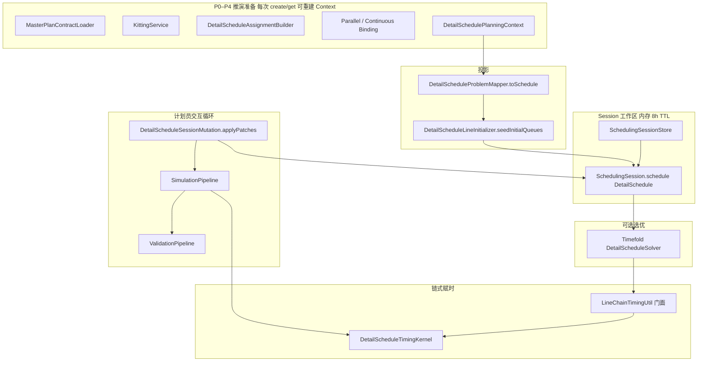

# 详细排程推演层 — 计算逻辑与技术说明（审阅稿）

> **版本**：2026-06-02  
> **读者**：架构/计划员/开发  
> **关联文档**：[aps-planning-layer.md](./aps-planning-layer.md) §5（S05 推演 P0–P4）、§5.6（Session）  
> **代码主包**：`com.plantops.scenario.planning`、`com.plantops.solver.detailschedule`、`com.plantops.scenario.DetailScheduleSessionService`

---

## 1. 定位与边界

### 1.1 推演层做什么

详细排程的 **推演层** 负责在 **已展开的工序实例**（`OperationAssignment`）上，做 **确定性** 的：

1. **结构准备**（P0–P4）：产线域、齐套、主计划契约、并行/连续绑定等（**不含** Timefold 得分）。
2. **工作副本**（`SchedulingSession`）：内存中的 `DetailSchedule`，供计划员改队列、推演、再发布。
3. **链式赋时**（`LineChainTimingUtil`）：按产线 list 顺序 + 换型 + 工艺链衔接 + 契约下界 → `startMinute` / `endMinute`。
4. **约束校验**（`ScheduleValidationService`）：不依赖 Timefold Score，输出 HARD/MEDIUM 违背列表。

### 1.2 推演层不做什么

| 能力 | 负责方 | 说明 |
|------|--------|------|
| 产线/顺序 **全局选优** | Timefold `DetailScheduleConstraintProvider` | 仅 `optimize` / `solve` 路径 |
| 工单生成、MRP、工艺展开 | `DetailSchedulePlanningContextBuilder` P0–P3 | 进入 Session 前完成 |
| 持久化排程版本 | `DetailScheduleService.persistSchedule` | `confirm` 时触发 |
| 车间执行状态机 | `ProductionTaskService` | RELEASED / RUNNING / COMPLETED |

**核心约定（与主文档一致）**：

- 日常交互默认：**patch → simulate（链式赋时）→ validate**，**不**调用 Timefold。
- Timefold 为 **可选** 的 `optimize` / 创建 Session 时 `solve=true`。
- 赋时与校验共用同一套 `DetailSchedule` 对象；Session 内对 `schedule` 的修改为 **原地** 更新。

---

## 2. 总体架构



### 2.1 关键类职责

| 类 | 路径 | 职责 |
|----|------|------|
| `DetailSchedulePlanningContextBuilder` | `scenario/planning/` | S05 P0–P4，产出 `OperationAssignment` 列表 + `ScheduleLine` |
| `DetailScheduleProblemMapper` | `scenario/planning/` | Context → `DetailSchedule` + `DetailScheduleProblemFacts` |
| `DetailScheduleLineInitializer` | `solver/detailschedule/` | 按 `sequenceHint` / 指定产线 **种子入队** |
| `SchedulingSession` / `SchedulingSessionStore` | `scenario/planning/` | Session 元数据 + 内存 `DetailSchedule` |
| `DetailScheduleSessionService` | `scenario/` | create / get / simulate / optimize / confirm / candidateLines |
| `DetailScheduleSessionMutation` | `scenario/planning/` | `SessionStepPatchDto` → 改线、改序、锁定 |
| `DetailScheduleSimulationEngine` | `scenario/planning/` | full / incremental simulate |
| `LineChainTimingUtil` | `solver/detailschedule/` | 全量链式赋时 |
| `ScheduleValidationService` | `scenario/planning/` | 推演后校验 |
| `DetailScheduleService` | `scenario/` | 编排求解、预览 DTO、`assignStartTimes` 委托 |

---

## 3. 数据模型

### 3.1 `DetailSchedule`（Timefold Solution + Session 工作副本）

| 字段 | 类型 | 含义 |
|------|------|------|
| `lines` | `List<ScheduleLine>` | 产线候选；含 `lineId`、`resourceId`、`opened`、`capacityMinutes` |
| `operations` | `List<OperationAssignment>` | 全部工序实例（含未上产线） |
| `problemFacts` | `DetailScheduleProblemFacts` | 换型索引、工序流转规则、锚点日、契约权重 |
| `score` | HardSoftScore | 仅 Timefold 求解后有意义 |

**产线队列（list-variable 模型）**：

- 每条 `ScheduleLine.assignedOperations` 为 **有序 list**，表示该产线上的加工顺序。
- 工序是否「已排」以 **是否出现在某条产线的 list 中** 为准（`op.getLine()` 影子字段可能为空，但 list 成员关系有效）。
- `DetailScheduleSessionMutation` / `DetailScheduleSimulationEngine.scheduledOperationIds` 均通过 **list 包含** 判断已分配。

### 3.2 `OperationAssignment` 关键字段（推演相关）

| 字段 | 来源阶段 | 推演/校验用途 |
|------|----------|----------------|
| `operationId` | P3 | 全局主键；patch `stepId` |
| `workOrderNo` / `batchNo` / `operationSeq` | P3 | 展示、批次过滤 |
| `durationMinutes` | P3 | 赋时 cursor 推进 |
| `earliestStartMinute` | P2 齐套 + 工艺链迭代抬升 | 赋时下界；校验 EARLIEST_START |
| `kittingEligible` | P2 | 未上产线且齐套 → MEDIUM |
| `mpContractStartDate` / `End` / `ResourceId` | P0 主计划契约 | `ScheduleContractSettings` 最早开工地板 |
| `routingPredecessor` | P3 | 工艺链后继约束 |
| `pairGroupId` / `pairMateOperationId` | P4 并行绑定 | 同线同起同止 |
| `continuousGroupId` | P4 连续生产 | 队列内不得被其它料号隔开 |
| `designatedLineId` / `allowedLineIds` / `allowedResourceIds` | P3–P4 | `acceptsLine(line)` |
| `sequenceHint` | P3 | 初始入队排序 |
| `pinned` | 规则/锁定 patch | Timefold 硬约束；Session 可 patch |
| `startMinute` / `endMinute` | **赋时输出** | 甘特展示；未入队则清空 |

### 3.3 `acceptsLine(ScheduleLine)` 规则摘要

实现：`OperationAssignment.acceptsLine`（`solver/detailschedule/OperationAssignment.java`）

1. 产线 `resourceId` 非空，且与工序 `allowedResourceIds` / `resourceId` 匹配。
2. **连续生产**：若 `designatedLineId` 非空，必须同线。
3. **并行配对**：若 `designatedLineId` 非空，必须同线。
4. **并行孤儿**：`allowedLineIds` 为空或包含该 `lineId`。

**候选产线 API**（`candidateLines`）即遍历 Session 内全部 `ScheduleLine`，过滤 `acceptsLine == true`。

---

## 4. P0–P4 推演准备（Session 创建输入）

Session `create` 时执行：

```text
buildPlanningContext(masterPlanVersionId)
  → problemMapper.toSchedule(context)   // 含 seedInitialQueues
  → [可选] solveScheduleInMemory + applyTiming
  → [或] seedInitialQueues 后 applyTiming
  → 写入 SchedulingSessionStore
```

### 4.1 阶段表

| 阶段 | 内容 | 主要类 |
|------|------|--------|
| **P0** | 排程锚点、`ScheduleContractSettings`、主计划工序契约、开线决策 | `MasterPlanContractLoader`, `LineOpeningDecisionEntity` |
| **P1** | `ScheduleLine` 列表（开线/产能） | `ProductionLineEntity` |
| **P2** | 齐套池消耗 → `kittingEligible`、`earliestStartMinute`（含 `kitting_lock_t_hours`） | `KittingService` |
| **P3** | 工单→`OperationAssignment`；写入契约字段 | `DetailScheduleAssignmentBuilder` |
| **P4** | 并行工序对、连续生产组 | `ParallelOperationBindingService`, `ContinuousProductionBindingService` |

### 4.2 初始入队 `seedInitialQueues`

`DetailScheduleLineInitializer.seedInitialQueues`：

1. 清空各线 `assignedOperations`。
2. 每道工序 `resolveInitialLineId`：优先 `designatedLineId` → `allowedLineIds` 中首个 `acceptsLine` → 任意已开线且 `acceptsLine`。
3. 按产线分组，组内按 `sequenceHint` 排序入队；并行组只入队一次（`pairGroupId` 去重）。

**注意**：种子入队 **不等于** 最终时间；需再 `LineChainTimingUtil.applyAllStartTimes`（create 时若 `seedInitialQueues=true` 会 `applyTiming`）。

---

## 5. SchedulingSession 生命周期

### 5.1 存储

- **实现**：`ConcurrentHashMap<String, SchedulingSession>`（进程内存，非集群共享）。
- **TTL**：创建后 **8 小时**（`SchedulingSessionStore.DEFAULT_TTL`）；`require` 时过期则删除并 404。
- **内容**：不可变元数据 + **可变** `DetailSchedule schedule` 引用（simulate 原地修改同一对象）。

### 5.2 状态机（计划员视角）

```text
POST create  → Session + preview（可选 solve / seed）
     ↓
PATCH steps / POST simulate  → patch + 赋时 + 校验 + 更新 preview
     ↓
[可选] POST optimize  → Timefold + applyTiming + 更新 score
     ↓
POST confirm  → persistSchedule(DS-xxx) + ProductionTask RELEASED + 删除 Session
```

### 5.3 `DetailScheduleSessionService.create` 分支

| 请求 | 行为 |
|------|------|
| 默认 | Context → Schedule（seed 队列），**不**求解、**不**赋时（队列为空或仅种子） |
| `seedInitialQueues=true` | 种子入队 + `applyTiming` |
| `solve=true` | Timefold 内存求解 + `applyTiming`；记录 `score`、`solveDurationMs` |
| `seedInitialQueues` 与 `solve` | **互斥**，400 |

生产排程页默认：`createSession({ seedInitialQueues: true, solve: false })`。

---

## 6. 手动调整：`DetailScheduleSessionMutation`

**输入**：`List<SessionStepPatchDto>`，字段：

| 字段 | 类型 | 语义 |
|------|------|------|
| `stepId` | String | `operationId`，必填 |
| `lineId` | String? | 非空：移到该线并插入；空串：从所有线移除 |
| `sequenceOnLine` | Integer? | 1-based 目标位置（同线重排或插入位置） |
| `pinned` | Boolean? | 锁定标记 |

**处理顺序**（单 patch 内）：

1. `pinned` → 直接设置。
2. 若 `lineId != null`：从全线移除 → 插入目标线（`sequenceOnLine` 默认队尾）。
3. 否则若仅 `sequenceOnLine`：在当前所属产线（**list 查找**，不依赖 `op.line` 影子）重排。

**返回值**：触碰的 `stepId` 列表 → 作为增量推演的 **种子**。

**限制**：

- 不自动赋时；必须随后 `simulate`。
- 不校验 `acceptsLine`（由后续 `ScheduleValidationService` 报 HARD）。
- 不移除 `operations` 列表中的工序实体，只改 list  membership。

---

## 7. 推演管道：`SimulationPipeline`

`DetailScheduleSimulationEngine` 为 REST/测试兼容门面，实际编排由 `com.plantops.scenario.planning.simulation.SimulationPipeline` 完成。

**Phase 2 — SimulationProfile：** Session 创建时快照 `simulation_profile.config_json`；`simulate` 可传 `simulationProfileId` / `ruleOverrides`（仅当次）；响应含 `appliedRules`、`simulationProfileId`。CRUD：`GET/POST /api/v1/planning/simulation-profiles`。

### 7.1 入口

| 方法 | 模式 | 行为 |
|------|------|------|
| `fullSimulate(schedule)` | FULL | `DetailScheduleTimingKernel.applyAllStartTimes` → 收集全部已排工序 id → `ValidationPipeline.validate` |
| `incrementalSimulate(schedule, seeds)` | INCREMENTAL | `SimulationClosureExpander`（内置 ClosureRule）→ **仍全局** kernel 赋时 → recalculated = 闭包或全量 |

### 7.2 `simulate` 服务层路由（`DetailScheduleSessionService.simulate`）

```text
1. applyPatches(stepPatches) → patchTouched
2. seeds = patchTouched ∪ affectedOperationIds
3. if fullReschedule || seeds.isEmpty → fullSimulate
   else → incrementalSimulate(seeds)
4. sessionStore.put(更新后的 schedule)
5. buildSessionDto → preview + violations + simulationMode + recalculatedOperationIds
```

| 条件 | 推演模式 |
|------|----------|
| `fullReschedule=true` | FULL |
| 无 patch 且无 affected | FULL（空 seeds） |
| 有 patch 或 affected，且 `fullReschedule≠true` | INCREMENTAL |

**生产排程页前端约定**（`DetailSchedulePage`）：

| 操作 | API |
|------|-----|
| 工具栏「全量推演」 | `fullReschedule: true`，无 patch |
| 批次/工序右键排产、选择机台确认、拖入甘特、甘特拖拽 | `stepPatches` + `fullReschedule: false`（增量） |
| 取消计划（批次/全部） | 同上（unassign patch 后增量） |

### 7.3 增量闭包 `SimulationClosureExpander`

从种子 BFS 扩展，直到稳定；由 CDI 注册的 `AffectedClosureRule` 实现（受 `BusinessRuleScopeService` 控制）：

| ruleTypeId / 规则类 | 说明 |
|---------------------|------|
| `operation-transfer-time` / `RoutingSuccessorClosureRule` | 工艺后继 |
| `parallel-operations` / `ParallelMateClosureRule` | `pairMateOperationId` |
| （无）/ `SameLineSuffixClosureRule` | 同线队列当前位及后缀 |

`DetailScheduleSimulationEngine.expandAffectedClosure` 仍保留为静态入口，内部委托 `SimulationClosureExpander`。

**重要**：闭包仅用于 **标记** `recalculatedOperationIds`；赋时仍 **全产线全队列** 重算（全局收敛），避免局部时间不一致。

### 7.4 `scheduledOperationIds` 判定

计入 recalculated 需同时满足：

- `startMinute != null`
- `operationId != null`
- **已分配产线**：`op.getLine() != null` **或** 某 `line.assignedOperations.contains(op)`

---

## 8. 链式赋时：`DetailScheduleTimingKernel`

实现位于 `scenario/planning/simulation/DetailScheduleTimingKernel`；`LineChainTimingUtil.applyAllStartTimes` 为静态门面（委托 kernel，便于 Timefold 与单测共用）。

内置 `TimingRule`（换型、工艺链、契约 earliest、并行对扫描）由 `SimulationRuleRegistry` 按 `BusinessRuleScope` 启用后参与 cursor 计算。

这是推演层的 **核心数值计算**，Timefold 求解后也会通过 `DetailScheduleService.assignStartTimes` → `LineChainTimingUtil` 调用同一内核。

### 8.1 总体流程

```text
FOR iter = 1 .. 16:
    applyLineQueuesOnce()                    // 按每条产线队列顺序扫 cursor 赋 start
    IF NOT bumpEarliestFromRoutingPredecessors():
        BREAK                                // 工艺链抬升 earliest，无变化则停
clampAssignedStartsToRoutingChain()          // 已赋 start 若早于链下界则抬升
applyLineQueuesOnce()                        // 再扫一遍队列

FOR each op NOT in any line queue:
    op.startMinute = null                    // 未入队清空时间
```

### 8.2 单产线队列 `applySingleLineQueue`

对 `line.assignedOperations` **按 list 顺序** 遍历：

| 步骤 | 计算 |
|------|------|
| 并行对（同队列内 mate） | 换型间隙 + max(earliest, 契约, 双工序链下界) → **同 start**；cursor += max(duration) |
| 普通工序 | 换型(前→今) + max(earliest, 契约, 链下界) → start；cursor += duration |

**换型**：`ChangeoverRuleIndex.computeMinutes(工序名, resource, seq, 前产品, 后产品)`。

**最早开工地板 `effectiveEarliestStartMinute`**：

```text
max(op.earliestStartMinute, contractSettings.contractStartMinuteFloor(op, anchorDate))
```

### 8.3 跨产线工艺链

**链下界** `routingChainFloorStart` → `minimumStartRespectingRoutingChain`：

- 沿 `routingPredecessor` 回溯到根，正向模拟：
  - 已赋 `startMinute` 用实际值；
  - 未赋用 `earliestStartMinute` 模拟传递。
- 相邻工序应用 `OperationTransferTimeIndex.ResolvedRule`：

| `OperationLinkMode` | 后继最早开工 |
|-------------------|----------------|
| `STANDARD` | predStart + predDuration + minGap |
| `SIMULTANEOUS_START` | predStart |
| `DELAYED_START` | predStart + delayStart |
| `SIMULTANEOUS_END` | predEnd - succDuration |

**迭代抬升** `bumpEarliestFromRoutingPredecessors`：若链推算的 requiredStart > 当前 `earliestStartMinute`，则抬升并继续外层迭代（最多 16 轮）。

**钳制** `clampAssignedStartsToRoutingChain`：已有 `startMinute` 仍早于链下界时，直接抬 start（再 `applyLineQueuesOnce` 推开同线后续）。

### 8.4 与 Timefold Shadow 的关系

- Timefold 运行时使用 `@ShadowVariable` + `OperationStartTimeCalculator` 在约束中读时间。
- **Session 推演路径不跑求解器**，直接写 `op.setStartMinute`，属于 **显式链式模型**，与 shadow 逻辑目标一致但实现路径独立。
- 因此：手动改序后 **必须** `simulate` 才能与校验、甘特展示一致。

---

## 9. 校验层：`ValidationPipeline` / `ScheduleValidationService`

`ScheduleValidationService.validate` 构建 `SimulationRuleContext` 后委托 `ValidationPipeline`；各 `ValidationRule` 实现对应下表 ruleCode（启用逻辑与 `BusinessRuleTypeIds` / 业务规则页一致）。

推演后 **全量扫描** `schedule.operations`（不采样）。

### 9.1 违背规则码

| ruleCode | Level | 触发条件 |
|----------|-------|----------|
| `UNASSIGNED_KITTED` | MEDIUM | 齐套但未分配产线（`line == null`） |
| `LINE_NOT_OPENED` | HARD | 产线 `opened == false` |
| `RESOURCE_MISMATCH` | HARD | `!op.acceptsLine(line)` |
| `EARLIEST_START_VIOLATION` | MEDIUM | `startMinute < earliestStartMinute` |
| `ROUTING_PRECEDENCE` | HARD | `routingPrecedenceViolationMinutes > 0` |
| `PARALLEL_PAIR_INCOMPLETE` | HARD | 并行组少于 2 道工序 |
| `PARALLEL_SAME_LINE` | HARD | 并行对不在同一产线 |
| `PARALLEL_SAME_TIME` | HARD | 并行对 start/end 不一致 |
| `CONTINUOUS_INTERLEAVED` | HARD | 连续组在队列中被其它料号隔开 |

**说明**：

- 校验 **不阻止** simulate 完成；违背写入 `ScheduleSessionSimulateResultDto.violations` 与 preview。
- HARD 计数用于 UI 警示；发布前应由计划员处理或知情确认。

---

## 10. REST API 一览

**资源类**：`ScheduleSessionResource`（`/api/v1/planning/schedule-sessions`）

| 方法 | 路径 | 说明 |
|------|------|------|
| POST | `/` | 创建 Session |
| GET | `/{sessionId}` | 读 Session + 重建 preview |
| GET | `/{sessionId}/operations/{operationId}/candidate-lines` | 可选产线 |
| PATCH | `/{sessionId}/steps` | body = patches → simulate(patches, full=false) |
| POST | `/{sessionId}/simulate` | body = `SimulateScheduleSessionRequest` |
| POST | `/{sessionId}/optimize` | Timefold 内存求解 |
| POST | `/{sessionId}/confirm` | 落库 + RELEASED 任务 |

### 10.1 `SimulateScheduleSessionRequest`

| 字段 | 含义 |
|------|------|
| `stepPatches` | 手动调整列表 |
| `affectedOperationIds` | 无 patch 时指定增量种子 |
| `fullReschedule` | true → 强制 FULL |

### 10.2 响应 `ScheduleSessionSimulateResultDto`

| 字段 | 含义 |
|------|------|
| `session.preview` | 工序/产线/诊断/违背/已排数量 |
| `simulationMode` | `FULL` / `INCREMENTAL` |
| `simulationDurationMs` | 推演耗时 |
| `recalculatedOperationIds` | 本次认为波及的工序 id |
| `violations` / `hardViolationCount` / `mediumViolationCount` | 校验结果 |

### 10.3 预览 DTO 构建

`DetailScheduleService.toSessionPreviewDto`：

- 工序行：结合 `operationsFromSchedule`（由 schedule 导出）与 context 候选。
- `scheduled=true`：有 line + start/end。
- 附带 `simulationMode`、`simulationDurationMs`、`recalculatedOperationIds`。

---

## 11. 确认发布与生产任务

`confirm(sessionId)`：

1. `persistSchedule("DS-" + uuid, schedule, duration)` → 排程版本落库。
2. 筛选 `line != null && startMinute != null` 的工序，按线、时间排序。
3. `ProductionTaskService.releaseFromSchedule(anchor, versionId, ops)`：
   - 新建或更新 `production_task` 为 **RELEASED**；
   - **RUNNING** 任务不覆盖计划时间；
   - 计划与执行不一致 → `planning_conflict`（`RUNNING_SCHEDULE_MISMATCH`）。
4. `sessionStore.remove(sessionId)`。

---

## 12. 前端交互与推演衔接（生产排程页）

### 12.1 数据流

```text
useScheduleSession(masterPlanVersionId)
  → createSession({ seedInitialQueues: true })
  → preview.operations[]  // 含 scheduled=false 的工序

甘特：previewOperationsToGantt → 仅 scheduled 且有 line/time
批次工序表：preview.operations 按 batchNo 过滤（含未排）

任意排产动作 → simulate(stepPatches[]) → 更新 preview + violations
```

### 12.2 前端插入算法（`scheduleSessionInsert.ts`）

与后端 **patch 语义** 对齐，不单独调用赋时 API：

| 场景 | 逻辑 |
|------|------|
| 单工序最早可排 | 取目标线当前甘特任务，找首个 `startMinute >= earliestStartMinute` 的位置 → `sequenceOnLine` |
| 整批上同线 | 按 `operationSeq` 排序；首道用 dropMinute 插位，后续用虚拟队列递增 minute 依次插位 |
| 批次拖入甘特 | drop 产线 + `dropMinute` → `buildBatchPatches` |
| 指定产线 | `GET candidate-lines` → 用户选线 → `buildOperationPatch` / `buildBatchPatches` → **增量** simulate |
| 工具栏全量推演 | 无 patch，`fullReschedule: true` |

**局限（审阅注意）**：

- 前端「最早可排」为 **启发式插位**（按 startMinute 找空位），最终时间以后端 `LineChainTimingUtil` 为准。
- 批次内多道工序 **默认同一条产线**；不支持按工序自动拆分到不同线（需多次单工序指定）。

### 12.3 KPI 与推演

`DetailScheduleKpiService.pageKpis`：

- 无 Session 工序时：仅「待排批次」来自 DB；
- POST body 带 preview 工序时：产能利用率、切换次数、延期比例按 **当前推演结果** 计算。

---

## 13. Timefold 与推演层对比

| 维度 | Session 推演 | Timefold optimize |
|------|----------------|-------------------|
| 触发 | simulate / applyTiming | optimize / solve |
| 产线选择 | 人工 patch / 种子入队 | 求解器 `@PlanningVariable line` |
| 顺序 | list 顺序 + 链式赋时 | list-variable + 约束 |
| 时间 | `LineChainTimingUtil` 显式 | Shadow + 约束一致化 |
| 输出 | violations DTO | score + violations（若再 simulate） |
| 性能 | 毫秒级（典型） | 秒～数十秒 |

---

## 14. 已知限制与演进建议

| 项 | 现状 | 建议 |
|----|------|------|
| Session 存储 | 单 JVM 内存 | 多实例需 Redis/DB 会话或粘性路由 |
| 增量推演 | 赋时全局重算，闭包仅作标记 | 文档化；真局部赋时需新算法 |
| Mutation | 不校验 acceptsLine | 可前置校验减少无效 simulate |
| confirm 过滤 | 依赖 `op.getLine()` 非 null | 与 list-only 分配对齐（仅 list 时已排可能漏发布） |
| 候选产线 | 按首工序 API | 批次可取多工序交集 |
| 推荐插位 | 前端启发式 | 可增加 `POST assign-earliest` 服务端算 seq |

---

## 15. 审阅检查清单

- [ ] P0–P4 与 Session 内对象是否同源、创建后改主计划是否需重建 Session  
- [ ] 计划员流程：改序 → simulate → 看 violations → confirm 是否符合现场 SOP  
- [ ] HARD 违背是否允许带错发布（当前不阻断 confirm）  
- [ ] 并行/连续/工艺链三类约束是否覆盖贵司工艺规则  
- [ ] 8h TTL 与计划员班次是否匹配  
- [ ] 集群部署时会话丢失风险是否可接受  

---

## 16. 源码索引（快速跳转）

| 主题 | 文件 |
|------|------|
| Session 服务 | `scenario/DetailScheduleSessionService.java` |
| 推演管道 | `scenario/planning/simulation/SimulationPipeline.java` |
| 推演门面 | `scenario/planning/DetailScheduleSimulationEngine.java` |
| 赋时内核 | `scenario/planning/simulation/DetailScheduleTimingKernel.java` |
| 规则注册 | `scenario/planning/simulation/SimulationRuleRegistry.java` |
| 手动 patch | `scenario/planning/DetailScheduleSessionMutation.java` |
| 链式赋时门面 | `solver/detailschedule/LineChainTimingUtil.java` |
| 校验 | `scenario/planning/ScheduleValidationService.java` |
| 可定制规则规格 | `docs/superpowers/specs/2026-06-02-detail-schedule-simulation-rules-design.md` |
| P0–P4 | `scenario/planning/DetailSchedulePlanningContextBuilder.java` |
| 初始入队 | `solver/detailschedule/DetailScheduleLineInitializer.java` |
| REST | `api/ScheduleSessionResource.java` |
| 前端 patch 组装 | `frontend/src/utils/scheduleSessionInsert.ts` |
| 前端 Session | `frontend/src/hooks/useScheduleSession.ts` |

---

*文档结束。若与代码不一致，以仓库当前实现为准；审阅意见请直接批注本文件或对应 PR。*
