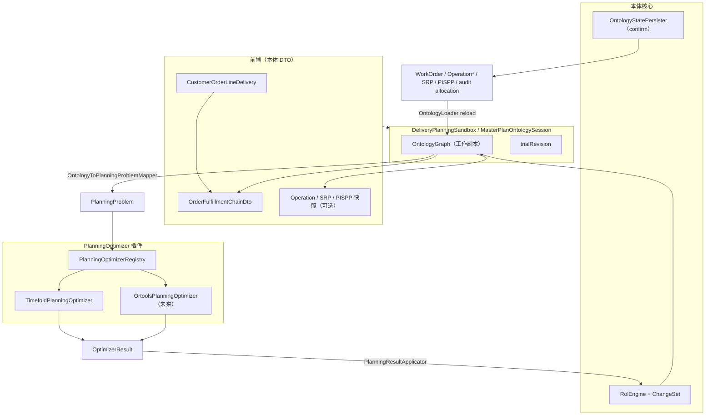

# 本体优先 + 可插拔求解器（M5）

> **版本：** M5 设计基线（2026-06-10）  
> **前置：** [otd-ontology-mapping.md](./otd-ontology-mapping.md)（M1–M4）、[aps-planning-layer.md](./aps-planning-layer.md)  
> **实施计划：** [superpowers/plans/2026-06-10-ontology-optimizer-plugin-m5.md](./superpowers/plans/2026-06-10-ontology-optimizer-plugin-m5.md)

## 1. 目标

| 目标 | 说明 |
|------|------|
| **前端基于本体** | 需求满足、甘特、物料视图只消费本体投影 DTO（`CustomerOrderLineDelivery`、`OrderFulfillmentChainDto`、`Operation`/`SRP`/`PISPP` 快照） |
| **本体可持久化** | `confirm` 将 Sandbox 内图状态写入 JPA；读路径以本体字段为准，而非求解器中间结构 |
| **求解器即插件** | Timefold 为首个实现；后续 OR-Tools 实现同一 `PlanningOptimizer` 接口，API/前端无感知 |
| **收敛 DTO** | 废弃 `OrderPlanningChainDto`；有限能力 trial 与确认后视图统一为增强版 `OrderFulfillmentChainDto` |

**一句话：** `OntologyGraph` 是业务真相源；求解器只负责 `PlanningProblem → OptimizerResult → ChangeSet/Operation.planned*`；前端只看满足链。

---

## 2. 现状与缺口

### 2.1 已有能力（可复用）

| 组件 | 路径 | 作用 |
|------|------|------|
| 本体图 | `com.plantops.ontology.OntologyGraph` | 供需/工序/产能内存模型 |
| 满足链投影 | `OntologyFulfillmentChainProjector` | COLD → SupplyOrder peg 链 → `OrderFulfillmentChainDto` |
| JIT 建链落库 | `OntologyUpstreamFulfillmentBuilder` + `OntologyUpstreamChainWorkOrderPersister` | 创建 MRP SupplyOrder |
| Session 沙盘 | `MasterPlanOntologySession` + `OntologySandboxStore` | simulate / optimize / confirm（全 workspace） |
| 直驱 Mapper | `OntologyToMasterPlanScheduleMapper` | 图 → Timefold `MasterPlanSchedule` |
| 结果回写（内存） | `OperationPlannedTimeProjection` | allocation → `Operation.plannedStartTotal/EndTotal` |
| ROL 传播 | `OntologyTimefoldMapper` + `RolTransaction` | allocation → PISPP/SRP `ChangeSet` |
| 单交付 FinitePlan | `OrderPlanningChainService.previewFiniteForDelivery` | **缺口：内存求解、不回写图、另出 PlanningChain DTO** |

### 2.2 核心缺口

1. **FinitePlan 与满足链脱节** — 求解结果只在 `OrderPlanningChainDto`，刷新 `fulfillment-chain` 看不到 Timefold 时间。
2. **满足链时间非 planned 真相** — `OntologyFulfillmentChainProjector.applyScheduleTimes` 用 JIT 启发式倒排，未 rollup `Operation.planned*`。
3. **求解器与 API 耦合** — Timefold 类型（`MasterPlanSchedule`、`OrderAllocation`）泄漏到需求动作路径。
4. **持久化仍以 allocation 为中心** — confirm 写 `MasterPlanAllocationEntity`；本体 `Operation`/SRP planned 字段未成为读路径 SoT。

---

## 3. 目标架构



### 3.1 分层职责

| 层 | 包 | 职责 |
|----|-----|------|
| **本体 SoT** | `com.plantops.ontology.*` | 业务对象与关系；planned 字段为读路径真相 |
| **ROL** | `com.plantops.rol.*` | `ChangeSet` 应用 + derived 传播 |
| **求解插件** | `com.plantops.scenario.planning.optimizer.*` | 求解器无关 Problem/Result；引擎适配 |
| **Sandbox** | `com.plantops.scenario.planning.delivery.*` / `MasterPlanOntologySession*` | 内存工作副本、TTL、workspace 隔离 |
| **持久化** | `com.plantops.scenario.planning.persist.*` | confirm 写 JPA；audit 派生 |
| **API 投影** | `OntologyFulfillmentChainProjector` 等 | 图 → REST DTO（无 Timefold 类型） |
| **求解器内部** | `com.plantops.solver.masterplan.*` | **仅** Timefold 适配器可见 |

---

## 4. 求解器插件契约

### 4.1 接口

```java
package com.plantops.scenario.planning.optimizer;

public interface PlanningOptimizer {
    /** 稳定引擎标识，如 "timefold" | "ortools" */
    String engineId();

    OptimizerResult optimize(PlanningProblem problem);
}
```

引擎选择：`system_parameter` `planning_optimizer_engine`（workspace 级），默认 `timefold`。由 `PlanningOptimizerRegistry` 注入 CDI 实现并路由。

### 4.2 PlanningProblem（求解器无关）

从 `OntologyGraph` + `MasterPlanSolveProfile` + 可选 scope 投影：

| 字段 | 说明 |
|------|------|
| `planningStart` | 计划起点日 |
| `profile` | 策略、产能模式、目标权重、overlay |
| `scopedSupplyOrderIds` | 空 = 全图；单交付 FinitePlan = 链上 SO 集合 |
| `operations` | 待排工序（supplyOrderId, operationId, segmentIndex, duration, allowedResourceIds, bounds） |
| `capacitySlots` | 资源时间槽（resourceId, date, index, availableMinutes） |
| `fixedLoads` | baseline 其他工单占用（slotId → minutes） |
| `bomEdges` | 父 SO → 子 SO（子先完工） |
| `precedenceEdges` | 同工单工序先后 |
| `materialFeasibility` | 物料闭合快照（PISPP 投影） |

**禁止**在 `PlanningProblem` 中出现 `@PlanningVariable`、Timefold Score 类型。

### 4.3 OptimizerResult（求解器无关）

| 字段 | 说明 |
|------|------|
| `assignments` | `PlanningAssignment` 列表（supplyOrderId, operationId, segmentIndex, resourceId, plannedStart, plannedEnd, durationMinutes） |
| `scoreSummary` | 可读得分摘要（插件自有格式，可选） |
| `solveDurationMs` | 耗时 |
| `diagnostics` | `PlanningDiagnostic`（severity, reasonCode, message, entityId） |
| `engineId` | 实际使用的引擎 |

### 4.4 适配器

| 类 | 职责 |
|----|------|
| `OntologyToPlanningProblemMapper` | `OntologyGraph` → `PlanningProblem` |
| `TimefoldPlanningOptimizer` | `PlanningProblem` → `MasterPlanSchedule` → Timefold → `OptimizerResult` |
| `OrtoolsPlanningOptimizer` | 同上，CP-SAT 模型（M5 后期） |
| `PlanningResultApplicator` | `OptimizerResult` → `OperationPlannedTimeProjection` + `PlanningAssignmentToChangeSetMapper` → `RolTransaction` |

### 4.5 OR-Tools 扩展原则

- 只新增 `OrtoolsPlanningOptimizer` + 内部模型构建；不改 API、不改前端、不改 `OrderFulfillmentChainDto` 形状。
- 对等性：**hard 约束可行性** + assignment 键 `(supplyOrderId, operationId, segmentIndex, resourceId, plannedStart)` 一致率 ≥ 95%；soft objective 允许不同。
- 单交付 Sandbox 与全 workspace Session 共用同一 `PlanningProblem` 契约。

---

## 5. Sandbox 模型

### 5.1 DeliveryPlanningSandbox（单交付）

面向需求满足页 `CustomerOrderLineDelivery` 右键动作。

| 字段 | 说明 |
|------|------|
| `sandboxId` | `DPS-{uuid}` |
| `workspaceId` | 硬隔离 |
| `deliveryId` | COLD 主键 |
| `baselinePlanVersionId` | 有限能力 fixed load 来源（可空） |
| `graph` | `OntologyGraph` 工作副本 |
| `rolEngine` | 与图绑定的 ROL 规则集 |
| `trialRevision` | optimize 递增；0 = 仅 JIT 建链 |
| `lastOptimizerResult` | 最近一次求解摘要 |
| `expiresAt` | TTL（默认 8h，与 Session 一致） |

**生命周期：**

```text
create(deliveryId, baselinePlanVersionId?)
  → OntologyLoader 装载交付子图 + baseline overlay 元数据

infinitePlanJit()
  → UpstreamFulfillmentBuilder（确定性倒排）
  → OntologyUpstreamChainWorkOrderPersister（SupplyOrder 落库）
  → trialRevision = 0
  → 返回 OrderFulfillmentChainDto

optimize(profile?)
  → scopedSupplyOrderIds = 链上 SUPPLY_ORDER
  → fixedLoads = baseline 排除链上 WO
  → PlanningOptimizer.optimize
  → PlanningResultApplicator（内存图，不落库）
  → trialRevision++
  → 返回 OrderFulfillmentChainDto

confirm()
  → OntologyStatePersister.persist(graph, deliveryId)
  → 可选写 audit MasterPlanAllocationEntity
  → sandbox 可销毁或标记 committed

cancel()
  → 删除 sandbox；可选 OrderDemandCancelPlanService
```

### 5.2 MasterPlanOntologySession（全 workspace）

现有 Session **收敛**到同一插件路径：

- `optimize` 改调 `PlanningOptimizerRegistry.get(engine).optimize(problem)`，不再直接 `masterPlanService.solveInMemory`。
- `confirm` 改调 `OntologyStatePersister`；allocation 表仅 audit。

单交付 Sandbox 与全 workspace Session 共享 `PlanningResultApplicator` 与 `OntologyToPlanningProblemMapper`。

---

## 6. API 与 DTO

### 6.1 保留 / 增强

| DTO | 变更 |
|-----|------|
| `OrderFulfillmentChainDto` | **唯一链视图**；保留 deliveryId |
| `FulfillmentChainNodeDto` | 增强（见 §6.2） |
| `OrderDemandActionResult` | FinitePlan 只返回 `fulfillmentChain`；移除 `planningChain`（Phase 2 删除字段） |

### 6.2 FulfillmentChainNodeDto 增强

| 字段 | 来源 |
|------|------|
| `startTs` / `endTs` | SUPPLY_ORDER：`Operation.planned*` rollup；无 planned 时 JIT 占位 |
| `planningStatus` | `OK` / `WARN` / `BLOCKED`（由 diagnostics 聚合） |
| `attributes.planningSignals` | `PlanningDiagnostic[]` |
| `attributes.baselineStartTs` / `baselineEndTs` | baseline 主计划对比（可选） |
| `attributes.trialRevision` | Sandbox 代数 |
| `attributes.solverEngine` | `timefold` / `ortools` / `jit` |

### 6.3 废弃

| DTO / 服务 | 替代 |
|------------|------|
| `OrderPlanningChainDto` | `OrderFulfillmentChainDto` |
| `OrderPlanningChainProjector` | `OntologyFulfillmentChainProjector` + planned rollup |
| `OrderPlanningChainService.previewFiniteForDelivery` | `DeliveryPlanningSandboxService.optimize` |
| `POST /planning/order-chain/preview` | `DeliveryPlanningSandbox` 或 Session API（Phase 2 移除） |

### 6.4 REST 目标（需求满足）

| 方法 | 路径 | 说明 |
|------|------|------|
| GET | `/api/v1/ontology/fulfillment/deliveries/{id}/fulfillment-chain` | 读链（DB 或 sandbox 图） |
| POST | `/api/v1/ontology/fulfillment/deliveries/{id}/sandbox` | 创建 Sandbox |
| POST | `.../sandbox/{sandboxId}/optimize` | 有限能力 optimize |
| POST | `.../sandbox/{sandboxId}/confirm` | 持久化 |
| POST | `.../deliveries/{id}/actions/INFINITE_PLAN_JIT` | JIT 建链（可内部 create sandbox） |
| POST | `.../deliveries/{id}/actions/FINITE_PLAN` | 委托 sandbox optimize（兼容期） |

---

## 7. 持久化：OntologyStatePersister

### 7.1 原则

- **confirm 唯一写入口**：`OntologyStatePersister.persist(PersistContext)`。
- 读路径：`OntologyLoader` 从 JPA  Hydrate 本体 planned 字段，满足链投影读 `Operation.planned*`。
- `MasterPlanAllocationEntity`：**audit / 对照 / 报表**，非 SoT（D38 升级版）。

### 7.2 Phase 1 persist 范围

| 本体 | JPA / 行为 |
|------|------------|
| `SupplyOrder` | 已有 `WorkOrderEntity`（JIT 路径） |
| `Operation.planned*` | Phase 1：confirm 写 audit allocation；Phase 3：Operation 列或 JSON 扩展 |
| `StandardResourcePeriod.reservedCapacity` | Phase 3 |
| `ProductInStockingPointPeriod.plannedSupplyOptimized` | 已有 ChangeSet 路径 |
| `Fulfillment` | `WorkOrderPeggingEntity` |

### 7.3 加载

`OntologyLoader.loadForDelivery(deliveryId)` / `PlanVersionAllocationHydrator` 反灌 published 计划 → `Operation.planned*` + SRP。

---

## 8. 满足链投影规则（OntologyFulfillmentChainProjector）

### 8.1 时间 rollup（替代 JIT 覆盖）

对 `SUPPLY_ORDER` 节点：

1. 取 `graph.operationsForSupplyOrder(supplyOrderId)`。
2. 若任一 `Operation.plannedStartTotal/plannedEndTotal` 非空 → 节点 `startTs` = min(plannedStart)，`endTs` = max(plannedEnd)。
3. 否则 → 保留现有 JIT 倒排（`applyScheduleTimes`）作为占位。

### 8.2 诊断注入

optimize 后把 `OptimizerResult.diagnostics` 写入对应节点的 `attributes.planningSignals`；聚合为链级 `overallStatus`。

### 8.3 工序条

`buildOperations` 已优先读 `Operation.planned*`；与节点 rollup 一致。

---

## 9. 与现有模块关系

```text
确定性推演（非 optimize）          选优（插件）
─────────────────────────          ─────────────
UpstreamFulfillmentBuilder         PlanningOptimizer
PispMrpDerivations                 Timefold / OR-Tools
OperationTimingBoundsProjection    PlanningResultApplicator
JIT applyScheduleTimes（无 planned）  FulfillmentChain planned rollup
```

| 保留 | 逐步废弃 |
|------|----------|
| `OntologyGraph`, `ChangeSet`, `RolEngine` | `OrderPlanningChainDto` |
| `MasterPlanOntologySession` | `FulfillmentPeggingService` 作为 S01 读路径 |
| `OntologyToMasterPlanScheduleMapper`（Timefold 适配内部） | confirm 时无条件 `MasterPlanService.solve()` 重扫 DB |
| `OperationPlannedTimeProjection` | `MasterPlanPlanningContextBuilder` 作为 SoT 读路径 |

---

## 10. 锁定决策（M5）

| # | 决策 | 值 |
|---|------|-----|
| **D35** | 前端链视图 SoT | 仅 `OrderFulfillmentChainDto` |
| **D36** | 求解器边界 | `PlanningOptimizer` 插件；Problem/Result 无 Timefold 类型 |
| **D37** | 预览 vs 确认 | optimize 仅内存 ROL；confirm 才 `OntologyStatePersister` |
| **D38** | allocation 表 | audit/cache，非读路径真相源 |
| **D39** | 单交付 scope | `DeliveryPlanningSandbox` + scoped SO + baseline fixedLoads |
| **D40** | OR-Tools 对等 | hard 可行 + assignment 键一致；soft 可不同 |
| **D41** | 引擎选择 | `planning_optimizer_engine` 系统参数，默认 `timefold` |
| **D42** | Sandbox TTL | 8h，继承 `OntologySandboxStore` |

### 10.1 切换 OR-Tools 引擎

系统参数 `planning_optimizer_engine` 可选值：

| 值 | 说明 |
|----|------|
| `timefold` | 默认；Timefold 局部搜索，soft 目标完整 |
| `ortools` | Google OR-Tools CP-SAT；hard 产能/先后约束，soft 目标简化 |

切换步骤（无需改代码或前端）：

1. 管理后台 / 计划参数 → 将 `planning_optimizer_engine` 设为 `ortools`
2. 重启不必需：`ParameterRegistry` 下次读取即生效
3. 需求满足页 **有限能力计划**、本体 Session **optimize** 均走 `PlanningOptimizerRegistry.requireDefault()`

对等性：`PlanningOptimizerParityTest` 在代表性单工单场景验证 hard 可行 + assignment 键 Jaccard ≥ 95%（D40）。soft 分数可不同。

---

## 11. 分阶段实施

详见 [M5 实施计划](./superpowers/plans/2026-06-10-ontology-optimizer-plugin-m5.md)。

| Phase | 内容 | 验收 |
|-------|------|------|
| **1** | 插件接口 + Timefold 适配 + DeliverySandbox + FinitePlan 改造 + Fulfillment 投影 rollup | FinitePlan 后 refresh 满足链可见 planned 时间；单元测试绿 |
| **2** | DTO 合并、废弃 PlanningChain API/前端 viewMode | 需求页单一链视图 |
| **3** | Session 走插件 + OntologyStatePersister 扩展 + allocation audit | confirm 后 reload 与 sandbox 一致 |
| **4** | OrtoolsPlanningOptimizer + 对等测试 | 参数切换引擎 |

---

## 12. 代码索引（目标包）

| 用途 | 路径 |
|------|------|
| 插件接口 | `scenario/planning/optimizer/PlanningOptimizer.java` |
| Timefold 适配 | `scenario/planning/optimizer/timefold/TimefoldPlanningOptimizer.java` |
| OR-Tools 适配 | `scenario/planning/optimizer/ortools/OrtoolsPlanningOptimizer.java` |
| Problem 投影 | `scenario/planning/optimizer/OntologyToPlanningProblemMapper.java` |
| 结果应用 | `scenario/planning/optimizer/PlanningResultApplicator.java` |
| 单交付 Sandbox | `scenario/planning/delivery/DeliveryPlanningSandbox*.java` |
| 持久化 | `scenario/planning/persist/OntologyStatePersister.java` |
| 满足链投影 | `ontology/fulfillment/OntologyFulfillmentChainProjector.java` |

---

*文档随 M5 实施更新；类名以 `src/main/java` 为准。*
