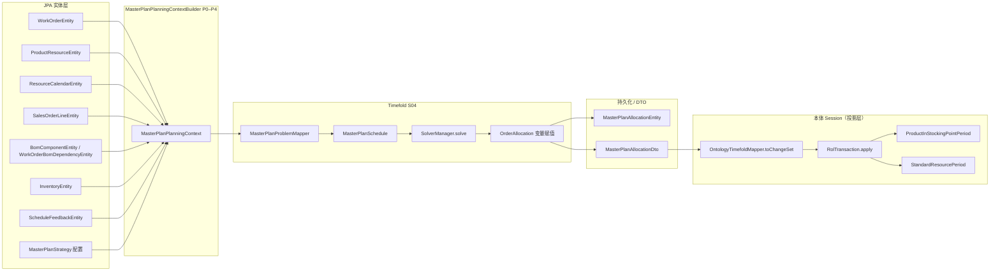

# 本体直驱 Timefold 求解评估（M3 Spike）

> **日期：** 2026-06-10  
> **范围：** Epic E / Task E.1 — 仅评估与决策记录，**无生产代码变更**  
> **Related：** [M3 计划](./superpowers/plans/2026-06-10-otd-ontology-master-plan-m3.md)（D5/D16）、[otd-ontology-mapping.md](./otd-ontology-mapping.md)

## 问题陈述

M2/M3 采用 **D5 复用策略**：Timefold 问题事实仍由 `MasterPlanPlanningContextBuilder` 从 JPA 实体装载，`OntologyTimefoldMapper` 仅将求解结果投影为 `ChangeSet` 回写 PISPP/SRP。本 spike 评估：是否应将 **本体图（`OntologyGraph`）** 升级为 Timefold 的 **唯一问题事实来源**，替代实体驱动的 `MasterPlanProblemMapper` 链路。

---

## 1. 现状：复用策略（D5）数据流

本体在现行架构中的角色是 **结果投影层**（optimize 后 PISPP `plannedSupplyTotal`、SRP `reservedCapacity`），而非求解输入真相源。

**关键路径说明：**

| 阶段 | 组件 | 行为 |
|------|------|------|
| 装载 | `MasterPlanPlanningContextBuilder` | 扫 `WorkOrderEntity`、工艺 `ProductResourceEntity`、MRP `MaterialFeasibilityService`、BOM 边、时栅 `TimeslotHorizonService`、反馈 overlay、并行绑定、策略权重 |
| 投影 | `MasterPlanProblemMapper` | `PlanningContext` → `MasterPlanSchedule`；额外加载 `ChangeoverRuleIndex` |
| 求解 | `MasterPlanService.solveProblem` | `SolverManager` 优化 `OrderAllocation.timeSlot` |
| 持久化 | `persistResult` | `OrderAllocation` → `MasterPlanAllocationEntity` / `PlanVersionEntity` |
| 本体桥接 | `MasterPlanOntologySessionService.optimize` | 调用 `MasterPlanService`（或读已有 version）→ `OntologyTimefoldMapper` → ROL 传播 PISPP/SRP |

---

## 2. 直驱方案：字段映射与缺口

下表按 **Timefold 问题事实 / 规划实体** 逐项对照本体对象。来源锚点：`MasterPlanSchedule`、`MasterPlanConstraintProvider`、`MasterPlanPlanningContextBuilder`。

### 2.1 问题事实（Problem Facts）

| 求解类 / 字段 | 当前实体 / 服务来源 | 本体对应 | 覆盖 / 缺口 |
|---------------|---------------------|----------|-------------|
| **TimeSlot.id** | `TimeslotHorizonService` 合成 `resourceId-D{n}` / `W{n}` | — | **缺口**：本体仅有 `Period`（混合桶 `ontology_period_sequence`），无 per-resource×shift 槽位 ID |
| **TimeSlot.index** | 时栅全局序号 | — | **缺口**：Period 仅有 `sequenceNr`，无跨资源全局 index |
| **TimeSlot.date / periodEnd** | 日槽 / 周槽起始结束 | `Period.startDate / endDate` | **部分**：粒度与 horizon 参数（`timeslot_*` vs `ontology_period_sequence`）不一致 |
| **TimeSlot.granularity** | `TimeslotGranularity` DAY/WEEK | `Period` 桶类型（d/w/m） | **部分**：周槽在求解侧按 7 日滚动，本体 Period 周桶边界可能不同 |
| **TimeSlot.shiftId** | 日槽固定 `DAY`；周槽 `WEEK`；日历 `ResourceCalendarEntity.shiftId` | — | **缺口**：本体 SRP 不按 shift 拆分 |
| **TimeSlot.resourceId** | `ProductionResourceEntity.routingResourceIds()` | `StandardResourcePeriod.standardResourceId` | **映射**：资源 ID 一致，但 SRP 是 period 聚合非 slot |
| **TimeSlot.capacityMinutes** | `ResourceCalendarEntity` 按日/周汇总 | `StandardResourcePeriod.totalCapacity − calendarDowntime`（period 内 Σ 日历） | **部分**：period 聚合 vs 单槽容量；周槽 `capacityForRange` 与 SRP 月桶不对齐 |
| **MasterPlanSettings.capacityStrategy** | `MasterPlanStrategyConfigService` → `MasterPlanCapacityStrategy` | — | **缺口**：策略配置不在 Session / 图内 |
| **MaterialFeasibilityContext.closingByMaterial** | `MaterialFeasibilityService` MRP 按日闭合 | `PISPP.plannedInventoryLevel` 链 | **缺口**：PISPP 是产品×period 滚动，非物料按日 NavigableMap；无采购件/自制件递归闭合语义 |
| **MaterialFeasibilityContext.bomByParent** | `BomComponentEntity` + MRP 展开 | — | **缺口**：本体无 BOM 组件需求对象 |
| **MaterialFeasibilityContext.bomByFinishedAndParent** | 成品 scoped BOM | — | **缺口** |
| **MaterialFeasibilityContext.manufacturedProducts** | `ProductResourceEntity` 产品集合 | `Product` 列表 | **部分**：有产品，无「可制造」标记与 MRP 集合对齐逻辑 |
| **MasterPlanObjectiveSettings.weightsById** | `MasterPlanObjectiveConfigService` / 策略 JSON | — | **缺口**：软目标权重不在本体 |
| **AdjacentSlotPair** | `AdjacentSlotPairFactory.fromSlots(timeSlots)` | — | **缺口**：可由 TimeSlot 派生，但本体无 TimeSlot 集合 |
| **MasterPlanCapacityOverlay.feedbackCutoff** | `ScheduleFeedbackService` + 参数 | — | **缺口**：冻结截止日不在 Session 图 |
| **MasterPlanCapacityOverlay.fixedMinutesBySlotId** | `ScheduleFeedbackEntity` → `SlotFixedLoad` | — | **缺口**：细排反馈固定负荷无本体表示 |
| **BomDependencyEdge.parent/childWorkOrderNo** | `WorkOrderBomDependencyEntity` | `SupplyOrder` 父子（`WorkOrderEntity.parentWorkOrderNo`） | **部分**：SO 有父子工单号，但无显式 MRP 合并边表；合并工单一对多边缺失 |
| **OperationPrecedenceEdge** | `MasterPlanOperationPrecedenceBuilder`（由 OrderAllocation 派生） | `Operation.sequenceNr` 链 | **部分**：工序序存在，但无 predecessor/successor allocation ID 边；拆段后多 allocation 无法表达 |
| **WorkOrderTimingBoundsContext.earliestStartByWorkOrder** | `WorkOrderTimingService.buildMasterPlanBounds()`（上游就绪、pegging、工艺） | `Operation.earliestPossibleStart`（M3 简化正排） | **部分**：本体仅日粒度、无 `LocalDateTime`、无上游物料 fulfillment（D14 明确简化） |
| **ChangeoverRuleIndex** | `BusinessRuleScopeService.loadMasterPlanChangeoverIndex()` | — | **缺口**：换型矩阵不在本体 |

### 2.2 规划实体 OrderAllocation（约束读取字段）

| OrderAllocation 字段 | 当前来源 | 本体对应 | 覆盖 / 缺口 |
|----------------------|----------|----------|-------------|
| **id** | `workOrderNo@OP{seq}_{seg}#{n}` 合成 | `Operation.id` | **部分**：本体 Operation ID 不同语义，无拆段后缀 |
| **workOrderNo** | `WorkOrderEntity.workOrderNo` | `SupplyOrder.id`（= workOrderNo） | **映射** |
| **parentWorkOrderNo** | `WorkOrderEntity.parentWorkOrderNo` | —（SO 未挂父 WO 字段） | **缺口** |
| **salesOrderNo / salesOrderLineNo** | `WorkOrderScheduleContext` ← SO/pegging | — | **缺口**：SupplyOrder 无销售订单行 |
| **productCode** | `WorkOrderEntity.productCode` | `SupplyOrder.productCode` | **映射** |
| **resourceId** | `ProductResourceEntity` 主资源 | — | **缺口**：Operation 无绑定资源 |
| **operationName / operationSeq** | `ProductResourceEntity` | `Operation.operationName / sequenceNr` | **映射**（序号为 loader 内 0-based，求解为 `sequenceNo`） |
| **dueDate** | `WorkOrderScheduleContext.dueDate` | `SupplyOrder.needDate` | **部分**：needDate 来自 WO.needDate，未必等于 pegging 交期 |
| **priority** | SO `priority` 或默认 5 | — | **缺口** |
| **durationMinutes** | 工艺 × 数量 + 拆段逻辑 | `Operation.productionTimeMinutes` | **部分**：本体为整工序分钟，无 FINITE_CAPACITY 拆段 |
| **segmentIndex / lastSegment** | `MasterPlanAllocationBuilder` 拆段 | — | **缺口** |
| **workOrderQuantity** | `WorkOrderEntity.quantity` | `SupplyOrder.quantity` | **映射** |
| **locked** | 冻结窗 + `scheduleLockFlag` + 业务规则 | — | **缺口** |
| **parallelGroupId / parallelOrphan / designatedLineId** | `MasterPlanParallelBindingService` + 业务规则 | — | **缺口**：并行工序组不在本体 |
| **allowedResourceIds** | `ProductRoutingSteps` 多资源工艺 | — | **缺口**：Operation 无候选资源列表 |
| **eligibleTimeSlots** | P3 过滤：资源 + overlay + timing bounds | — | **缺口**：须从 TimeSlot 全集 + 规则派生，本体无 |
| **timeSlot**（变量） | Timefold 赋值 | — | **缺口**：无槽位对象可赋 |

### 2.3 约束 ↔ 事实依赖汇总

| 约束名 | 依赖事实 | 本体可支撑？ |
|--------|----------|--------------|
| Material feasible on slot | `MaterialFeasibilityContext` + OA 产品/数量/槽日期 | **否**（MRP 按日闭合缺失） |
| Resource must match slot | OA `allowedResourceIds` + TimeSlot `resourceId` | **否**（缺 allowed 列表与 TimeSlot） |
| Not before earliest feasible start | `WorkOrderTimingBoundsContext` | **部分**（日粒度简化窗） |
| Upstream before parent WO | `BomDependencyEdge` + 槽 index | **部分**（缺显式边与槽 index） |
| Operation serial precedence | `OperationPrecedenceEdge` | **部分**（无 allocation 级边） |
| Parallel operations same slot | OA `parallelGroupId` | **否** |
| Slot capacity | TimeSlot `capacityMinutes` + overlay + settings | **部分**（period 级 SRP ≠ slot） |
| Segment order across days | OA `segmentIndex` | **否** |
| Locked / lateness / priority 软目标 | `MasterPlanObjectiveSettings` + OA 字段 | **部分**（缺 locked/priority/策略） |
| Balance adjacent slot loading | `AdjacentSlotPair` + objectives | **否**（无相邻槽对） |
| Concentrate capacity | TimeSlot 容量 + overlay | **部分** |
| Minimize slot changeover | `ChangeoverRuleIndex` + 同槽多产品 | **否** |

**覆盖率粗估：** 问题事实字段约 **15% 可直接映射**、**25% 部分对齐**、**60% 为缺口或需大量派生逻辑**。规划实体 OrderAllocation 约 **30% 字段可映射**，拆段、并行、资源候选、eligible 域均为硬缺口。

---

## 3. 成本/收益分析

| 维度 | 维持复用（D5） | 直驱本体 | 混合（本体 + 实体补洞） |
|------|--------------|----------|-------------------------|
| **需新增本体对象（估）** | 0 | **7–10** 类：`ResourceSchedulingSlot`（或 TimeSlot）、`BomDependency`、`ChangeoverRuleSet`、`ParallelOperationGroup`、`MaterialFeasibilitySnapshot`、`ProductionResource`、`ScheduleFeedbackOverlay`、`StrategyObjectiveBinding` 等 | **4–6** 类（仅补最大缺口） |
| **Mapper 重写范围** | 无；维持 `MasterPlanPlanningContextBuilder` + 薄 `MasterPlanProblemMapper` | 替换/废弃 ContextBuilder 实体扫描；新建 `OntologyToMasterPlanScheduleMapper`；`OntologyLoader` 大幅扩展 | 双入口：`OntologyGraph` + 实体查询并存 |
| **涉及类（估）** | — | `OntologyLoader`、`OntologyGraph`、`MasterPlanPlanningContextBuilder`、`MasterPlanAllocationBuilder`、`MasterPlanProblemMapper`、`MasterPlanOntologySessionService`、`MaterialFeasibilityService` 桥接 | 上述 + 分支逻辑 |
| **双轨维护风险** | 低：实体→求解单路径；本体仅结果投影 | 低（若彻底直驱）但迁移成本高 | **高**：Period vs TimeSlot、MRP vs PISPP、JIT 窗 vs TimingService 三套语义需长期同步 |
| **性能** | 求解前多次实体查询 + MRP；图构建与求解分离 | 单次图构建（O(WO×工序×period)）可能更重；可减少重复 MRP 若闭合进图 | 图构建 + 部分实体查询 |
| **测试负担** | 现有 S04 + M2/M3 Session 测试 | 全量回归 + 新 mapper 对等性测试（实体路径 vs 直驱路径 score/allocation 一致） | 对等性 + 分支覆盖 |
| **业务收益** | 本体 UI 与求解已打通（optimize/confirm） | 单一真相源、simulate 改值可直达求解输入 | 渐进对齐，短期收益有限 |
| **时间（粗估）** | 0（现状） | **8–12+ 周**（M4 专项） | **4–6 周** + 持续对齐成本 |

---

## 4. 结论与建议

### 推荐：**维持复用（D5）**

依据代码审查，本体图当前覆盖的是 **OTD 计划语义**（PISPP 滚动、SRP period 产能、Operation JIT 日窗），而 S04 Timefold 消费的是 **APS 槽位级排程语义**（混合日/周 TimeSlot、拆段 OrderAllocation、MRP 硬约束、换型矩阵、并行绑定、反馈冻结）。二者 **period 模型、时间粒度、BOM/MRP 闭合、资源候选与拆段** 均未对齐。强行直驱需在 M4 重建实质上已存在于 `MasterPlanPlanningContextBuilder` 的 P0–P4 推演层，收益主要是架构统一，而非短期功能或性能。

**不建议** 在 M3 后立刻启动全量直驱；**不建议** 长期并行「混合」双入口（双轨维护成本高于收益）。

### 若未来重评直驱的触发条件

1. **时栅统一：** `Period` 与 `TimeSlot` 共用同一 horizon / 粒度配置（或 TimeSlot 可由 `Period` + shift 确定性展开），且周/月桶边界一致。
2. **MRP 闭合进本体：** PISPP 链（或新 `MaterialPeriod`）提供与 `MaterialFeasibilityContext` 等价的按日/按 period 物料可行性，硬约束 `materialFeasibleOnSlot` 可单源验证。
3. **Operation 完备：** 每 Operation 具备 `allowedResourceIds`、与 Timefold 一致的 `durationMinutes`（含拆段策略）、`parallelGroupId`；`BomDependency` 显式建模。
4. **规则入图：** 换型矩阵、冻结窗/反馈 overlay、策略软目标权重可挂载 Session 或图扩展，无需 `BusinessRuleScopeService` 旁路查询。
5. **对等性证明：** 直驱 mapper 与现有路径在代表性 workspace 上 **allocation 集合与 hard score 一致**（自动化回归套件）。
6. **产品诉求：** 需要「Session simulate 修改供需/产能后直接触发求解、无需重扫 DB」且上述对齐已完成。

### M4 若启动直驱的实施顺序（备忘）

1. 统一时栅模型（TimeSlot 或 SchedulingSlot 本体类）  
2. 扩展 Operation + BOM 边 + 并行组  
3. MRP 闭合与 `MaterialFeasibilityContext` 桥接或内化  
4. `OntologyToMasterPlanScheduleMapper` + 对等性测试  
5. 切换 `optimize` 读图求解；保留实体路径 feature flag 直至回归绿灯  

---

*Epic E Task E.1 交付物 — 2026-06-10*
