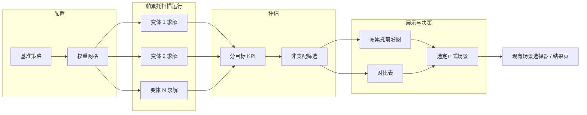

# 帕累托扫描模式 — 产品设计（v1）

| 项目 | 说明 |
|------|------|
| 文档版本 | v1.0 |
| 日期 | 2026-05-28 |
| 状态 | 设计稿（待评审 / 开发） |
| 关联 | `PROJECT_DOCUMENTATION.md` §3.4 策略、§3.5 场景、场景对比页 |

---

## 1. 背景与目标

### 1.1 现状

主计划求解采用 **Timefold HardSoftScore + 软目标加权求和**，每次运行产出 **一个** 标量最优场景（`planVersionId`）。计划员通过配置不同 **主计划策略**（权重组合）多次运行，在 **场景对比** 页人工比较权衡。

Timefold **不支持原生 Pareto Score**；无法在单次求解中自动输出数学意义上的帕累托前沿。

### 1.2 产品目标

在不改造求解器内核的前提下，提供 **「帕累托扫描」运行模式**：

1. 按预设的权重组合 **批量求解** 多个场景；
2. 对每个场景计算 **可解释的分目标 KPI**（而非仅总 Soft Score）；
3. 自动筛选 **非支配解（帕累托前沿）**；
4. 在专用界面展示 **前沿散点图 + 对比表**，计划员选定一个场景进入现有结果页链路。

**定位**：不是替代现有「单策略计划运行」，而是面向「多目标权衡探索」的增强模式。

### 1.3 成功标准

| 指标 | 目标 |
|------|------|
| 计划员可在 5 分钟内完成一次 9～16 点扫描并看懂权衡 | 是 |
| 前沿中任意两方案，至少在某一 KPI 上互有优劣 | 可验证 |
| 选定前沿方案后，与现有场景选择器 / 四结果页 **零改造联动** | 是 |
| 单次扫描总耗时可控（默认 ≤ 15 分钟） | 可配置上限 |

---

## 2. 概念模型



| 概念 | 说明 |
|------|------|
| **帕累托扫描** | 一次用户触发的批量运行，产生 `paretoScanId`，包含 N 个子场景 |
| **扫描变体** | 在基准策略（产能模式、硬约束不变）上，仅改变软目标权重的一组参数 |
| **分目标 KPI** | 从分配结果 **事后计算** 的业务指标，与求解器惩罚项一一对应但可独立理解 |
| **非支配解** | 在所有已启用 KPI 上，不存在「全部不差且至少一项更优」的另一方案 |
| **帕累托前沿** | 非支配解集合；允许计划员在前沿外手动加入方案对比 |

---

## 3. 用户与场景

| 角色 | 典型场景 |
|------|----------|
| 计划员 | 交期与产能均衡冲突，希望看到「偏交期 / 偏均衡 / 折中」各长什么样 |
| 生产主管 | 评估开有限产能后，延期与超载区间的权衡曲线 |
| 管理层 | 评审会前快速展示 3～5 个代表性方案，而非单一 Score |

**典型流程**

1. 在「计划运行」或新页「帕累托探索」选择 **基准策略** 与 **扫描模板**；
2. 启动扫描 → 进度条展示 N/M 完成；
3. 进入 **帕累托前沿** 视图：散点图（X=延期 KPI，Y=均衡 KPI，点=场景）；
4. 点击前沿上的点 → 侧边卡片显示策略权重、产能 KPI、Hard 可行性；
5. **「采用此场景」** → 写入 `PlanContext.selectedScenarioId`，跳转需求满足 / 产能平衡等结果页。

---

## 4. 功能范围

### 4.1 MVP（v1）

| 编号 | 功能 | 说明 |
|------|------|------|
| P01 | 扫描模板 | 内置 2～3 套权重网格（见 §5.2） |
| P02 | 批量流水线 | 顺序调用现有 `MasterPlanService.solveWithStrategy`（变体权重注入） |
| P03 | 分目标 KPI 落库 | 每个 `planVersionId` 关联 `objective_kpi` JSON |
| P04 | 非支配筛选 API | 输入 scanId 或 planVersionId 列表 → 返回 `paretoFront` + `dominated` |
| P05 | 帕累托探索页 | 散点图 + 前沿列表 + 采用场景 |
| P06 | 与场景对比打通 | 前沿方案一键加入现有场景对比多选 |

### 4.2 后续（v2+）

- 自定义权重网格（UI 编辑各目标档位）
- ε-约束扫描（固定延期上限再优化均衡）
- 扫描结果导出 Excel / 快照命名
- 与详细排程联动（前沿方案批量试排程）

### 4.3 明确不做（v1）

- Timefold 内核 Pareto Score 改造
- 实时并行 N 路求解（v1 顺序执行，降低复杂度）
- 多工厂 / 多租户

---

## 5. 扫描配置

### 5.1 基准策略

用户选择已有 **主计划策略** 作为基准：

- **继承**：`capacityStrategy`、业务规则、规划窗参数；
- **覆盖**：仅 `objectives[].weight` 按网格变化；
- **变体命名**：`{基准策略名} · 扫描-{序号} · w(延期={a},均衡={b},…)`。

### 5.2 内置扫描模板（MVP）

面向当前四个软目标，v1 **仅对计划员最常权衡的两维扫描**：**延期** vs **产能均衡**；其余目标保持基准策略权重不变。

| 模板 ID | 名称 | 网格 | 变体数 |
|---------|------|------|--------|
| `grid_lateness_balance_3x3` | 延期 × 均衡（3×3） | 延期权重 ∈ {5, 10, 20} × 均衡权重 ∈ {0, 1, 5} | 9 |
| `grid_lateness_balance_2x2` | 快速扫描（2×2） | 延期 ∈ {5, 20} × 均衡 ∈ {0, 5} | 4 |
| `grid_full_extremes` | 单目标极值 | 每次仅启用一个软目标（4 变体） | 4 |

**默认推荐**：`grid_lateness_balance_3x3`（9 点，约 9 × 单次求解时长）。

**权重为 0** 表示该软目标在当次变体中 **关闭**（与优化目标页「禁用」语义一致）。

### 5.3 运行约束

| 参数 | 默认 | 说明 |
|------|------|------|
| `maxVariants` | 16 | 单次扫描变体上限 |
| `skipInfeasible` | true | Hard &lt; 0 的方案仍入库但默认不进入前沿 |
| `dedupeByAllocation` | true | 分配结果完全相同的变体只保留一个代表 |
| `solverSecondsOverride` | null | 可选缩短单次求解时间以控制总时长 |

---

## 6. 分目标 KPI 定义

分目标 KPI 在求解完成后，基于 `master_plan_allocation` **确定性重算**，便于与业务沟通，且用于帕累托比较（**全部按「越小越好」归一**）。

| KPI ID | 名称 | 单位 | 计算方式 | 对应软目标 |
|--------|------|------|----------|------------|
| `obj_total_lateness_days` | 总延期人天 | 天 | Σ max(0, 完成日 − 交期) × 订单量权重 | `minimize_lateness` |
| `obj_late_order_lines` | 延期订单行数 | 行 | 交期被超出的 SO 行数 | `minimize_lateness` |
| `obj_priority_penalty` | 优先级惩罚 | 点 | Σ 槽位序号 × 优先级（与约束同公式） | `prioritize_high_priority` |
| `obj_locked_earliness_penalty` | 锁定靠前惩罚 | 点 | Σ 锁定订单槽位序号 | `locked_orders_prefer_earlier` |
| `obj_balance_penalty` | 产能均衡惩罚 | 分钟 | Σ 相邻槽位负荷差（与约束同公式） | `balance_adjacent_slot_loading` |
| `obj_hard_feasible` | 硬约束可行 | 0/1 | Hard Score = 0 → 1，否则 0 | （硬约束） |

**帕累托比较维度（MVP 默认）**

- 主平面：**`obj_total_lateness_days`**（X） vs **`obj_balance_penalty`**（Y）
- 过滤：仅 `obj_hard_feasible = 1` 的方案参与非支配筛选
- 辅助：悬浮展示 `cap_overload`、`mp_total_wo`、总 Soft Score

**持久化**

```json
{
  "planVersionId": "MP-20260528-001",
  "objectiveKpis": {
    "obj_total_lateness_days": 12.0,
    "obj_balance_penalty": 840.0,
    "obj_hard_feasible": 1
  },
  "weightsUsed": {
    "minimize_lateness": 10,
    "balance_adjacent_slot_loading": 5
  }
}
```

建议新增表 `plan_objective_kpi` 或扩展 `plan_version.metadata`（CLOB）。

---

## 7. 非支配筛选

### 7.1 算法（MVP）

输入：方案集合 `S`，比较维度集合 `D`（默认 `{obj_total_lateness_days, obj_balance_penalty}`）。

方案 **a 支配 b** 当且仅当：

- ∀ d ∈ D: `kpi[a,d] ≤ kpi[b,d]`
- ∃ d ∈ D: `kpi[a,d] < kpi[b,d]`

**帕累托前沿** = { s ∈ S | 不存在 s' ∈ S 支配 s }。

复杂度 O(n² · |D|)，n ≤ 16 完全可接受。

### 7.2 业务规则

| 规则 | 说明 |
|------|------|
| 不可行方案 | Hard 不可行默认不参与前沿，但在「全部变体」列表可查看 |
| 完全相同 KPI | 保留先完成者，或合并为一条展示 |
| 单点前沿 | 提示「当前网格下未发现权衡，请扩大权重范围或检查数据」 |

---

## 8. 界面设计

### 8.1 入口

**方案 A（推荐）**：在 **计划运行** 页增加运行模式切换：

```text
运行模式：  ( • 单策略运行 )  ( ○ 帕累托扫描 )
```

选「帕累托扫描」时显示：基准策略下拉 + 扫描模板下拉 + 「开始扫描」。

**方案 B**：独立导航 **主计划 → 帕累托探索**（与场景对比并列）。

MVP 采用 **方案 A**，减少导航项；前沿详情可跳转至 **场景对比** 深链。

### 8.2 帕累托探索页布局

```text
┌──────────────────────────────────────────────────────────────┐
│ 帕累托探索 · 扫描 PARETO-20260528-01   [导出] [加入场景对比] │
├───────────────────────┬──────────────────────────────────────┤
│ 散点图                 │ 变体列表                              │
│  X: 总延期人天         │  ★ 前沿 (3)                          │
│  Y: 均衡惩罚           │    ○ MP-…-03  延期12 均衡840  [采用]   │
│  ★=前沿 ○=被支配       │    ○ MP-…-07  …                       │
│  点击点高亮            │  ─ 被支配 (6) [展开]                  │
├───────────────────────┴──────────────────────────────────────┤
│ 选中变体详情：权重、Hard/Soft Score、产能超载、链接四结果页      │
└──────────────────────────────────────────────────────────────┘
```

**散点图交互**

- 前沿点：实心 + 强调色；被支配点：空心灰点
- 框选多个点 → 批量加入场景对比
- 坐标轴可切换（v2）：延期 vs 超载区间数

### 8.3 与现有页面关系

| 现有能力 | 帕累托模式下的行为 |
|----------|-------------------|
| 场景选择器 | 「采用」后等价于手动选中该 `planVersionId` |
| 场景对比 | 前沿方案预填勾选 |
| 优化目标 / 策略 | 基准策略只读引用；变体权重不入策略库（除非用户「另存为策略」） |
| 计划运行日志 | 扫描产生一条父记录 + N 条子运行日志 |

---

## 9. 数据模型与 API

### 9.1 新增实体（建议）

**`pareto_scan_run`**

| 字段 | 类型 | 说明 |
|------|------|------|
| scan_id | VARCHAR | 主键 |
| base_strategy_id | VARCHAR | 基准策略 |
| template_id | VARCHAR | 扫描模板 |
| status | ENUM | RUNNING / SUCCESS / FAILED / PARTIAL |
| variant_count | INT | 计划变体数 |
| completed_count | INT | 已完成 |
| started_ts / finished_ts | TIMESTAMP | |
| execution_log | CLOB | 进度日志 |

**`pareto_scan_variant`**

| 字段 | 类型 | 说明 |
|------|------|------|
| scan_id | VARCHAR | FK |
| variant_index | INT | 序号 |
| plan_version_id | VARCHAR | 求解产出 |
| weights_json | CLOB | 当次权重 |
| objective_kpis_json | CLOB | 分目标 KPI |
| is_pareto_front | BOOLEAN | 筛选结果 |
| pipeline_run_id | VARCHAR | 可选，关联单次 pipeline |

### 9.2 REST API（草案）

| 方法 | 路径 | 说明 |
|------|------|------|
| GET | `/api/v1/planning/pareto/templates` | 扫描模板列表 |
| POST | `/api/v1/planning/pareto/scans` | 启动扫描 `{ baseStrategyId, templateId }` |
| GET | `/api/v1/planning/pareto/scans/{scanId}` | 状态 + 进度 |
| GET | `/api/v1/planning/pareto/scans/{scanId}/result` | 变体 + 前沿 + KPI |
| POST | `/api/v1/planning/pareto/scans/{scanId}/pareto-filter` | 自定义比较维度重算前沿 |
| POST | `/api/v1/planning/pareto/scans/{scanId}/adopt` | `{ planVersionId }` 标记为推荐场景 |

现有 `/planning/scenarios` 列表在扫描完成后 **自动包含** 新产生的 `planVersionId`（无需新接口）。

### 9.3 服务层

```text
ParetoScanService
  ├─ expandTemplate(baseStrategy, templateId) → List<WeightVariant>
  ├─ runScan(scanId) → 循环 MasterPlanService.solveWithVariant(...)
  ├─ ObjectiveKpiCalculator.compute(planVersionId) → Map
  ├─ ParetoDominanceFilter.front(variants, dimensions) → Set
  └─ 复用 PipelineRunService 写日志（可选）

ObjectiveKpiCalculator
  └─ 与 MasterPlanConstraintProvider 公式保持一致（共享纯函数或单测对齐）
```

---

## 10. 技术要点与风险

| 项 | 说明 |
|----|------|
| 求解器 | 仍为加权单目标；帕累托是 **运行编排 + 事后评估** |
| KPI 一致性 | `ObjectiveKpiCalculator` 必须与约束惩罚 **同源公式**，需单元测试对照 |
| 性能 | 9 变体 × 30s ≈ 4.5min；需在 UI 明示预估时长 |
| H2 内存 | 扫描产生多版本；演示环境可接受，生产需版本保留策略 |
| 去重 | 不同权重可能收敛到相同分配；dedupe 避免前沿假象 |

---

## 11. 实施分期

### Phase 1 — 后端骨架（约 3～5 人日）

- [ ] Flyway：`pareto_scan_run` / `pareto_scan_variant` / KPI 存储
- [ ] `ObjectiveKpiCalculator` + 单测
- [ ] `ParetoScanService` + 3 个内置模板
- [ ] REST + 扫描进度查询

### Phase 2 — 前端（约 3～4 人日）

- [ ] 计划运行页「帕累托扫描」模式
- [ ] 帕累托探索页（散点图 + 列表 + 采用）
- [ ] 与 `PlanContext` / 场景对比联动

### Phase 3 —  polish（约 2 人日）

- [ ] 扫描失败重试、部分成功（PARTIAL）
- [ ] 文档与 `PROJECT_DOCUMENTATION.md` 索引
- [ ] 演示脚本：一键跑 2×2 快速扫描

---

## 12. 附录：与「多策略手动对比」的差异

| 维度 | 现有：多策略手动运行 | 帕累托扫描 |
|------|---------------------|------------|
| 权重设定 | 用户逐个建策略 | 模板自动生成网格 |
| 对比指标 | 总 Hard/Soft + 产能 KPI | **分目标 KPI** + 非支配筛选 |
| 决策辅助 | 人工看柱状图 | **前沿散点 + 支配关系** |
| 场景数量 | 不确定 | 可控（4～16） |
| 存入策略库 | 是 | 变体默认 **不** 入库（可选另存） |

---

*本文档为 v1 设计稿；开发以评审结论为准。实施完成后合并摘要至 `PROJECT_DOCUMENTATION.md`。*
