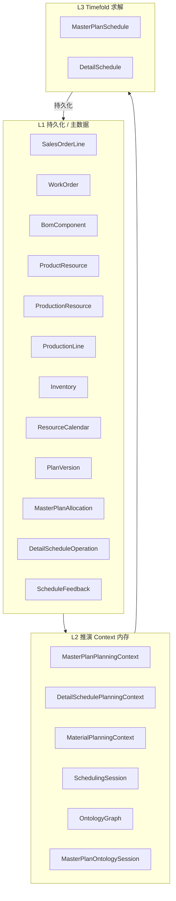
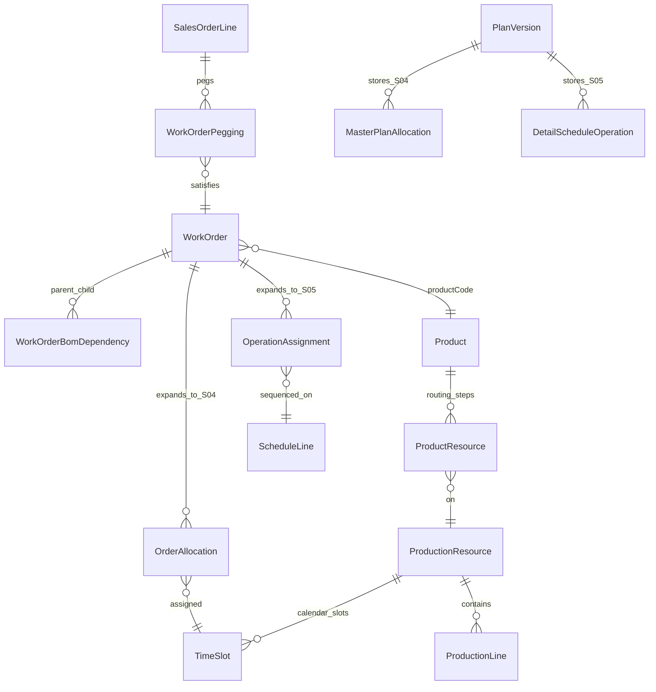

# 排程领域模型

本文档描述 Plant Operation Plan 当前代码中的**排程领域模型**，按三层划分：**持久化真相源 → 推演 Context → Timefold 求解投影**。

相关代码包：

| 层 | 包路径 |
|----|--------|
| 持久化 | `com.plantops.persistence.entity` |
| 推演 | `com.plantops.scenario.planning` |
| 主计划求解 | `com.plantops.solver.masterplan` |
| 细排求解 | `com.plantops.solver.detailschedule` |
| 工艺展开 | `com.plantops.scenario.ProductRoutingSteps` |

---

## 1. 分层总览



| 层 | 职责 |
|----|------|
| **L1** | 业务真相、版本化计划结果 |
| **L2** | 确定性推演（MRP、齐套、可行域、诊断） |
| **L3** | 组合优化（槽位分配、产线工序顺序） |

---

## 2. L1：持久化领域

### 2.1 需求与工单

| 实体 | 表 | 关键字段 | 含义 |
|------|-----|----------|------|
| `SalesOrderLineEntity` | `sales_order_line` | productCode, orderQty, dueDate, priority, scheduleLockFlag | 销售需求行 |
| `WorkOrderEntity` | `work_order` | workOrderNo, productCode, quantity, resourceId, parentWorkOrderNo, needDate, bomLevel, sourceType, batchSplitStatus | 制造任务（MRP 合并工单） |
| `WorkOrderBomDependencyEntity` | `work_order_bom_dependency` | parentWorkOrderNo → childWorkOrderNo | 工单树（子件先于父件） |
| `WorkOrderPeggingEntity` | `work_order_pegging` | salesOrder ↔ workOrder, peggedQty | 需求满足挂接 |

`WorkOrderEntity` 常量：`SOURCE_MRP` / `SOURCE_MANUAL`；`batchSplitStatus`: `NONE` / `SPLIT` / `PARTIAL`。

### 2.2 结构与工艺

| 实体 | 含义 |
|------|------|
| `BomComponentEntity` | 父件→子件、用量、`isCriticalComponent` |
| `ProductResourceEntity` | 产品工艺：`sequenceNo`, `operationName`, `resourceId`, `processTimeSeconds`, `setupTimeMinutes` |
| `MaterialEntity` / `InventoryEntity` | 物料主数据、可用库存 |

### 2.3 产能与产线

| 实体 | 关系 |
|------|------|
| `ProductionResourceEntity` | 逻辑工作中心；`routingResourceIds()` 供主计划建槽 |
| `ProductionLineEntity` | 物理产线，`lineId` → `resourceId`（多产线可属同一资源） |
| `ResourceCalendarEntity` | 资源×日期×班次产能 |
| `LineOpeningDecisionEntity` | 主计划版本下的开线决策 |

### 2.4 计划版本与结果

| 实体 | planType | 内容 |
|------|----------|------|
| `PlanVersionEntity` | `MASTER_PLAN` / `DETAIL_SCHEDULE` | versionId, score, strategyId, parentPlanVersionId, sourceDetailScheduleVersionId |
| `MasterPlanAllocationEntity` | — | allocationId, workOrderNo, resourceId, slotDate, slotIndex, shiftId, durationMinutes |
| `DetailScheduleOperationEntity` | — | operationId, workOrderNo, lineId, batchNo, startMinute, endMinute, sequenceIndex |
| `ScheduleFeedbackEntity` | — | 细排实绩冻结 → 主计划滚动重排 |
| `KittingResultEntity` | — | 订单/工单齐套结果 |

### 2.5 业务规则（约束数据源）

| 实体 | 用途 |
|------|------|
| `ParallelOperationRuleEntity` | 并行工序同槽/同线 |
| `OperationTransferTimeRuleEntity` | 工序间转移时间 |
| `ContinuousProductionRuleEntity` | 连续生产不可插单 |
| `ChangeoverMatrixEntity` | 换型 |
| `OperationPostProcessingRuleEntity` | 后处理 |
| `MaterialLeadTimeRuleEntity` | 物料提前期 |

---

## 3. L2：推演层（Planning Context）

### 3.1 共享物料

```
MaterialPlanningContext
  └── InventorySnapshot（snapshotId, availableByProduct）
         ↑ S04 MRP 闭合与 S05 齐套共用同一池
```

| 类 | 文件 | 作用 |
|----|------|------|
| `InventorySnapshot` | `planning/InventorySnapshot.java` | 工作区期初可用量不可变快照 |
| `MaterialPlanningContext` | `planning/MaterialPlanningContext.java` | 流水线内 S04/S05 共享 |
| `MaterialFeasibilityContext` | `solver/masterplan/MaterialFeasibilityContext.java` | 按日 closing + BOM/自制件快照（求解线程只读） |
| `MaterialFeasibilityService` | `scenario/MaterialFeasibilityService.java` | 构建 MRP 快照 |
| `MaterialPlanningContextBuilder` | `planning/MaterialPlanningContextBuilder.java` | 装载共享库存 |

### 3.2 主计划推演

**`MasterPlanPlanningContext`**（`planning/MasterPlanPlanningContext.java`）

| 字段 | 类型 | 含义 |
|------|------|------|
| planningStart | LocalDate | 规划起点 |
| capacityStrategy | MasterPlanCapacityStrategy | UNCONSTRAINED / FINITE_CAPACITY |
| objectiveSettings | MasterPlanObjectiveSettings | 软目标权重 |
| capacityOverlay | MasterPlanCapacityOverlay | 反馈冻结、固定负荷 |
| timeSlots | List&lt;TimeSlot&gt; | 资源×日(周)槽 |
| orderAllocations | List&lt;OrderAllocation&gt; | 候选分配 |
| materialFeasibility | MaterialFeasibilityContext | MRP 门控 |
| bomDependencyEdges | List&lt;BomDependencyEdge&gt; | 工单树先后 |
| operationPrecedenceEdges | List&lt;OperationPrecedenceEdge&gt; | 同工单工序先后 |
| workOrderTimingBounds | WorkOrderTimingBoundsContext | 最早可行开工槽 |
| diagnostics | MasterPlanPlanningDiagnosticsDto | 推演诊断 |
| materialPlanning | MaterialPlanningContext | 可选共享物料 |

**构建链**

```
MasterPlanPlanningContextBuilder.build()
  → MasterPlanProblemMapper.toSchedule()
  → MasterPlanSchedule
```

辅助类：

- `MasterPlanAllocationBuilder` — 工单×工序 → `OrderAllocation`（含拆段）
- `MasterPlanOperationPrecedenceBuilder` — 工序先后边
- `WorkOrderScheduleContext` — 工单交期/优先级/可排性解析

### 3.3 详细排程推演

**`DetailSchedulePlanningContext`**（`planning/DetailSchedulePlanningContext.java`）

| 字段 | 类型 | 含义 |
|------|------|------|
| planningAnchor | LocalDate | 分钟时间轴锚点 |
| contractSettings | ScheduleContractSettings | 主计划契约权重 L1/L2 |
| lines | List&lt;ScheduleLine&gt; | 开线产线 |
| operations | List&lt;OperationAssignment&gt; | 候选工序 |
| materialPlanning | MaterialPlanningContext | 齐套共用库存池 |
| diagnostics | DetailSchedulePlanningDiagnosticsDto | 齐套不可排等 |

**P2 齐套**（`DetailSchedulePlanningContextBuilder`）：

- `KittingService.checkAndConsumeWorkOrderKitting` → `kittingEligible` + `earliestStartMinute`
- 齐套主要通过推演字段与仿真校验约束，**不在** `DetailScheduleConstraintProvider` 中做硬罚

**构建链**

```
DetailSchedulePlanningContextBuilder.build()
  → DetailScheduleProblemMapper.toSchedule()
  → DetailSchedule
```

辅助类：

- `DetailScheduleAssignmentBuilder` — 工单/批次 → `OperationAssignment`
- `DetailScheduleRoutingSupport` — 工艺前驱链

### 3.4 会话工作副本

| 类 | 含义 |
|----|------|
| `SchedulingSession` | 细排预览/仿真内存态，确认前不写执行表 |
| `SchedulingSessionStore` | 会话存储 |
| `OrderPlanningChainService` | 订单级满足链（需求→工单→工序→槽位） |
| `OntologyGraph` | OTD MPS 本体内存图（`com.plantops.ontology`）；由 `OntologyLoader` 从 `planVersionId` 投影 |
| `MasterPlanOntologySession` | 主计划本体 Session（图 + `RolEngine`）；`MasterPlanOntologySessionStore` 按工作区隔离，8h TTL |
| `MasterPlanOntologySessionService` | create / simulate（ROL-lite 传播）/ confirm；REST 见 `MasterPlanSessionResource` |

---

## 4. L3：Timefold 求解模型

### 4.1 S04 主计划 — `MasterPlanSchedule`

**Solution 类**：`solver/masterplan/MasterPlanSchedule.java`

| 角色 | 类 | 说明 |
|------|-----|------|
| Planning Entity | `OrderAllocation` | 工单×工序×可选拆段 |
| 决策变量 | `OrderAllocation.timeSlot` | 分配到时间槽 |
| Problem Fact | `TimeSlot` | 资源×日期×产能 |
| Problem Fact | `MaterialFeasibilityContext` | MRP 快照 |
| Problem Fact | `BomDependencyEdge` | 父工单 / 子工单 |
| Problem Fact | `OperationPrecedenceEdge` | 前驱/后继 allocationId |
| Problem Fact | `MasterPlanCapacityOverlay` | 冻结与固定负荷 |
| Problem Fact | `WorkOrderTimingBoundsContext` | 最早可行槽 |
| Problem Fact | `AdjacentSlotPair` | 邻槽负荷软约束 |
| Problem Fact | `MasterPlanObjectiveSettings` | 目标权重 |

**`OrderAllocation` 关键属性**（`solver/masterplan/OrderAllocation.java`）

| 属性 | 说明 |
|------|------|
| id | 如 `WO-xxx@OP10_0#0` |
| workOrderNo, productCode, workOrderQuantity | 工单与用量 |
| resourceId, operationName, operationSeq | 工艺步骤 |
| segmentIndex, lastSegment | 跨槽拆段 |
| parallelGroupId, parallelOrphan, designatedLineId | 并行规则 |
| allowedResourceIds, eligibleTimeSlots | 候选域 |
| locked | 冻结窗口内锁定 |

**`TimeSlot`**：支持 `TimeslotGranularity`（日/周），`periodEnd`、`capacityMinutes`。

**硬约束**（`MasterPlanConstraintProvider`）

| 约束名 | 说明 |
|--------|------|
| Material feasible on slot | 槽位日期 MRP 可行 |
| Resource must match slot | 资源匹配 |
| Not before earliest feasible start | 不早于最早可行开工 |
| Upstream before assembly | BOM 子工单先于父工单 |
| Operation serial precedence | 同工单工序先后 |
| Parallel operations same slot | 并行组同槽 |
| Slot capacity | FINITE_CAPACITY 下槽位产能 |
| Segment order across days | 拆段顺序 |

**软约束（节选）**：交期、优先级、邻槽负荷、换型、活跃槽位、产能集中度等。

### 4.2 S05 详细排程 — `DetailSchedule`

**Solution 类**：`solver/detailschedule/DetailSchedule.java`

采用 **产线 List Variable** 模型：每条 `ScheduleLine` 持有有序 `OperationAssignment` 列表。

| 角色 | 类 | 说明 |
|------|-----|------|
| Planning Entity | `ScheduleLine` | `assignedOperations`（PlanningListVariable） |
| Planning Entity | `OperationAssignment` | 工序实例 |
| 影子变量 | `line` | InverseRelation ← list |
| 影子变量 | `previousOnLine` / `nextOnLine` | 产线链 |
| 影子变量 | `startMinute` | `OperationStartTimeCalculator` |
| Problem Fact | `DetailScheduleProblemFacts` | 契约、换型规则、班次容量 |

**`OperationAssignment` 关键属性**（`solver/detailschedule/OperationAssignment.java`）

| 属性 | 说明 |
|------|------|
| operationId, workOrderNo | 标识 |
| batchNo, batchQuantity | 拆批 |
| resourceId, operationName, operationSeq | 工艺 |
| kittingEligible, earliestStartMinute | 齐套推演 |
| mpTargetEndDate, mpContractStart/EndDate | 主计划契约 |
| pairGroupId, parallelPaired, parallelOrphan | 并行 |
| continuousGroupId, continuousProduction | 连续生产 |
| routingPredecessor | 工艺前驱（固定引用） |
| designatedLineId, allowedLineIds, allowedResourceIds | 候选产线/资源 |

**硬约束**（`DetailScheduleConstraintProvider`）

| 约束名 | 说明 |
|--------|------|
| Line must be opened | 产线须开线 |
| Resource must match line | `acceptsLine` |
| Parallel operation same line | 配对同线 |
| Parallel operation same start end | 配对同起同止 |
| Continuous production no interleaving | 连续组不插单 |
| Routing precedence | 工艺前驱先于后继 |

**软约束（节选）**：交期 L1、主计划契约资源/目标偏差 L2、换型、资源优先级。

---

## 5. 实例关系图



### 粒度对照

| 阶段 | 规划单元 | 时间粒度 |
|------|----------|----------|
| S04 主计划 | `OrderAllocation`（工序，可拆段） | 日槽 / 周槽 |
| S05 细排 | `OperationAssignment`（工序，可拆批） | 相对分钟（planningAnchor） |

---

## 6. 工艺展开（共同上游）

```
ProductRoutingSteps.forProduct(productCode)
  → List<Step(sequenceNo, operationName, resourceId, processTimeSeconds)>
  → 无 product_resource 时回退 ProductRoutingCatalog
```

| 层 | 展开 |
|----|------|
| S04 | 每道工序 → 1..N 个 `OrderAllocation`（FINITE_CAPACITY 按槽产能拆段） |
| S05 | 每道工序（× 批次）→ `OperationAssignment`，`routingPredecessor` 链 |

---

## 7. 服务与 API 边界

| 用例 | 服务类 |
|------|--------|
| MRP 工单生成 | `MrpExplosionService`, `WorkOrderGenerationService` |
| 主计划求解 | `MasterPlanService` |
| 主计划推演/预览 | `MasterPlanPlanningContextBuilder`, `MasterPlanProblemMapper` |
| 细排求解 | `DetailScheduleService`, `DetailScheduleSimulationEngine` |
| 细排推演/预览 | `DetailSchedulePlanningContextBuilder`, `DetailScheduleProblemMapper` |
| 反馈滚动主计划 | `MasterPlanService.refreshSubsequentPlan`, `ScheduleFeedbackService` |
| 订单满足链 | `OrderPlanningChainService`, `FulfillmentPeggingService` |
| 主计划本体 Session（M1） | `MasterPlanOntologySessionService`, `OntologyLoader`, `RolEngine` |
| 齐套 | `KittingService` |
| 得分解释 | `PlanningScoreExplainService` |

---

## 8. 标识符约定

| 对象 | ID 模式 |
|------|---------|
| 主计划版本 | `MP-{uuid8}` |
| 细排版本 | `DS-{uuid8}` |
| S04 分配 | `{workOrderNo}@OP{seq}_{ordinal}#{segment}` |
| S05 工序 | 通常 `OP-{workOrderNo}`（可含批次后缀） |

---

## 9. 物料与齐套分工

| 能力 | 层级 | 实现 |
|------|------|------|
| 多层 MRP / 按日平衡 | S04 门控 | `MaterialFeasibilityService` → `MaterialFeasibilityContext` |
| 一级齐套 / 库存消耗 | S05 推演 | `KittingService` → `kittingEligible`, `earliestStartMinute` |
| 共享库存池 | S04+S05 同次运行 | `MaterialPlanningContext` + `InventorySnapshot` |

---

## 10. 相关文档

- [主计划 BOM / 工艺粒度对比](master-plan-bom-routing.md)
- [OTD 本体映射基线 M1](otd-ontology-mapping.md)
- [APS 推演层（含 §8.6 本体 Session API）](aps-planning-layer.md)
- [项目总览](PROJECT_DOCUMENTATION.md)

---

*文档随代码演进更新；以 `src/main/java` 下类定义为准。*
