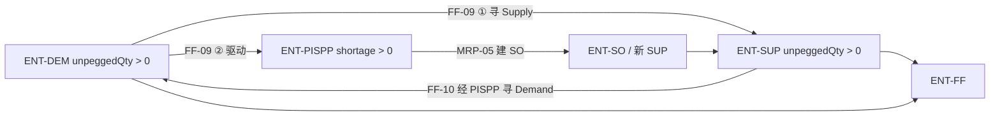

# §4 业务规则与约束

> **hard** = 不变量，违反则求解失败或拒绝操作。**soft** = 优化目标。  
> **基础规则（§4.0）** = 平台级约束，不归属业务价值目标（VAL）；验收见 §8 AC。  
> **知识分层：** 本节 RULE-* 构成 **StandardKnowledge** 核心；分类索引见 **[§14 StandardKnowledge 目录](../volumes/knowledge/13-14-business-knowledge.md)** · 行业/客户 overlay 见 **[§13](../volumes/knowledge/13-14-business-knowledge.md)**（ADR-12）。  
> 规则 ID 回指 SCN；验收见 §8。

### 规则索引（按领域）

| 领域 | §4 章节 | 规则前缀 |
|------|---------|----------|
| DOM-PLT | §4.0 · §4.3 · PERS · §18 | WS, SES, PERS, IAM |
| DOM-FF | §4.1 · §4.1.1 · §4.1.2 | FF, PLAN-01, DEM |
| DOM-MP | §4.2 · §4.5.1 | MP, SUP-05 |
| DOM-MRP | §4.4 · §4.5.1 | MRP, SUP-01 |
| DOM-RT | §4.5 · §4.5.1 | RT, SUP-02~04 |
| DOM-MD | §4.12 | MD |
| DOM-TX | §4.13 | TX |

### 规则索引（按知识类型）

| 类型 | 说明 | 代表 |
|------|------|------|
| KN-TYPE-INV | hard 不变量 | FF-01, SES-04, MD-07 |
| KN-TYPE-OPT | soft 优化 | MP-02, FF-07 |
| KN-TYPE-MOT | 行为动机 | FF-09, FF-10, MRP-05 |
| KN-TYPE-EXM | 豁免 | PLAN-01-E1/E2 |
| KN-TYPE-PAR | 参数默认 | MRP-04, MP-07 → §4.6 |
| KN-TYPE-INT/STR | 集成/结构 | MD-*, TX-* |

---

---

## 4.0 基础规则（平台）

> 适用全部业务 API 与 Session；**不得**写入 VAL KPI。场景见 **SCN-T03**，验收 AC-08。simulate / optimize / confirm 的图规则见 RULE-SES-04（AC-13）。

### RULE-WS-01 Workspace 行级隔离（hard）

**场景：** SCN-T03  
**陈述：** 所有业务读写必须在 **ENT-WS** 作用域内执行；请求须携带 `X-Workspace-Id`。

| 约束 | 要求 |
|------|------|
| 数据边界 | 查询/写入仅可见当前 Workspace 内实体 |
| 跨库访问 | 用其他 Workspace 的 id 访问 **视为未找到**（404 或空集） |
| 泄漏 | **0** 跨 Workspace 数据泄漏（AC-08） |

**输入：** `X-Workspace-Id`、业务主键（如 COLD id、planVersionId）  
**输出：** 仅当前 WS 数据；跨 WS 无结果

> **授权层：** 在 RULE-WS-01 之前须通过 **RULE-IAM-01~06**（用户已认证、WS 成员、模块启用、操作权限）。见 [§18 IAM](../volumes/platform/18-19-workspace-platform.md)。

---

### RULE-IAM-01 用户 Workspace 成员资格（hard）

**场景：** SCN-T03, SCN-T06 · ADR-13  
**陈述：** 已认证用户 **仅可** 访问其 **`workspace_member`** 中登记的 ENT-WS；请求 `X-Workspace-Id` 非成员 → **403 WORKSPACE_FORBIDDEN**。

---

### RULE-IAM-02 每用户至少一个自有 Workspace（hard）

**场景：** SCN-T06  
**陈述：** 创建 ENT-USR 时 **必须** 同事务创建 `workspaceType=PERSONAL` 的 ENT-WS，且 `ownerUserId=userId`；禁止删除用户 **最后一个** PERSONAL WS。

---

### RULE-IAM-03 模块启用门禁（hard）

**场景：** SCN-T06  
**陈述：** `workspace_enabled_module.enabled=false` 的 **MOD-*** 对该 WS **不可见**（UI 隐藏 + API **403 MODULE_DISABLED**）。

---

### RULE-IAM-04 模块操作权限（hard）

**场景：** SCN-T06  
**陈述：**

| 操作 | 所需 |
|------|------|
| GET / 只读 | 模块 **VIEW** 或 **EDIT** |
| POST/PUT/PATCH/DELETE · simulate · optimize · confirm · PlanningRun | 模块 **EDIT** |
| 成员/模块配置 | 角色 **WS_ADMIN** 或 **OWNER** |

`OWNER` / `WS_ADMIN` 对已启用模块 implicit **EDIT**。

---

### RULE-IAM-05 超级管理员（hard）

**场景：** SCN-T06  
**陈述：** `is_super_admin=true` 的用户可管理 **所有** ENT-USR 与 ENT-WS 的 IAM 配置；**不得** 绕过 Standard **hard** RULE（§13.4）。Super Admin 操作 **须** 审计。

---

### RULE-IAM-06 计划模块组件注册（hard）

**场景：** SCN-T06  
**陈述：** 凡独立 **计划** 能力须注册 **MOD-***；凡 **上游数据对接** 须注册 **ADP-***（§19）。二者写入 `workspace-modules.yaml` / `integration-adapters.yaml`。

---

## 4.1 满足链规则

### RULE-FF-01 挂接顺序（hard）

**场景：** SCN-01c  
**陈述：** 对同一 ENT-DEM，系统按 **PEG-INV → PEG-WO → PEG-SH** 顺序建立 ENT-FF，不得跳过库存直接 peg 工单（当库存可用时）。

**输入：** ENT-DEM.quantity、可用库存、开放 ENT-SO 产出  
**输出：** ENT-FF 列表及各类 quantity 合计 ≤ demand.quantity

---

### RULE-FF-02 BomDependency 派生（hard）

**场景：** SCN-01c, SCN-01g, SCN-06  
**陈述：** ENT-BD 由父 ENT-SO 的 ENT-DEM 经 ENT-FF → ENT-SUP → 子 ENT-SO 追溯生成；**不得**将 legacy `WorkOrderBomDependencyEntity` 作为装载真相源。  
**ADR-09：** COMMITTED revision 以 **`ont_bom_dependency`** 为持久化真相；派生算法用于 DRAFT 校验与写入前一致性检查。

---

### RULE-FF-03 取消计划与取消承诺分离（hard）

**场景：** SCN-01e, SCN-01f  
**陈述：**

| 操作 | 影响范围 | 不得 |
|------|----------|------|
| **取消计划**（`CANCEL_PLAN`） | 移除本行 pegging；删除本行专属可重建 ENT-SO；保留共享/已下发工单 | 删除 ENT-COLD / ENT-DEM |
| **取消承诺**（`CANCEL_PROMISE`） | 清空 `confirmedDeliveryDate` / `promiseDate` | 删除 ENT-SO、pegging 或 ENT-FF |

共享工单判定：同一 ENT-SO 的 pegging 服务多订单行时，仅解除本行 pegging。

---

### RULE-FF-04 JIT 建链落库（hard）

**场景：** SCN-01g  
**陈述：** `INFINITE_PLAN_JIT` 创建的专属 ENT-SO **立即**写入 JPA（`work_order`、`work_order_pegging`、`work_order_bom_dependency`），不等待 Session confirm；重建前须清理旧专属工单（SCN-01e 或内部 `removeExclusiveRegeneratableWorkOrders`）。

---

### RULE-PLAN-01 纳入计划 COLD 须可满足（soft + 豁免）

**场景：** SCN-06, SCN-01c, SCN-02a · VAL-01  
**类型：** soft（允许延期）；**豁免**见下表

**陈述：** 凡标记为**纳入主计划/排程范围**的 ENT-COLD，求解与满足链推演须为其建立完整 ENT-FF 挂接（可 **延期** 满足，但不得无故长期 BLOCKED / 无链）。

| 豁免 | 条件 | 系统行为 |
|------|------|----------|
| **E1 主数据缺口** | 满足链上缺少正确 **供应路径**（无 ENT-RT/ENT-RS、工艺未维护、无法物化 ENT-OP） | 标记 `MASTER_DATA_GAP`；**允许**暂不满足；须可识别原因（SCN-T04） |
| **E2 物料短缺** | 组件 ENT-DEM 仅能通过 PEG-SH 或缺口 peg 覆盖 | 按 **默认最长采购周期**（见 RULE-MRP-04）推算该物料 **最晚可用日**，作为 Supply 可用时间上界参与满足；**允许**在该边界内仍不满足，但须展示短缺与最晚可用日 |

**输入：** 开放 COLD 集合、ENT-OG 满足链、BusinessRules 物料提前期  
**输出：** 每条 COLD：`FULFILLABLE` \| `DELAYED_OK` \| `MASTER_DATA_GAP` \| `MATERIAL_SHORTAGE_BOUNDED`

---

### RULE-MRP-04 短缺物料最晚可用日（hard，与 PLAN-01-E2 联动）

**场景：** SCN-04a, SCN-07j, SCN-06 · **CFG**  
**陈述：** 对物料短缺导致的组件 Demand，**最晚可用 Supply 日期** = `needDate` 向前推算的**最长采购周期**，取值顺序：

1. BusinessRules **`material-lead-time`** 精确物料行的 **最长采购周期(天)**  
2. 同表 **物料编码 = `*`** 的 **默认最长采购周期** 行（RULE-MRP-04 默认行，UI 高亮）  
3. 系统参数 **`default_procurement_lead_time_days`**（ParameterRegistry，默认 7）

该日期写入 shortage Supply 的 `availableDate` 上界，供 MRP / 预留 / 满足链展示与 RULE-PLAN-01 判定。

| UI 字段（BusinessRules · 采购提前期） | 实体字段 | 说明 |
|--------------------------------------|----------|------|
| 物料编码 | `productCode` | 精确物料；**`*` = 默认最长采购周期**（仅一行） |
| 最长采购周期(天) | `leadTimeDays` | 向前推算天数 |

**主数据：** BusinessRules · `material-lead-time` · `MaterialLeadTimeRuleEntity`

---

## 4.1.1 供需行为动机（Motivation）

> **动机** = 实体在 ENT-OG 中的 **soft 目标驱动行为**（寻供、寻需、建 SO），**不是** hard 不变量。  
> 无法满足时须落 RULE-PLAN-01 豁免或 SCN-07j 预警，但系统 **不得** 对 `unpeggedQty > 0` 无可用动作。

### RULE-FF-09 Demand 满足动机（soft）

**场景：** SCN-01c, SCN-07e~h, SCN-04a · 与 RULE-MRP-05 联动  
**陈述：** 每个 **ENT-DEM** 的动机是 **让自身需求得到满足**。当该 Demand **未被完全满足** 时，系统应主动推进挂接或增供。

#### 触发条件

| 状态 | 判定 |
|------|------|
| **未挂接** | 不存在以该 Demand 为 `demandId` 的 ENT-FF |
| **挂接不足** | `peggedQty = Σ ENT-FF.quantity < demand.quantity`，即 **`unpeggedQty > 0`** |

#### 动机行为（按优先级）

| 顺序 | 行为 | 说明 |
|------|------|------|
| **1** | **寻找 Supply** | 经 ENT-PISPP 列出 eligible Supply（SCN-07f）；按 **RULE-FF-01**（INV→WO→SH）与 **RULE-FF-06 Demand 锚点** 尝试创建 ENT-FF |
| **2** | **驱动 PISPP 增供** | 当现有 Supply（含库存、开放 WO 产出）仍不足以覆盖 `unpeggedQty` 时，触发所属 ENT-PISPP 的 **消缺动机**（**RULE-MRP-05**）：创建 ENT-SO → 产出新 ENT-SUP → 再 peg 回该 Demand |
| **3** | **停止并显式** | 受 RULE-PLAN-01-E1/E2、RULE-FF-08、无 ENT-RT 等约束阻断时，保留 `unpeggedQty` 并展示短缺 / `UNALLOCATED_DEMAND`（RULE-FF-07） |

**输入：** `demandId`、`quantity`、`needDate`、`unpeggedQty`、同 PISP 的 Supply 池  
**输出：** 新增/更新的 ENT-FF；和/或 ENT-SO + ENT-SUP；更新 PISPP 与 `unpeggedQty`

> **与 PEG-SH：** 缺口 peg 是 **RULE-FF-01** 末步的系统派生结果，表示「仍无实物 Supply 可挂」；Demand 动机在步骤 1–2 **穷尽** 后才允许稳定存在 PEG-SH。

---

### RULE-FF-10 Supply 分配动机（soft）

**场景：** SCN-07e~i, SCN-07a · 与 RULE-FF-09 对偶  
**陈述：** 每个 **ENT-SUP** 的动机是 **让自身供应量被 Demand 消耗**（完成分配 / 预留）。当 Supply 仍有 **未挂接余量** 时，系统应经 PISPP 主动寻找可匹配的 Demand。

#### 触发条件

| 状态 | 判定 |
|------|------|
| **未分配** | 不存在以该 Supply 为 `supplyId` 的 ENT-FF |
| **分配不足** | `peggedQty = Σ ENT-FF.quantity < supply.quantity`，即 **`unpeggedQty > 0`** |

（`SUP-INV-*` / 工单产出 Supply 均适用；`SUP-SHORT-*` 缺口 Supply **不参与** 本动机——其语义为短缺占位，见 RULE-FF-01。）

#### 动机行为（按优先级）

| 顺序 | 行为 | 说明 |
|------|------|------|
| **1** | **经 PISPP 寻 Demand** | 在同 ENT-PISP、可用 `availableDate ≤ demand.needDate`（**RULE-FF-08**）的 Period 内，列出 eligible Demand（SCN-07e）；按 **RULE-FF-06 Supply 锚点** 创建 ENT-FF |
| **2** | **跨 Period 展示** | 若无同 Period 可匹配 Demand，保留 `unpeggedQty` 并计入 **UNALLOCATED_SUPPLY**（RULE-FF-07）；可展示至后续 Period 的 Demand |
| **3** | **停止并显式** | 无 eligible Demand 时不得伪造 FF；余量留在 Supply.unpeggedQty / PISPP 计划供应侧 |

**输入：** `supplyId`、`quantity`、`availableDate`、`unpeggedQty`、同 PISP/Period 的 Demand 池  
**输出：** 新增 ENT-FF；Demand/Supply 双方 `unpeggedQty` 下降；PISPP 刷新

---

### 动机协作关系



| 规则 | 角色 |
|------|------|
| RULE-FF-09 | Demand 侧：寻 Supply → 驱动 PISPP 建供 |
| RULE-FF-10 | Supply 侧：经 PISPP 寻 Demand |
| RULE-MRP-05 | PISPP 侧：缺口 → 建 SO |
| RULE-FF-06 | 自动预留时的选供/选需次序 |
| RULE-FF-07 | 动机未能消解时的预警 |

---

## 4.1.2 需求侧 Standard 知识（Demand）

> **归属：** StandardKnowledge · 目录见 [§16](../volumes/knowledge/15-16-planning-knowledge.md) · **Industry/Custom** 可 overlay 规则表行与 soft 权重，**不得**改 hard 陈述  
> **实体：** ENT-CO · ENT-COL · ENT-COLD · ENT-DEM · ENT-FF

### RULE-DEM-01 订单优先级（hard 排序 + PAR 规则表）

**场景：** SCN-01c, SCN-02a, SCN-06, SCN-07h · VAL-01  
**类型：** hard（排序结果确定）+ **KN-TYPE-PAR**（规则表内容）

**陈述：** 满足链挂接、自动预留（RULE-FF-06）、主计划 Demand 排序须按 **Effective 优先级** 降序处理同级竞争资源。

**优先级计算：**

```
priorityScore = Σ dimensionWeight × dimensionRank
```

| 维度（BusinessRules · `demand-priority-rules`） | 典型来源 | 说明 |
|------------------------------------------------|----------|------|
| **客户等级** | ENT-CO.customerGrade / txn 扩展 | A/B/C…；等级越高 rank 越小（越优先） |
| **产品属性** | ENT-PISP / Product 属性列 | 如战略品、出口品、margin 带 |
| **订单类型** | ENT-CO.orderType | 如样品单、返修单 |
| **要求交期** | ENT-COLD.requestedDate | 同分 tie-break：交期更早者优先 |
| **订单头优先级** | ENT-CO.priority | 上游 ERP 显式优先级（可选） |

**规则表维护：** BusinessRules · **`demand-priority-rules`**（列：维度、权重、匹配条件、rank）；匹配 **最具体** 行优先（产品+客户 > 仅客户 > `*` 默认）。

**输出：** 每条 ENT-COLD / ENT-DEM 的 `priorityScore`；挂接与预留 **不得** 让低分 Demand 抢占高分已 peg 量（hard）。

---

### RULE-DEM-02 交付数量容差 Delivery Tolerance（hard + 计划语义）

**场景：** SCN-01c, SCN-01a · KPI-MP-S02 · VAL-01  
**类型：** KN-TYPE-INV（容差带 hard）+ 计划语义

**陈述：** 每个 ENT-COLD（及对应 ENT-DEM）维护 **目标数量** 与 **容差带**：

| 字段 | 含义 |
|------|------|
| `targetQuantity` | 计划制定与 MRP **目标量**（默认 = 订单批次 qty） |
| `minDeliveryQuantity` | 交付下限；`peggedQty ≥ min` 视为 **可交付** |
| `maxDeliveryQuantity` | 交付上限；超过为 hard 违规（KPI-MP-S02 强罚） |

**计划 vs 满足：**

| 阶段 | 行为 |
|------|------|
| **计划制定** | 按 **`targetQuantity`** 建立 ENT-FF / 驱动 ENT-SO 数量 |
| **库存已满足下限** | 当 `Σ PEG-INV.quantity ≥ minDeliveryQuantity` 时，**不得**再为该 Demand 创建 **额外** 供应（WO/PO）仅因未达 target；target 缺口可保留 soft 展示 |
| **履约判定** | `minDeliveryQuantity ≤ fulfilledQty ≤ maxDeliveryQuantity` → 交付合规 |

**主数据：** txn `delivery_min_qty` / `delivery_max_qty`（§12）；缺省 `min = max = target`（容差 0）。

---

### RULE-DEM-03 交期策略 Delivery Date Strategy（soft 分段惩罚 + PAR）

**场景：** SCN-01b, SCN-06 · KPI-MP-S01 · RULE-MP-05  
**类型：** KN-TYPE-OPT · KN-TYPE-PAR

**陈述：** 每个 ENT-COLD 可配置 **交期策略**，驱动 ENT-PER 对齐与延期 soft 惩罚分段：

| 字段 | 说明 |
|------|------|
| `deliveryGranularity` | `DAILY` \| `WEEKLY` — 可交付窗口对齐到日/周 bucket |
| `earliestDeliveryDate` | 最早可交付日（可选；默认 = requestedDate − `earlyAllowDays`） |
| `latestDeliveryDate` | 最晚可交付日（可选；默认 = requestedDate + `lateAllowDays`） |
| `earlyAllowDays` | 允许 **提前** 天数；窗口内 **低惩罚** |
| `lateAllowDays` | 允许 **延后** 天数；窗口内 **低惩罚** |
| `requestedDate` | 目标交期（日/周中心） |

**惩罚分段（对齐 CP Delivery Performance）：**

| 区间 | soft 惩罚 |
|------|-----------|
| `[earliest, requested]` 且 ≤ earlyAllow | 极低（鼓励提前但可控） |
| `(requested, latest]` 且 ≤ lateAllow | **低** |
| `< earliest` 或 `> latest` | **高**（KPI-MP-S01 β 系数） |

**hard：** 挂接 Supply 的 `availableDate` 仍须满足 RULE-FF-08；策略只影响 **计划完工日** 与 **soft score**，不放宽 hard 预留时间。

**主数据：** BusinessRules · **`delivery-date-strategy`**（按客户/产品/COLD 模板）；COLD 行可 override。

---

### RULE-DEM-04 最小包装量 PPQ（hard）

**场景：** SCN-01c, SCN-07e~h, SCN-07b · KPI-MP-C06  
**类型：** KN-TYPE-INV

**陈述：** 当 ENT-COLD / ENT-PISP 设定 **`ppq`（Preferred Pack Quantity）> 0** 时：

| 约束 | 要求 |
|------|------|
| ENT-FF.quantity | 每条 peg **须为 ppq 的整数倍**（末批允许 `≤ target` 且 `≥ min` 的残余规则由 Industry overlay） |
| ENT-SO.quantity（MRP 建供） | **须为 ppq 整数倍**，除非 `target − pegged` 残余 `< ppq` 且已 ≥ minDelivery（RULE-DEM-02） |
| 库存 peg | 若库存 batch 非 ppq 倍数，**允许** peg 但须标记 `PPQ_MISMATCH` 预警（soft） |

**主数据：** `md_pisp.ppq` 或 BusinessRules · **`ppq-rules`**（产品×库存点）。

---

### RULE-DEM-05 订单齐套 Order Kitting（soft）

**场景：** SCN-02a, SCN-01c · VAL-01  
**类型：** KN-TYPE-OPT

**陈述：** 对同一 **ENT-CO** 下所有 **ENT-COL**（及其 ENT-COLD），优化器 **尽量** 使各 COL 的 **计划完工/交付日一致**（同周或同日，取决于 CO.`kittingGranularity`）。

| 字段 | 说明 |
|------|------|
| `kittingEnabled` | ENT-CO 是否启用齐套（默认 false） |
| `kittingGranularity` | `SAME_DAY` \| `SAME_WEEK` |
| `kittingPenaltyWeight` | 齐套偏差 soft 权重（Industry/Custom 可配） |

**行为：** 不齐套 **不** hard 阻断求解；计入 soft（类似 CP 部分订单协调）。齐套优先级 **低于** RULE-DEM-01 客户等级（不为此让 VIP 订单整体延期）。

**主数据：** txn `customer_order.kitting_enabled` · `kitting_granularity`（§12）。

---

## 4.2 主计划规则

### RULE-MP-01 资源匹配（hard）

**场景：** SCN-06, SCN-T01  
**陈述：** 每个 ENT-OP 的产能分配（**ENT-RCA**）必须使用其 ENT-OOSR 中声明的 `standardResourceId` 之一，并挂在对应 **leaf ENT-SRP** 上（ADR-15）。

---

### RULE-MP-02 期间产能与超载（soft 超载）

**场景：** SCN-06, SCN-03c, SCN-03a · **CFG**  
**陈述：**

| 层级 | 约束 |
|------|------|
| **期间基准** | **leaf ENT-SRP** 有效产能 = **Σ ENT-PRP.available**（ADR-17）；日 Period 默认上限可参考 **1440 分钟**（可随日历配置调整） |
| **hard** | 分配须满足资源匹配、工序顺序、并行等同 **periodId** 等 hard 规则 |
| **soft** | **Σ ENT-RCA.assignedMinutes** 允许超过 SRP `availableCapacity`；超出部分计 **CapacityOverloadCost**（极高软惩罚），求解器最小化超载 |

> **过渡：** 求解器内部仍经 **DERIVE** 的 `TimeSlot`/`ENT-SS` 投影（TODO-23 S4）；规范读路径与 confirm 写回以 **ENT-RCA + leaf SRP** 为准（ADR-16）。

---

### RULE-MP-07 产能超载成本（soft）

**场景：** SCN-06, SCN-03a, SCN-T01  
**陈述：** 当某 **leaf ENT-SRP** 上 `Σ ENT-RCA.assignedMinutes > availableCapacity`（等价于 `overloadCapacity > 0`）时，按超出分钟数累加 **CapacityOverloadCost**（权重远高于一般延期 soft）；UI 产能平衡页须展示 overload 状态（SCN-03a KPI）。

**参数：** `capacity_overload_threshold_pct`（展示阈值，默认 110%）；求解侧以超出分钟为 soft 变量（SOL-ORT）。

**字段：** 见 [§5.20.3 ENT-SRP](../../core/05-domain-model.md#5203-entsrpstandardresourceperiod) · [§5.20.4 ENT-RCA](../../core/05-domain-model.md#5204-ent-rcaresourcecapacityassignment--adr-15)

---

### RULE-MP-03 BOM 先后顺序（hard）

**场景：** SCN-06  
**陈述：** 子 ENT-SO 的 ENT-OP 不得安排在父 ENT-SO 依赖物料满足之前（经 ENT-BD 与物料快照判定）。

---

### RULE-MP-06 工序 Routing 顺序（hard）

**场景：** SCN-06, SCN-T04, SCN-T05  
**陈述：** 同一 ENT-SO 内 ENT-OP 的计划时间顺序须遵循 **ENT-RS.sequenceNo**（RoutingStep 序号）：前序 RS 对应 OP 的开始/结束不得晚于后序 RS 对应 OP（允许零间隔或配置 transfer time）。

**主数据：** BusinessRules · `operation-transfer-time`（工序间隔，CFG）

---

### RULE-MP-08 并行工序同区间（hard）

**场景：** SCN-06, SCN-T05  
**陈述：** 在 BusinessRules **`parallel-operations`** 中配对的 ENT-OP（parallelGroup）须计划在 **同一 leaf ENT-SRP 所对应的 periodId**（同起同止或同 period 窗口；细排侧见 parallelOperationSameStartEnd）。

**主数据：** BusinessRules · `parallel-operations`

> **过渡：** 迁移期求解器仍可能用 DERIVE 的 `TimeSlot` 表达同槽；TODO-23 S3 收敛后 UI/KPI 主语统一为 **SRP@Period**。

**字段：** 见 [§5.20.4 ENT-RCA](../../core/05-domain-model.md#5204-ent-rcaresourcecapacityassignment--adr-15)

---

### RULE-MP-04 物料闭合（hard，PATH-ONT）

**场景：** SCN-T01, SCN-01b  
**陈述：** 在分配槽位时，ENT-OP 消耗不得导致 ENT-PISPP 在对应 ENT-PER 上违反闭合库存（MaterialFeasibilitySnapshot）。

---

### RULE-MP-05 延期（soft）

**场景：** SCN-06-E2  
**陈述：** 交期晚于 latestDesiredDate 产生软约束惩罚；允许排产但得分变差。

---

## 4.3 Session / 沙盘规则

### RULE-SES-01 simulate 不求解（hard）

**场景：** SCN-01a, SCN-03c, SCN-04c, SCN-T05  
**陈述：** `simulate` 仅通过 ROL 应用 ChangeSet，**不得**调用 SOL-TF 或 SOL-ORT。

---

### RULE-SES-02 confirm 前置（hard）

**场景：** SCN-T02-E1  
**陈述：** Session `confirm` 要求已 optimize 且 hard score = 0（或业务允许的显式豁免策略）。

---

### RULE-SES-03 单真相源（hard）

**场景：** SCN-01b, SCN-T01, SCN-T02 · ADR-08  
**陈述：** S04 optimize/confirm 仅以 Session 内 **ENT-OG** 为输入，不得 JPA 重建问题体或从基线 planVersion 抄录 allocation 冒充 optimize。

---

### RULE-SES-04 Workspace 单一权威图（hard）

**场景：** SCN-01b · ADR-07  
**陈述：** 每个 ENT-WS 同时最多 **一张**权威 ENT-OG 用于 simulate / optimize / confirm。ENT-SBX 与 ENT-SES **必须引用同一装载**，不得用投影图作为并行真相源。

| 约束 | 要求 |
|------|------|
| 单 COLD CTP | scoped optimize 在同一全图上 |
| 只读 API | 允许 project DTO-FC；**不得**写入 |
| 并行图 | **禁止** 双图各自 optimize |

---

## 4.3.1 Ontology 持久化规则（ADR-09）

> FULL 模式为默认；Partial 为 `ont_entity_policy` 子集（§5.16）。

### RULE-PERS-01 DB–Ontology 同构读路径（hard）

**场景：** SCN-T02 · ADR-09  
**陈述：** `persistence_mode=FULL` 时，组装 `OntologyGraph` **必须**通过 `OntologyRestorer.loadRevision` 读取 `ont_*`；**禁止**从 legacy `WorkOrderEntity` / 重算 peg 覆盖 committed `ont_fulfillment`。

### RULE-PERS-02 写路径唯一入口（hard）

**陈述：** 对 ENT-OG 的结构化变更（含 simulate ROL、optimize 写回、confirm）**必须**经 `OntologyPersistencePort` 在同一 DB 事务内更新内存图与 `ont_*` / `ont_change_log`。

### RULE-PERS-03 confirm 原子 promote（hard）

**陈述：** confirm 将 DRAFT revision **原子**转为 COMMITTED，更新 `ont_revision_head(WORKSPACE)`；任一步失败 **整事务 rollback**，不得出现部分 HEAD 或部分实体行。

### RULE-PERS-04 WAL 与宕机（hard）

**陈述：** 生产默认 `ontology.wal.sync=SYNC_PER_CHANGE`：simulate/optimize API **成功返回**当且仅当对应 WAL 与实体 upsert 已 commit。未 commit 的事务变更 **不得**对调用方可见。

### RULE-PERS-05 Partial 不得破坏 schema（hard）

**陈述：** Partial 模式仅通过 `storage=DERIVE` **跳过写入**；**不得**删除或省略 `ont_*` 表定义；DERIVE 类实体在 FULL 模式下 **必须** STORE。

---

## 4.4 供需平衡与 MRP 规则

### RULE-MRP-01 工艺路径优先级（hard）

**场景：** SCN-07b, SCN-07c  
**陈述：** 同一 ENT-PISP 下多条 ENT-RT 时，**自动创建**须选 **pathPriority 最小**（数值越小优先级越高）且 RS 完整的路径。手工创建时计划员可 override。

**输入：** ENT-PISP.id、候选 ENT-RT[]  
**输出：** 选定 routingId

---

### RULE-MRP-02 区间供应计划与 PISPP 一致（hard）

**场景：** SCN-07b~d  
**陈述：** 在指定 ENT-PER 区间创建的 ENT-SO，其计划产出量须回写对应 ENT-PISPP 的 `plannedSupplyTotal`（及 MRP/优化对照字段）；创建后 `recalculatePlanningFields()`，缺口不得与 UI 表不一致。

**输入：** pispId、periodFrom、periodTo、quantity、routingId  
**输出：** ENT-SO + 更新后的 ENT-PISPP 链

---

### RULE-MRP-03 优化创建 scoped 边界（hard）

**场景：** SCN-07d  
**陈述：** 优化创建仅作用于所选 PISP 区间内的 Demand 与候选路径；**不得**改写其他 PISP 已 confirm 的 ENT-PV allocation，除非显式 Session confirm。

---

### RULE-MRP-05 PISPP 期间供需平衡与缺口动机（hard + soft）

**场景：** SCN-07a, SCN-07b~d, SCN-04a · VAL-04  
**类型：** **hard**（平衡恒等式与缺口计量）+ **soft**（消缺动机 / 主动建供）

**陈述：** 对每个 **ENT-PISP × ENT-PER** 的 **ENT-PISPP**，须在每个 Period 内保持 **供需平衡记账**；当计划供应不足以覆盖计划需求与库存目标时，**不得**隐式「抹平」，须将不足量显式体现在 **`stockShortageQuantity`（缺口量）** 上。

#### hard：期间平衡恒等式

每次 Demand / Supply / ENT-SO / ENT-FF 变更后，须调用 `recalculatePlanningFields()`（及链式 `PispRolling`），使：

| 字段 | 含义 |
|------|------|
| `replenishedInventoryLevel` | `onHand + plannedSupplyTotal` |
| `plannedInventoryLevel` | `onHand + plannedSupplyTotal − plannedDemandQuantityTotal` |
| **`stockShortageQuantity`** | `max(0, plannedDemandQuantityTotal + inventoryTargetQuantity − replenishedInventoryLevel)` |

| 约束 | 要求 |
|------|------|
| 守恒 | 同一 PISPP 链上，Demand/Supply 聚合与 `plannedDemandQuantityTotal` / `plannedSupplyTotal` **一致** |
| 缺口可见 | `stockShortageQuantity > 0` ⇔ 该 Period **物料短缺**；UI 与 API-MAT-01 **必须**展示 |
| 禁止负缺口 | `stockShortageQuantity` **不得**为负；不得用未记账供应掩盖短缺 |

**输入：** ENT-PISPP 链、Period 内 Demand 聚合、计划供应（含 ENT-SO 产出、库存 peg）  
**输出：** 更新后的 `onHand` / `plannedSupplyTotal` / `plannedDemandQuantityTotal` / **`stockShortageQuantity`**

#### soft：PISPP 消缺动机（Motivation）

**ENT-PISPP 对 `stockShortageQuantity > 0` 具有消缺动机：** 系统应 **主动尝试** 通过创建 **ENT-SO**（及后续 ENT-FF 挂接）增加 `plannedSupplyTotal`，以 **降低或消除** 缺口量。  
**Demand 侧** 亦可 **驱动** 本动机：当 **RULE-FF-09** 判定 `unpeggedQty > 0` 且无可用 Supply 可 peg 时，经所属 PISPP 触发建 SO。

| 行为 | 说明 |
|------|------|
| **触发** | 某 Period `stockShortageQuantity > 0`；或计划员/流水线调用「按路径创建供应」（SCN-07b~d） |
| **动作** | 按 **RULE-MRP-01** 选 ENT-RT，创建数量 ≤ 缺口量（或区间 net 缺口）的 ENT-SO；回写 **RULE-MRP-02** |
| **目标** | 最小化各 Period 的 `stockShortageQuantity`（及关联 Demand 的 unpeggedQty）；受产能/工艺/交期 soft 约束 |
| **豁免** | **RULE-PLAN-01-E1** 无供应路径时不得强行建 SO；**E2** 采购边界内仍可有缺口但须展示 |

> **动机 ≠ hard 必须消缺：** 在 master data 缺口、产能不可行或采购边界内，允许保留 `stockShortageQuantity > 0`；但系统 **不得** 无反应——须可触发 SCN-07b 自动建供、SCN-07d 优化建供或 SCN-04 短缺 KPI。

**与相关规则：**

| 规则 | 关系 |
|------|------|
| RULE-MRP-02 | 建 SO 后须回写 PISPP，使缺口与 UI 一致 |
| RULE-MRP-01 | 自动建供时的路径选择 |
| RULE-PLAN-01 / MRP-04 | 仍无法满足时的豁免与最晚可用日 |
| RULE-FF-01 | 建 SO 后通过 PEG-WO 满足 Demand |
| RULE-FF-09 | Demand unpegged → 驱动 PISPP 建供 |
| RULE-FF-10 | 建 SO 产出 SUP 后 → Supply 寻 Demand peg |

---

### RULE-FF-05 手工预留校验（hard）

**场景：** SCN-07g  
**陈述：**

| 约束 | 要求 |
|------|------|
| 物料/PISP | Demand 与 Supply 须同一 ENT-PISP（或配置允许的替代料规则） |
| 数量 | `fulfillment.quantity ≤ min(demand.unpeggedQty, supply.unpeggedQty)` |
| 类型 | 手工创建类型为 PEG-INV 或 PEG-WO；**不得**手工创建 PEG-SH（缺口由系统派生） |
| 图 | 写入权威 ENT-OG；ROL 传播 PISPP |

---

### RULE-FF-06 自动预留选供/选需（hard）

**场景：** SCN-07h, SCN-07i  
**陈述：**

| 锚点 | 选供/选需顺序（默认） |
|------|------------------------|
| **Demand 锚点**（SCN-07h） | ① 可用日期 ≤ needDate 优先 ② 库存 Supply 优于工单产出 ③ 可用量大的优先 |
| **Supply 锚点**（SCN-07i） | ① needDate 更早的 Demand 优先 ② 订单/COLD 优先级高者优先 ③ 未预留量大者优先 |

实现 **RULE-FF-09 / RULE-FF-10** 动机时的默认选供/选需策略；可配置覆盖见 `reservation_auto_policy`（CFG）。

---

### RULE-FF-08 预留 Supply 不晚于 Demand 交期（hard）

**场景：** SCN-07g~j, SCN-01c · 与 RULE-FF-05 联动  
**陈述：** 已创建 ENT-FF（**预留 / peg**）中，Supply 的 **availableDate**（或工单产出可用日）**不得晚于** 对应 Demand 的 **needDate**（要求交期）。违反则：

| 阶段 | 行为 |
|------|------|
| **创建 / 拖拽 / 自动预留** | **拒绝**创建 ENT-FF（API-MAT-06/07 返回 400） |
| **求解后校验** | hard 不可行或标记 `TIME_MISMATCH` 为 **错误**（非仅预警） |

> SCN-07j 的 `TIME_MISMATCH` **预警**仍展示历史错误或 simulate 试算结果；**新建** peg 须满足本 hard 规则。

**输入：** demandId, supplyId, quantity, needDate, availableDate  
**输出：** ENT-FF 或拒绝

---

### RULE-FF-07 预留预警（soft）

**场景：** SCN-07j  
**陈述：** 区间内须持续计算并展示：`UNALLOCATED_DEMAND`、`UNALLOCATED_SUPPLY`、`TIME_MISMATCH`（Supply 可用时间晚于 Demand needDate，**含**违反 RULE-FF-08 的存量 peg）。预警不阻断只读分析；**新建 peg** 仍受 RULE-FF-08 hard 约束。

---

## 4.5 工艺模板规则

### RULE-RT-01 物化一致性（hard）

**场景：** SCN-T04, SCN-06, SCN-07b~d  
**陈述：** 工单展开时，每个 ENT-RS 物化为一条 ENT-OP；ENT-RSOSR → ENT-OOSR；ENT-RSIM → ENT-OIM；ENT-RSOM → ENT-OOM。

---

### RULE-RT-02 首末道投料产出（soft 约定 / hard 装载）

**场景：** SCN-T04  
**陈述：** ENT-RSIM 仅投影到首道 ENT-RS；ENT-RSOM 仅投影到末道 ENT-RS。

---

## 4.5.1 供应侧 Standard 知识（Supply）

> **归属：** StandardKnowledge · [§16](../volumes/knowledge/15-16-planning-knowledge.md)  
> **实体：** ENT-SO · ENT-OP · ENT-RS · ENT-RSOSR · ENT-OOSR · ENT-SR · ENT-SRP · **ENT-RCA** · ENT-PRP（ADR-17）

### RULE-SUP-01 供应数量 LotSize / Min / Max（hard + PAR）

**场景：** SCN-07b, SCN-06, SCN-07b~d · KPI-MP-C06  
**类型：** KN-TYPE-INV · KN-TYPE-PAR

**陈述：** 计划 ENT-SO（MRP 创建或 JIT 建链）数量须遵守 **产品×库存点** 或 **Routing** 上的数量规则：

| 字段 | 约束 |
|------|------|
| `lotSize` | `quantity % lotSize == 0`（lotSize > 0 时 hard） |
| `minQuantity` | 若 `plannedQty < minQuantity`：按策略 **`minQtyStrategy`** 处理 |
| `maxQuantity` | `quantity ≤ maxQuantity`；超出须 **拆分为多条 ENT-SO** |

**`minQtyStrategy`（BusinessRules · `supply-quantity-rules`）：**

| 值 | 行为 |
|----|------|
| `SKIP` | 本 period **不创建** SO；缺口留待下 period 或人工 |
| `PLAN_AT_MIN` | 创建 **`quantity = minQuantity`** 的 SO（即使缺口更小） |

**与 RULE-DEM-04：** lotSize 与 ppq **同时** 生效时，取 **LCM(lotSize, ppq)** 为有效批量（Standard 默认）。

**主数据：** `md_pisp.lot_size` / `min_quantity` / `max_quantity` / `min_qty_strategy`；BusinessRules tab **`supply-quantity-rules`** 可 override。

---

### RULE-SUP-02 工序时间 RoutingStep → Operation（hard 物化 + PAR 规则表）

**场景：** SCN-T04, SCN-06, SCN-T05 · RULE-MP-06  
**类型：** KN-TYPE-INV · KN-TYPE-PAR · KN-TYPE-STR

**陈述：** 每个 **ENT-RS** 须携带时间属性；物化 **ENT-OP** 时 **1:1 复制**（RULE-RT-01 扩展）：

| RS / OP 字段 | 含义 | 单位 |
|--------------|------|------|
| `preProcessingTime` | 前处理（换型前、备料） | 分钟 |
| `schedulingSpace` | 工序间调度缓冲（与 RULE-MP-06 transfer 叠加或取 max，由 `timingMergePolicy` 配置） | 分钟 |
| `productionTime` | 核心加工时间（见 RULE-SUP-03 按资源速度重算） | 分钟 |
| `postProcessingTime` | 后处理（冷却、质检、等待搬运） | 分钟 |

**计划用时（Single 资源）：**

```
operationDurationMinutes = preProcessingTime + productionTime + postProcessingTime
slotDemandMinutes = operationDurationMinutes × (assignedQty / baseQty)
```

**维护路径：** BusinessRules · **`routing-step-timing`**（匹配 routingCode + sequenceNo 或 PISP 模板）→ sync 至 **`md_routing_step`** → 投影 ENT-RS → 物化 ENT-OP。

---

### RULE-SUP-03 工序资源 RSOSR / OOSR（hard + PAR）

**场景：** SCN-T04, SCN-06, RULE-MP-01  
**类型：** KN-TYPE-INV · KN-TYPE-PAR

**陈述：** **ENT-RSOSR**（→ ENT-OOSR）扩展属性：

| 字段 | 说明 |
|------|------|
| `resourcePriority` | 越小越优先（已有）；同 OP 选资源时取最小 priority |
| `productionRate` | 产品在 **该 StandardResource** 上的生产速度：`baseQty` / `productionTimeMinutes` |
| `resourceUsageType` | `SINGLE` \| `BATCH` |
| `batchSize` | 仅 BATCH：该 PISP 在此工序 **一批最大数量** |
| `batchDurationMinutes` | 仅 BATCH：**整批**生产时间（与 batchSize 对应） |

**Single 模式：** `productionTime = (qty / productionRate)` 或由 RSOSR 固定 `process_time` 按 qty 线性缩放。

**Batch 模式（加热炉/罐区等）：**

| 条件 | 生产时间 |
|------|----------|
| `qty ≥ batchSize` | `ceil(qty / batchSize) × batchDurationMinutes` |
| `qty < batchSize` | **`batchDurationMinutes` 不变**（不满批仍占满炉时） |

**主计划产能占用：** 上述生产时间 + RULE-SUP-02 前后处理时间 → 写入 **ENT-RCA.assignedMinutes**（挂 **leaf ENT-SRP** · ADR-15），而非直接写 ENT-SS。

**主数据：** `md_routing_step_osr` 列 + BusinessRules · **`routing-step-resource`**。

---

### RULE-SUP-04 工序良率 Yield（hard）

**场景：** SCN-07b, SCN-06, SCN-T04  
**类型：** KN-TYPE-INV · KN-TYPE-STR

**陈述：** **ENT-RS.yieldRate** ∈ (0, 1]：投入 100 原料，有效产出 = **100 × yieldRate**。

| 层级 | 行为 |
|------|------|
| **ENT-OIM 需求** | 组件需求量 = `grossQty / yieldRate`（向上取整至 PPQ/lot 倍数） |
| **ENT-OOM 产出** | `effectiveOutput = inputQty × yieldRate` |
| **MRP 建 SO 数量** | 覆盖 Demand 时按 **净需求 / 累积 yield** 放大 |

**默认：** `yieldRate = 1.0`（无损耗）。**主数据：** `md_routing_step.yield_rate`。

---

### RULE-SUP-05 资源效率与产能聚合（hard 产能计算 + PAR）

**场景：** SCN-03a, SCN-06, RULE-MP-02 · VAL-05 · **ADR-17**  
**类型：** KN-TYPE-INV · KN-TYPE-PAR

**陈述：** 产能分 **两层**计算：**日历在 ENT-PR**，**聚合到 ENT-SR**；主计划 **ENT-RCA** 仍挂 **ENT-SRP**（不按 PR 排产）。

**Layer 1 — ENT-PRP（PhysicalResourcePeriod，真相源）：**

```
PRP.totalCapacityMinutes     = Σ 日历条目（md_resource_calendar @ physical_resource_code, 落入 period）
PRP.calendarDowntimeMinutes  = 停机/保养/节假日
PRP.schedulerFeedbackMinutes = Σ SchedulerFeedback（S05 细排已占，按 PR/line 归因）
PRP.grossAvailableMinutes    = total − downtime − feedback
PRP.availableCapacityMinutes = PRP.grossAvailable × resourceEfficiency
```

`resourceEfficiency` 取自 **ENT-PR**（若缺省）或 **ENT-SR** / **ENT-RG**（SR 优先于 RG，默认 1.0）。

**Layer 2 — ENT-SRP（StandardResourcePeriod，聚合）：**

```
SRP.totalCapacity     = Σ PRP.availableCapacityMinutes
                          （同一 standardResourceId + periodId 下全部 ENT-PR）
SRP.reservedCapacity  = Σ ENT-RCA.assignedMinutes on this SRP   （ADR-15）
SRP.overloadCapacity  = max(0, reserved − available)              （RULE-MP-07 soft）
```

**示例：** SR 有 2 个 PR → 对应 2 条 PRP 的 available 分钟数之和 = 该 SRP 的 `totalCapacity`。

| 输入 | 说明 |
|------|------|
| `calendarDownTimeMinutes` | 在 **PRP** 层累计 |
| `schedulerFeedbackMinutes` | 在 **PRP** 层按物理资源/产线累计，rollup 至 SRP |

**ENT-SS.capacityMinutes**（过渡）与 **ENT-SRP.totalCapacity** 均须与 **Σ PRP** 一致；超载判定（RULE-MP-07）基于 SRP effective 容量。

**主数据：** `md_resource_calendar.physical_resource_code` · `md_physical_resource` · `md_standard_resource.resource_efficiency` · `md_resource_group.resource_efficiency`

---

## 4.6 RULE 与 BusinessRules 主数据映射

> **规范（§4 RULE-*）** = 系统必须遵守的语义；**BusinessRules 页** = 项目可维护的参数表（CFG）。下表为当前映射；未列出的 tab 仍影响求解，后续补行。  
> **UI 路由（§19.4.5）：** demand/capacity/material → **MOD-OCP** `/master-plan/rules/*`；production/labor → **MOD-SCH** `/scheduling/rules/*`。Legacy `/business-rules/*` 仅 redirect。

| RULE ID | 类型 | BusinessRules tab / 参数 | 说明 |
|---------|------|---------------------------|------|
| RULE-PLAN-01-E2 | 豁免 | `material-lead-time` | 最长采购周期 → 短缺最晚可用日 |
| RULE-MRP-04 | hard | `material-lead-time` · 列「最长采购周期(天)」· 物料 `*` 默认行 | 短缺最晚可用日 |
| RULE-MRP-05 | hard + soft | — | PISPP 期间平衡恒等式；`stockShortageQuantity`；消缺动机 → SCN-07b~d |
| RULE-FF-09 | soft | `reservation_auto_policy`（Demand 锚） | Demand 满足动机：寻 Supply / 驱动 PISPP 建 SO |
| RULE-FF-10 | soft | `reservation_auto_policy`（Supply 锚） | Supply 分配动机：经 PISPP 寻 Demand |
| RULE-MP-06 | hard | `operation-transfer-time` | 相邻 RS 间隔 |
| RULE-MP-08 | hard | `parallel-operations` | 并行工序同区间 |
| RULE-MP-07 | soft | `capacity_overload_threshold_pct` | 超载展示阈值（ParameterRegistry） |
| RULE-FF-06 | hard | `reservation_auto_policy`（待增） | 自动预留策略 |
| RULE-FF-08 | hard | — | 预留时间 hard；不可配置放宽 |
| RULE-PLAN-01 | soft | `demand-priority-rules` | 排序与锁定，影响满足优先级 |
| RULE-DEM-01 | hard + PAR | `demand-priority-rules` | 客户等级、产品属性等维度优先级 |
| RULE-DEM-02 | hard | txn COLD min/max qty | 交付容差；库存达下限停增供 |
| RULE-DEM-03 | soft | `delivery-date-strategy` | 日/周交付、提前/延后分段惩罚 |
| RULE-DEM-04 | hard | `ppq-rules` · md_pisp.ppq | 最小包装倍数 |
| RULE-DEM-05 | soft | txn CO kitting_* | 订单齐套 |
| RULE-SUP-01 | hard + PAR | `supply-quantity-rules` | lotSize / min / max |
| RULE-SUP-02 | hard + PAR | `routing-step-timing` | RS 四段时间 → OP |
| RULE-SUP-03 | hard + PAR | `routing-step-resource` | 资源优先级、速度、Single/Batch |
| RULE-SUP-04 | hard | md_routing_step.yield_rate | 工序良率 |
| RULE-SUP-05 | hard + PAR | md_sr/rg.resource_efficiency | 有效产能 = (日历−反馈)×效率 |
| RULE-MD-01~05 | hard | — | External → md 门禁；见 §11 |
| RULE-MD-06 | soft | — | WARNING 同步留痕 |
| RULE-MD-07~13 | hard | — | PISP/RT/RS/RSOSR/SR/PR/RG 结构基本规则 |
| RULE-TX-01~10 | hard | — | External 交易 → txn_*；Firm WO；见 §12 |

**不应** 将 §3 场景全文或 ADR 写入 BusinessRules；仅 **可配置参数** 进主数据页。

---

## 4.12 外部主数据质量与同步（ADR-10）

> 表定义与问题码详见 [§11](../volumes/data/11-12-external-data.md)。

### RULE-MD-01 计划只读 Internal Master（hard）

**场景：** SCN-T04, SCN-06, SCN-07b~d · ADR-10  
**陈述：** 主计划 / MRP / CTP / `MasterPlanRoutingProjector` **仅允许**读取 **`md_*` 内部主数据**（及由其投影的 ENT-RT/RS/*）。**禁止**直接读取 `external_*` staging 或跳过 sync 使用 legacy 表（迁移期双读须显式 Feature 且 TODO-13 跟踪）。

### RULE-MD-02 外部数据必经质检（hard）

**陈述：** 任何自 ERP/MES/Excel/API 进入系统的工艺/资源/库存点数据 **必须先**写入对应 **`external_*` 表**；**未**经 `MasterDataQualityService.checkBatch` 的行 **`quality_status` 不得为 PASSED**。

### RULE-MD-03 同步门禁（hard）

**陈述：** 仅 **`quality_status ∈ {PASSED, WARNING}` 且 `is_blocked = false`** 的 external 行可执行 sync 进入 `md_*`。`FAILED` 或 `is_blocked=true` **不得**进入内部主数据。

| quality_status | 默认 is_blocked | 可否 sync |
|----------------|-----------------|-----------|
| PENDING | true | ❌ |
| FAILED | true | ❌ |
| WARNING | false | ✅（须保留 issue_codes） |
| PASSED | false | ✅ |

### RULE-MD-04 问题数据可标识（hard）

**陈述：** 每条 external 行须可机器/人工识别质量问题：**`quality_issue_codes`** + **`quality_issue_detail`**；UI/API 须能按 batch、表、issue_code 查询失败行（SCN-T04-E*）。

### RULE-MD-05 同步顺序与引用完整性（hard）

**陈述：** sync 须按 §11.5 顺序执行；子表 FK 在 external 层 **MD-Q-FK-*** 检查通过后方可 sync；同步完成后 invalidate 路由/资源投影缓存。

### RULE-MD-06 WARNING 留痕（soft）

**陈述：** `WARNING` 行可 sync，但 **不得**清除 `quality_issue_codes`；主计划 UI 对引用 WARNING 源的 PISP/RT 须展示 **主数据质量徽章**（PlanningSignalBadge 扩展）。

---

### 主数据结构基本规则（hard）

> 适用 **external_* 质检** 与 **md_* 同步后校验**；问题码见 §11.4.2 · 验收 AC-MD-06。

#### RULE-MD-07 PISP ↔ Routing 双向关联

**场景：** SCN-T04, SCN-07b~d  
**陈述：**

| 方向 | 约束 |
|------|------|
| **PISP → Routing** | `planning_relevant=true` 的 **ENT-PISP** 须至少有 **1** 条 **ENT-RT** |
| **Routing → PISP** | 每条 **ENT-RT** 须关联 **存在且有效** 的 ENT-PISP（`product_code` + `stocking_point_code` 可解析为 PISP） |

**问题码：** `MD-Q-PISP-01`（缺 Routing）· `MD-Q-RT-02`（Routing 无有效 PISP）

---

#### RULE-MD-08 Routing ↔ RoutingStep 双向关联

**陈述：**

| 方向 | 约束 |
|------|------|
| **RoutingStep → Routing** | 每条 **ENT-RS** 须归属 **1** 条已声明的 ENT-RT |
| **Routing → RoutingStep** | 每条 **ENT-RT** 须有 **至少 1** 条 ENT-RS |

**问题码：** `MD-Q-RS-05`（孤儿 Step）· `MD-Q-RT-03`（Routing 无 Step）

---

#### RULE-MD-09 RoutingStep 序号唯一

**陈述：** 每条 ENT-RS 须有 **`sequence_no`（Sequence）**；同一 ENT-RT 下 **`sequence_no` 不得重复**；须为 **正整数**。

**问题码：** `MD-Q-RS-01`（重复或缺失 sequence）  
**建议（WARN）：** `MD-Q-RS-02` — sequence 从 1 连续至 N，无空洞（非 hard，但 UI 提示）

---

#### RULE-MD-10 RoutingStep 须有标准资源候选

**陈述：** 每条 **ENT-RS** 须有 **至少 1** 条 **ENT-RSOSR**（RoutingStepOnStandardResource）。

**问题码：** `MD-Q-RS-03`（**FAIL**）

---

#### RULE-MD-11 RSOSR 须引用已存在 StandardResource

**陈述：** 每条 **ENT-RSOSR** 的 `standard_resource_code` 须在 **StandardResource** 集合中存在（external 层查 `external_standard_resource` / sync 后查 `md_standard_resource`）。

**问题码：** `MD-Q-FK-02`

---

#### RULE-MD-12 StandardResource 须有 PhysicalResource

**陈述：** 每个 **StandardResource** 须至少有 **1** 条 **PhysicalResource** 映射至该标准资源（`standard_resource_code`）。

**问题码：** `MD-Q-SR-01`

---

#### RULE-MD-13 StandardResource 归属唯一 ResourceGroup

**陈述：** 每个 **StandardResource** 的 `resource_group_code` **必填**；且 **有且仅有 1** 个 ResourceGroup（不得为空、不得多值、不得引用不存在的组）。

**问题码：** `MD-Q-RG-01`（组不存在）· `MD-Q-RG-02`（缺失或多重归属）

---

## 4.13 外部交易数据质量与同步（ADR-11）

> 表定义见 [§12](../volumes/data/11-12-external-data.md)。

### RULE-TX-01 计划只读 Internal Transactional（hard）

**场景：** SCN-01~05, SCN-07, SCN-T01 · ADR-11  
**陈述：** 组装 ENT-OG 时，需求/供应/库存/采购 **仅允许**读取 **`txn_*` 内部交易表**（及 ADR-09 `ont_*` committed revision）。**禁止**直接读 `external_*` 交易 staging 或 legacy `sales_order_line` / `work_order` / `inventory` 作为目标态（迁移期双写须 TODO-14 跟踪）。

### RULE-TX-02 外部交易必经质检（hard）

**陈述：** ERP/MES 订单、工单、库存、PO **必须先**写入 **`external_*` 交易表**；未经 `TransactionalDataQualityService.checkBatch` 不得 `quality_status=PASSED`。

### RULE-TX-03 同步门禁与顺序（hard）

**陈述：** 仅 **`PASSED` / `WARNING` 且 `is_blocked=false`** 可 sync 至 `txn_*`；顺序见 §12.4（CO → COL → COLD → Inv → PO → WO → Op → OpRes）。

### RULE-TX-04 Firm 工单同步（hard）

**陈述：** `external_work_order` sync 生成的 **`txn_supply_order.firm_status` 必须为 `FIRM`**；FIRM SO **不得**被 SCN-01e 专属工单清理或 MRP REGENERATABLE 删除逻辑移除（SCN-05b Firm 预警只读其风险，不自动删单）。

### RULE-TX-05 交易引用主数据（hard）

**陈述：** sync 时 `product_code` / `stocking_point_code` / `standard_resource_code` **必须**在已 sync 的 **`md_*`** 中存在；否则 **FAIL**（`TX-Q-CO-01`, `TX-Q-WO-02`, `TX-Q-WOOR-01`）。

### RULE-TX-06 COLD 与 Demand 1:1（hard）

**陈述：** 每条 sync 后的 **`txn_customer_order_line_delivery`** 须对应 **唯一** `txn_demand`（`source_type=CUSTOMER_DELIVERY`，`source_id=COLD id`）。

### RULE-TX-07 WorkOrder 工序结构（hard）

**陈述：** 每条 `external_work_order_operation` 须归属已 sync 的 WO；同 WO **`operation_seq` 不重复**；sync 后 Firm WO 须 **≥1** Operation（batch 闭包）。

### RULE-TX-08 OperationResource 引用 StandardResource（hard）

**陈述：** `external_work_order_operation_resource.standard_resource_code` **必须** ∈ `md_standard_resource`（与 RULE-MD-11 一致）。

### RULE-TX-09 Firm Operation 须有 OSR（hard）

**陈述：** 每条 sync 后的 **`txn_operation`** 须有 **≥1** **`txn_operation_osr`**（与 RULE-MD-10 对齐）。

### RULE-TX-10 问题数据可标识（hard）

**陈述：** 与 RULE-MD-04 相同：external 交易行须 **`quality_issue_codes`** + **`quality_issue_detail`**。

---

## 4.7 已废止规则

### RULE-DIAG-01（废止，ADR-03）

原实体路径「推演诊断」预览规则已移除；前端改用语义信号（PlanningSignalBadge）展示本体链状态。

---

**回指：** [03-scenarios.md](./03-scenarios.md) · [08-acceptance.md](./08-acceptance.md)
