# §5 领域模型与数据（Plant Operation Ontology）

> **聚合根：** `OntologyGraph`（ENT-OG）· **术语：** [§2](./02-glossary.md) · **规则：** [§4](./04-business-rules.md)  
> **Draw.io：** [ontology-domain-model.drawio](../ontology-domain-model.drawio) · **OTD 映射：** [otd-ontology-mapping.md](../otd-ontology-mapping.md)  
> **版本基线：** M4+ · ADR-07 单一权威图 · ADR-08 PATH-ONT  
> **范围（现行）：** ENT-OG **仅规范订单协同计划**（原主计划 · **MOD-OCP** / PROC-S04）。**MOD-SCH 作业排程**、**MOD-SLT 分切排样** 仍各自独立模型与持久化（如 `DetailScheduleOperationEntity`）；纳入 Ontology 的实体、关系与 `ont_*` 表族见 **§10 TODO-20**。

`OntologyGraph` 是 Session 内的**运行时**计划领域聚合图，承载供需、工序、满足、PISPP/SRP/PRP 与规划占用（ENT-RCA）。**推演与 optimize 的真相源在内存**；simulate / optimize / confirm 按 **ADR-09** 持久化到 **`ont_*`**（§5.14）。**读装载**经 `WorkspaceAuthoritativeOntologyGraphService`（legacy `OntologyLoader` 壳 + `OntologyP0Overlay`）；legacy JPA 在迁移期仍作 confirm 并行写边界（§5.10）。

---

## 5.0 如何阅读本章

> **Ontology 范围（现行）：** 本章 ENT-OG 内实体 **仅覆盖 MOD-OCP / PROC-S04**（订单协同计划）。MOD-SCH、MOD-SLT 见 **TODO-20**。

| 读者意图 | 读哪节 | 何时有效 |
|----------|--------|----------|
| 理解计划本体结构 | §5.1~§5.9 | 始终 |
| 对照**当前代码**装载 / confirm | §5.10 | 已切读 `ont_*` P0 overlay；legacy 对照至 TODO-13/14 |
| 设计 **Flyway / Restorer** | §5.14~§5.18 | P0~P5 骨架已落地；收口 Sprint 6C~6D |
| Session / Sandbox API | §5.19 | 已规范 |
| 实体字段全集 | §5.20 + [appendix](./05-domain-model-appendix-fields.md) | Phase 2 进行中（日历链 + P0 部分） |
| SQL 列级 DDL | [05-ont-schema.md](../volumes/data/05-ont-schema.md) 或 §5.14.2 扩展 | **P0 已落地（V65 · PostgreSQL）**；Master/period/BOM 等 P1/P2 待 Flyway |

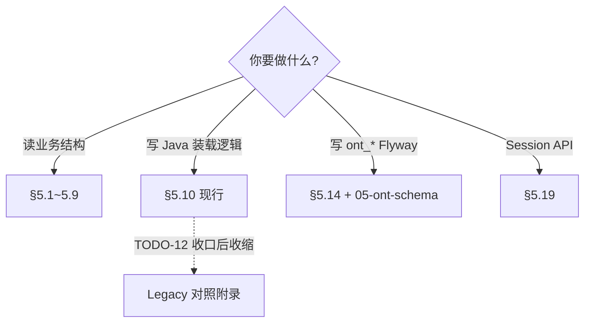

| 章节 | 性质 | 说明 |
|------|------|------|
| §5.1~§5.9 | **规范（结构）** | ENT-OG 内实体与关系；与 ADR-07/08 一致 |
| §5.10 | **过渡（现行实现）** | legacy JPA confirm 边界 + 读路径对照；TODO-12 收口后收缩 |
| §5.14~§5.18 | **规范（目标态）** | ADR-09 全量 `ont_*` 持久化 |
| §5.19~§5.20 | **规范（补全中）** | §5.19 Session 已规范；§5.20 日历链 + P0 部分已落地；**P0 SQL 列级规范已落地（V65 · TODO-21 Phase 3 部分）** |

---

## 5.1 核心结构链（速览）

### 需求侧

```
ENT-CO → ENT-COL → ENT-COLD → ENT-DEM [CUSTOMER_DELIVERY]
ENT-ForecastDemand → ENT-DEM [FORECAST]
BOM → ENT-OIM → ENT-DEM [BOM_COMPONENT]
```

### 供应侧

```
ENT-SO → ENT-PU → ENT-OP
              ├→ ENT-OOSR ──→ ENT-RCA ──→ ENT-SRP
              ├→ ENT-OOSR
              ├→ ENT-OIM → ENT-DEM [BOM_COMPONENT]
              └→ ENT-OOM → ENT-SUP
```

### 满足

```
ENT-DEM ←→ ENT-FF ←→ ENT-SUP
ENT-BD 派生自 ENT-FF（父 ENT-SO → 子 ENT-SO）
```

挂接顺序：**PEG-INV → PEG-WO → PEG-SH**（RULE-FF-01）。

### 工艺模板（Master，API 投影；工单物化时进入 ENT-OG）

```
ENT-PISP → ENT-RT（1:N，pathPriority）→ ENT-RS
                      ├→ ENT-RSOSR
                      ├→ ENT-RSIM
                      └→ ENT-RSOM
```

| 模板 | 运行时 |
|------|--------|
| ENT-RS | ENT-OP |
| ENT-RSOSR | ENT-OOSR |
| ENT-RSIM | ENT-OIM |
| ENT-RSOM | ENT-OOM |

**投影：** `MasterPlanRoutingProjector` · **内部主数据：** `md_*`（自 **§11 External_* 同步**）· **过渡 legacy：** `MaterialEntity`, `ProductResourceEntity`, `BomComponentEntity`

### 期间

```
ENT-PER → ENT-PISPP（每 ENT-PISP）
ENT-PER → ENT-PRP（每 ENT-PR · 日历生效层）
ENT-PRP ──rollup──→ ENT-SRP（每 ENT-SR · ADR-17）
ENT-PER（leaf）→ ENT-RCA（经 ENT-SRP · ADR-15/16）
ENT-SR 1:N ENT-PR（主数据 · RULE-MD-12）
```

**Period 序列：** 参数 `ontology_period_sequence`（如 `14x3shift,4x1d,2x1w` 或 `14x1d,4x1w,2x1m`），缺省 `28×1d`。  
**班次：** 不在独立 **ENT-SS** 建模，而在 **Period 定义层** 展开 shift 粒度（**ADR-16** · §5.8.1 · **TODO-23**）。  
**过渡：** 现行 `schedulingSlotsOrdered` / `TimeSlot` 由日历 DERIVE，待 TODO-23 S5 退役 ENT-SS。

---

## 5.2 OntologyGraph 容器

由 **`WorkspaceAuthoritativeOntologyGraphService`** 装载：内部 `OntologyLoader`（legacy JPA 壳）+ 可选 **`OntologyP0Overlay`**（committed `ont_*` P0）→ `build()` 固化。Session / Sandbox TTL ~8h。

| 集合字段 | 类型 | ENT | 说明 |
|----------|------|-----|------|
| `productsById` | `Product` | — | 产品主数据 |
| `defaultStockingPoint` | `StockingPoint` | — | 默认 `DEFAULT-FG` |
| `pispsById` | `ProductInStockingPoint` | ENT-PISP | 产品×库存点 |
| `customerOrdersById` | `CustomerOrder` | ENT-CO | 销售订单头；齐套（RULE-DEM-05） |
| `customerOrderLinesById` | `CustomerOrderLine` | ENT-COL | 销售订单行 |
| `customerOrderLineDeliveriesById` | `CustomerOrderLineDelivery` | ENT-COLD | 交付批次；前端主粒度 |
| `forecastDemandsById` | `ForecastDemand` | — | 预测需求 |
| `demandsById` | `Demand` | ENT-DEM | 统一需求锚点 |
| `supplyOrdersById` | `SupplyOrder` | ENT-SO | `id = workOrderNo` |
| `planUnitsById` | `PlanUnit` | ENT-PU | 计划单元 |
| `operationsById` | `Operation` | ENT-OP | 工序实例 |
| `operationOnStandardResourceById` | `OperationOnStandardResource` | ENT-OOSR | 工序×资源 |
| `suppliesById` | `Supply` | ENT-SUP | 产出/库存/缺口 |
| `operationInputMaterialsById` | `OperationInputMaterial` | ENT-OIM | 工序投料 |
| `operationOutputMaterialsById` | `OperationOutputMaterial` | ENT-OOM | 工序产出 |
| `fulfillments` | `Fulfillment` | ENT-FF | 需求—供应边 |
| `bomDependencies` | `BomDependency` | ENT-BD | 父子 SO（派生） |
| `pispPeriodsById` | `ProductInStockingPointPeriod` | ENT-PISPP | 物料期间 |
| `srpById` | `StandardResourcePeriod` | ENT-SRP | 资源期间产能（**Σ ENT-PRP** · ADR-17） |
| `prpById` | `PhysicalResourcePeriod` | ENT-PRP | 物理资源期间产能（日历真相源） |
| `resourceCapacityAssignmentsById` | `ResourceCapacityAssignment` | ENT-RCA | OP×OOSR×SRP 占用分钟 |
| `periodsOrdered` | `Period` | ENT-PER | 有序时间桶（可含 shift 粒度） |
| `schedulingSlotsOrdered` | `SchedulingSlot` | ENT-SS | **legacy-only / transition · ADR-16 废止中**；由 Period/calendar DERIVE |

### 5.2.1 总图（ER）

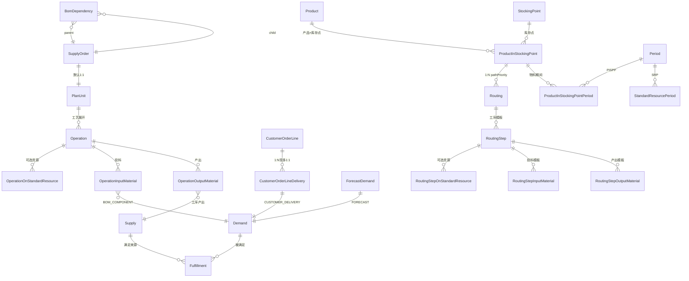

---

## 5.3 包结构

| 包 | 职责 | 代表类型 |
|----|------|----------|
| `ontology.master` | 主数据 / 工艺模板 | `Routing`, `RoutingStep`, `RoutingStepOnStandardResource`, … |
| `ontology.demand` | 需求侧 | `CustomerOrderLine`, `CustomerOrderLineDelivery`, `Demand` |
| `ontology.supply` | 供应 / 制造 | `SupplyOrder`, `Operation`, `ResourceCapacityAssignment`, `Supply` |
| `ontology.fulfillment` | 供需挂接 | `Fulfillment`, `SupplyChainLoader` |
| `ontology.period` | 时间桶 / MRP / 产能 | `Period`, `ProductInStockingPointPeriod`, `StandardResourcePeriod` |
| `ontology.scheduling` | 规划槽位 | `SchedulingSlot` |
| `ontology.planning` | 求解配置 | `MasterPlanSolveProfile` |
| 根 | 图 / ID / 装载 | `OntologyGraph`, `OntologyIds`, `WorkspaceAuthoritativeOntologyGraphService`, `OntologyLoader`（@Deprecated 内部壳） |

---

## 5.4 需求侧

```mermaid
classDiagram
    class CustomerOrderLine {
        +String id COL-{so}-{line}
        +String productCode
        +double orderQty
    }
    class CustomerOrderLineDelivery {
        +String id COLD-{so}-{line}-{seq}
        +LocalDate requestedDate
        +LocalDate confirmedDeliveryDate
        +String status
    }
    class Demand {
        +String id
        +DemandSourceType sourceType
        +LocalDate needDate
        +double quantity
    }
    class DemandSourceType {
        <<enumeration>>
        CUSTOMER_DELIVERY
        FORECAST
        BOM_COMPONENT
    }
    CustomerOrderLine "1" --> "0..*" CustomerOrderLineDelivery
    CustomerOrderLineDelivery "1" --> "1" Demand
    Demand --> DemandSourceType
```

**JPA：** `SalesOrderLineEntity` → COL + COLD（**目标态：** `txn_*` ← §12 `external_customer_order*` sync；过渡见 TODO-14）。

---

## 5.5 供应 / 制造

```mermaid
classDiagram
    class SupplyOrder {
        +String id = workOrderNo
        +LocalDate needDate
    }
    class PlanUnit {
        +String id PU-{so}-{seq}
    }
    class Operation {
        +String id OP-{so}-{seq}
        +int routingSequenceNo
        +LocalDateTime plannedStartTotal
    }
    class OperationOnStandardResource {
        +String standardResourceId
        +int resourcePriority
    }
    class Supply {
        +String id
    }
    SupplyOrder "1" --> "1" PlanUnit
    PlanUnit "1" --> "1..*" Operation
    Operation "1" --> "0..*" OperationOnStandardResource
```

**Canonical 链：**

```
SupplyOrder → PlanUnit → Operation
                              ├→ OperationOnStandardResource
                              ├→ OperationInputMaterial → Demand
                              └→ OperationOutputMaterial → Supply
```

**Supply ID 模式：**

| 模式 | 含义 |
|------|------|
| `SUP-{so}-{seq}` | 工单产出 |
| `SUP-INV-{product}` | 库存 peg |
| `SUP-SHORT-{product}` | 缺口 peg |

**工序顺序：** 遵循 `routingSequenceNo` / RS `sequenceNo`（RULE-MP-06）。

### 5.5.1 产能分配（ENT-RCA · ResourceCapacityAssignment）

> **规范定位（2026-06-21）：** **ENT-RCA** 是 **ENT-OG 内** 的产能占用边，不是仅存在于求解器包内的中间结构。  
> **实现差距：** 本体类型 **ENT-RCA** 已纳入 `OntologyGraph`（TODO-22 **R1 已完成 2026-07-01**）；optimize 写回 **ENT-RCA + SRP rollup** 已落地（**R2 已完成 2026-07-01**）；求解器包 `com.plantops.solver.masterplan.ResourceCapacityAssignment` 仍绑定 `TimeSlot` / 日拆段；投影见 **R3**。

**语义：** 一条 **ENT-RCA** 表示：某 **ENT-OP** 经其 **ENT-OOSR** 候选资源绑定，在某一 **ENT-SRP**（标准资源×期间）上 **已分配（或待求解）的占用分钟数** `assignedMinutes`。

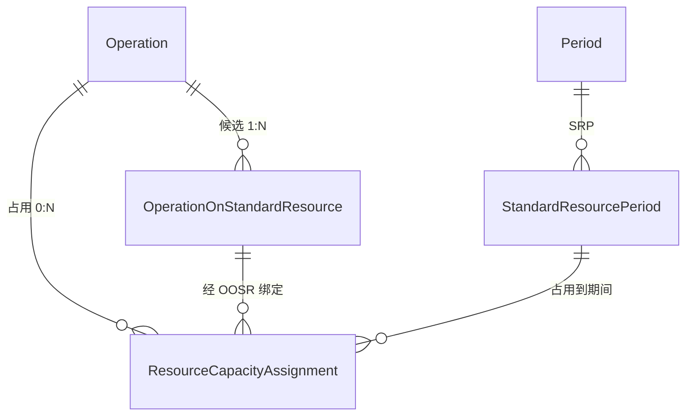

| 关系 | 基数 | 约束 |
|------|------|------|
| ENT-OP → ENT-OOSR | 1 : N | 工艺展开；RULE-MP-01：分配资源须 ∈ OOSR |
| ENT-OP → ENT-RCA | 1 : N | 同一工序可多条（多机台并行、跨 period 拆分） |
| ENT-RCA → ENT-OOSR | N : 1 | **必须**引用已声明的 OOSR；`RCA.standardResourceId = OOSR.standardResourceId` |
| ENT-RCA → ENT-SRP | N : 1 | `SRP.standardResourceId` 与 OOSR 一致；`SRP.periodId` 为占用期间 |
| ENT-SRP 聚合 | — | `SRP.reservedCapacity = Σ RCA.assignedMinutes`；`SRP.totalCapacity = Σ PRP.available`（**ADR-17** · §5.8.2） |

**ENT-RCA 关键属性（规范）：**

| 属性 | 说明 |
|------|------|
| `id` | `RCA-{operationId}-{oosrId}-{srpId}` 或等价稳定键 |
| `operationId` | 所属 ENT-OP |
| `operationOnStandardResourceId` | 绑定的 ENT-OOSR |
| `standardResourcePeriodId` | 绑定的 ENT-SRP |
| `assignedMinutes` | 在该 SRP 上占用的有效加工分钟（不含 setup 是否计入由 RULE-SUP-02 定义） |
| `operationTotalMinutes` | 冗余：同 OP 键下各 RCA 之和须守恒（拆段/多资源） |
| `locked` | Firm / 冻结分配（CFG） |
| `parallelGroupId` | 与 OP 一致；RULE-MP-08 |

**守恒（hard）：**

```
∀ operationKey:  Σ RCA.assignedMinutes = operationTotalMinutes
∀ ENT-SRP:         Σ RCA.assignedMinutes → 更新 reservedCapacity（及 overload 派生）
```

**与 ENT-SS 的分工（目标态 · ADR-16）：**

| 实体 | 粒度 | 角色 |
|------|------|------|
| **ENT-SRP** | 资源 × **Period**（含 **shift-Period**） | 产能期间桶；**ENT-RCA 的规范挂接面** |
| **ENT-RCA** | OP × OOSR × **SRP** | 本体 **占用真相**；optimize confirm 后读路径 SoT |
| **ENT-SS** | 资源 × 日槽 | **废止中**（TODO-23 S5）；迁移期 = `TimeSlot` DERIVE，非 SoT |

> 班次占用 = **shift 级 ENT-PER** 上的 **ENT-SRP + ENT-RCA**，不再引入平行 ENT-SS 集合。  
> 求解器 `TimeSlot` 由 **leaf Period** 投影（TODO-23 S4）；confirm 写回 **ENT-RCA + SRP**。

> **跟踪：** [§10 TODO-22](./10-decisions-risks.md#todo-22-分阶段adr-15--ent-rca) · [ADR-15](./10-decisions-risks.md#adr-15-ent-rca-纳入-ontology产能占用边) · [TODO-23 / ADR-16 §5.8.1](./10-decisions-risks.md#todo-23-分阶段adr-16--shift-period)

**持久化（目标态 · TODO-12 · TODO-22 R4）：** 表 `ont_resource_capacity_assignment`；与 `ont_operation_osr`、`ont_srp` FK 逻辑一致。

---

## 5.6 满足链（Fulfillment）

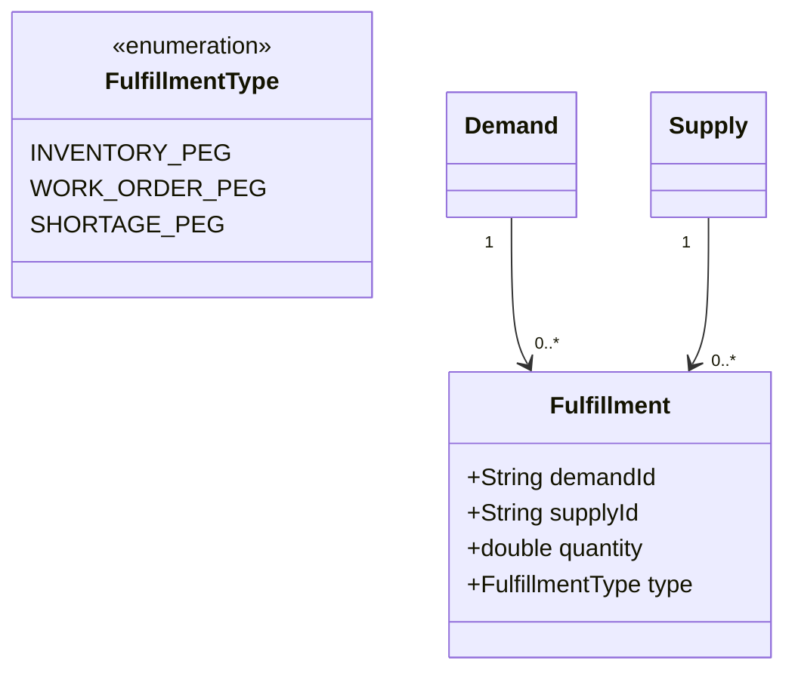

**BOM 依赖派生：**

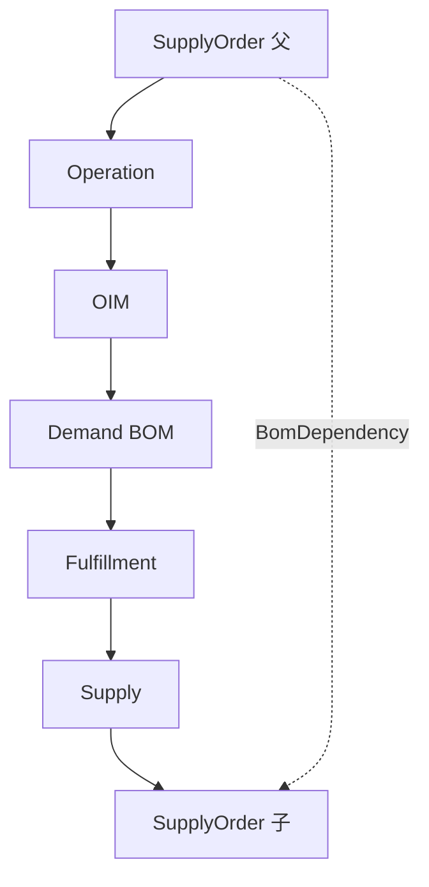

`BomDependency` 由 `BomDependencyDerivation` 追溯派生；**不得**以 `WorkOrderBomDependencyEntity` 为装载真相源（RULE-FF-02）。

**预留：** PISPP 页手工/自动 peg 写入 ENT-FF（SCN-07g~i）；Supply `availableDate` ≤ Demand `needDate`（RULE-FF-08）。

---

## 5.7 主数据工艺模板（Master Routing）

```mermaid
classDiagram
    class ProductInStockingPoint {
        +String id PISP-{product}
    }
    class Routing {
        +String id RT-{pispId}
        +int pathPriority
    }
    class RoutingStep {
        +String id RS-{pispId}-{seq}
        +int sequenceNo
        +double yieldRate
        +int preProcessingTime
        +int schedulingSpace
        +int productionTime
        +int postProcessingTime
    }
    class RoutingStepOnStandardResource {
        +int resourcePriority
        +double productionRate
        +ResourceUsageType resourceUsageType
        +double batchSize
        +int batchDurationMinutes
    }
    ProductInStockingPoint "1" --> "0..*" Routing
    Routing "1" --> "1..*" RoutingStep
    RoutingStep "1" --> "0..*" RoutingStepOnStandardResource
```

| 主数据模板 | 运行时（OntologyGraph） |
|------------|-------------------------|
| `RoutingStep` | `Operation` |
| `RoutingStepOnStandardResource` | `OperationOnStandardResource` |
| `RoutingStepInputMaterial` | `OperationInputMaterial` → `Demand` |
| `RoutingStepOutputMaterial` | `OperationOutputMaterial` → `Supply` |

**扩展字段（§16 · RULE-DEM/SUP）：**

| 实体 | 字段 | RULE |
|------|------|------|
| ENT-CO | `kittingEnabled`, `kittingGranularity`, `customerGrade`, `priority` | DEM-01, DEM-05 |
| ENT-COLD | `target/min/maxDeliveryQuantity`, `ppq`, `deliveryGranularity`, `early/lateAllowDays` | DEM-02~04 |
| ENT-PISP | `ppq`, `lotSize`, `min/maxQuantity` | DEM-04, SUP-01 |
| ENT-RS / ENT-OP | 四段时间 + `yieldRate` | SUP-02, SUP-04 |
| ENT-RSOSR / ENT-OOSR | `productionRate`, `resourceUsageType`, `batchSize`, `batchDurationMinutes` | SUP-03 |
| ENT-SR / ENT-RG | `resourceEfficiency` | SUP-05 |

多条 ENT-RT 时按 `pathPriority` 选路径（SCN-07b~d · RULE-MRP-01）。

---

## 5.8 时间 / 物料 / 产能

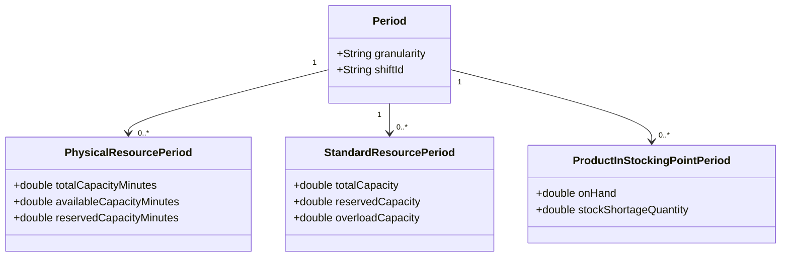

> **注：** `SchedulingSlot` 省略（ADR-16）。PRP→SRP 聚合见 **§5.8.2**。

**PISPP：** 供需平衡页二维表（SCN-07a）。期间平衡与缺口量见 **RULE-MRP-05**；消缺动机驱动 SCN-07b~d 建 SO。**SRP 超载：** 允许超过槽位容量，计 CapacityOverloadCost（RULE-MP-02/07）。

**短缺最晚可用日：** BusinessRules `material-lead-time` · 物料 `*` 默认最长采购周期（RULE-MRP-04）。

### 5.8.1 Shift 级 Period（ADR-16 · TODO-23）

> **原则：** 时间桶 **只有 ENT-PER 一套**；班次 = Period 的一种 **granularity**，不是 ENT-SS。

**`ontology_period_sequence` 语法（扩展）：**

| 片段 | 含义 | 示例 |
|------|------|------|
| `{N}x{M}shift` | 连续 N 个日历日，每日 M 个班次 Period | `14x3shift` → 14×3 个 leaf Period |
| `{N}x1d` | N 个日 Period | `4x1d` |
| `{N}x1w` / `{N}x1m` | N 个周/月 Period | `2x1w` |

**示例：** `14x3shift,4x1d,2x1w` — 近端 42 个 shift-Period，随后 4 日、2 周。

**ENT-PER 扩展属性（目标态）：**

| 属性 | 说明 |
|------|------|
| `id` | `P-{seq}` 或 `P-{date}-{shiftId}` |
| `sequenceNr` | horizon 内序 |
| `granularity` | `SHIFT` \| `DAY` \| `WEEK` \| `MONTH` |
| `shiftId` | 班次码（`SHIFT` 时必填；来自 MOD-CAL / `md_resource_calendar`） |
| `startDateTime` / `endDateTime` | 桶边界（shift 须精确到时刻） |
| `parentPeriodId` | 可选；日/周 Period rollup 子 shift-Period |

**rollup（汇总 Period，可选 DERIVE）：**

```text
SRP(parent).totalCapacity     = Σ SRP(child shift-Period).totalCapacity
SRP(parent).reservedCapacity  = Σ ENT-RCA on child SRP
```

**ENT-RCA 挂接：** 仅挂在 **leaf Period** 的 SRP 上（通常为 `granularity=SHIFT` 或 `DAY`）；父 Period 不直接挂 RCA。

**与 ENT-PISPP：** v1 **物料闭合仍按日 Period**（RULE-MRP-05）；shift 级 PISPP 为 TODO-23 可选扩展。产能（SRP/RCA）与物料（PISPP）粒度不一致时，simulate 须按 RULE 显式传播。

**ENT-SS 废止路径：**

| 阶段 | ENT-SS |
|------|--------|
| 现行 | `SchedulingSlotExpander` → `schedulingSlotsOrdered` |
| TODO-23 S4 | `PeriodExpander` → leaf Period → DERIVE `TimeSlot` |
| TODO-23 S5 | 移除 `schedulingSlotsOrdered`；`ont_scheduling_slot` 不写入 |

---

### 5.8.2 PhysicalResource 与产能聚合（ADR-17 · TODO-24）

> **原则：** **日历在 ENT-PR 上生效**；**ENT-PRP** 为期间产能真相源；**ENT-SRP** 为同一 ENT-PER 下所属 PR 的 **聚合视图**。主计划 **排产仍用 ENT-SR**（ENT-OOSR / ENT-RCA），不改为 Physical 粒度。

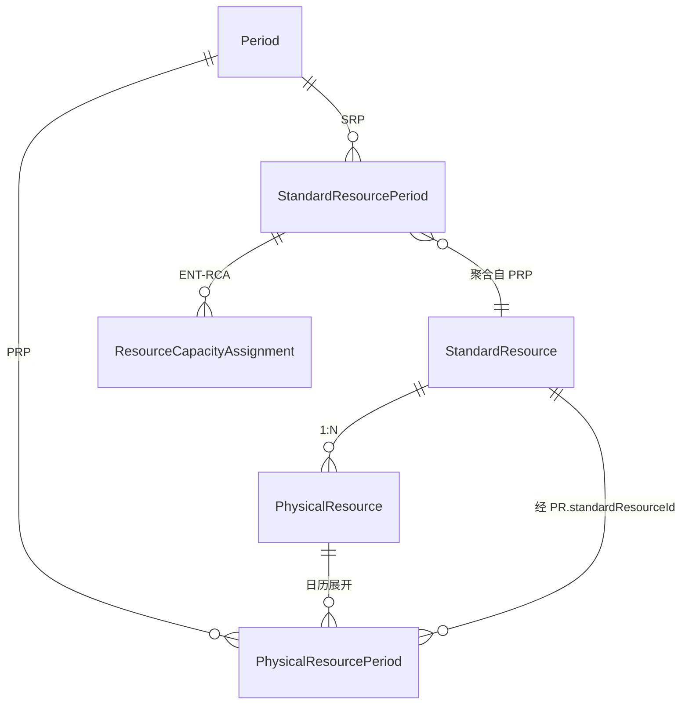

| 关系 | 基数 | 说明 |
|------|------|------|
| **ENT-SR → ENT-PR** | 1 : N | RULE-MD-12；`md_physical_resource.standard_resource_code` |
| **ENT-PER → ENT-PRP** | 1 : N | 每个 PR 在每个 Period（含 shift-Period）一条 PRP |
| **ENT-PER → ENT-SRP** | 1 : N | 每个 SR 在每个 Period 一条 SRP |
| **ENT-PRP → ENT-SRP** | N : 1 | 同一 `periodId` + `PR.standardResourceId` 下 PRP rollup 到 SRP |
| **ENT-RCA → ENT-SRP** | N : 1 | ADR-15；**不**直接挂 PRP（计划粒度 = SR） |

**ENT-PRP 关键属性（规范）：**

| 属性 | 说明 |
|------|------|
| `id` | `PRP-{physicalResourceId}-{periodId}` |
| `physicalResourceId` | ENT-PR |
| `standardResourceId` | 冗余自 PR，便于聚合 |
| `periodId` | 与 ENT-SRP 同一 ENT-PER |
| `totalCapacityMinutes` | 日历毛产能（该 PR 在该 Period 内） |
| `calendarDowntimeMinutes` | 停机/保养/节假日 |
| `schedulerFeedbackMinutes` | S05 细排已占（RULE-SUP-05） |
| `availableCapacityMinutes` | 可用 = total − downtime − feedback（再 × efficiency） |
| `reservedCapacityMinutes` | 主计划占用；可选 PR 级分摊 DERIVE |
| `overloadCapacityMinutes` | max(0, reserved − available) |

**聚合（hard · RULE-SUP-05）：**

```text
∀ ENT-SRP(sr, period):
  SRP.totalCapacity      = Σ PRP.availableCapacityMinutes
                           where PRP.standardResourceId = sr
                             and PRP.periodId = period
  SRP.reservedCapacity   = Σ ENT-RCA.assignedMinutes on this SRP
                           (= Σ PRP.reservedCapacityMinutes 若 PR 级分摊)
```

**示例：** ENT-SR `SR-A` 映射 **ENT-PR** `PR-1`、`PR-2`；同一 shift-Period `P-20260621-D1`：

| PRP | availableMinutes |
|-----|------------------|
| PR-1 | 480 |
| PR-2 | 360 |
| **SRP(SR-A, P-…)** | **840** |

**装载顺序（目标态）：**

```text
md_resource_calendar（按 physical_resource_code）
  → ENT-PRP
  → rollup ENT-SRP
  → ENT-RCA optimize 更新 SRP.reserved（PRP 占用可选 DERIVE 分摊）
```

**实现差距：** 现行 `OntologyLoader.loadStandardResourcePeriods` 按 `ResourceCalendarEntity.resourceId`（≈ SR）直写 SRP，无 ENT-PRP（**TODO-24**）。

> **跟踪：** [§10 TODO-24](./10-decisions-risks.md#todo-24-分阶段adr-17--prp--srp) · [ADR-17](./10-decisions-risks.md#adr-17-physicalresource-产能聚合pr--sr--prp--srp)

---

## 5.9 权威图装载与视图（ADR-07）

> 每个 ENT-WS **一张**权威 ENT-OG；ENT-COLD 为视图/scope，非并行真相源。

| 层级 | 方法 | 范围 | simulate / optimize / confirm |
|------|------|------|--------------------------------|
| **权威 ENT-OG** | `loadForWorkspace` | 全 Workspace 开放工单 + PISPP/SRP/Slot | ✅ ENT-SES / ENT-SBX |
| **权威 + 反灌** | `loadForPlanVersion` | 同上 + **ENT-RCA** / allocation → Operation/SRP（**过渡** · TODO-22 R5） | ✅ |
| **COLD 视图** | `OntologyFulfillmentChainProjector.project` | DTO-FC | 只读 |
| **只读快照（废止中）** | `buildDeliveryFulfillmentProjectionGraph` | 无 Session 轻量链 API | ❌ RULE-SES-04 |
| **SRP 只读** | `loadSrpCapacityForPlanVersion` | Period + SRP | ❌ |

单 COLD CTP：**scoped 子问题**跑在权威全图上，不得再 build 结构不同的第二张图。

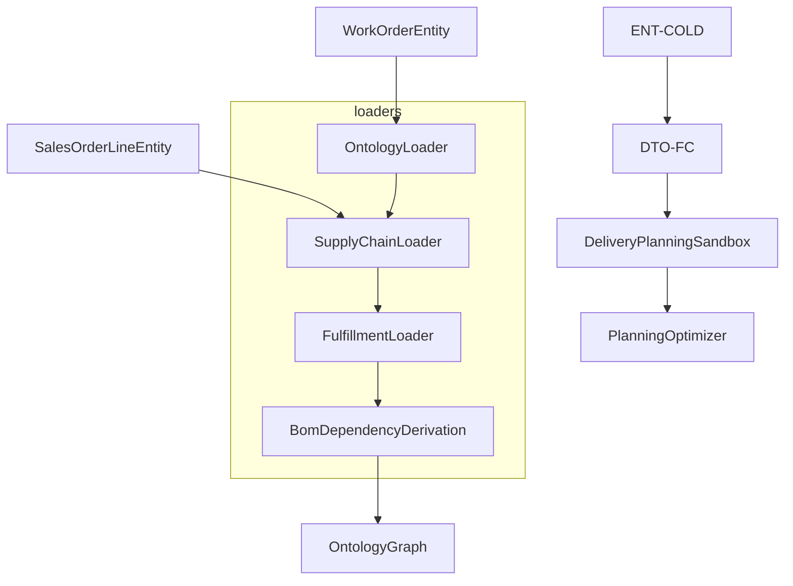

---

## 5.10 持久化与求解器边界（现行实现 · 过渡）

> ⚠️ **过渡章节**：P4 切读已落地（`OntologyP0Overlay` + WORKSPACE HEAD bootstrap）；**业务读路径**已迁 `WorkspaceAuthoritativeOntologyGraphService`（Sprint 6B）。本节仍描述 legacy JPA **confirm 并行写**与对照关系；全量退役 loader 主路径见 **TODO-12 Sprint 6D**。

> **目标态：** §5.14 **全量 Ontology 持久化（ADR-09）**。Flyway / Restorer 设计以 **§5.14** 为准。

| 本体 | 持久化 / 投影 | 说明 |
|------|---------------|------|
| ENT-OG 读装载 | `WorkspaceAuthoritativeOntologyGraphService` | `OntologyLoader` 壳 + `ont_*` P0 overlay；MRP 后 `OntologyLegacyMutationCoordinator` 双写 WO |
| ENT-SO | `WorkOrderEntity` + `ont_supply_order` | 双写期 1:1 · `id = workOrderNo` |
| ENT-OP | 图内 + 求解写回 | 来自工艺物化 |
| ENT-RT/RS/* | 无表 | `MasterPlanRoutingProjector` |
| ENT-FF | 内存 peg | `WorkOrderPeggingEntity` 对照 |
| ENT-BD | 派生 | 非 JPA 真相源 |
| ENT-OG | Session 内存 + **`ont_*`（ADR-09）** | 运行时推演在内存；simulate/optimize/confirm 写 DRAFT/COMMITTED revision |
| ENT-PV 结果 | **`ont_resource_capacity_assignment`** + `ont_operation` / `ont_srp` | confirm 占用 SoT（ADR-15 · TODO-22 R4） |
| ENT-PV 结果（过渡） | `MasterPlanAllocationEntity` | legacy confirm；TODO-22 R5 退役 |
| S05 结果 | `DetailScheduleOperationEntity` | 细排 confirm |
| ENT-SS | `TimeSlot` | **过渡** 1:1；ADR-16 后由 leaf Period DERIVE |

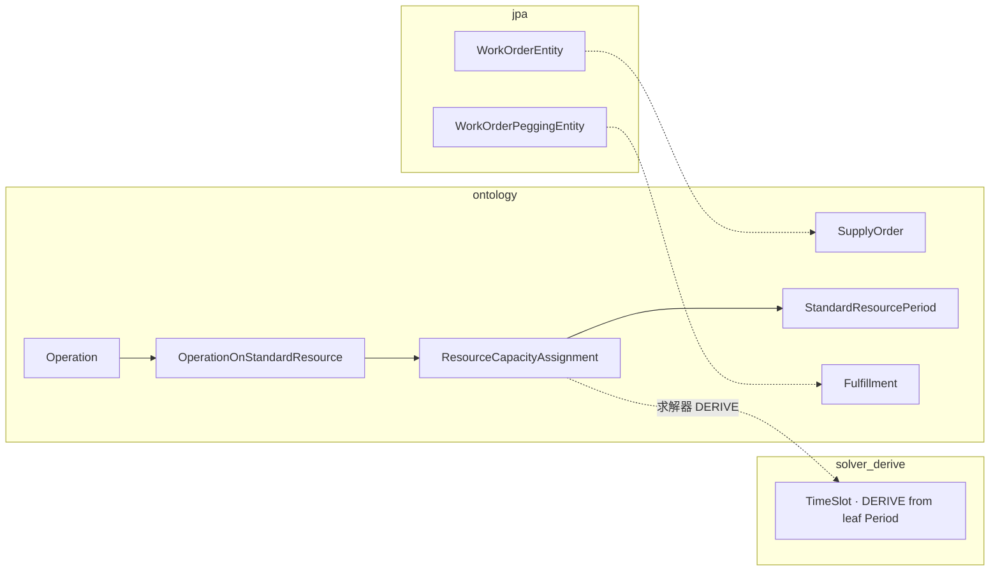

> **ADR-15：** ENT-RCA 为本体占用真相。  
> **ADR-16：** ENT-SS 目标态废止；`TimeSlot` 由 **shift/day leaf Period** DERIVE。

---

## 5.11 ID 命名（OntologyIds）

| 前缀 | 实体 |
|------|------|
| `COL-` / `COLD-` | CustomerOrderLine / Delivery |
| `DEM-COLD-` / `DEM-FC-` / `DEM-BOM-` | Demand |
| `PU-` / `OP-` / `OOSR-` / `RCA-` / `OIM-` / `OOM-` | 运行时工序族 |
| `SUP-` / `SUP-INV-` / `SUP-SHORT-` | Supply |
| `FF-` / `BOM-DEP-` | Fulfillment / BomDependency |
| `PISP-` / `PISPP-` | 产品×库存点 / 物料期间 |
| `RT-` / `RS-` / `RSOSR-` / `RSIN-` / `RSOUT-` | Routing 族 |
| `SRP-` / `P-` | 资源期间 / Period |
| `{resourceId}-D{n}` | SchedulingSlot |

---

## 5.12 关系基数速查

| 关系 | 基数 | 说明 |
|------|------|------|
| COL → COLD | 1 : N | 设计多批次 |
| COLD → Demand | 1 : 1 | CUSTOMER_DELIVERY |
| PISP → Routing | 1 : N | pathPriority |
| Routing → RoutingStep | 1 : N | sequenceNo |
| SupplyOrder → PlanUnit | 1 : 1 | 默认 |
| PlanUnit → Operation | 1 : N | 工艺展开 |
| Demand ↔ Supply | N : M | 经 Fulfillment |
| PISP → PISPP | 1 : N | 每 period |

---

## 5.13 源码索引

```
src/main/java/com/plantops/ontology/
├── OntologyGraph.java
├── OntologyIds.java
├── WorkspaceAuthoritativeOntologyGraphService.java
├── OntologyLoader.java                    # @Deprecated · legacy 壳 / bootstrap 边界
├── persistence/                           # §5.17 · ADR-09
├── demand/
├── supply/
├── fulfillment/
├── master/
├── period/
├── scheduling/
└── planning/
```

---

## 5.14 全量 Ontology 持久化（目标态 · ADR-09）

> **决策：** 以 **Ontology 为语义基准**，数据库表与 ENT-* **同构、可 SQL 查询**；内存 `OntologyGraph` 由 DB **恢复/组装**，而非仅从 legacy JPA 重算派生。  
> **Partial 模式：** 从全量 schema **分化**——部分 ENT 标记 `DERIVE`，不落库、装载时重算（§5.17）。  
> **实现（2026-06-30）：** PostgreSQL **`V65__ont_p0.sql`** + H2 **`V66__ont_p0_h2.sql`** · 列级规范 [`05-ont-schema.md`](../volumes/data/05-ont-schema.md) · `OntologyRestorer` / Session WAL / promote / dual-write / overlay / bootstrap **已落地**（TODO-12 P0~P5 骨架 + Sprint 6A/6B）；收口 Sprint 6C~6D（Session kill/reload E2E · PG 全量 parity）。

### 5.14.1 核心概念：Revision（图版本）

一张 ENT-OG 在 DB 中对应一个 **`ont_revision`**（图版本），而非散落的多套 legacy 表。

| 概念 | 表 / 字段 | 说明 |
|------|-----------|------|
| **图版本** | `ont_revision` | 一次 ENT-OG 快照的元数据 |
| **版本头指针** | `ont_revision_head` | 每个 Workspace + 作用域当前 HEAD |
| **Session 草稿** | `ont_revision.status = DRAFT` | simulate / optimize 中间态 |
| **已提交** | `ont_revision.status = COMMITTED` | confirm 或外部同步后的稳定态 |
| **变更日志** | `ont_change_log` | DRAFT 期 append-only WAL（宕机恢复） |

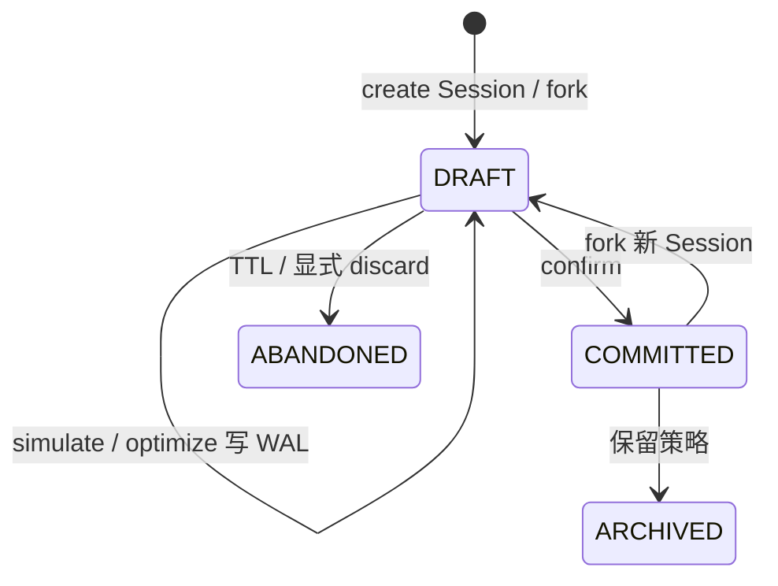

**`ont_revision` 关键字段：**

| 字段 | 说明 |
|------|------|
| `revision_id` | PK，`REV-{uuid}` |
| `workspace_id` | ENT-WS |
| `parent_revision_id` | fork 自哪一版（通常 base planVersion 的 HEAD） |
| `plan_version_id` | confirm 后关联 `PlanVersionEntity`（可空） |
| `session_id` | ENT-SES / ENT-SBX（DRAFT 必填） |
| `status` | `DRAFT` \| `COMMITTED` \| `ABANDONED` \| `ARCHIVED` |
| `persistence_mode` | `FULL`（默认）\| `PARTIAL`（§5.17） |
| `change_seq` | WAL 单调序号 |
| `committed_at` | confirm 时间 |

**HEAD 作用域（`ont_revision_head.scope_key`）：**

| scope_key | HEAD 含义 |
|-----------|-----------|
| `WORKSPACE` | 全厂权威 ENT-OG（对齐 ADR-07） |
| `SESSION:{sessionId}` | 沙盘 DRAFT revision |
| `PLAN:{planVersionId}` | 已发布计划版本绑定的 COMMITTED revision |

### 5.14.2 表与 Ontology 1:1 映射

> **V65 范围（P0 · 已落地）：** 容器四表 + `ont_demand` · `ont_supply_order` · `ont_operation` · `ont_fulfillment` · `ont_pispp` · `ont_srp` · `ont_resource_capacity_assignment`。下表其余表为 **P1/P2 扩展**（规范完整 · Flyway 待建）。

所有实体表 **必须** 含：`workspace_id`, `revision_id`, `entity_id`（= `OntologyIds` 前缀 ID）。  
表名前缀 **`ont_`**，列名 snake_case，与 Java 本体字段可 1:1 映射。

#### 容器 / 版本

| 表 | ENT / 用途 |
|----|------------|
| `ont_revision` | 图版本元数据 |
| `ont_revision_head` | `(workspace_id, scope_key) → revision_id` |
| `ont_change_log` | WAL：`change_seq`, `change_type`, `payload_json` |
| `ont_session` | `session_id → draft_revision_id`, `base_revision_id`, `expires_at` |

#### Master / 工艺模板（revision 内快照）

| 表 | ENT |
|----|-----|
| `ont_product` | Product |
| `ont_stocking_point` | StockingPoint |
| `ont_pisp` | ProductInStockingPoint |
| `ont_routing` | Routing（`path_priority`） |
| `ont_routing_step` | RoutingStep |
| `ont_routing_step_osr` | RoutingStepOnStandardResource |
| `ont_routing_step_im` | RoutingStepInputMaterial |
| `ont_routing_step_om` | RoutingStepOutputMaterial |

> Master 主数据仍可从 `MaterialEntity` / `ProductResourceEntity` **导入**到 revision；**运行时 SQL 以 `ont_*` 为准**。

#### 需求

| 表 | ENT |
|----|-----|
| `ont_customer_order_line` | CustomerOrderLine |
| `ont_customer_order_line_delivery` | CustomerOrderLineDelivery |
| `ont_forecast_demand` | ForecastDemand |
| `ont_demand` | Demand（含 `source_type`, `source_id`, `need_date`, `quantity`） |

#### 供应 / 制造

| 表 | ENT |
|----|-----|
| `ont_supply_order` | SupplyOrder |
| `ont_plan_unit` | PlanUnit |
| `ont_operation` | Operation |
| `ont_operation_osr` | OperationOnStandardResource |
| `ont_resource_capacity_assignment` | ResourceCapacityAssignment（ENT-RCA） |
| `ont_operation_im` | OperationInputMaterial |
| `ont_operation_om` | OperationOutputMaterial |
| `ont_supply` | Supply |

#### 满足 / BOM

| 表 | ENT |
|----|-----|
| `ont_fulfillment` | Fulfillment |
| `ont_bom_dependency` | BomDependency |

> **规范变更（ADR-09）：** `ont_bom_dependency` 为 **COMMITTED revision 的持久化真相**；装载时 **读表**，不再从 FF 派生覆盖已提交行。DRAFT 期仍可在内存派生后 **写入** `ont_bom_dependency`（与 FF 同事务）。

#### 期间 / 产能 / 槽位

| 表 | ENT |
|----|-----|
| `ont_period` | Period（`sequence_nr`, `granularity`, `shift_id`, `start/end`, `parent_period_id` · **TODO-23 S1**） |
| `ont_pispp` | ProductInStockingPointPeriod |
| `ont_physical_resource_period` | PhysicalResourcePeriod（ENT-PRP · **TODO-24**） |
| `ont_srp` | StandardResourcePeriod（**Σ PRP** · ADR-17） |
| `ont_scheduling_slot` | SchedulingSlot（**ADR-16 不写入**；legacy 只读对照） |

#### 索引建议（SQL 查询友好）

| 查询场景 | 索引 |
|----------|------|
| 按 revision 拉全图 | 各表 `(workspace_id, revision_id)` |
| COLD 满足链 | `ont_demand(revision_id, source_type, source_id)` |
| 工单工序 | `ont_operation(revision_id, supply_order_id, routing_sequence_no)` |
| PISPP 平衡表 | `ont_pispp(revision_id, pisp_id, period_id)` |
| peg 查询 | `ont_fulfillment(revision_id, demand_id)` / `(supply_id)` |

### 5.14.3 读写路径（内存 ↔ DB 一致）

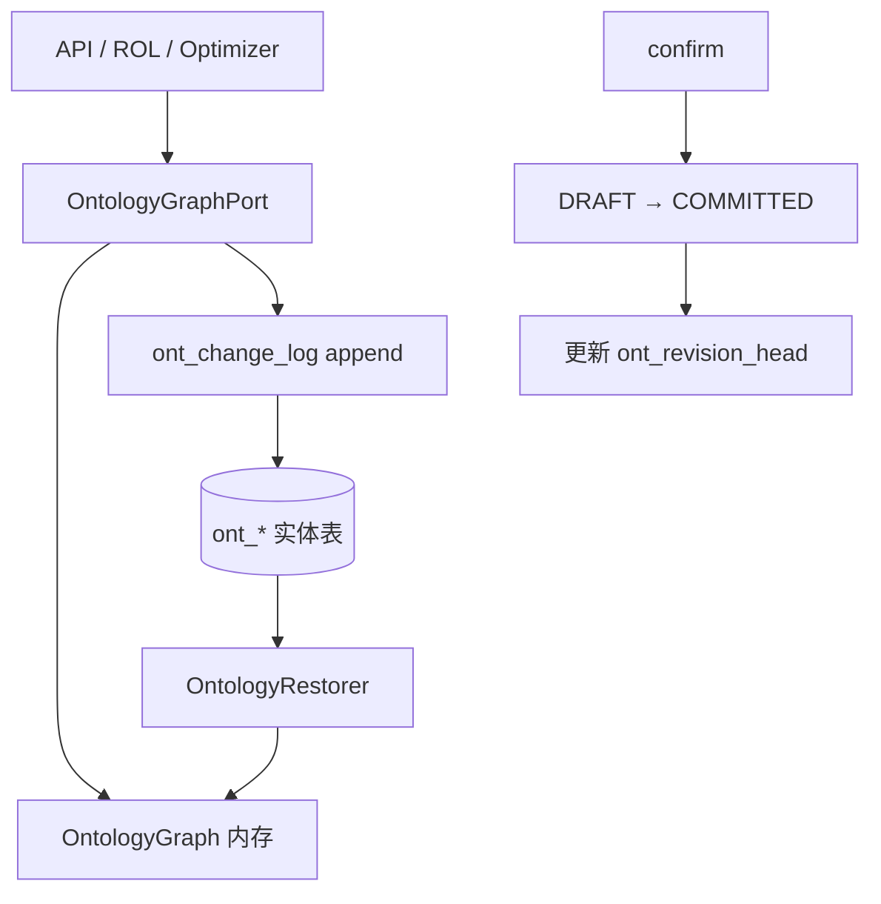

| 操作 | 写 DB | 写内存 | 一致性 |
|------|-------|--------|--------|
| **create Session** | fork `ont_revision` DRAFT + copy 父 revision 实体行 | 从 DRAFT restore | 同事务 |
| **simulate** | append `ont_change_log` + upsert 受影响 `ont_*` 行 | ROL 改图 | **单事务**：DB 与内存同 commit |
| **optimize** | upsert `ont_operation` 时间 / **`ont_resource_capacity_assignment`** / `ont_srp` / `ont_pispp` + WAL | 写回图（ENT-RCA → SRP.reserved · ADR-15） | 同上 |
| **confirm** | DRAFT→COMMITTED；写 `plan_version_id`；更新 WORKSPACE HEAD | invalidate 权威缓存 | 单事务；失败全 rollback |
| **只读 API** | 无 | `OntologyRestorer.load(head)` 或读 committed | 读 committed HEAD |

**唯一写入口：** `OntologyPersistencePort`（实现类取代分散的 `OntologyLoader.build` 写路径与 `OntologyStatePersister` 仅写 allocation 的模式）。

**读路径：**

- `OntologyRestorer.loadRevision(revisionId)` → `OntologyGraph`
- 禁止 bypass：业务代码 **不得** 在 FULL 模式下用 legacy `WorkOrderEntity` 拼装 Session 图（RULE-PERS-01）。

### 5.14.4 宕机恢复（FULL 模式）

| 宕机时刻 | DB 状态 | 重启后 | 用户可见 |
|----------|---------|--------|----------|
| simulate 事务 **已 commit** | DRAFT revision + WAL + 更新后的 `ont_*` | 恢复 `ont_session` → load DRAFT revision | 沙盘保留 |
| simulate 事务 **未 commit** | WAL 最后一条不完整 | 丢弃该 transaction；回退到 `change_seq - 1` | 丢失最后一次 simulate |
| optimize 后 | 同 simulate + `last_optimizer_result` 存 `ont_session.optimizer_result_json` | 可 **继续 confirm** 或 re-optimize | 保留 optimize |
| confirm 中途 | 事务 rollback | HEAD 仍指向旧 COMMITTED | 无部分 confirm |
| confirm 成功 | 新 COMMITTED + WORKSPACE HEAD 更新 | load HEAD → 权威 OG | 与 confirm 前 DRAFT 一致 |
| Session TTL 过期 | DRAFT → `ABANDONED`（定时任务） | 只读 COMMITTED HEAD | 草稿清理 |

**fsync 策略（NFR，见 §9 补充）：**

| 级别 | 配置 | 保证 |
|------|------|------|
| `SYNC_PER_CHANGE` | 默认生产 | 每次 simulate/optimize API 成功返回前 WAL + 实体行已 commit |
| `SYNC_BATCH` | 压测/内网 | 最多丢失 N 秒 batch 内变更 |

### 5.14.5 与 legacy JPA 表的关系（迁移）

| Legacy | 目标 | 策略 |
|--------|------|------|
| `work_order` | `ont_supply_order` | 双写 → 切读 `ont_*` → 废弃 legacy 写 |
| `work_order_pegging` | `ont_fulfillment` | 迁移脚本 1:1 映射 WO peg |
| `work_order_bom_dependency` | `ont_bom_dependency` | 一次性导入；之后仅写 `ont_*` |
| `master_plan_allocation` | **`ont_resource_capacity_assignment`** + `ont_srp.reserved` | allocation 反灌改为读 committed **ENT-RCA**（TODO-22 R5） |
| `sales_order_line` | `ont_col` + `ont_cold` | 可选拆表；导入 revision |
| Master 数据 | `ont_routing*` 快照 | 每次 fork revision 时从 master 投影 copy-in |

**过渡期：** `OntologyLoader` 保留为 **legacy 壳 + bootstrap 边界**（`@Deprecated`）；生产读经 **`WorkspaceAuthoritativeOntologyGraphService`** + `OntologyP0Overlay`；`OntologyRestorer` 从 `ont_*` 组装 P0 子集。

---

## 5.15 SQL 查询与视图

Committed HEAD 上的常用查询 **不依赖** 内存：

```sql
-- 示例：某 COLD 满足链（COMMITTED）
SELECT f.*, d.need_date, s.entity_id AS supply_id
FROM ont_fulfillment f
JOIN ont_demand d ON d.revision_id = f.revision_id AND d.entity_id = f.demand_id
JOIN ont_supply s ON s.revision_id = f.revision_id AND s.entity_id = f.supply_id
WHERE f.workspace_id = :ws AND f.revision_id = :headRevision
  AND d.source_type = 'CUSTOMER_DELIVERY' AND d.source_id = :coldId;
```

**推荐视图（实现待办）：**

| 视图 | 用途 |
|------|------|
| `v_ont_workspace_head` | 解析 WORKSPACE COMMITTED revision_id |
| `v_ont_pispp_balance` | PISPP 二维表（SCN-07a） |
| `v_ont_fulfillment_chain` | COLD → FF → SO 链 |

---

## 5.16 Partial 模式（从 FULL 分化）

Partial **不是** 另一套 schema，而是同一 `ont_*` 表 + **存储策略**：

**表 `ont_entity_policy`（或 revision 级 JSON）：**

| `entity_kind` | `storage` | 装载行为 |
|---------------|-----------|----------|
| `FULFILLMENT`, `SUPPLY_ORDER`, `DEMAND`, … | `STORE` | 读表 |
| `BOM_DEPENDENCY`, `PISPP` | `DERIVE` | 不读表；`OntologyDeriver` 重算 |
| `PHYSICAL_RESOURCE_PERIOD` | `STORE` | 日历真相；或由 calendar **DERIVE** 后 upsert |
| `STANDARD_RESOURCE_PERIOD` | `DERIVE` | **Σ PRP** rollup（ADR-17）；或与 PRP 同事务 STORE |
| `SCHEDULING_SLOT` | **不装载** | ADR-16 废止；legacy 由 `PeriodExpander` + DERIVE `TimeSlot` 替代 |

| 模式 | `persistence_mode` | 宕机 Session | SQL 可查 |
|------|---------------------|--------------|----------|
| **FULL** | 全部 `STORE` | WAL 恢复 DRAFT | 全部 `ont_*` |
| **PARTIAL** | 混合 policy | 仅 STORE 类实体 + WAL | 仅 STORE 类；DERIVE 类需 API 或临时表 |

**原则：** Partial 是 FULL 的 **写子集**；表结构不变，避免两套模型。

---

## 5.17 实现包结构（目标）

```
com.plantops.ontology.persistence/
├── OntologyPersistencePort.java           # 写入口（实现 OntologyPersistenceService）
├── OntologyRestorer.java                  # revision → OntologyGraph（P0 子集）
├── OntologyRevisionService.java           # fork / promote / HEAD
├── OntologySessionPersistenceService.java # DRAFT Session + WAL
├── OntologyLegacyImporter.java            # legacy 图 → COMMITTED ont_*
├── OntologyLegacyDualWriteService.java    # work_order → ont_supply_order
├── OntologyLegacyMutationCoordinator.java # MRP 等 legacy 变更后双写 + 失效缓存
├── OntologyWorkspaceHeadBootstrapService.java
├── OntologyP0Overlay.java
├── OntologyPartialDeriver.java
└── entity/                                # ont_* JPA
```

`OntologyLoader.loadForWorkspace` / `loadForPlanVersion` / `loadSrpCapacityForPlanVersion` → **`@Deprecated`**；外部读路径统一 `WorkspaceAuthoritativeOntologyGraphService`。

---

## 5.18 源码索引（补充）

见 §5.13；持久化实现目录 **`ontology.persistence`**（**P0~P5 骨架已落地** · Sprint 6C~6D 收口 · TODO-12）。

---

## 5.19 平台与 Session（ENT-WS · ENT-SES · ENT-SBX · ENT-PV）

> **范围：** 描述 **MOD-OCP / PROC-S04** 沙盘与计划版本；不含 MOD-SCH / MOD-SLT（TODO-20）。  
> **规则：** RULE-SES-01~04 · RULE-PERS-01~05 · **API-SES-01~05** · SCN-T01/T02

### 5.19.1 概念关系

每个 **ENT-WS** 持有一张权威 **ENT-OG**（ADR-07）。**ENT-SES** 与 **ENT-SBX** 均在该图上进行 simulate / optimize / confirm，**不得**再装载结构不同的第二张图。

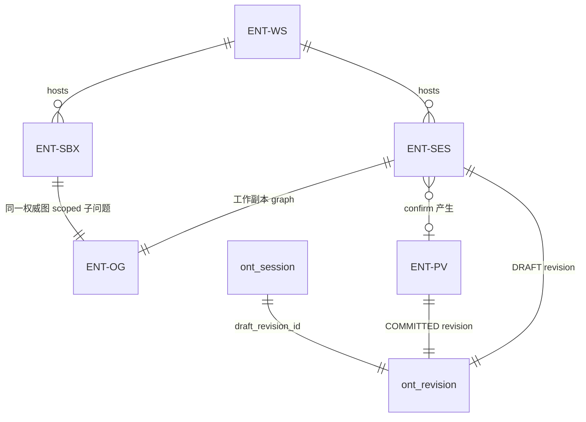

| 概念 | 术语 | 说明 |
|------|------|------|
| 工作区 | **ENT-WS** | 数据集隔离单元；见 §18 |
| 全厂沙盘 | **ENT-SES** | `MasterPlanOntologySession`；PATH-ONT optimize |
| 单交付 trial | **ENT-SBX** | `DeliveryPlanningSandbox`；COLD scope + baseline fixedLoads |
| 计划版本 | **ENT-PV** | confirm 产出；API `masterPlanVersionId` / `planVersionId` |
| 图版本 | `ont_revision` | ADR-09；DRAFT / COMMITTED |
| Session 索引 | `ont_session` | `session_id` → DRAFT revision + TTL |

### 5.19.2 ENT-SES（MasterPlanOntologySession）

**Java：** `com.plantops.scenario.planning.MasterPlanOntologySession` · 实现 `OntologySandbox`

| 字段 | 类型 | 规范说明 | 持久化（目标态 · TODO-12） |
|------|------|----------|---------------------------|
| `sessionId` | `SES-{uuid}` | API 路径键 | `ont_session.session_id` |
| `workspaceId` | string | RULE-WS-01 隔离 | `ont_session.workspace_id` |
| `basePlanVersionId` | string? | fixedLoads / 反灌来源 | `ont_session.base_revision_id` → `ont_revision` |
| `graph` | OntologyGraph | ADR-07 权威图工作副本 | DRAFT revision 下 `ont_*` 行集 |
| `rolEngine` | RolEngine | simulate：ROL + ChangeSet | 不持久化 |
| `createdAt` | datetime | 创建时刻 | `ont_session.created_at` |
| `expiresAt` | datetime | TTL 默认 8h（§9 NFR） | `ont_session.expires_at` |
| `solveProfile` | MasterPlanSolveProfile | optimize 策略与权重 | `ont_session.solve_profile_json`（目标） |
| `lastOptimizerResult` | OptimizerResult | 求解器无关结果摘要 | `ont_session.optimizer_result_json` |
| `lastSolution` | MasterPlanSchedule | **过渡**：Timefold 类型泄漏 | **废止**；目标态仅保留 `lastOptimizerResult` |
| `lastSolveDurationMs` | long? | 求解耗时 | 含于 `optimizer_result_json` |

### 5.19.3 ENT-SBX（DeliveryPlanningSandbox）

**Java：** `com.plantops.scenario.planning.delivery.DeliveryPlanningSandbox` · 实现 `OntologySandbox`

| 字段 | 类型 | 规范说明 | 持久化（目标态） |
|------|------|----------|------------------|
| `sandboxId` | `DPS-{uuid}` | 对外键；`OntologySandbox.sessionId()` | 可与 `ont_session.session_id` 同键 |
| `workspaceId` | string | RULE-WS-01 | `ont_session.workspace_id` |
| `deliveryId` | COLD id | scope 根（ADR-06） | `ont_session.delivery_id`（目标列） |
| `baselinePlanVersionId` | string? | CTP fixedLoads 来源 | `ont_session.base_revision_id` |
| `graph` | OntologyGraph | **同 WS 权威图**上的 scoped 工作副本 | 同 ENT-SES |
| `rolEngine` | RolEngine | simulate | 不持久化 |
| `createdAt` / `expiresAt` | datetime | TTL 8h | `ont_session.expires_at` |
| `trialRevision` | int | `0` = 仅 JIT；optimize 递增 | `ont_session.trial_revision` |
| `lastOptimizerResult` | OptimizerResult? | 最近一次 optimize | `ont_session.optimizer_result_json` |

**与 ENT-SES 差异：**

| 维度 | ENT-SES | ENT-SBX |
|------|---------|---------|
| 范围 | 全 Workspace | 单 **ENT-COLD** + 链上 SO |
| optimize 输入 | 全图或 Session 策略 | `PlanningProblem.scopedSupplyOrderIds` + baseline fixedLoads |
| API | API-SES-01~05 | Sandbox API / `OrderDemandAction` FINITE_PLAN |
| 图装载 | `loadForWorkspace` | **不得** `buildDeliveryFulfillmentProjectionGraph` 作 SoT（RULE-SES-04） |

### 5.19.4 ENT-PV（PlanVersion）

**JPA（现行）：** `PlanVersionEntity` · confirm 后绑定 COMMITTED revision（§5.14）

| 字段 | 说明 |
|------|------|
| `planVersionId` | 场景版本 ID；OCP 分析页 `activePlanVersionId` |
| `committedRevisionId` | `ont_revision.revision_id`（`status=COMMITTED`，TODO-12） |
| `optimizerScoreSummary` | hard/soft 可读摘要；§15 KPI-MP-TOT（TODO-16 结构化 `kpiBreakdown`） |
| `committedAt` | confirm 时间；与 `ont_revision.committed_at` 对齐 |

### 5.19.5 生命周期与 API 对照

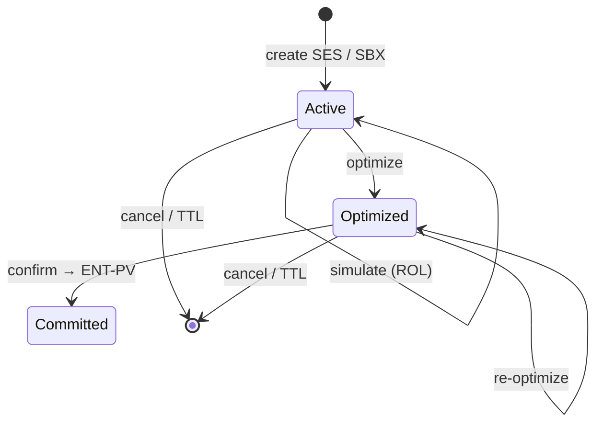

| 操作 | ENT-SES / ENT-SBX 内存 | `ont_*`（FULL · TODO-12） | API |
|------|------------------------|----------------------------|-----|
| **create** | fork `OntologyGraph` | fork **DRAFT** `ont_revision` + copy 父实体行 | API-SES-01 · Sandbox create |
| **simulate** | ROL → graph | append WAL + upsert 受影响行 | API-SES-02 |
| **optimize** | `PlanningOptimizer` → graph | upsert OP/SRP/PISPP + WAL | API-SES-03 |
| **confirm** | `OntologyStatePersister` | DRAFT→COMMITTED · 更新 HEAD · 写 `plan_version_id` | API-SES-04 |
| **discard / TTL** | 移除内存 Session | DRAFT→`ABANDONED` | — |

**硬约束（RULE-SES）：**

- **simulate** 不得调用 SOL-TF / SOL-ORT（RULE-SES-01 延伸 · §4）。
- optimize / confirm 输入 **必须** 来自 Session 内 ENT-OG，禁止 PATH-ENT 重建（ADR-08 · RULE-SES-03）。
- 单 COLD CTP 在权威全图上跑 **scoped 子问题**，不得第二张并行图（ADR-07 · RULE-SES-04）。

---

## 5.20 实体属性目录（TODO-21 Phase 2）

> **列约定：** `属性` · `类型` · `必填` · `来源`（`memory`/`md_*`/`txn_*`/`derived`/`solver`/`rol`）· `RULE/SCN` · `现状`（`implemented`/`spec-only`/`legacy-only`）  
> **SQL 类型：** P0 列级 DDL 见 [`05-ont-schema.md`](../volumes/data/05-ont-schema.md)（**V65 已落地**）；P1/P2 扩展表待后续 Flyway。  
> **P0 核心实体**（ENT-OP · ENT-COLD 等）见 [`05-domain-model-appendix-fields.md`](./05-domain-model-appendix-fields.md)（Phase 2 进行中）。

### 5.20.0 索引

| 实体 | 小节 | Java / 表 | 现状 |
|------|------|-----------|------|
| ENT-PER | §5.20.1 | `Period` · `ont_period` | `implemented`（缺 shift 字段 · TODO-23 S1） |
| ENT-PRP | §5.20.2 | **spec-only** · `ont_physical_resource_period` | `spec-only`（TODO-24 P1） |
| ENT-SRP | §5.20.3 | `StandardResourcePeriod` · `ont_srp` | `implemented`（**P0 DDL 已落地** · 直写日历 · 待 PRP rollup） |
| ENT-RCA | §5.20.4 | solver 包 · `ont_resource_capacity_assignment` | `legacy-only`（**P0 DDL 已落地** · TODO-22 R1~R3 本体/写回） |
| ENT-SS | §5.20.5 | `SchedulingSlot` · `ont_scheduling_slot` | **legacy-only / transition**（TODO-23 S5 退役） |
| 资源日历 | §5.20.6 | `ResourceCalendarEntity` · `resource_calendar` | `legacy-only`（键为 resourceId） |
| 工厂日历 | §5.20.7 | `FactoryCalendarPolicyEntity` · MOD-CAL | `implemented` |

### 5.20.1 ENT-PER（Period）

| 属性 | 类型 | 必填 | 来源 | RULE/SCN | 现状 |
|------|------|------|------|----------|------|
| `id` | String | Y | memory | — | implemented |
| `sequenceNr` | int | Y | derived | `ontology_period_sequence` | implemented |
| `startDate` | LocalDate | Y | derived | — | implemented |
| `endDate` | LocalDate | Y | derived | — | implemented |
| `granularity` | enum | Y | derived | ADR-16 · §5.8.1 | **spec-only** |
| `shiftId` | String | N | md_* / MOD-CAL | ADR-16 | **spec-only** |
| `startDateTime` | datetime | N | derived | shift 桶边界 | **spec-only** |
| `endDateTime` | datetime | N | derived | shift 桶边界 | **spec-only** |
| `parentPeriodId` | String | N | derived | rollup 父桶 | **spec-only** |

### 5.20.2 ENT-PRP（PhysicalResourcePeriod · ADR-17）

| 属性 | 类型 | 必填 | 来源 | RULE/SCN | 现状 |
|------|------|------|------|----------|------|
| `id` | String | Y | derived | `PRP-{pr}-{period}` | **spec-only** |
| `physicalResourceId` | String | Y | md_* | RULE-MD-12 | **spec-only** |
| `standardResourceId` | String | Y | md_* | 冗余聚合键 | **spec-only** |
| `periodId` | String | Y | memory | 同 ENT-SRP | **spec-only** |
| `totalCapacityMinutes` | double | Y | md_* | RULE-SUP-05 L1 | **spec-only** |
| `calendarDowntimeMinutes` | double | Y | md_* | RULE-SUP-05 | **spec-only** |
| `schedulerFeedbackMinutes` | double | Y | txn_* / derived | RULE-SUP-05 · TODO-24 P5 | **spec-only** |
| `availableCapacityMinutes` | double | Y | derived | × resourceEfficiency | **spec-only** |
| `reservedCapacityMinutes` | double | Y | derived | 可选 RCA 分摊 | **spec-only** |
| `overloadCapacityMinutes` | double | Y | derived | RULE-MP-07 | **spec-only** |

### 5.20.3 ENT-SRP（StandardResourcePeriod）

| 属性 | 类型 | 必填 | 来源 | RULE/SCN | 现状 |
|------|------|------|------|----------|------|
| `id` | String | Y | derived | `SRP-{sr}-{seq}` | implemented |
| `standardResourceId` | String | Y | md_* | — | implemented |
| `periodId` | String | Y | memory | — | implemented |
| `totalCapacity` | double | Y | md_* → **Σ PRP** | RULE-SUP-05 L2 | implemented（**直写日历**） |
| `calendarDowntime` | double | Y | md_* | RULE-SUP-05 | implemented |
| `technicalDowntime` | double | Y | rol / derived | — | implemented |
| `reservedCapacity` | double | Y | solver → **Σ RCA** | ADR-15 · RULE-MP-02 | implemented |
| `availableCapacity` | double | Y | derived | `recalculateCapacityFields` | implemented |
| `freeCapacity` | double | Y | derived | — | implemented |
| `overloadCapacity` | double | Y | derived | RULE-MP-07 | implemented |

### 5.20.4 ENT-RCA（ResourceCapacityAssignment · ADR-15）

| 属性 | 类型 | 必填 | 来源 | RULE/SCN | 现状 |
|------|------|------|------|----------|------|
| `id` | String | Y | derived | §5.5.1 | **spec-only** |
| `operationId` | String | Y | memory | RULE-MP-01 | solver 包 only |
| `operationOnStandardResourceId` | String | Y | memory | RULE-MP-01 | **spec-only** |
| `standardResourcePeriodId` | String | Y | memory | leaf SRP | solver 包 only |
| `assignedMinutes` | double | Y | solver | 守恒 §5.5.1 | solver 包 only |
| `locked` | boolean | N | rol / CFG | — | **spec-only** |

### 5.20.5 ENT-SS（SchedulingSlot · 过渡）

| 属性 | 类型 | 必填 | 来源 | RULE/SCN | 现状 |
|------|------|------|------|----------|------|
| `id` | String | Y | derived | TimeSlot 投影 | implemented |
| `index` | int | Y | derived | — | implemented |
| `date` / `periodEnd` | LocalDate | Y | derived | TimeslotHorizon | implemented |
| `granularity` | enum | Y | derived | DAY/WEEK | implemented |
| `shiftId` | String | Y | derived | 多为 `DAY`/`WEEK` | implemented |
| `resourceId` | String | Y | md_* | ≈ SR | implemented |
| `capacityMinutes` | int | Y | md_* | 须 ≡ Σ PRP（目标） | implemented |

### 5.20.6 资源日历（`resource_calendar` · legacy）

| 属性 | 类型 | 必填 | 来源 | RULE/SCN | 现状 |
|------|------|------|------|----------|------|
| `resourceId` | String | Y | md_* / MOD-CAL | **目标：** `physical_resource_code` | legacy-only |
| `calendarDate` | LocalDate | Y | MOD-CAL / 手工 | — | implemented |
| `shiftId` | String | Y | MOD-CAL | `DAY`/`S1`/`S2`/`S3` | implemented |
| `availableCapacityMinutes` | int | Y | MOD-CAL / 手工 | RULE-SUP-05 | implemented |
| `unavailableCapacityMinutes` | int | Y | 手工 | 停机 | implemented |

### 5.20.7 工厂日历（MOD-CAL）

| 属性 | 实体 | 说明 | 现状 |
|------|------|------|------|
| `shiftMode` | Policy | `TWO` / `THREE` | implemented |
| `shift1/2/3Start/End` | Policy | 班次起止 | implemented |
| `saturdayWork` / `sundayWork` | Policy | 周末默认 | implemented |
| `shift1/2/3Open` | DayOverride | 单日班次开关 | implemented |
| `syncToResourceCalendars` | API | 写入 horizon 内全部 owner | implemented |

---

**回指：** [02-glossary.md](./02-glossary.md) · [04-business-rules.md](./04-business-rules.md) · [06-api-contracts.md](./06-api-contracts.md) · [10-decisions-risks.md](./10-decisions-risks.md) ADR-09 · [05-domain-model-appendix-fields.md](./05-domain-model-appendix-fields.md)
