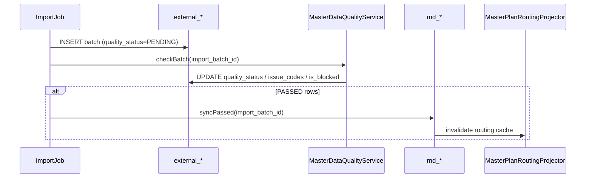
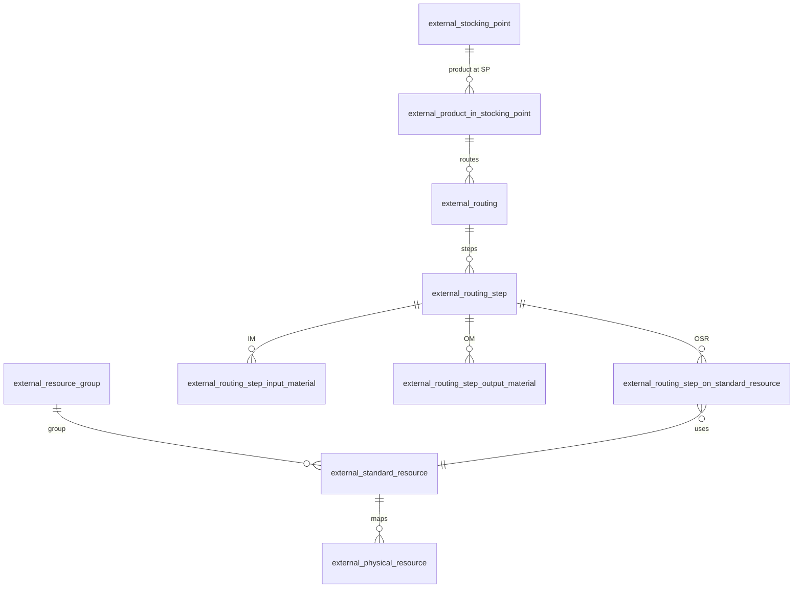
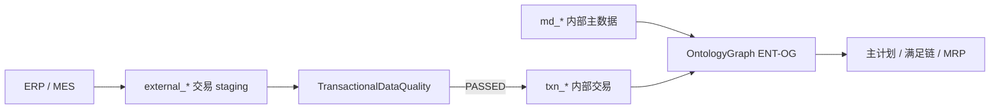
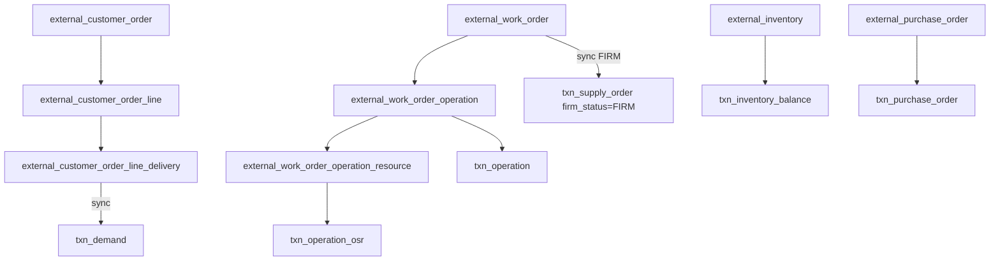

# 数据卷 · External 数据集成（§11 · §12）

> **§ 编号不变。** §11 外部主数据 · §12 外部交易。

---

<a id="s11-external-master"></a>

# §11 外部主数据与同步（External Master → Internal `md_*`）

> **范围：** 主计划所依赖的 **工艺与资源主数据**（StockingPoint / PISP / Routing / Resource…）  
> **交易数据**（订单 / Firm 工单 / 库存 / PO）见 **[§12](#s12-external-transactional)**
> **原则：** 计划制定 **仅基于内部主数据（`md_*`）**；上游 **只能** 写 **`external_*` staging**，经 **质检 → sync** 进入内部。  
> **关联：** [§5 工艺模板](../../core/05-domain-model.md) · [§4 RULE-MD-*](../../core/04-business-rules.md#412-外部主数据质量与同步) · ADR-10

---

## 11.1 数据分层


| 层 | 命名 | 角色 | 计划是否可读 |
|----|------|------|--------------|
| **外部** | `external_*` | 上游系统镜像；允许脏数据 | ❌ |
| **内部** | `md_*` | 通过质检的 canonical 主数据 | ✅ |
| **本体** | ENT-RT/RS/*、Operation 物化 | Session 内推演 | ✅（自 md 投影） |

> **禁止：** 主计划路径直接读 `external_*` 或跳过质检写 `md_*`（RULE-MD-01）。

---

## 11.2 外部表公共列（所有 `external_*`）

每张 `external_*` 表 **必须** 含下列质量与追溯列（除业务字段外）：

| 列 | 类型 | 说明 |
|----|------|------|
| `id` | BIGINT PK |  Surrogate key |
| `workspace_id` | VARCHAR | ENT-WS |
| `external_row_id` | VARCHAR | 上游系统行主键（可 composite 序列化） |
| `source_system` | VARCHAR | 如 `ERP_SAP` / `MES_FOO` / `EXCEL_IMPORT` |
| `source_revision` | VARCHAR | 上游版本/时间戳 |
| `import_batch_id` | VARCHAR | 本次导入批次 `IMP-{uuid}` |
| `imported_at` | TIMESTAMP | 进入 staging 时间 |
| **`quality_status`** | ENUM | `PENDING` \| `PASSED` \| `FAILED` \| `WARNING` |
| **`quality_checked_at`** | TIMESTAMP | 最近质检时间 |
| **`quality_issue_codes`** | VARCHAR/JSON | 问题码列表，如 `["MD-Q-RS-01","MD-Q-FK-02"]` |
| **`quality_issue_detail`** | TEXT/JSON | 人类可读说明 |
| **`is_blocked`** | BOOLEAN | **true** = 禁止同步（即使 WARNING 可配置） |
| `sync_status` | ENUM | `NOT_SYNCED` \| `SYNCED` \| `SUPERSEDED` |
| `synced_at` | TIMESTAMP | 最近成功同步到 `md_*` |
| `internal_key` | VARCHAR | 同步后内部业务键（如 `RT-PISP-xxx-1`） |
| `row_hash` | VARCHAR | 业务列 hash，用于变更检测 |
| `active` | BOOLEAN | 上游是否仍有效（软删） |

**问题数据标识：** 质检失败行 **`quality_status=FAILED`** 且 **`is_blocked=true`**；带 **`quality_issue_codes`** 供 UI/API 展示。WARNING 行可同步但须留痕（RULE-MD-03）。

---

## 11.3 External 表定义与 Internal 映射

### 11.3.1 库存点与产品×库存点

#### `external_stocking_point` → `md_stocking_point`

| External 列 | 说明 | Internal (`md_stocking_point`) |
|-------------|------|--------------------------------|
| `stocking_point_code` | 库存点编码 | `code` |
| `stocking_point_name` | 名称 | `name` |
| `site_code` | 工厂/地点 | `site_code` |

Ontology：**ENT-StockingPoint** · 缺省 `DEFAULT-FG` 可来自首条 PASSED 行或 CFG。

#### `external_product_in_stocking_point` → `md_pisp`

| External 列 | 说明 | Internal (`md_pisp`) |
|-------------|------|----------------------|
| `product_code` | 物料/产品编码 | `product_code` |
| `stocking_point_code` | FK → external_stocking_point | `stocking_point_code` |
| `planning_relevant` | 是否纳入 MRP/主计划 | `planning_relevant` |
| `ppq` | 最小包装量 | `ppq` |
| `lot_size` | 供应批量 | `lot_size` |
| `min_quantity` | 最小工单量 | `min_quantity` |
| `max_quantity` | 最大工单量 | `max_quantity` |
| `min_qty_strategy` | SKIP \| PLAN_AT_MIN | `min_qty_strategy` |
| `procurement_type` | 制造/采购/混合 | `procurement_type` |

Ontology：**ENT-PISP** · `id = PISP-{product_code}-{stocking_point_code}`  
**过渡：** 同步时 upsert `material`（`MaterialEntity`）以保持 legacy 读路径至 TODO-13 完成。

---

### 11.3.2 工艺路线族

#### `external_routing` → `md_routing`

| External 列 | 说明 | Internal |
|-------------|------|----------|
| `routing_code` | 路线编码 | `routing_code` |
| `product_code` | 产品 | `product_code` |
| `stocking_point_code` | 库存点 | `stocking_point_code` |
| `path_priority` | 多路径优先级（越小越高） | `path_priority` |
| `routing_name` | 描述 | `name` |
| `effective_from` / `effective_to` | 有效期 | 同左 |

Ontology：**ENT-RT** · `id = RT-{pispId}` 或 `RT-{pispId}-{pathPriority}`

#### `external_routing_step` → `md_routing_step`

| External 列 | 说明 | Internal |
|-------------|------|----------|
| `routing_code` | FK | `routing_code` |
| `sequence_no` | 工序序号 | `sequence_no` |
| `operation_code` | 工序代码 | `operation_code` |
| `operation_name` | 工序名称 | `operation_name` |
| `standard_resource_group_code` | 可选默认资源组 | `resource_group_code` |
| `yield_rate` | 良率 (0,1] | `yield_rate` |
| `pre_processing_minutes` | 前处理 | `pre_processing_minutes` |
| `scheduling_space_minutes` | 调度缓冲 | `scheduling_space_minutes` |
| `production_minutes` | 基准生产 | `production_minutes` |
| `post_processing_minutes` | 后处理 | `post_processing_minutes` |

Ontology：**ENT-RS** · `id = RS-{pispId}-{sequence_no}`

#### `external_routing_step_on_standard_resource` → `md_routing_step_osr`

| External 列 | 说明 | Internal |
|-------------|------|----------|
| `routing_code` | FK | `routing_code` |
| `sequence_no` | FK | `sequence_no` |
| `standard_resource_code` | 标准资源 | `standard_resource_code` |
| `resource_priority` | 越小越优先 | `resource_priority` |
| `setup_time_minutes` |  setup | `setup_time_minutes` |
| `process_time_seconds` | 加工时间 | `process_time_seconds` |
| `process_time_uom` | 时间单位 | `process_time_uom` |
| `production_rate` | 生产速度 qty/min | `production_rate` |
| `resource_usage_type` | SINGLE \| BATCH | `resource_usage_type` |
| `batch_size` | BATCH 一批最大量 | `batch_size` |
| `batch_duration_minutes` | BATCH 整批时间 | `batch_duration_minutes` |

Ontology：**ENT-RSOSR**

#### `external_routing_step_input_material` → `md_routing_step_im`

| External 列 | 说明 | Internal |
|-------------|------|----------|
| `routing_code` | FK | `routing_code` |
| `sequence_no` | FK | `sequence_no` |
| `component_product_code` | 组件物料 | `component_product_code` |
| `component_qty` | 单位用量 | `component_qty` |
| `component_uom` | 单位 | `component_uom` |
| `issue_stocking_point_code` | 发料库存点 | `issue_stocking_point_code` |

Ontology：**ENT-RSIM** · 通常仅首道 RS（RULE-RT-02）

#### `external_routing_step_output_material` → `md_routing_step_om`

| External 列 | 说明 | Internal |
|-------------|------|----------|
| `routing_code` | FK | `routing_code` |
| `sequence_no` | FK | `sequence_no` |
| `output_product_code` | 产出物料 | `output_product_code` |
| `output_qty` | 产出数量 | `output_qty` |
| `receive_stocking_point_code` | 收货库存点 | `receive_stocking_point_code` |

Ontology：**ENT-RSOM** · 通常仅末道 RS（RULE-RT-02）

**Legacy 过渡映射：**

| Internal | Legacy（退役中） |
|----------|------------------|
| `md_routing_step` + `md_routing_step_osr` | `product_resource` |
| `md_routing_step_im` | `bom_component` |
| `MasterPlanRoutingProjector` | 读 `md_*`，不再扫 legacy |

---

### 11.3.3 资源族

#### `external_resource_group` → `md_resource_group`

| External 列 | 说明 | Internal |
|-------------|------|----------|
| `resource_group_code` | 资源组编码 | `code` |
| `resource_group_name` | 名称 | `name` |
| `calendar_code` | 默认日历 | `calendar_code` |
| `resource_efficiency` | 资源组效率 (0,1] | `resource_efficiency` |

Ontology：资源组为 **SRP 聚合 / 产能视图** 维度（非 ENT-OG 独立节点，挂 StandardResource）。

#### `external_standard_resource` → `md_standard_resource`

| External 列 | 说明 | Internal |
|-------------|------|----------|
| `standard_resource_code` | 标准资源编码 | `code` |
| `standard_resource_name` | 名称 | `name` |
| `resource_group_code` | FK | `resource_group_code` |
| `capacity_uom` | 产能单位 | `capacity_uom` |
| `is_bottleneck` | 是否瓶颈 | `is_bottleneck` |
| `resource_efficiency` | 设备效率 (0,1] | `resource_efficiency` |

Ontology：**ENT-SRP.standardResourceId** · 对齐 `ProductionResourceEntity.resourceId`

#### `external_physical_resource` → `md_physical_resource`

| External 列 | 说明 | Internal |
|-------------|------|----------|
| `physical_resource_code` | 物理设备/产线编码 | `code` |
| `physical_resource_name` | 名称 | `name` |
| `standard_resource_code` | 映射标准资源 | `standard_resource_code` |
| `production_line_code` | 产线 | `production_line_code` |
| `status` | RUN/IDLE/MAINT | `status` |

Ontology：**ENT-PR** · 映射 **ENT-SR**（1:N · RULE-MD-12）；**日历在 PR 生效** → **ENT-PRP** → rollup **ENT-SRP**（ADR-17 · §5.8.2）。主计划槽位 ID = **StandardResource**；S05 细排使用 `production_line_code` / lineId。

**Legacy 过渡：** `md_standard_resource` ↔ `production_resource`；`md_physical_resource` ↔ `production_line`。

#### `external_resource_calendar` → `md_resource_calendar`（ADR-17 · TODO-24 P2）

> **原则：** 日历 **仅在 ENT-PR 生效**；装载 Ontology 时投影为 **ENT-PRP**，再 rollup **ENT-SRP**（§5.8.2 · RULE-SUP-05）。**禁止** 按 `standard_resource_code` 直写 SRP 跳过 PRP（目标态）。

| External 列 | 说明 | Internal (`md_resource_calendar`) |
|-------------|------|-----------------------------------|
| `physical_resource_code` | FK → `md_physical_resource.code` | `physical_resource_code` |
| `calendar_date` | 日历日 | `calendar_date` |
| `shift_id` | `DAY` \| `S1` \| `S2` \| `S3`（与 MOD-CAL 一致） | `shift_id` |
| `available_capacity_minutes` | 该 PR×日×班次可用分钟 | `available_capacity_minutes` |
| `unavailable_capacity_minutes` | 停机/保养/节假日不可用 | `unavailable_capacity_minutes` |
| `calendar_code` | 可选；关联 `md_resource_group.calendar_code` | `calendar_code` |

**Ontology 投影（装载时，非 sync 写表）：**

```text
md_resource_calendar @ physical_resource_code
  → ENT-PRP.totalCapacityMinutes / calendarDowntimeMinutes
  → × resourceEfficiency → PRP.availableCapacityMinutes
  → rollup ENT-SRP.totalCapacity（Σ PRP · 同 SR + periodId）
```

**Legacy 过渡：** 现行 JPA `resource_calendar.resource_id`（≈ SR 或 `lineId`）在 TODO-24 P2 前仍被 `OntologyLoader` 直读；迁移后 **仅** 按 `physical_resource_code` 装载 PRP。MOD-CAL `syncToResourceCalendars` 目标态写入 **PR 键**（§5.20.6）。

**质量规则（建议 · RULE-MD 扩展）：**

| 码 | 条件 |
|----|------|
| MD-Q-CAL-01 | `physical_resource_code` 不存在于 `md_physical_resource` |
| MD-Q-CAL-02 | `shift_id` 非法（非 DAY/S1/S2/S3） |
| MD-Q-CAL-03 | PR 映射的 SR 违反 RULE-MD-12（SR 无 PR） |

---

## 11.4 质量检查（Master Data Quality）

### 11.4.1 流程



| 步骤 | API（目标） | 说明 |
|------|-------------|------|
| **导入** | `POST /api/master-data/import/{domain}` | 只写 `external_*` |
| **质检** | `POST /api/master-data/quality/check` | body: `importBatchId` |
| **同步** | `POST /api/master-data/sync` | 仅 `quality_status IN (PASSED, WARNING)` 且 `is_blocked=false` |
| **报告** | `GET /api/master-data/quality/report` | 按 batch / issue_code 汇总 |

### 11.4.2 问题码（`quality_issue_codes`）

> 与 **RULE-MD-07~13** 主数据结构基本规则一一对应。

| 码 | 级别 | 适用 | 检查 | RULE |
|----|------|------|------|------|
| **MD-Q-FK-01** | FAIL | 全部 | 必填 FK 在 **同 batch 或已 SYNCED external 行** 中存在 | MD-05 |
| **MD-Q-FK-02** | FAIL | RSOSR | `standard_resource_code` ∈ StandardResource | **MD-11** |
| **MD-Q-SP-01** | FAIL | PISP | `stocking_point_code` ∈ StockingPoint | — |
| **MD-Q-PISP-01** | FAIL | PISP（batch 闭包） | `planning_relevant=true` 的 PISP 至少 1 条 Routing | **MD-07** |
| **MD-Q-RT-01** | FAIL | Routing | 同 PISP `path_priority` 唯一 | — |
| **MD-Q-RT-02** | FAIL | Routing | `product_code`+`stocking_point_code` 解析为有效 PISP | **MD-07** |
| **MD-Q-RT-03** | FAIL | Routing（batch 闭包） | 每条 Routing 至少 1 条 RoutingStep | **MD-08** |
| **MD-Q-RS-01** | FAIL | RoutingStep | 同 Routing 下 `sequence_no` 必填、正整数、**不重复** | **MD-09** |
| **MD-Q-RS-02** | WARN | RoutingStep（batch 闭包） | sequence 建议 1..N 连续无空洞 | MD-09 |
| **MD-Q-RS-03** | FAIL | RoutingStep（batch 闭包） | 每条 RS 至少 1 条 RSOSR | **MD-10** |
| **MD-Q-RS-04** | FAIL | RSIM/RSOM | 数量 > 0 | — |
| **MD-Q-RS-05** | FAIL | RoutingStep | `routing_code` 须指向已声明 Routing | **MD-08** |
| **MD-Q-RS-06** | WARN | RSIM | 非首道 RS 有投料（RULE-RT-02） | RT-02 |
| **MD-Q-RS-07** | WARN | RSOM | 非末道 RS 有产出（RULE-RT-02） | RT-02 |
| **MD-Q-RG-01** | FAIL | StandardResource | `resource_group_code` ∈ ResourceGroup | **MD-13** |
| **MD-Q-RG-02** | FAIL | StandardResource | `resource_group_code` **必填**且仅归属 **1** 个组 | **MD-13** |
| **MD-Q-SR-01** | FAIL | StandardResource（batch 闭包） | 每个 SR 至少 1 条 PhysicalResource | **MD-12** |
| **MD-Q-PR-01** | FAIL | PhysicalResource | `standard_resource_code` ∈ StandardResource | — |
| **MD-Q-DUP-01** | FAIL | 全部 | 业务 natural key 在同 batch 内重复 | — |

**batch 闭包检查：** 在单表行级 FK 通过后，对 `import_batch_id` 全量行跑 **MD-Q-PISP-01 / RT-03 / RS-03 / SR-01** 等聚合规则；失败行写入 **`quality_issue_codes`** 并 **`is_blocked=true`**。

**`is_blocked` 默认：**

| quality_status | is_blocked | 可否 sync |
|----------------|------------|-----------|
| PENDING | true | ❌ |
| FAILED | true | ❌ |
| WARNING | false（可 CFG 为 true） | ✅（留 issue） |
| PASSED | false | ✅ |

---

## 11.5 同步规则（External → Internal）

| 规则 | 行为 |
|------|------|
| **顺序** | StockingPoint → PISP → ResourceGroup → StandardResource → PhysicalResource → Routing → Step → OSR/IM/OM |
| **Upsert key** | 各表 natural key（见 11.3） |
| **删除** | external `active=false` → md 标记 `inactive`；不物理删（保留计划追溯） |
| **版本** | 同 natural key 新 batch sync → 旧 md 行 `superseded_at` |
| **投影** | sync 完成后 **`MasterPlanRoutingProjector` 只读 `md_*`** 生成 ENT-RT/RS/* |

---

## 11.6 ER（External 层）



---

## 11.7 实现索引（目标）

```
com.plantops.masterdata.external/     # External*Entity JPA
com.plantops.masterdata.internal/     # Md*Entity JPA
com.plantops.masterdata.quality/      # MasterDataQualityService, issue codes
com.plantops.masterdata.sync/         # MasterDataSyncService, ordered pipeline
```

Flyway：`Vxx__external_master_data.sql` · `Vxx__md_master_data.sql`（TODO-13）

---

**回指：** [04-business-rules.md](../../core/04-business-rules.md) · [05-domain-model.md](../../core/05-domain-model.md) · [10-decisions-risks.md](../../core/10-decisions-risks.md) · [08-acceptance.md](../../core/08-acceptance.md) AC-MD-*

---

<a id="s12-external-transactional"></a>

# §12 外部交易数据与同步（External → Internal Transactional）

> **范围：** 订单、**Firm 工单**、库存、采购等 **交易态** 数据（非 §11 工艺/资源主数据）  
> **原则：** 计划装载 **只读 `txn_*` 内部交易表**；上游 **仅** 写 `external_*` staging → 质检 → sync → `txn_*` → 组装 ENT-OG  
> **关联：** [§11 外部主数据](#§11-外部主数据与同步external-master--internal-md_) · [§5 需求/供应链](../../core/05-domain-model.md) · [§4 RULE-TX-*](../../core/04-business-rules.md#413-外部交易数据质量与同步) · ADR-11

---

## 12.1 数据分层（与 §11 并列）



| 层 | 前缀 | 示例 | 计划可读 |
|----|------|------|----------|
| 外部 staging | `external_*` | `external_work_order` | ❌ |
| 内部交易 | `txn_*` | `txn_supply_order` | ✅ |
| 内部主数据 | `md_*` | `md_routing` | ✅（工艺展开） |

> **禁止：** `OntologyLoader` / `OntologyRestorer` 直接读 `external_*` 或 legacy `sales_order_line` / `work_order` 作为目标态路径（RULE-TX-01）。

---

## 12.2 公共列

与 §11.2 **相同** 的质量与追溯列（`quality_status`, `quality_issue_codes`, `is_blocked`, `import_batch_id`, …）。

---

## 12.3 External 表 ↔ Internal ↔ Ontology

### 12.3.1 客户订单族

#### `external_customer_order` → `txn_customer_order`

| External 列 | 说明 | Internal |
|-------------|------|----------|
| `customer_order_no` | 销售订单号 | `customer_order_no` |
| `customer_code` | 客户 | `customer_code` |
| `order_date` | 下单日 | `order_date` |
| `order_status` | 上游状态 | `source_status` |
| `customer_grade` | 客户等级 | `customer_grade` |
| `priority` | 订单优先级 | `priority` |
| `kitting_enabled` | 订单齐套 | `kitting_enabled` |
| `kitting_granularity` | SAME_DAY \| SAME_WEEK | `kitting_granularity` |

Ontology：订单头 **投影字段**（COL 可不含头表，v1 可选落库）。

#### `external_customer_order_line` → `txn_customer_order_line`

| External 列 | 说明 | Internal | Ontology |
|-------------|------|----------|----------|
| `customer_order_no` | FK | `customer_order_no` | COL.salesOrderNo |
| `line_no` | 行号 | `line_no` | COL.salesOrderLineNo |
| `product_code` | 产品 | `product_code` | COL.productCode |
| `order_qty` | 数量 | `order_qty` | COL.orderQty |
| `uom_code` | 单位 | `uom_code` | — |

**ENT-COL** · `id = COL-{so}-{line}`

#### `external_customer_order_line_delivery` → `txn_customer_order_line_delivery`

| External 列 | 说明 | Internal | Ontology |
|-------------|------|----------|----------|
| `customer_order_no` | FK | `customer_order_no` | — |
| `line_no` | FK | `line_no` | — |
| `delivery_seq` | 批次序号 | `delivery_seq` | COLD seq |
| `delivery_qty` | 批次数量 | `delivery_qty` | COLD.qty / targetQuantity |
| `delivery_min_qty` | 交付下限 | `delivery_min_qty` | RULE-DEM-02 |
| `delivery_max_qty` | 交付上限 | `delivery_max_qty` | RULE-DEM-02 |
| `ppq` | 最小包装 | `ppq` | RULE-DEM-04 |
| `delivery_granularity` | DAILY \| WEEKLY | `delivery_granularity` | RULE-DEM-03 |
| `early_allow_days` | 允许提前 | `early_allow_days` | RULE-DEM-03 |
| `late_allow_days` | 允许延后 | `late_allow_days` | RULE-DEM-03 |
| `requested_date` | 要求交期 | `requested_date` | COLD.requestedDate |
| `confirmed_date` | 确认交期 | `confirmed_date` | COLD.confirmedDeliveryDate |
| `line_status` | 状态 | `status` | COLD.status |

**ENT-COLD** · `id = COLD-{so}-{line}-{seq}` · 同步时 **1:1 创建** `txn_demand`（`source_type=CUSTOMER_DELIVERY`）

**Legacy 过渡：** `sales_order_line` ← sync 投影（TODO-14 M4 前）

---

### 12.3.2 Firm 工单族（SupplyOrder / Operation）

> **RULE-TX-04：** 自 `external_work_order` 同步的 SupplyOrder **必须**为 **`firm_status = FIRM`**（已确认/已下发，不可被 MRP 自动删除）。

#### `external_work_order` → `txn_supply_order`

| External 列 | 说明 | Internal | Ontology |
|-------------|------|----------|----------|
| `work_order_no` | 工单号 | `supply_order_id` (= workOrderNo) | **ENT-SO.id** |
| `product_code` | 产品 | `product_code` | SO.productCode |
| `quantity` | 数量 | `quantity` | SO.quantity |
| `need_date` | 需求/完工日 | `need_date` | SO.needDate |
| `parent_work_order_no` | 父工单 | `parent_supply_order_id` | SO 父子 |
| `firm_flag` | 上游 Firm 标记 | **`firm_status = FIRM`** | SO.firmStatus |
| `source_type` | ERP/MES | `source_type = EXTERNAL_SYNC` | — |
| `dispatch_status` | 下发状态 | `dispatch_status` | SCN-05 |

同步时 **默认创建** `txn_plan_unit`（1:1，`PU-{wo}-0`）。

#### `external_work_order_operation` → `txn_operation`

| External 列 | 说明 | Internal | Ontology |
|-------------|------|----------|----------|
| `work_order_no` | FK | `supply_order_id` | SO |
| `operation_seq` | 工序序号 | `routing_sequence_no` | **ENT-OP.routingSequenceNo** |
| `operation_code` | 工序代码 | `operation_code` | OP |
| `operation_name` | 名称 | `operation_name` | OP.operationName |
| `planned_start` | 计划开始 | `planned_start` | OP.plannedStartTotal |
| `planned_end` | 计划结束 | `planned_end` | OP.plannedEndTotal |
| `plan_unit_seq` | 计划单元序 | `plan_unit_id` | **ENT-PU** |

**ENT-OP** · `id = OP-{wo}-{seq}` · 归属 Firm SO 的 PlanUnit

#### `external_work_order_operation_resource` → `txn_operation_osr`

| External 列 | 说明 | Internal | Ontology |
|-------------|------|----------|----------|
| `work_order_no` | FK | `supply_order_id` | — |
| `operation_seq` | FK | `operation_id` | OP |
| `standard_resource_code` | 标准资源 | `standard_resource_code` | **ENT-OOSR** |
| `resource_priority` | 优先级 | `resource_priority` | OOSR |
| `setup_time_minutes` | setup | `setup_time_minutes` | OOSR |
| `process_time_seconds` | 加工 | `process_time_seconds` | OOSR |

**ENT-OOSR** · `standard_resource_code` **必须** ∈ `md_standard_resource`（RULE-TX-08）

**Legacy 过渡：** `work_order` + `product_resource` 时间字段 ← 双写至 TODO-14 完成

---

### 12.3.3 库存

#### `external_inventory` → `txn_inventory_balance`

| External 列 | 说明 | Internal | Ontology |
|-------------|------|----------|----------|
| `product_code` | 物料 | `product_code` | SUP-INV |
| `stocking_point_code` | 库存点 | `stocking_point_code` | PISP |
| `on_hand_qty` | 现有量 | `on_hand_qty` | PISPP.onHand / **ENT-SUP** 库存 |
| `available_qty` | 可用量 | `available_qty` | Fulfillment 可用 |
| `as_of_date` | 快照日 | `as_of_date` | — |

Ontology：同步后生成/更新 **`SUP-INV-{product}`** Supply 与 PISPP 期初（RULE-FF-01 PEG-INV）

**Legacy：** `inventory` 表

---

### 12.3.4 采购订单

#### `external_purchase_order` → `txn_purchase_order`

| External 列 | 说明 | Internal | Ontology |
|-------------|------|----------|----------|
| `purchase_order_no` | PO 号 | `purchase_order_no` | — |
| `line_no` | 行号 | `line_no` | — |
| `product_code` | 物料 | `product_code` | SUP |
| `stocking_point_code` | 收货库存点 | `stocking_point_code` | PISP |
| `order_qty` | 订单量 | `order_qty` | — |
| `open_qty` | 未收量 | `open_qty` | Supply.quantity |
| `promised_date` | 承诺到货 | `available_date` | SUP.availableDate |
| `po_status` | 状态 | `status` | — |

Ontology：同步为 **计划供应**（采购 Supply），参与 PEG-INV 之前序；**非 Firm SO**。可与 RULE-MRP-04 采购周期联动。

> v1 可选：PO 仅落 `txn_*`，Fulfillment 自动 peg 为后续 SCN。

---

## 12.4 同步顺序与 Firm 语义



| 步骤 | 顺序 |
|------|------|
| 1 | CustomerOrder → Line → Delivery → **Demand** |
| 2 | Inventory |
| 3 | PurchaseOrder |
| 4 | WorkOrder（**FIRM**）→ PlanUnit |
| 5 | WorkOrderOperation |
| 6 | WorkOrderOperationResource |

同步完成后：**invalidate** Workspace 权威 OG 缓存；Fulfillment 按 RULE-FF-01 重 peg（或增量更新 `txn_fulfillment`）。

---

## 12.5 质量检查（Transactional Quality）

### 12.5.1 问题码

| 码 | 级别 | 检查 | RULE |
|----|------|------|------|
| **TX-Q-FK-01** | FAIL | 子表 FK 在同 batch 或已 SYNCED 父表存在 | TX-03 |
| **TX-Q-CO-01** | FAIL | COL 引用的 `product_code` ∈ `md_pisp` 或 txn 已同步物料 | TX-05 |
| **TX-Q-COLD-01** | FAIL | 每 COLD 有且仅有 1 条 CUSTOMER_DELIVERY Demand 目标 | TX-06 |
| **TX-Q-WO-01** | FAIL | `external_work_order.firm_flag=true` 方可 sync 为 FIRM SO | **TX-04** |
| **TX-Q-WO-02** | FAIL | WO `product_code` 在 md_pisp 存在 | TX-05 |
| **TX-Q-WOO-01** | FAIL | 每条 Operation 归属已声明 WO | TX-07 |
| **TX-Q-WOO-02** | FAIL | 同 WO 下 `operation_seq` 不重复 | TX-07 |
| **TX-Q-WOOR-01** | FAIL | `standard_resource_code` ∈ `md_standard_resource` | **TX-08** |
| **TX-Q-WOOR-02** | FAIL | 每条 Operation 至少 1 条 WOOR | TX-09 |
| **TX-Q-INV-01** | FAIL | `stocking_point_code` ∈ `md_stocking_point` | — |
| **TX-Q-PO-01** | FAIL | PO 行 `product_code` + SP 有效；`open_qty ≥ 0` | — |
| **TX-Q-DUP-01** | FAIL | natural key 在同 batch 不重复 | — |

**batch 闭包：** WO 同步后须存在 ≥1 Operation；Firm WO 须完整 OSR（与 RULE-MD-10 对齐）。

---

## 12.6 Internal 表清单（`txn_*`）

| 表 | Ontology |
|----|----------|
| `txn_customer_order` | （可选头） |
| `txn_customer_order_line` | ENT-COL |
| `txn_customer_order_line_delivery` | ENT-COLD |
| `txn_demand` | ENT-DEM |
| `txn_supply_order` | ENT-SO · **`firm_status`** |
| `txn_plan_unit` | ENT-PU |
| `txn_operation` | ENT-OP |
| `txn_operation_osr` | ENT-OOSR |
| `txn_inventory_balance` | ENT-SUP 库存 / PISPP.onHand |
| `txn_purchase_order` | 采购 Supply 源 |
| `txn_fulfillment` | ENT-FF（可选：sync 后 peg 持久化，ADR-09） |

### `txn_supply_order.firm_status` 枚举

| 值 | 含义 | 来源 |
|----|------|------|
| **FIRM** | 外部同步/已确认工单；**不可**被 REGENERATABLE 清理 | `external_work_order` sync |
| **PLANNED** | 本系统 MRP/Session 创建、未 Firm | SCN-07b, JIT |
| **REGENERATABLE** | 可重建专属链 | SCN-01g 非 Firm 专属 WO |

---

## 12.7 API（目标）

| 步骤 | 路径 |
|------|------|
| 导入 | `POST /api/transactional-data/import/{domain}` |
| 质检 | `POST /api/transactional-data/quality/check` |
| 同步 | `POST /api/transactional-data/sync` |
| 报告 | `GET /api/transactional-data/quality/report` |

`domain` ∈ `customer-order` | `work-order` | `inventory` | `purchase-order`

---

## 12.8 实现索引

```
com.plantops.transactional.external/
com.plantops.transactional.internal/
com.plantops.transactional.quality/
com.plantops.transactional.sync/
```

Flyway：`Vxx__external_transactional.sql` · `Vxx__txn_transactional.sql`（TODO-14）

---

**回指：** [11-external-master-data.md](#§11-外部主数据与同步external-master--internal-md_) · [04-business-rules.md](../../core/04-business-rules.md) · [08-acceptance.md](../../core/08-acceptance.md) AC-TX-*