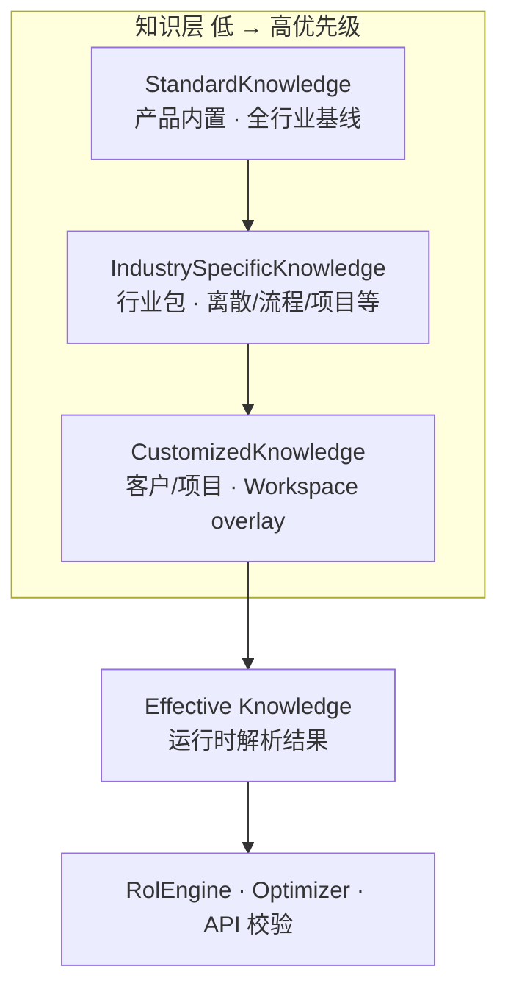
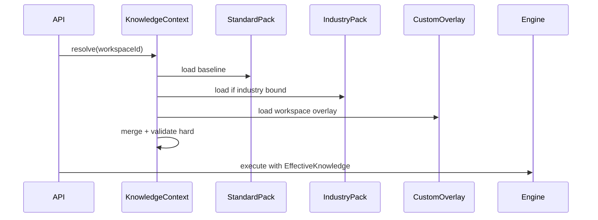
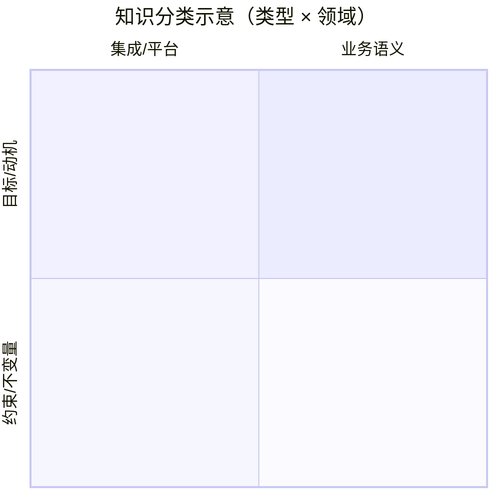

# 知识卷 · 业务知识分层与目录（§13 · §14）

> **§ 编号不变。**

---

<a id="s13-knowledge-layers"></a>

# §13 业务知识分层（Standard / Industry / Customized）

> **目标：** 内置 **StandardKnowledge**，按 **行业** 叠加 **IndustrySpecificKnowledge**，按 **客户/项目** 叠加 **CustomizedKnowledge**；计划行为由 **合并后的有效知识（Effective Knowledge）** 驱动。  
> **关联：** [§4 RULE-*](../../core/04-business-rules.md) · [§7 STD/CFG/CUST](../../core/07-standardization.md) · ADR-12

---

## 13.1 三层定义



| 层 | ID 前缀 | 载体 | 谁维护 | 典型内容 |
|----|---------|------|--------|----------|
| **标准** | `STD-KN-*` | SDD §3/§4/§8 + 代码默认 + 种子参数 | 产品/架构 | RULE-FF-01、PATH-ONT、PISPP 平衡、Session 生命周期 |
| **行业** | `IND-KN-{industry}-*` | 行业 Knowledge Pack（可安装） | 行业顾问 + 产品 | 默认 peg 策略、工艺模板约定、KPI 权重、启用 SCN 子集 |
| **定制** | `CUS-KN-{workspace}-*` | Workspace overlay + BusinessRules 表 | 实施 + 客户 | 采购周期表、并行工序、客户豁免、OTIF 阈值 |

**原则：** 高层 **可覆盖** 低层的 **参数与 soft 规则**；**不得** 静默削弱 Standard **hard** 规则（除非 Standard 自身声明「可行业配置」或走 **显式豁免** KN-EXEMPT）。

---

## 13.2 与现有 SDD  artifact 的映射

| 现有 artifact | 知识层 | 说明 |
|---------------|--------|------|
| **§4 RULE-*（hard）** | **Standard**（主） | 不变量；Industry/Custom **不可改陈述**，仅可配置 **豁免条件**（如 RULE-PLAN-01-E1/E2） |
| **§4 RULE-*（soft）** | Standard 默认 + Industry/Custom **覆盖权重/阈值** | 如 CapacityOverloadCost、延期惩罚 |
| **§4.6 BusinessRules 表（CFG）** | Standard 默认行 + **Customized** 主数据 | `material-lead-time`、parallel-operations 等 |
| **§3 SCN** | Standard 全集；Industry **启用/禁用/变体**；Custom **可选扩展 SCN** | 验收仍锚定 SCN ID |
| **§1 VAL/KPI** | Standard 目标；Industry/Custom **阈值** | 不改变 VAL 定义，只改目标值 |
| **§11 md_* / §12 txn_*** | 非 Knowledge | **数据**；Industry 可带 **种子主数据/交易样例**，不是规则本身 |
| **代码（OntologyLoader、Solver）** | 非 Knowledge | **引擎**；读 Effective Knowledge 配置 |

---

## 13.3 知识条目类型（KN-*）

| 类型 | 说明 | 示例 | 可覆盖性 |
|------|------|------|----------|
| **KN-RULE-PARAM** | 绑定 RULE-ID 的可配置参数 | `reservation_auto_policy` → RULE-FF-06 | Industry ✓ Custom ✓ |
| **KN-RULE-SOFT** | soft 规则权重/开关 | 超载 cost 倍数、延期惩罚系数 | Industry ✓ Custom ✓ |
| **KN-RULE-EXEMPT** | 豁免策略扩展 | 额外 MASTER_DATA_GAP 物料类 | Industry ✓ Custom ✓（须审计） |
| **KN-SCN-FLAG** | 场景启用/必选 | 流程行业关闭 SCN-07d 优化建供 | Industry ✓ |
| **KN-VAL-TARGET** | KPI 目标值 | OTIF 目标 95% → 92% | Custom ✓ |
| **KN-PROC** | 流程编排偏好 | ATP 后必须 CTP 才允许 confirm | Industry ✓ Custom ✓ |
| **KN-UI-HINT** | 文案/向导/字段显隐 | 行业术语「卷」vs「件」 | Industry ✓ Custom ✓ · **§17.10** |
| **KN-MASTER-SEED** | 行业默认主数据模板 | 离散装配默认 RT 结构 | Industry 包附带 |
| **KN-HARD** | hard 规则正文 | RULE-WS-01 | **仅 Standard**（变更 = 产品版本） |

---

## 13.4 优先级与冲突解析

### 13.4.1 合并顺序（Effective Knowledge）

```
Effective = merge(
  StandardKnowledge,           // baseline
  IndustryPack[industry_id],   // 若 Workspace 绑定行业
  CustomOverlay[workspace_id]  // 客户/项目
)
```

| 冲突类型 | 解析规则 |
|----------|----------|
| 同 KEY 参数 | **Custom > Industry > Standard** |
| Custom 试图关闭 hard RULE | **拒绝**（API 400 / 导入 FAILED），除非 KEY=`KN-RULE-EXEMPT` 且 Standard 允许 |
| Industry 与 Standard SCN 冲突 | Industry 只能 **disable 可选 SCN**，不能删除 Standard 必选 SCN（SCN-T03、SCN-T02 confirm 等） |
| 多 Custom 层（集团+工厂） | v2：`workspace_id` + 可选 `plant_id`；当前 v1：**单 Workspace overlay** |

### 13.4.2 与 §7 标签对齐

| §7 标签 | 知识层 |
|---------|--------|
| `[STD] [COMMON]` | StandardKnowledge |
| `[CFG] [COMMON]` | Standard 默认 + Customized 可改 |
| `[CFG] [SPECIFIC]` | Industry 或 Custom |
| `[CUST] [SPECIFIC]` | CustomizedKnowledge（优先 REFLOW? 评估） |

---

## 13.5 打包与交付

### 13.5.1 StandardKnowledgePack（内置）

| 属性 | 值 |
|------|-----|
| **pack_id** | `plantops-standard-v1` |
| **目录** | [§14 StandardKnowledge 目录](#s14-standard-catalog) · [knowledge/standard/](../../../knowledge/standard/) |
| **内容** | `catalog.yaml`（类型+领域）· `defaults/parameters.yaml` · SDD §1–§4、§8 |
| **发布** | 随产品版本 `1.0.0-SNAPSHOT` |

**类型体系（KN-TYPE-*）：** INV · OPT · MOT · EXM · PAR · INT · STR · PLT · SCN · VAL · AC — 详见 §14.2。

### 13.5.2 IndustrySpecificKnowledgePack（可安装）

```yaml
# knowledge/industries/discrete-assembly/pack.yaml（示例）
pack_id: ind-discrete-assembly-v1
extends: plantops-standard-v1
industry_id: DISCRETE_ASSEMBLY
version: 1.0.0
overlays:
  - key: KN-RULE-PARAM.reservation_auto_policy
    value: { demandAnchor: [INV, WO, DATE_ASC], ... }
  - key: KN-SCN-FLAG.SCN-07d
    enabled: true
  - key: KN-VAL-TARGET.VAL-01.otif_target_pct
    value: 93
  - key: KN-RULE-SOFT.RULE-MP-07.overload_cost_multiplier
    value: 1.5
seed_master_data: ./seeds/md_routing_templates.csv
```

| 行业示例 ID | 侧重 |
|-------------|------|
| `DISCRETE_ASSEMBLY` | 多阶 BOM、Firm WO、SCN-07 预留 |
| `PROCESS_BATCH` | 批次/连续产、罐区库存点 |
| `PROJECT_MTO` | 项目号、长周期 PO |

### 13.5.3 CustomizedKnowledgeOverlay（Workspace）

| 存储 | 说明 |
|------|------|
| **`knowledge_overlay`** 表 | JSON/YAML 片段：`overlay_key`, `value`, `source=CUSTOM`, `updated_by` |
| **BusinessRules 各 tab** | 已是 Customized 主要入口（§4.6） |
| **`system_parameter`** | Workspace 级参数覆盖 |

```yaml
# Workspace overlay 示例（存 DB）
workspace_id: WS-ACME
extends_industry: DISCRETE_ASSEMBLY
overlays:
  - key: KN-RULE-PARAM.material-lead-time.default_days
    value: 14
  - key: KN-RULE-EXEMPT.RULE-PLAN-01.E2.product_codes
    value: ["RAW-SPECIAL-*"]
```

---

## 13.6 运行时：KnowledgeContext



| 组件 | 职责 |
|------|------|
| **`KnowledgeRegistry`** | 注册 Standard + 已安装 Industry packs |
| **`KnowledgeResolver`** | merge + 缓存（per Workspace TTL） |
| **`KnowledgeValidator`** | 导入 overlay 时校验：不可破坏 hard RULE |
| **引擎接入点** | `RolEngine`、`PlanningOptimizerRegistry`、`MasterDataQualityService`、API 校验器 **只读 Effective** |

**Workspace 绑定：**

| 字段 | 说明 |
|------|------|
| `WorkspaceEntity.industry_id` | 可选；决定 Industry pack |
| `WorkspaceEntity.knowledge_pack_version` | Standard+Industry 版本 pin |
| `knowledge_overlay` | Custom 层 |

---

## 13.7 什么放哪一层（决策表）

| 问题 | Standard | Industry | Custom |
|------|----------|----------|--------|
| PEG 顺序 INV→WO→SH | ✓ RULE-FF-01 | 调整 **自动预留** 次序（soft） | 客户优先级表 |
| Session 必须 confirm 前 optimize | ✓ hard | ✗ | ✗ |
| 产能超载是否 hard | ✓ soft（RULE-MP-02） | 行业默认 cost 权重 | 工厂 KPI 阈值 |
| 采购周期 | ✓ RULE-MRP-04 算法 | 行业默认 `*` 行 seed | BusinessRules 表 |
| 是否启用 SCN-07 物料预留 | ✓ 定义 SCN | 流程行业可默认关闭 UI | 客户选配 |
| Firm WO 定义 | ✓ RULE-TX-04 | ✗ | MES 映射字段 |
| 主数据 MD-Q 结构规则 | ✓ RULE-MD-07~13 | 行业额外 WARN | ✗ |
| 前端术语/字段 | 通用文案 | 行业 pack | 客户 logo/字段 |

---

## 13.8 治理与 REFLOW

| 活动 | 规则 |
|------|------|
| **REFLOW** | Custom `[REFLOW?]` → 评估进入 Industry → 再进入 Standard（§7） |
| **版本** | Industry pack semver；Workspace pin `knowledge_pack_version` |
| **审计** | Custom overlay 变更写 `planning_event` / audit log |
| **测试** | 每层 pack 带 `@SpecRef` 子集；Effective 合并测试（AC-KN-*） |
| **文档** | Standard 变更 = SDD PR；Industry = pack CHANGELOG；Custom = 实施说明 |

---

## 13.9 目录结构（目标仓库）

```
docs/sdd/
  core/                            # StandardKnowledge 规范正文 §0–§10
  volumes/
    data/                          # §11–§12
    knowledge/                     # §13–§16
    platform/                      # §17–§19
knowledge/
  standard/
    pack.yaml                      # plantops-standard-v1  manifest
    defaults/                      # 默认 CFG 值
  industries/
    discrete-assembly/
      pack.yaml
      overlays/
      seeds/
    process-batch/
      pack.yaml
src/main/resources/knowledge/      # 运行时加载 Standard+Industry
```

Customized：**DB** `knowledge_overlay` + 现有 BusinessRules 表（不随 git 发布）。

---

## 13.10 与主数据/交易分层的关系

| 分层 | 回答的问题 |
|------|------------|
| **§13 Knowledge** | **怎么做**（规则、策略、阈值、流程） |
| **§11 md_*** | **用什么工艺/资源结构** |
| **§12 txn_*** | **当前订单/工单/库存事实** |
| **§5 ENT-OG** | **运行时推演状态** |

装载 OG：`txn_*` + `md_*` + **EffectiveKnowledge** → Loader/Restorer。

---

## 13.11 实施路线（TODO-15）

| 阶段 | 交付 | 状态 |
|------|------|------|
| **K0** | `KnowledgeContext` 读 Standard defaults + BusinessRules（= Custom CFG） | **已完成** · `KnowledgeResolver` · `ParameterRegistry` 接 Effective |
| **K1** | `Workspace.industry_id` + 1 个 Industry pack（discrete-assembly） | **已完成** · `V75` · `DISCRETE_ASSEMBLY` |
| **K2** | `knowledge_overlay` 表 + 导入校验（KN validator） | **已完成** · `KnowledgeOverlayService` · `GET/POST /api/v1/knowledge/*` |
| **K3** | Optimizer / FF-06 / MRP-04 全改读 Effective | **已完成 2026-07-03** · `MaterialLeadTimeKnowledgeService` · `ReservationAutoPolicyService` |
| **K4** | Industry pack 安装 CLI + AC-KN-* | **已完成 2026-07-03** · `POST /api/v1/knowledge/industry/{id}/install` |

---

**回指：** [04-business-rules.md](../../core/04-business-rules.md) · [07-standardization.md](../../core/07-standardization.md) · [10-decisions-risks.md](../../core/10-decisions-risks.md) ADR-12

---

<a id="s14-standard-catalog"></a>

# §14 StandardKnowledge 目录（按类型分类）

> **pack_id：** `plantops-standard-v1` · **机器可读：** [knowledge/standard/catalog.yaml](../../../knowledge/standard/catalog.yaml)  
> **归属：** 仅 **StandardKnowledge** 层（ADR-12）；Industry/Custom **不得**修改 KN-TYPE-INV / KN-TYPE-PLT / KN-TYPE-INT hard 陈述  
> **正文：** 规则详细陈述仍在 [§4](../../core/04-business-rules.md)；本节为 **分类索引与覆盖策略**

---

## 14.1 两维分类模型

每条 Standard 知识用 **两个正交维度** 描述：



| 维度 | 前缀 | 回答的问题 |
|------|------|------------|
| **知识类型（Type）** | `KN-TYPE-*` | **是什么性质**的知识？（不变量、参数、动机…） |
| **业务领域（Domain）** | `DOM-*` | **作用在哪个子系统**？（满足链、MRP、主计划…） |

**STD-KN 条目 ID：** `STD-KN-{RULE-ID}`，与 §4 `RULE-*` 1:1（废止规则除外）。

---

## 14.2 知识类型（KN-TYPE-*）

| 类型 ID | 名称 | 定义 | Standard 载体 | Industry 可覆盖 | Custom 可覆盖 |
|---------|------|------|---------------|-----------------|---------------|
| **KN-TYPE-INV** | 不变量 | hard；违反则拒绝/不可行 | §4 RULE hard | ✗ | ✗ |
| **KN-TYPE-OPT** | 优化目标 | soft；最小化惩罚 | §4 RULE soft | 权重 ✓ | 权重 ✓ |
| **KN-TYPE-MOT** | 行为动机 | 实体主动寻供/寻需/建 SO | §4.1.1 · MRP-05 soft | 策略 ✓ | 策略 ✓ |
| **KN-TYPE-EXM** | 豁免 | 允许在条件下不满足 soft/hard | RULE-PLAN-01-E* | 扩展 ✓ | 扩展 ✓ |
| **KN-TYPE-PAR** | 参数默认 | CFG 默认值，绑定 RULE | §4.6 · §7.3 · `defaults/` | 默认 ✓ | **主配置** ✓ |
| **KN-TYPE-INT** | 集成门禁 | External→internal 同步/质检 | RULE-MD/TX · RULE-PERS | ✗ | ✗ |
| **KN-TYPE-STR** | 结构约束 | 主数据/交易图结构完整性 | RULE-MD-07~13 · TX-07~09 | ✗ | ✗ |
| **KN-TYPE-PLT** | 平台 | WS / Session / OG 生命周期 | §4.0 · SES · PERS | ✗ | ✗ |
| **KN-TYPE-SCN** | 场景 | 用户可观察行为（GWT） | §3 | 启用/禁用 ✓ | 扩展 ✓ |
| **KN-TYPE-VAL** | 价值/KPI | 业务目标定义 | §1 | 阈值 ✓ | 阈值 ✓ |
| **KN-TYPE-AC** | 验收 | 可机械判定断言 | §8 | ✗ | ✗ |

### 14.2.1 类型与 `overridable` 枚举

| overridable | 含义 | 对应类型 |
|-------------|------|----------|
| **none** | 不可 overlay | INV, INT, STR, PLT |
| **param** | 仅改参数值 | PAR |
| **soft** | 改权重/开关 | OPT, 部分 MOT |
| **exempt** | 改豁免集合 | EXM |

---

## 14.3 业务领域（DOM-*）

| 领域 ID | 名称 | §4 章节 | 核心 ENT |
|---------|------|---------|----------|
| **DOM-PLT** | 平台 | §4.0 · §4.3 · PERS | ENT-WS · ENT-SES · ENT-OG |
| **DOM-FF** | 满足链 | §4.1 · §4.1.2 | ENT-DEM · ENT-FF · ENT-COLD |
| **DOM-MRP** | 物料/MRP | §4.4 | ENT-PISPP · ENT-SO |
| **DOM-MP** | 主计划/产能（≈ **MOD-OCP** / PROC-S04） | §4.2 · §4.5.1 | ENT-OP · ENT-SRP · **ENT-RCA** · ENT-PRP · RULE-SUP-05 |
| **DOM-RT** | 工艺模板 | §4.5 · §4.5.1 | ENT-RT · ENT-RS/* · RULE-SUP-02~04 |
| **DOM-MD** | 主数据集成 | §4.12 | md_* · external_* |
| **DOM-TX** | 交易集成 | §4.13 | txn_* · Firm SO |
| **DOM-PER** | 持久化 | PERS | ont_* · revision |

---

## 14.4 按类型汇总（Standard RULE 注册表）

### KN-TYPE-INV · KN-TYPE-PLT · KN-TYPE-INT · KN-TYPE-STR（不可 overlay）

| RULE | 领域 | 摘要 |
|------|------|------|
| RULE-WS-01 | PLT | Workspace 隔离 |
| RULE-SES-01~04 | PLT | Session / 权威图 |
| RULE-PERS-01~05 | PLT/PER | Ontology 持久化 |
| RULE-FF-01~06, 08 | FF | 挂接、预留 hard |
| RULE-MRP-01~04 | MRP | 路径、PISPP 一致、scoped |
| RULE-MP-01, 03, 04, 06, 08 | MP/RT | 资源、BOM 序、routing 序、并行 |
| RULE-RT-01 | RT | 物化一致 |
| RULE-MD-01~05, 07~13 | MD | 集成 + 结构 |
| RULE-TX-01~10 | TX | 交易集成 + Firm |

### KN-TYPE-OPT · KN-TYPE-MOT（可 soft overlay）

| RULE | 领域 | 摘要 |
|------|------|------|
| RULE-MP-02, 05, 07 | MP | 超载、延期 soft |
| RULE-FF-07 | FF | 预留预警 |
| RULE-FF-09, 10 | FF | Demand/Supply 动机 |
| RULE-MRP-05 | MRP | PISPP 平衡 + 消缺动机 |
| RULE-MD-06 | MD | WARNING 留痕 |
| RULE-RT-02 | RT | 首末道 IM/OM（soft 约定） |
| RULE-DEM-03 | FF | 交期策略分段惩罚 |
| RULE-DEM-05 | FF | 订单齐套 |

### KN-TYPE-INV · KN-TYPE-PAR — 供需 Standard（§16）

| RULE | 领域 | 摘要 |
|------|------|------|
| RULE-DEM-01 | FF | 订单优先级 |
| RULE-DEM-02 | FF | 交付容差 |
| RULE-DEM-04 | FF | PPQ |
| RULE-SUP-01 | MRP | LotSize / Min / Max |
| RULE-SUP-02~04 | RT | 工序时间 / 资源 Batch / 良率 |
| RULE-SUP-05 | MP | ResourceEfficiency |

### KN-TYPE-EXM

| RULE | 豁免 |
|------|------|
| RULE-PLAN-01 | E1 主数据缺口 · E2 物料短缺（采购边界内） |

### KN-TYPE-PAR（见 `knowledge/standard/defaults/parameters.yaml`）

| param_key | RULE | 默认值 |
|-----------|------|--------|
| `material-lead-time` | MRP-04 | `*` 行 7 天 |
| `operation-transfer-time` | MP-06 | BusinessRules tab |
| `parallel-operations` | MP-08 | BusinessRules tab |
| `capacity_overload_threshold_pct` | MP-07 | 110 |
| `reservation_auto_policy` | FF-06 | RULE-FF-06 默认序 |
| `default_procurement_lead_time_days` | MRP-04 | 7 |
| `ontology_period_sequence` | — | 14x1d,4x1w,2x1m |
| `planning_optimizer_engine` | — | ortools |

---

## 14.5 按领域汇总

| 领域 | RULE 数量 | 类型分布 |
|------|-----------|----------|
| **DOM-PLT** | 9 | INV+PLT 为主 |
| **DOM-FF** | 12+5 | INV + MOT + EXM + DEM |
| **DOM-MRP** | 5 | INV + MOT + PAR |
| **DOM-MP** | 8 | INV + OPT + PAR |
| **DOM-RT** | 2 | INV + OPT |
| **DOM-MD** | 13 | INT + STR |
| **DOM-TX** | 10 | INT + STR |
| **DOM-PER** | 5 | INT + PLT |

---

## 14.6 关联 artifact（Standard 非 RULE）

| artifact | 类型 | 位置 |
|----------|------|------|
| SCN-01a~h, SCN-02~07, SCN-T01~T07 | KN-TYPE-SCN | §3 |
| VAL-01~06 | KN-TYPE-VAL | §1 |
| KPI-MP-S01~S08 | KN-TYPE-VAL | §15 主计划评分 |
| KPI-MP-C01~C10 | KN-TYPE-VAL | §15 主计划约束 |
| KPI-MP-B01~B10 | KN-TYPE-VAL | §15 主计划业务展示 |
| KPI-MP-TOT | KN-TYPE-VAL | §15 Total 聚合 |
| AC-01~27, AC-MD-*, AC-TX-*, AC-PERS-* | KN-TYPE-AC | §8 |
| ENT-* 术语 | —（模型，非知识） | §2 · §5 |
| API-* | —（契约） | §6 |

---

## 14.7 StandardKnowledgePack 文件布局

```
knowledge/standard/
  pack.yaml              # manifest
  catalog.yaml           # RULE 注册表（类型+领域+overridable）
  defaults/
    parameters.yaml      # KN-TYPE-PAR 默认值
docs/sdd/
  core/04-business-rules.md        # 规范正文（陈述）
  volumes/knowledge/13-14-business-knowledge.md  # §14 本目录
```

**加载顺序：** `pack.yaml` → `catalog.yaml` → `defaults/*` → merge §4 正文（人工/CI 校验一致）。

---

## 14.8 治理

| 变更 | 要求 |
|------|------|
| 新增 RULE | 同时更新 §4 + `catalog.yaml` + 本节汇总表 |
| 改 hard 陈述 | 产品 minor 版本 + ADR（若架构级） |
| 改 PAR 默认 | 仅 `defaults/parameters.yaml` + §7.3 |
| 废止 | `catalog.yaml` → `deprecated` + §4.7 |

---

**回指：** [13-business-knowledge-layers.md](#s13-knowledge-layers) · [04-business-rules.md](../../core/04-business-rules.md) · [07-standardization.md](../../core/07-standardization.md)