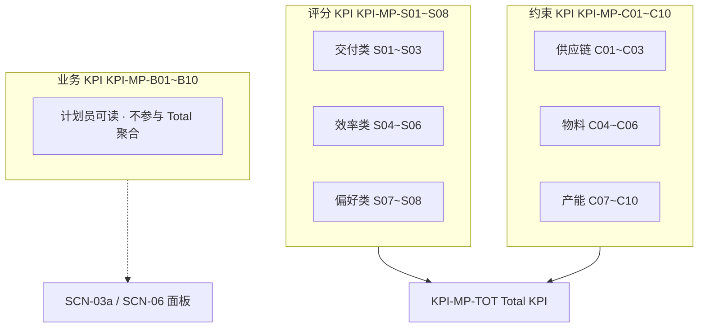
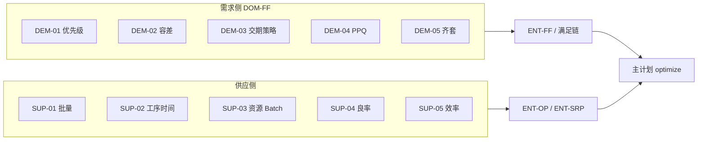

# 知识卷 · 计划知识（§15 · §16）

> **§ 编号不变。** §15 PROC-S04 KPI · §16 Standard 供需知识。

---

# §15 主计划核心 KPI（PROC-S04）

> **参考：** Company Planner《How to interpret Supply Chain Business Goals and KPIs》v2（`CP-Interpret-Business-Goals-KPIs-v2.md`）  
> **范围：** **PROC-S04** 主计划求解 / `PlanningOptimizer`（SCN-06、SCN-T01、SCN-01b CTP）；**MOD-OCP** 模块 UI 消费本节 KPI；不含 S05 细排分钟级 KPI  
> **与 §1 关系：** §1 **VAL-01~05** 为业务结果型 KPI；本节定义 **求解器侧** 评分/约束 KPI 及 **计划员可读** 业务 KPI，二者通过下表对齐

---

## 15.1 CP 业务目标 → 本产品 VAL

| CP 业务目标 | 本产品 VAL | 主计划中的体现 |
|-------------|-----------|----------------|
| 提高客户服务 | VAL-01 | 交期可视、部分履约、提前预警延期 |
| 提高交付性能 | VAL-01, VAL-02 | 最小化 COLD 延迟；PlanningRun 产出可承诺 ENT-PV |
| 减少库存 | VAL-04 | JIT 倾向、降低 PISPP 超储与 WIP |
| 提高吞吐量 | VAL-05 | 瓶颈 ENT-SRP 高利用、减少闲置 |
| 提高盈利能力 | VAL-05（间接） | 偏好 Firm 供、低成本路径（v1 简化） |

> CP「提高盈利能力」在 v1 不单独设 VAL；通过 **偏好类评分 KPI** 与 **利用率** 间接体现。

---

## 15.2 KPI 三层模型（对齐 CP）



| 层级 | ID 前缀 | 数量 | 作用 | 参与 Total KPI |
|------|---------|------|------|----------------|
| **评分 KPI** | `KPI-MP-S*` | 8 | 引导优化器权衡业务目标 | ✓ |
| **约束 KPI** | `KPI-MP-C*` | 10 | 避免物理不可行；权重远高于评分 | ✓ |
| **业务 KPI** | `KPI-MP-B*` | 10 | 计划员熟悉术语解读方案 | ✗ |

**时间衰减（CP 通则）：** 同一 KPI 在 **近期 ENT-PER** 的违规惩罚权重 **高于** 远期（实现：`periodDecay^periodIndex`，Industry/Custom 可配 `KN-VAL-TARGET`）。

---

## 15.3 Total KPI 聚合域（KPI-MP-TOT）

Total KPI 由六域子分求和（越小越优，与 CP 一致）：

| 聚合域 | CP 名称 | 本产品 DOM | 组成 KPI |
|--------|---------|------------|----------|
| **交付链** | Delivery Chain | DOM-MP-DEL | S01, S02, S03 |
| **物料规划** | Material Planning | DOM-MP-MAT | C01~C06, S03, S04（部分） |
| **产能规划** | Capacity Planning | DOM-MP-CAP | C07~C10, S06 |
| **供应** | Supply | DOM-MP-SUP | S04, S07 |
| **偏好** | Preference | DOM-MP-PREF | S07, S08 |
| **Total** | Total KPI | — | 以上加总 |

**求解输出：** `ENT-PV.optimizerScoreSummary` 须可分解为上述域（TODO-16）；`hardScore=0` 等价于 **全部 hard 约束 KPI（C* hard 子集）= 0**。

---

## 15.4 评分 KPI（KPI-MP-S01~S08）

### 15.4.1 交付类

| ID | 名称 | 优化目标 | 单位 | VAL | RULE / ENT | 公式（CP 对齐） |
|----|------|----------|------|-----|------------|-----------------|
| **KPI-MP-S01** | 交付性能得分 | 最小化延迟及延迟时长 | 权重×延迟天 | VAL-01 | RULE-MP-05 · **RULE-DEM-03** · ENT-COLD | early/late 窗口分段惩罚 |
| **KPI-MP-S02** | 交付履约得分 | 最大化履约量 | 权重×缺口 | VAL-01 | **RULE-DEM-02** · ENT-FF | min/max 容差带 |
| **KPI-MP-S03** | 库存 adherence 得分 | 最小化库存目标未达 | 权重×覆盖缺口天 | VAL-01, VAL-04 | ENT-PISPP · safety/target stock | 低于安全库存惩罚 > 介于 min~target；缺口天 = 库存覆盖天数差 |

### 15.4.2 效率类

| ID | 名称 | 优化目标 | 单位 | VAL | RULE / ENT | 公式（CP 对齐） |
|----|------|----------|------|-----|------------|-----------------|
| **KPI-MP-S04** | 供应持有得分 | 最小化库存持有 | 权重×持有天 | VAL-04 | ENT-PISPP · PEG-INV | `Σ supply( coef × qty × holdingDays^exp )`；FIFO 消耗；权重 **低于** S03 |
| **KPI-MP-S05** | 在制品持有得分 | 最小化 WIP 等待 | 权重×额外 lead time | VAL-03, VAL-04 | ENT-OP 相邻间隙 · RULE-MP-06 | `Σ op( coef × inputQty × extraLeadTime^exp )`；大间隔重罚、小间隔容忍 |
| **KPI-MP-S06** | 资源利用率得分 | 最大化 ENT-SRP 利用 | 权重×闲置产能 | VAL-05 | ENT-SRP · RULE-MP-02 | `Σ srpPeriod( unusedCapacity/total × scorePerPct )`；近期 period 权重更高 |

### 15.4.3 偏好类

| ID | 名称 | 优化目标 | 单位 | VAL | RULE / ENT | 公式（CP 对齐） |
|----|------|----------|------|-----|------------|-----------------|
| **KPI-MP-S07** | 供应偏好得分 | 优先 Firm / 低成本路径 | 权重×horizon 天 | VAL-05 | Firm SO · txn WO · flex SO | Firm 供 **零罚**；flex 供越晚规划罚越低；路径 cost × qty × days^exp |
| **KPI-MP-S08** | 供应质量得分 | 最小化特性偏差 | 权重×质量偏差 | — | **v1 N/A** | 特性规划场景；默认权重 0 |

---

## 15.5 约束 KPI（KPI-MP-C01~C10）

> **权重原则：** 约束 KPI 权重 **远高于** 评分 KPI；近期违规权重更高。  
> **本产品 hard/soft 划分：** 下列「实现」列标注当前 ADR；与 CP 差异见 §15.7。

| ID | 名称 | CP 分类 | 优化目标 | VAL | RULE / ENT | 实现 |
|----|------|---------|----------|-----|------------|------|
| **KPI-MP-C01** | 缺失上游供应 | 供应链 | 最小化未履约需求 | VAL-01, VAL-04 | RULE-MRP-05 · ENT-FF · PEG-SH | hard（物料闭合 RULE-MP-04） |
| **KPI-MP-C02** | 无效上游供应 | 供应链 | 最小化约束违规供应 | VAL-01 | ENT-FF peg 合法性 | hard |
| **KPI-MP-C03** | 上游供应延迟 | 供应链 | 工序不得早于物料到达 | VAL-03 | ENT-OP start · ENT-PISPP | hard |
| **KPI-MP-C04** | 超量分配需求 | 物料 | 需求预留 ≤ 要求量 | VAL-04 | ENT-FF reservedQty | hard |
| **KPI-MP-C05** | 超量使用供应 | 物料 | 供应分配 ≤ 可用量 | VAL-04 | ENT-SO output · inventory | hard |
| **KPI-MP-C06** | 部分分配件 | 物料 | 不可分割批量违规 | — | **RULE-DEM-04 PPQ** · **RULE-SUP-01 lotSize** | hard（有 lot/ppq 时） |
| **KPI-MP-C07** | 资源产能过载 | 产能 | 最小化 SRP 过载 | VAL-05 | RULE-MP-07 · **ENT-SRP** · ENT-RCA | **soft**（见 §15.7） |
| **KPI-MP-C08** | Campaign 过载 | 产能 | Campaign 资源过载 | — | — | **v1 范围外** |
| **KPI-MP-C09** | 缺失产能消耗 | 产能 | 最小化未排程工序 | VAL-02 | 未分配 ENT-OP | soft→hard 可配置 |
| **KPI-MP-C10** | 产能消耗分散 | 产能 | 最小化跨 period 拉长 | VAL-03 | ENT-OP 跨槽位分散 | soft |

**公式（C07，CP）：** `Σ srpPeriod( overloadPct × costPerPct )`，其中 `costPerPct = overloadQty × duration^exp × decay^periodIdx`。

---

## 15.6 业务 KPI（KPI-MP-B01~B10）

> 供 **SCN-03a 产能平衡**、**SCN-06 主计划结果**、**SCN-02 需求满足** 展示；**不参与** Total KPI 计算。

| ID | 名称 | 度量方式 | VAL | 场景 | 数据源 |
|----|------|----------|-----|------|--------|
| **KPI-MP-B01** | 计划 OTIF 率 | 计划完工 ≤ promise 的 COLD 占比 | VAL-01 | SCN-02a, SCN-06 | ENT-COLD rollup |
| **KPI-MP-B02** | 计划延期订单数 | latestDesired 后完工的 COLD 数 | VAL-01 | SCN-02a | ENT-OP plannedEnd |
| **KPI-MP-B03** | 承诺交期偏差 P95（天） | planned vs promiseDate | VAL-01 | SCN-01d | ENT-COLD |
| **KPI-MP-B04** | 瓶颈资源利用率 | max(SRP reserved/total) | VAL-05 | SCN-03a | ENT-SRP |
| **KPI-MP-B05** | 超载 period 占比 | overload>0 的 **SRP** 数 / 总 leaf SRP | VAL-05 | SCN-03a | ENT-SRP · RULE-MP-07 |
| **KPI-MP-B06** | 制造周期 P95（天） | OP plannedEnd−Start | VAL-03 | SCN-05a | ENT-OP |
| **KPI-MP-B07** | 工序间等待占比 | 相邻 OP 间隙 / makespan | VAL-03 | SCN-06 | ENT-OP |
| **KPI-MP-B08** | 物料缺口 period 数 | PISPP stockShortage>0 的 period 计数 | VAL-04 | SCN-04a, SCN-07a | ENT-PISPP |
| **KPI-MP-B09** | 未排程工序数 | 无 **ENT-RCA** 分配的 ENT-OP | VAL-02 | SCN-06-E1 | ENT-OP · ENT-RCA |
| **KPI-MP-B10** | 主计划求解耗时 | optimize 端到端 ms | VAL-02 | SCN-06, SCN-T01 | ENT-PV.solveDurationMs |

**CFG 阈值：** `capacity_overload_threshold_pct`（默认 110%）用于 B05 **展示**告警，与 C07 求解 soft 分离。

---

## 15.7 与 CP 的差异（ intentional ）

| 主题 | CP | 本产品 | 理由 |
|------|-----|--------|------|
| **产能过载 C07** | 约束 KPI（高权重） | **soft**（RULE-MP-02/07 CapacityOverloadCost） | SCN-06-E2：产能不足仍产出 planVersion；计划员在 SCN-03a 识别 overload |
| **Campaign C08** | 约束 KPI | v1 不支持 | 无 Campaign 资源模型 |
| **供应质量 S08** | 评分 KPI | 权重 0 | 无特性规划 |
| **hard score** | 多约束硬不可行 | `hard=0` + soft Total 最小 | Timefold HardSoft / OR-Tools 分层 |
| **销售预算** | CP 外流程 | 不在 PROC-S04 | §1 范围 |

---

## 15.8 KPI ↔ 规则 ↔ 验收 追溯

| KPI 簇 | 关键 RULE | AC |
|--------|-----------|-----|
| S01, S02, B01~B03 | RULE-MP-05, RULE-FF-01 | AC-04 |
| S03, S04, B08 | RULE-MP-04, RULE-MRP-05 | AC-04, AC-MAT-* |
| S05, B06~B07 | RULE-MP-06, RULE-MP-08 | AC-04 |
| S06, C07, B04~B05 | RULE-MP-02, RULE-MP-07 | AC-04, SCN-03a |
| C01~C06 | RULE-MP-04, RULE-MRP-* | AC-04 |
| C09~C10 | RULE-MP-01 | AC-04 |
| B10 | — | NFR-01, VAL-02 |

---

## 15.9 API 与持久化（规范目标）

| 字段 | 位置 | 说明 |
|------|------|------|
| `totalKpi` | `PlanVersionEntity` / API-MP result | KPI-MP-TOT 标量 |
| `kpiBreakdown` | 同上 | `{ delivery, material, capacity, supply, preference, scoring[], constraint[] }` |
| `businessKpis` | GET master-plan/kpis/{versionId} | KPI-MP-B01~B10 |
| `scoreSummary` | 现有 `optimizerScoreSummary` | 人类可读；逐步结构化（TODO-16） |

---

## 15.10 知识分层

| 层级 | 可 overlay |
|------|------------|
| KPI **定义**（本节 ID、公式） | Standard only |
| KPI **权重 / 指数 / 衰减** | Industry ✓ · Custom ✓（`KN-VAL-TARGET.KPI-MP-S*.weight`） |
| KPI **目标阈值**（B* baseline/target） | Custom ✓（§0 闸口实测） |
| C07 soft vs hard | **不可**改为 hard silent（须 ADR） |

**注册：** `KN-TYPE-VAL` · DOM-MP · 见 [§14](./13-14-business-knowledge.md#s14-standard-catalog)

---

**回指：** [01-value-goals.md](../../core/01-value-goals.md) · [04-business-rules.md](../../core/04-business-rules.md#42-主计划规则) · [03-scenarios.md](../../core/03-scenarios.md) · CP 参考 `OTD/Reference/CP-Interpret-Business-Goals-KPIs-v2.md`

---

# §16 Standard 供需知识（Demand & Supply）

> **pack_id：** `plantops-standard-v1` · **机器可读：** [knowledge/standard/demand-supply/catalog.yaml](../../../knowledge/standard/demand-supply/catalog.yaml)  
> **规则正文：** [§4.1.2 需求侧](../../core/04-business-rules.md#412-需求侧-standard-知识demand) · [§4.5.1 供应侧](../../core/04-business-rules.md#451-供应侧-standard-知识supply)  
> **归属：** StandardKnowledge（ADR-12）；Industry/Custom 可 overlay **规则表行** 与 **soft 权重**，hard 陈述不可改

---

## 16.1 总览

| 侧 | RULE | 数量 | DOM | 主 BusinessRules tab |
|----|------|------|-----|----------------------|
| **需求** | RULE-DEM-01~05 | 5 | DOM-FF | demand-priority-rules, delivery-date-strategy, ppq-rules |
| **供应** | RULE-SUP-01~05 | 5 | DOM-MRP / DOM-RT / DOM-MP | supply-quantity-rules, routing-step-timing, routing-step-resource |



---

## 16.2 需求侧知识条目

| STD-KN | RULE | KN-TYPE | overridable | 摘要 |
|--------|------|---------|-------------|------|
| STD-KN-DEM-01 | RULE-DEM-01 | INV, PAR | param | 客户等级、产品属性等 → priorityScore |
| STD-KN-DEM-02 | RULE-DEM-02 | INV | none | target/min/max；库存≥min 停增供 |
| STD-KN-DEM-03 | RULE-DEM-03 | OPT, PAR | soft | 日/周交付；提前/延后分段惩罚 → KPI-MP-S01 |
| STD-KN-DEM-04 | RULE-DEM-04 | INV, PAR | param | PPQ 整数倍 peg / 建 SO |
| STD-KN-DEM-05 | RULE-DEM-05 | OPT | soft | 同 CO 下 COL 齐套交付 |

### 16.2.1 `demand-priority-rules`（RULE-DEM-01）

| 列 | 类型 | 说明 |
|----|------|------|
| `dimension` | enum | CUSTOMER_GRADE \| PRODUCT_ATTR \| ORDER_TYPE \| REQUESTED_DATE \| HEADER_PRIORITY |
| `matchCustomerGrade` | string? | A/B/C… |
| `matchProductCode` | string? | `*` 通配 |
| `matchProductAttr` | string? | 自定义属性键值 |
| `weight` | decimal | 维度权重 |
| `rank` | int | 该匹配下的 rank（越小越优先） |

### 16.2.2 交付容差（RULE-DEM-02）

| 实体字段 | 来源 |
|----------|------|
| `targetQuantity` | COLD.deliveryQty |
| `minDeliveryQuantity` | txn `delivery_min_qty`；缺省 = target |
| `maxDeliveryQuantity` | txn `delivery_max_qty`；缺省 = target |

### 16.2.3 `delivery-date-strategy`（RULE-DEM-03）

| 列 | 说明 |
|----|------|
| `matchCustomerCode` / `matchProductCode` | 匹配键 |
| `deliveryGranularity` | DAILY \| WEEKLY |
| `earlyAllowDays` | 允许提前天数 |
| `lateAllowDays` | 允许延后天数（窗口内低罚） |
| `earlyPenaltyCoef` / `latePenaltyCoef` | soft 系数（Industry overlay） |

---

## 16.3 供应侧知识条目

| STD-KN | RULE | KN-TYPE | overridable | 摘要 |
|--------|------|---------|-------------|------|
| STD-KN-SUP-01 | RULE-SUP-01 | INV, PAR | param | lotSize；min SKIP/PLAN_AT_MIN；max 拆单 |
| STD-KN-SUP-02 | RULE-SUP-02 | INV, PAR, STR | param | 前处理/调度/生产/后处理 → OP |
| STD-KN-SUP-03 | RULE-SUP-03 | INV, PAR | param | 资源优先级、速度、Single/Batch |
| STD-KN-SUP-04 | RULE-SUP-04 | INV, STR | none | yieldRate 放大投料 / MRP |
| STD-KN-SUP-05 | RULE-SUP-05 | INV, PAR | param | ResourceEfficiency × 有效产能 |

### 16.3.1 `supply-quantity-rules`（RULE-SUP-01）

| 列 | 说明 |
|----|------|
| `productCode` / `stockingPointCode` | 匹配 |
| `lotSize` | 批量倍数 |
| `minQuantity` | 最小工单量 |
| `maxQuantity` | 单 WO 上限 |
| `minQtyStrategy` | SKIP \| PLAN_AT_MIN |

### 16.3.2 `routing-step-timing`（RULE-SUP-02）

| 列 | 说明 |
|----|------|
| `routingCode` / `sequenceNo` | 定位 RS |
| `preProcessingMinutes` | 前处理 |
| `schedulingSpaceMinutes` | 调度缓冲 |
| `productionMinutes` | 基准生产（与 RSOSR 速度联动） |
| `postProcessingMinutes` | 后处理 |

### 16.3.3 `routing-step-resource`（RULE-SUP-03）

| 列 | 说明 |
|----|------|
| `standardResourceCode` | 资源 |
| `resourcePriority` | 优先级 |
| `productionRate` | qty / 分钟 |
| `resourceUsageType` | SINGLE \| BATCH |
| `batchSize` | BATCH 一批 max qty |
| `batchDurationMinutes` | BATCH 整批时间 |

### 16.3.4 ResourceEfficiency（RULE-SUP-05）

```
effectiveAvailable = (calendarMinutes − downTime − schedulerFeedback) × resourceEfficiency
```

| 字段 | 表 |
|------|-----|
| `resource_efficiency` | md_standard_resource, md_resource_group |
| SchedulerFeedback | 细排反馈表（S05 → SRP 占用，TODO-17） |

---

## 16.4 与 §15 KPI 对齐

| KPI | 需求/供应 RULE |
|-----|----------------|
| KPI-MP-S01 交付性能 | RULE-DEM-03 分段惩罚 |
| KPI-MP-S02 交付履约 | RULE-DEM-02 min/max |
| KPI-MP-C06 部分分配件 | RULE-DEM-04 PPQ · RULE-SUP-01 lotSize |
| KPI-MP-B04~B05 产能 | RULE-SUP-05 effective 容量 |

---

## 16.5 文件布局

```
knowledge/standard/
  demand-supply/
    catalog.yaml          # DEM/SUP RULE 注册
  defaults/
    demand-supply-rules.yaml   # tab 列定义与默认值
docs/sdd/core/04-business-rules.md    # §4.1.2 · §4.5.1 陈述
  volumes/knowledge/15-16-planning-knowledge.md  # §16 本目录
```

---

**回指：** [§14 Standard 目录](./13-14-business-knowledge.md#s14-standard-catalog) · [§11 主数据](../data/11-12-external-data.md#s11-external-master) · [§12 交易](../data/11-12-external-data.md#s12-external-transactional)