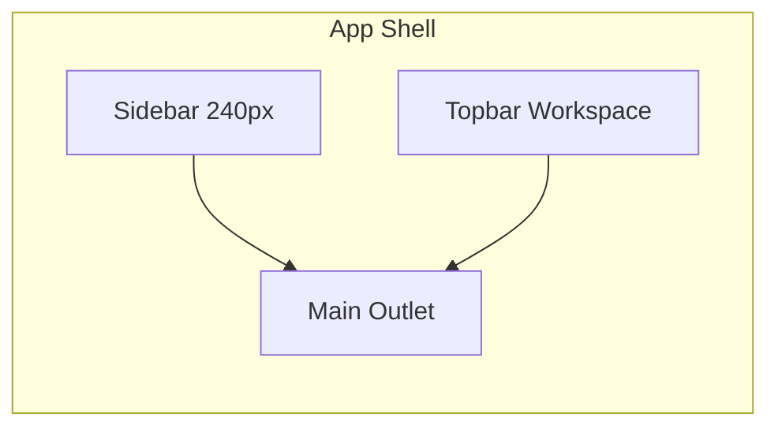

# §17 UI/UX 规范

> **范围：** Plant Operation Plan Web SPA（`frontend/` · HashRouter）  
> **原则：** 界面是 **ENT-OG / DTO 投影** 的只读或可配置入口，**不是** JPA 表或求解器中间结构的镜像（ADR-03 · ADR-06 · ADR-08）  
> **追溯：** SCN → UI-PAGE → API（§6）；验收见 §17.12 · §8 AC-UI-*

---

## 17.1 设计原则

| ID | 原则 | 说明 |
|----|------|------|
| **UI-P-01** | 本体优先 | 满足链、甘特、物料视图消费 **DTO-FC / Operation 快照 / PISPP**；禁止恢复实体路径诊断 Panel（ADR-03） |
| **UI-P-02** | COLD 主粒度 | 列表、右键菜单、ATP/CTP 均以 **ENT-COLD**（`deliveryId`）为选中根；COL 为行级属性 |
| **UI-P-03** | Workspace 上下文 | 顶栏 **WorkspaceSelector** 切换 ENT-WS；所有 API 带 `X-Workspace-Id`（RULE-WS-01） |
| **UI-P-04** | 场景驱动分析 | 订单协同计划（OCP）分析页共享 **PlanContext** 场景；切换场景重载 `activePlanVersionId` |
| **UI-P-05** | 规范锚定 | 页面行为以 **SCN** 为准；实现差距标注 `[GAP]`，不反向改 SCN |
| **UI-P-06** | 信号而非堆栈 | 计划异常用 **PlanningSignalBadge** + 状态 badge；不向业务用户暴露 solver stack trace |

---

## 17.2 信息架构与路由

**路由基座：** `/#/{path}`（HashRouter）

### 17.2.1 导航树（规范目标 · 对齐 §19）

> **现状：** 侧栏由 `workspaceNav.ts` 驱动（对齐 `workspace-modules.yaml`）；**MOD-DI** 已落地 `/integration/*`；**IAM** 侧栏 MOD 过滤与顶栏用户操作 **已落地**。

```
首页                          /
数据集成 (MOD-DI)             /integration/*
  ├─ 集成概览                 /integration
  ├─ External 主数据          /integration/external/master
  ├─ External 交易            /integration/external/transactional
  ├─ 适配器                   /integration/adapters
  │    ├─ ERP SAP             /integration/adapters/erp-sap
  │    ├─ MES                 /integration/adapters/mes
  │    └─ Excel 导入          /integration/adapters/excel
  ├─ 质检报告                 /integration/quality
  └─ 工厂日历 (MOD-CAL)        /factory-calendar
订单协同计划 (MOD-OCP)         /master-plan/*
  ├─ …（参数、运行、分析等）
  └─ 业务规则                 /master-plan/rules/*
      ├─ 需求规则             /master-plan/rules/demand
      ├─ 产能规则             /master-plan/rules/capacity
      └─ 物料规则             /master-plan/rules/material
作业排程 (MOD-SCH)            /scheduling/*
  └─ 业务规则                 /scheduling/rules/*
      ├─ 生产规则             /scheduling/rules/production
      └─ 人力规则             /scheduling/rules/labor
分切排样 (MOD-SLT)            /slitting/*
```

**Legacy redirect：** `/business-rules/*` → 上表模块内路由

**过渡期 legacy（映射 MOD-DI）：** `/master-data` · `/business-data`

**顶栏：** Workspace 选择 · 「管理数据集」→ `/workspaces`

**深链路由（无侧栏入口，保留兼容）：**

| 路由 | 页面 | 说明 |
|------|------|------|
| `/demand-tracking` | 需求跟踪 | 旧 KPI 页；`/kpi` 重定向 |
| `/workspaces` | 数据集管理 | Workspace CRUD |

**规范目标路由（`[GAP]` 未入导航）：**

| 路由 | SCN | 说明 |
|------|-----|------|
| `/master-plan/analysis/supply-demand-balance` | SCN-07a~j | 供需平衡 PISPP 专页（TODO-11） |

### 17.2.2 旧路径重定向

`App.tsx` 维护 **永久重定向**（如 `/demand` → `/master-plan/analysis/demand`）。新增页面 **必须** 注册 canonical 路径 + 旧路径 redirect，避免书签断裂。

---

## 17.3 全局壳层（App Shell）



| 区域 | 组件 | 规范 |
|------|------|------|
| **侧栏** | `Layout` | 可折叠 nav-group；当前路径高亮 `active` / `is-active-group` |
| **顶栏** | `WorkspaceSelector` | 切换后 **清空** PlanContext 并 reload 场景 |
| **主区** | `<main class="main">` | 单页滚动；分析页可用 `100dvh` 内 split |
| **品牌** | sidebar brand | 产品名 + 副标题；Industry overlay 可换 logo（KN-UI-HINT） |

**色板（Standard · `Layout.css`）：**

| Token | 值 | 用途 |
|-------|-----|------|
| `--shell-bg` | `#f1f5f9` | 主背景 |
| `--sidebar-bg` | `#0f172a` → `#1e293b` | 侧栏渐变 |
| `--text-primary` | `#0f172a` | 正文 |
| `--accent-link` | `#3b82f6` | 链接 / 顶栏操作 |
| `--border` | `#e2e8f0` | 分割线与表格边 |

---

## 17.4 页面模式（Page Patterns）

### 17.4.1 页头 `PageHeader`

| variant | 使用场景 | 结构 |
|---------|----------|------|
| **default** | 配置页、数据管理 | 标题 + 描述 + actions |
| **compact**（`DECISION_PAGE_HEADER`） | 需求满足、产能、排程 | 场景选择器 + 单行标题 + actions |

**上下文选择器：**

| 选择器 | 页面 | 绑定 |
|--------|------|------|
| `ScenarioSelector` | OCP 分析、计划运行、本体推演 | `PlanContext.selectedScenarioId` → `activePlanVersionId` |
| `ScheduleVersionSelector` | 生产排程模块 | 细排 `planVersionId` |

### 17.4.2 决策页布局（Master Plan Analysis）

**标准三区（需求满足 `DemandPage` 为参考实现）：**

```
┌─ PageHeader (compact + ScenarioSelector) ─────────────┐
├─ KPI 条 / StatusBanner ───────────────────────────────┤
├─ FilterableTable (COLD 列表) ────┬─ 选中 COLD ────────┤
│                                   │  FulfillmentChain  │
│                                   │  + Gantt           │
│                                   │  + Material Drawer │
└───────────────────────────────────┴────────────────────┘
```

| 模式 | 组件 | SCN |
|------|------|-----|
| 主从表 | `FilterableTable` + 详情 panel | SCN-01c |
| 垂直分割 | `VerticalResizeSplit` | 用户可调比例；localStorage 持久化 |
| 甘特 | `SupplyOrderPlanUnitGantt` / `FulfillmentGanttPanel` | SCN-01c, SCN-05a |
| 右键菜单 | `DemandOrderContextMenu` | SCN-01a~h 动作 |
| 确认对话框 | `DemandActionConfirmDialog` | SCN-01d/e/f/g |

### 17.4.3 主数据 / 业务规则页

| 模式 | 组件 | 说明 |
|------|------|------|
| Tab 页 | `MasterDataTabBody` / `BusinessRulesPage` | 每 tab 映射 RULE §4.6 |
| 可编辑表 | `EditableTable` | 行内编辑 + 保存；必填列标 `*` |
| 规则说明 | `BusinessRuleDescriptionHeader` | tab 顶部陈述 RULE 摘要 |
| 高亮缺省行 | `MaterialLeadTimeRuleCallout` | 如 RULE-MRP-04 的 `*` 默认行 |

### 17.4.4 工具栏

| 组件 | 用途 |
|------|------|
| `PpToolbar` / `PpToolbarRow` | 无 card 阴影的紧凑操作条 |
| `PpToolbarHint` | `<details>` 折叠长说明 |
| `FulfillmentGanttToolbar` | 甘特缩放、视图模式 |

---

## 17.5 组件目录（UI-COMP-*）

| ID | 组件 | 职责 | RULE/ADR |
|----|------|------|----------|
| **UI-COMP-01** | `PlanningSignalBadge` | 计划语义信号（SKIP/WARN/INFO） | ADR-03 |
| **UI-COMP-02** | `FilterableTable` | 统一表头筛选、列宽、行 hover tip | — |
| **UI-COMP-03** | `ConstraintViolationCell` | 表格内 hard 违背展示 | §4 hard |
| **UI-COMP-04** | `FulfillmentChainTreePanel` | DTO-FC 树 + peg 类型 | SCN-01c |
| **UI-COMP-05** | `FulfillmentMaterialDrawer` | 工序物料 / 预齐套 | SCN-02b |
| **UI-COMP-06** | `DashboardKpiCard` | 首页 KPI 卡片 | VAL-* |
| **UI-COMP-07** | `ScenarioComparisonPage` | 多 ENT-PV 并排 | VAL-06 · TODO-03 |
| **UI-COMP-08** | `PispPeriodInventoryTable` | PISPP 期间表（过渡） | SCN-04 · SCN-07a `[GAP]` 专页 |

**表格子系统（`components/table/`）：** `useTableLayout` 持久化列宽/筛选；`TableRowHoverTip` 行摘要；`TableCellContextMenu` 单元格菜单。

---

## 17.6 状态与视觉语义

### 17.6.1 列表状态 Badge

| CSS class | 语义 | 典型 status |
|-----------|------|-------------|
| `badge ok` | 正常 / 齐套 | ON_TRACK, KITTING_OK, OK |
| `badge danger` | 风险 / 短缺 | SHORTAGE, AT_RISK, BLOCKED |
| `badge muted` | 待处理 | PENDING |
| `badge info` | 信息 | 其他 |

### 17.6.2 PlanningSignalBadge

| severity | class | 用途 |
|----------|-------|------|
| SKIP | `opsig-danger` | 不可排 / 主数据缺口 |
| WARN | `opsig-warn` | WARNING 主数据、预留偏差 |
| INFO | `opsig-info` | 提示性信号 |

**文案：** `reasonCode` → `planningReasonLabels` 中文；tooltip 展示 `message`。

### 17.6.3 产能超载（SCN-03a）

产能平衡页 **必须** 可视区分：

| 状态 | 展示 |
|------|------|
| `assigned ≤ capacity` | 默认 |
| `capacity < assigned ≤ threshold` | 警告色（`capacity_overload_threshold_pct`） |
| `assigned > threshold` | 超载 / KPI-MP-B05 |

### 17.6.4 主数据质量（RULE-MD-06）

引用 WARNING 源 PISP/RT 的行/节点 **必须** 展示 `PlanningSignalBadge` 或等价质量徽章。

---

## 17.7 SCN → 页面映射

| SCN | 主页面 | 关键 UI 行为 |
|-----|--------|--------------|
| SCN-01a | 需求满足 | 右键 / 动作 ATP；无 optimize  spinner 误导 |
| SCN-01b | 需求满足 | CTP optimize；Session 过期提示 |
| SCN-01c | 需求满足 | DTO-FC 树 + INV→WO→SH |
| SCN-01d~f | 需求满足 | `DemandActionConfirmDialog` |
| SCN-01g~h | 需求满足 | JIT / 有限能力建链 |
| SCN-02a~b | 需求满足 | KPI 条 + 根因 panel |
| SCN-02c | 需求满足 → 产能/物料 | **深链 + 自动筛选** `[GAP]` TODO-09 |
| SCN-03a~c | 产能平衡 | 超载 KPI；simulate 能力 `[GAP]` 深度 |
| SCN-04a~c | 物料计划 | 短缺表；试算 `[GAP]` |
| SCN-05a~d | 生产工单 | 工单层级表；跳转细排 |
| SCN-06 | 计划运行 | PlanningRun 进度 + ENT-PV |
| SCN-07a~j | 供需平衡 `[GAP]` | PISPP 表、预留拖拽 `[GAP]` |
| SCN-T01~02 | 本体推演 | simulate / optimize / confirm |
| SCN-T03 | 数据集 | Workspace 隔离 |
| SCN-T04 | 主数据 / 数据模型 | RT/RS 投影 |
| SCN-T05 | 生产排程 | 分钟级甘特 |

---

## 17.8 跨页导航契约（UI-NAV-*）

| ID | 触发 | 目标 | Query/State | 状态 |
|----|------|------|-------------|------|
| **UI-NAV-01** | SCN-02c「查看产能计划」 | `/master-plan/analysis/capacity` | `?resource={srId}` | 路由已实现；**query 深链筛选** `[GAP]` · TODO-09 |
| **UI-NAV-02** | SCN-02c「查看物料计划」 | `/master-plan/analysis/material-planning` | `?product={pispId}` | 路由已实现（`MaterialPlanningPage`）；**query 深链筛选** `[GAP]` · TODO-09 |
| **UI-NAV-03** | SCN-03b 点击工单 | `/master-plan/analysis/work-orders` | `?workOrderNo=` | 路由已实现；**query 深链筛选** `[GAP]` · TODO-09 |
| **UI-NAV-04** | 生产工单 → 细排 | `/scheduling/detail-schedule` | `?workOrderNo=` | 部分实现 |

**规则：** 目标页 **必须** 读取 URL query 并应用表格筛选；若参数无效，显示 `StatusBanner` 提示而非静默忽略。

---

## 17.9 BusinessRules 与 UI 字段

BusinessRules 页 **不得** 嵌入 SCN 全文；仅 **CFG 参数表**（§4.6 · §16）。

| 分类路由 | Tab 示例 | RULE |
|----------|----------|------|
BusinessRules 页 **内嵌于计划模块**；**不得** 再使用全局 `/business-rules` 导航（legacy 仅 redirect）。

| 模块 | 路由 | Tab 示例 | RULE |
|------|------|----------|------|
| MOD-OCP | `/master-plan/rules/demand` | 需求优先级（待增 tab） | RULE-DEM-01 |
| MOD-OCP | `/master-plan/rules/material` | 采购提前期 | RULE-MRP-04 |
| MOD-SCH | `/scheduling/rules/production` | 并行工序、工序衔接 | RULE-MP-06, MP-08 |

**§16 待增 tab（TODO-17）：** ~~`demand-priority-rules` · `delivery-date-strategy` · `supply-quantity-rules` · `routing-step-timing` · `routing-step-resource`~~ **已实现 2026-07-02**；产能规则另含 `scheduler-feedback` 只读（RULE-SUP-05）

**字段标签：** 与 §2 术语一致（COLD、PISPP、SRP）；禁止同义词混用。

---

## 17.10 知识分层与 UI（KN-UI-HINT）

| 层 | UI 可覆盖 |
|----|-----------|
| Standard | 布局、组件、路由（本节） |
| Industry | 字段显隐、行业术语、默认 tab |
| Custom | Logo、OTIF 阈值展示、选配 SCN 入口 |

**不得** 通过 UI 配置关闭 Standard **hard** RULE（§13.4）。

---

## 17.11 非功能（UI 部分）

| ID | 要求 | 追溯 |
|----|------|------|
| **UI-NFR-01** | 首屏 LCP < 3s（dev 构建） | §9 NFR-01 |
| **UI-NFR-02** | 长任务（optimize）须进度/禁用重复提交 | SCN-01b, SCN-06 |
| **UI-NFR-03** | 表格 1 万行内滚动流畅；超量须分页或虚拟化 | — |
| **UI-NFR-04** | 场景切换 ≤ 2s 内完成 loading 反馈 | PlanContext |
| **UI-NFR-05** | 表单校验失败 inline 提示，不只用 toast | — |

---

## 17.12 用户与权限管理 UI

> **规范正文：** [§18 IAM](./18-19-workspace-platform.md) · **实现：** **已落地 2026-06**

### 17.12.1 路由

| 路由 | 页面 | 权限 |
|------|------|------|
| `/login` | 登录 | 匿名；OIDC / 本地 / dev 跳过 |
| CreateWorkspacePage | 无 Layout 全屏 | 已登录且 `hasWorkspaces=false`（dev 用户除外） |
| `/account` | 个人设置 | 已登录 |
| `/workspaces` | Workspace 列表（现有，扩展） | 已登录 |
| `/workspaces/{id}/settings` | 成员 · 模块 · 权限矩阵 | WS_ADMIN+ |
| `/admin/users` | 平台用户管理 | SUPER_ADMIN |
| `/admin/workspaces` | 平台 Workspace 管理 | SUPER_ADMIN |

### 17.12.2 导航与模块过滤

| 行为 | 规范 |
|------|------|
| **侧栏** | `Layout` 读取 `GET /api/v1/iam/me` 或 membership；**仅渲染** `enabledModules` 对应 nav-group |
| **WorkspaceSelector** | 仅成员 WS；切换时校验 localStorage 选中 id 仍合法 |
| **403 页** | `MODULE_DISABLED` / `WORKSPACE_FORBIDDEN` 友好提示 + 返回首页 |
| **顶栏用户** | 显示 `displayName` · **切换用户** · **登出** |

### 17.12.3 Workspace 设置页（SCN-T06b）

**Tab 结构：**

| Tab | 内容 |
|-----|------|
| **成员** | 邀请用户、角色（MEMBER/WS_ADMIN）、移除 |
| **模块** | MOD-* 开关（checkbox 列表，来自 [`workspace-modules.yaml`](../../../knowledge/standard/modules/workspace-modules.yaml)） |
| **权限** | 成员 × 模块矩阵（NONE / VIEW / EDIT）；OWNER/WS_ADMIN 行只读 FULL |

### 17.12.4 Super Admin（SCN-T06c）

- 用户表：loginName · status · isSuperAdmin · 最后登录
- 操作：创建、禁用、重置密码、授予/撤销 Super Admin
- 任意 WS 快捷进入 `/workspaces/{id}/settings`

---

## 17.13 UI 验收（AC-UI-*）

| AC | 陈述 |
|----|------|
| **AC-UI-01** | 需求满足页选中 COLD 后 3s 内展示 DTO-FC（或 loading） |
| **AC-UI-02** | Workspace 切换后列表无上一 WS 数据残留 |
| **AC-UI-03** | 产能页 SRP 超载 period 可识别（颜色或 KPI） |
| **AC-UI-04** | `PlanningSignalBadge` 覆盖 MASTER_DATA_GAP / WARNING 主数据 |
| **AC-UI-05** | 旧 URL redirect 可达 canonical 页 |
| **AC-UI-06** | SCN-02c 深链（UI-NAV-01/02）实现后：跳转 + 筛选生效 |

> 完整 AC 仍见 [§8](../../core/08-acceptance.md)；UI 专项以本节为补充。

---

## 17.14 实现差距汇总

| 项 | 规范 | 现状 | 跟踪 |
|----|------|------|------|
| 供需平衡专页 | SCN-07 · §3 | 物料计划页过渡 | TODO-11 |
| SCN-02c/03b 跳转 | §17.8 | 未自动筛选 | TODO-09 |
| §16 六 tab | BusinessRules | **已实现 2026-07-02**（TODO-17） | — |
| **IAM** | §18 · SCN-T06 | 登录/RBAC/MOD 过滤/Super Admin **已落地** | — |
| **数据集成 MOD-DI** | §19 · SCN-T07 | `/integration` 骨架已建；API/ADP 待建 | **TODO-19** |
| VAL-06 场景对比 | SCN | 页面已有 | 深度 KPI 待 §15 TODO-16 |

---

## 17.15 UI 技术栈与分层策略

> **决策：** 混合架构 — **L1 Shell** 用 Ant Design + TanStack Query；**L2/L3 领域层** 保持自研组件（ADR 延续 ADR-03/06/08）。

### 17.15.1 栈

| 层 | 技术 | 路径 |
|----|------|------|
| **运行时** | React 18 · Vite · TypeScript | `frontend/` |
| **路由** | react-router-dom · HashRouter | `App.tsx` |
| **L1 Shell** | **Ant Design 5** · `@ant-design/icons` | `providers/AppProviders.tsx` · `pages/integration/*` |
| **服务端状态** | **TanStack Query** | 新模块 API（integration）；IAM 经 `AuthContext` + `/iam/me` |
| **客户端状态** | zustand · React Context | `PlanContext` · `WorkspaceContext` |
| **L2 模式** | 自研 CSS + 组件 | `PageHeader` · `FilterableTable` · `PlanningSignalBadge` |
| **L3 领域** | 自研 + 专用库 | `gantt-task-react` · `react-konva`（分切 Studio） |

### 17.15.2 三层职责

```mermaid
flowchart TB
  subgraph L1 [L1 Shell — Ant Design]
    NAV[workspaceNav 侧栏]
    INT[/integration MOD-DI]
    IAM[/admin IAM 已建]
  end
  subgraph L2 [L2 Patterns — 自研]
    PH[PageHeader / StatusBanner]
    FT[FilterableTable 体系]
  end
  subgraph L3 [L3 Domain — 自研]
    FC[FulfillmentChain / Gantt]
    SLT[Slitting Konva]
  end
  L1 --> L2 --> L3
```

| 层级 | 新建页面策略 | 禁止 |
|------|--------------|------|
| **L1** | CRUD、表单、Upload、External 浏览、IAM 矩阵 | 替换决策页三区布局 |
| **L2** | 扩展 token；wrapper 不破坏 SCN 行为 | 为统一库重写 FilterableTable |
| **L3** | 仅 DTO/SCN 驱动变更 | 用通用 Chart/Gantt 替换领域甘特 |

### 17.15.3 设计 Token

| 文件 | 说明 |
|------|------|
| `frontend/src/config/design-tokens.css` | CSS 变量（`--shell-bg` 等） |
| `frontend/src/config/antTheme.ts` | Ant `ConfigProvider` 映射同一色板 |

### 17.15.4 导航数据驱动

| 文件 | 说明 |
|------|------|
| `knowledge/standard/modules/workspace-modules.yaml` | 规范源（MOD-* · 路由前缀） |
| `frontend/src/config/workspaceNav.ts` | 侧栏渲染；**须与 yaml 同步** |
| `frontend/src/hooks/useEnabledModules.ts` | 模块开关；接 `AuthContext.enabledModules`（来自 `/iam/me`） |

### 17.15.5 MOD-DI 集成模块（已实现骨架）

| 路由 | 页面 | UI 层 |
|------|------|-------|
| `/integration` | 集成概览 | L1 Ant |
| `/integration/external/master` | External 主数据 | L1 Ant Table |
| `/integration/external/transactional` | External 交易 | L1 Ant |
| `/integration/adapters` | 适配器列表 | L1 Ant |
| `/integration/adapters/{slug}` | SAP / MES / Excel | L1 Ant Form/Upload |
| `/integration/quality` | 质检报告 | L1 Ant（API 待建） |

**API 客户端：** `frontend/src/api/integrationClient.ts` · 后端 TODO-19。

### 17.15.6 渐进迁移顺序

1. ✅ MOD-DI `/integration/*`（Ant + Query）
2. ~~IAM `/login` · `/admin/*` · WS 设置~~ **已完成**
3. `WorkspaceAdminPage` · 工厂日历（可选 Ant 化）
4. **不迁移** 需求满足 / 产能 / 细排决策页 Shell

---

**回指：** [03-scenarios.md](../../core/03-scenarios.md) · [06-api-contracts.md](../../core/06-api-contracts.md) · [18-identity-access-management.md](./18-19-workspace-platform.md) · [19-workspace-modules-and-adapters.md](./18-19-workspace-platform.md) · `frontend/src/config/workspaceNav.ts`
