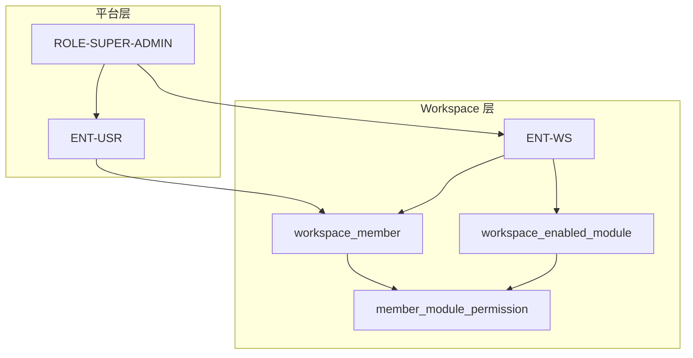
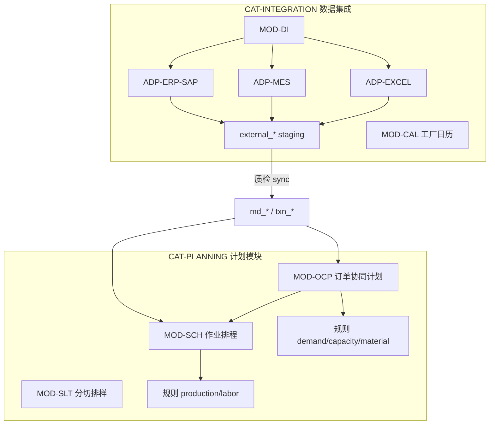

# 平台卷 · Workspace 平台（§18 · §19）

> **§ 编号不变。** §18 IAM · §19 模块与 ADP 适配器。

---

<a id="s18-iam"></a>

# §18 用户与权限管理（IAM）

> **目标：** 在 **RULE-WS-01** 数据隔离之上，增加 **用户身份、Workspace 成员、模块开关、操作权限** 四层控制（ADR-13）  
> **现状：** 实现为 **规范目标**；当前仅 `X-Workspace-Id` 头隔离，无登录与 RBAC（§9 NFR-04 过渡态）  
> **关联：** [§4 RULE-IAM-*](../../core/04-business-rules.md#rule-iam-01-用户-workspace-成员资格hard) · [§6 API-IAM-* / API-INT-*](../../core/06-api-contracts.md#api-iam-01-当前用户) · [§17 管理 UI](./17-ui-ux.md#1712-用户与权限管理-ui)

---

## 18.1 模型总览



| 层级 | 回答的问题 |
|------|------------|
| **身份** | 谁登录？ |
| **成员资格** | 用户能进哪些 Workspace？ |
| **模块** | Workspace 启用了哪些 **MOD-***（集成 / 计划 / 配置）？ |
| **权限** | 成员在某模块能 **查看** 还是 **修改/运行**？ |

---

## 18.2 实体与术语

| ID | 实体/表 | 说明 |
|----|---------|------|
| **ENT-USR** | `app_user` | 平台用户；`userId` · `loginName` · `displayName` · `status` |
| **ENT-WS** | `workspace` | 数据集；扩展 `ownerUserId` · `workspaceType` |
| **MEM-WS** | `workspace_member` | 用户↔Workspace 多对多 |
| **MOD-*** | `workspace_module` | Workspace **模块** 注册表（MOD-DI/OCP/SCH/SLT…）· §19 |
| **ADP-*** | `integration_adapter` | 数据集成 **适配器**（ERP/MES/Excel）· §19 |
| **PERM-VIEW** | — | 只读：列表、链、甘特、报表 |
| **PERM-EDIT** | — | 修改：主数据、规则、simulate、confirm、PlanningRun |
| **ROLE-SUPER-ADMIN** | `app_user.is_super_admin` | 平台超级管理员 |

**Workspace 类型：**

| workspaceType | 说明 |
|---------------|------|
| **PERSONAL** | 用户自有 Workspace；注册时自动创建 |
| **SHARED** | 团队/项目共享；由 Owner 或 Super Admin 创建 |

---

## 18.3 用户与 Workspace（需求 1.1）

### 18.3.1 成员资格规则

| 规则 | 陈述 |
|------|------|
| **至少一个自有 WS** | 每个 **ENT-USR** 创建时 **必须** 自动创建 **1 个** `workspaceType=PERSONAL` 的 ENT-WS，且 `ownerUserId=userId` |
| **多 WS 归属** | 用户可加入 **多个** SHARED Workspace（`workspace_member`） |
| **可见列表** | 顶栏 `WorkspaceSelector` **仅展示** 当前用户有成员资格的 WS |
| **默认 WS** | 登录后默认选中 **最近使用** 或 **PERSONAL** WS |

### 18.3.2 Workspace 成员角色

| 角色 | 代码 | 能力 |
|------|------|------|
| **所有者** | `OWNER` | 删除 WS（非 PERSONAL 可删）、配置模块、管理全部成员、全部已启用模块 EDIT |
| **管理员** | `WS_ADMIN` | 管理成员与模块权限；不可删除 WS、不可变更 Owner |
| **成员** | `MEMBER` | 按 **模块×权限** 矩阵授权 |

> **PERSONAL** WS：`OWNER` 固定为创建者；不可添加其他 `OWNER`；可邀请 `MEMBER`（可选产品策略）。

---

## 18.4 Workspace 内权限（需求 1.2）

### 18.4.1 权限级别（按模块）

| 级别 | 代码 | 允许 | 禁止 |
|------|------|------|------|
| **无** | `NONE` | — | 路由/API 均不可见 |
| **查看** | `VIEW` | GET、只读报表、导出 | POST/PUT/PATCH/DELETE、simulate、optimize、confirm |
| **修改** | `EDIT` | VIEW + 写操作 + PlanningRun + Session confirm | 成员管理、模块开关 |

**矩阵存储：** `workspace_member_module`（`userId`, `workspaceId`, `moduleId`, `accessLevel`）

**OWNER / WS_ADMIN 默认：** 对已 **启用** 模块 implicit `EDIT`（成员管理另需 WS_ADMIN+）。

### 18.4.2 与 API 的映射

| API 类 | 所需权限 |
|--------|----------|
| GET 列表/链/甘特 | 对应模块 **VIEW** |
| POST simulate | 对应模块 **EDIT** |
| POST optimize / confirm | 对应模块 **EDIT** |
| POST PlanningRun | **MOD-OCP** · **EDIT** |
| MasterData 保存 | **MOD-DI** · **EDIT**（internal 页） |
| External 导入 / Sync | **MOD-DI** · **EDIT** |
| BusinessRules 保存 | **MOD-OCP** 或 **MOD-SCH** · **EDIT**（按规则分类归属，§19.4.5） |
| Workspace 成员 CRUD | **WS_ADMIN** 或 **OWNER**（API-IAM-06） |

**HTTP：** 无成员资格 → **403** `WORKSPACE_FORBIDDEN`；有成员但权限不足 → **403** `MODULE_FORBIDDEN`；模块未启用 → **403** `MODULE_DISABLED`。

---

## 18.5 Workspace 模块组件

> **完整定义：** [§19 Workspace 模块与数据集成适配器](#s19-workspace-modules)  
> **机器可读：** [workspace-modules.yaml](../../../knowledge/standard/modules/workspace-modules.yaml) · [integration-adapters.yaml](../../../knowledge/standard/modules/integration-adapters.yaml)

### 18.5.1 模块分类（摘要）

| 分类 | 模块 | 说明 |
|------|------|------|
| **CAT-INTEGRATION** | **MOD-DI** · **MOD-CAL** | 数据集成（External_* 展示 + ADP 适配器）与工厂日历 |
| **CAT-PLANNING** | **MOD-OCP** · **MOD-SCH** · **MOD-SLT** | 订单协同计划 · 作业排程 · 分切排样 |

### 18.5.2 Workspace 模块开关

表 **`workspace_enabled_module`**（`workspaceId`, `moduleId`, `enabled`）：

| 规则 | 陈述 |
|------|------|
| 默认 | 新建 WS 启用 **MOD-DI · MOD-OCP · MOD-SCH · MOD-CAL**；**MOD-SLT** 默认关 |
| 关闭模块 | 侧栏 **隐藏** 对应导航；API 返回 403 |
| 适配器 | MOD-DI 下 **`workspace_enabled_adapter`** 单独开关 ADP（Excel 默认开） |

### 18.5.3 组件扩展契约（MOD-EXT / ADP-EXT）

| 类型 | 交付物 |
|------|--------|
| **计划模块 MOD-*** | `moduleId` · 路由 · nav · API 前缀 · §19.4 菜单表 |
| **集成适配器 ADP-*** | `adapterId` · `source_system` · External 表映射 · SPI · §19.3 |

---

## 18.6 超级管理员（需求 1.4）

| 能力 | 说明 |
|------|------|
| **用户 CRUD** | 创建/禁用/重置所有 ENT-USR |
| **授予 Super Admin** | 设置/撤销 `is_super_admin`（至少保留 1 名） |
| **任意 WS** | 查看与配置 **所有** Workspace 的成员、模块（审计日志） |
| **不绕过业务 hard** | Super Admin **不** 静默修改 Standard hard RULE；仅平台与 IAM |

**审计：** 所有 Super Admin 写操作写入 `iam_audit_log`。

---

## 18.7 认证与请求上下文

| 项 | 规范 |
|----|------|
| **生产** | 外置 IdP（OIDC）或本地账号；JWT / Session Cookie |
| **开发** | `plantops.security.dev-mode=true` 可注入固定用户（须显式配置） |
| **请求上下文** | 解析后注入 `CurrentUser` + 校验 `X-Workspace-Id` 成员资格 |
| **与 RULE-WS-01** | 先 **认证** → 再 **WS 成员** → 再 **模块+权限** → 最后 **行级 WS 隔离** |

---

## 18.8 数据模型（持久化）

```sql
-- 概念 DDL（Flyway TODO-18）
app_user (user_id PK, login_name UK, display_name, is_super_admin, status, created_at)
workspace (+ owner_user_id, workspace_type)  -- 扩展既有 workspace 表
workspace_member (workspace_id, user_id, role, PK(workspace_id,user_id))
workspace_enabled_module (workspace_id, module_id, enabled)
workspace_enabled_adapter (workspace_id, adapter_id, enabled)
workspace_adapter_config (workspace_id, adapter_id, config_json)
workspace_member_module (workspace_id, user_id, module_id, access_level)
iam_audit_log (id, actor_user_id, action, target, payload_json, created_at)
```

**Ontology：** IAM 表 **不** 进入 ENT-OG；仅网关/Filter 层 enforcement。

---

## 18.9 UI 规范摘要

| 页面 | 路由 | 权限 |
|------|------|------|
| 用户个人设置 | `/account` | 已登录 |
| Workspace 成员与模块 | `/workspaces/{id}/settings` | WS_ADMIN+ |
| 平台用户管理 | `/admin/users` | SUPER_ADMIN |
| 平台 Workspace 管理 | `/admin/workspaces` | SUPER_ADMIN |

**WorkspaceSelector：** 仅列出成员 WS；无权限 WS id 深链 → 403 页。

详见 [§17.12](./17-ui-ux.md#1712-用户与权限管理-ui)。

---

## 18.10 场景与验收

| SCN | 说明 |
|-----|------|
| **SCN-T06** | IAM：登录、成员、模块、Super Admin（§3） |
| **AC-IAM-*** | §8 |

---

## 18.11 迁移（从 v1 无 RBAC）

| 阶段 | 行为 |
|------|------|
| **M0** | 单用户 `dev` + 全权限；与现网一致 |
| **M1** | 表结构 + Filter；默认全员 WS `default` 成员 |
| **M2** | 模块开关 + 侧栏过滤 |
| **M3** | 成员矩阵 + Super Admin UI |
| **M4** | 生产 IdP；关闭 dev-mode |

**跟踪：** [§10 TODO-18](../../core/10-decisions-risks.md)

---

**回指：** [09-nfr.md](../../core/09-nfr.md) NFR-04 · [10-decisions-risks.md](../../core/10-decisions-risks.md) ADR-13

---

<a id="s19-workspace-modules"></a>

# §19 Workspace 模块与数据集成适配器

> **目标：** 每个 ENT-WS 按 **模块分类** 启用能力；**数据集成** 与 **计划模块** 分离；集成通过 **ADP-*** 适配器写入 `external_*`  
> **IAM：** 模块开关与权限见 [§18](#s18-iam) · **External 表**见 [§11](../data/11-12-external-data.md#s11-external-master) · [§12](../data/11-12-external-data.md#s12-external-transactional)  
> **机器可读：** [workspace-modules.yaml](../../../knowledge/standard/modules/workspace-modules.yaml) · [integration-adapters.yaml](../../../knowledge/standard/modules/integration-adapters.yaml)

---

## 19.1 Workspace 模块分类



| 分类 | 模块 | 说明 |
|------|------|------|
| **数据集成** | **MOD-DI** · **MOD-CAL** | External_* 展示 + ADP 适配器 + 质检/Sync；工厂日历 |
| **计划模块** | **MOD-OCP** · **MOD-SCH** · **MOD-SLT** | 订单协同计划 / 作业排程 / 分切排样；**业务规则内嵌于各模块**（§19.4.5） |

> **废止映射：** 原 **MOD-DATA**（主数据/业务数据页）归入 **MOD-DI**（External 视图 + 过渡期 internal 页）。原 **MOD-CAL** 从独立 CAT-CONFIG 移入 CAT-INTEGRATION。

---

## 19.2 MOD-DI 数据集成

### 19.2.1 职责

| 能力 | 说明 |
|------|------|
| **External 浏览** | 按表展示 `external_*` 行；`quality_status` · `quality_issue_codes` · `import_batch_id` |
| **批次追溯** | 按 `IMP-{uuid}` 查看导入来源、适配器、行级问题 |
| **适配器运行** | 手动/定时触发 ADP 拉取或 Excel 上传 |
| **质检与 Sync** | 调用 `MasterDataQualityService` / `TransactionalDataQualityService` → `md_*` / `txn_*` |
| **禁止** | MOD-DI **不得** 跳过 staging 直写 `md_*`（RULE-MD-01） |

### 19.2.2 UI 结构（规范目标）

```
/integration                          集成概览（批次、告警）
/integration/external/master          External 主数据（§11 表族）
/integration/external/transactional   External 交易（§12 表族）
/integration/adapters                 适配器列表与状态
/integration/adapters/erp-sap         ADP-ERP-SAP 配置与运行
/integration/adapters/mes             ADP-MES 配置与运行
/integration/adapters/excel           ADP-EXCEL 模板下载与上传
/integration/quality                  质检报告（按 batch / issue_code）
```

**过渡期：** `/master-data`、`/business-data` 作为 MOD-DI 下 **internal** 子页保留，直至 `md_*`/`txn_*` 专页完成。

### 19.2.3 权限（MOD-DI）

| 操作 | 级别 |
|------|------|
| 浏览 External / 质检报告 | VIEW |
| Excel 上传、触发 ERP/MES 同步、执行 sync | EDIT |
| 适配器连接配置（含密钥引用） | EDIT + WS_ADMIN 推荐 |

---

## 19.3 数据集成适配器（ADP-*）

> **组件模型：** 与 **MOD-*** 类似，适配器为 **可注册插件**；Workspace 启用 MOD-DI 后，可 **选配** 启用哪些 ADP（`workspace_enabled_adapter`）。

### 19.3.1 Standard 预设适配器

| adapterId | 名称 | 阶段 | source_system | 写入 |
|-----------|------|------|---------------|------|
| **ADP-ERP-SAP** | ERPAdapterSAP | **Phase 1** | `ERP_SAP` | `external_*`（主数据+交易） |
| **ADP-MES** | MESAdapter | Phase 1 | `MES_DEFAULT` | `external_*`（工单/反馈） |
| **ADP-EXCEL** | ExcelDataAdapter | Phase 1 | `EXCEL_IMPORT` | `external_*`（模板列=External 结构） |
| ADP-ERP-GENERIC | 其他 ERP | Phase 2 | `ERP_*` | 同 SAP 契约 |

### 19.3.2 ADP-ERP-SAP（Phase 1 优先）

| 项 | 规范 |
|----|------|
| **输入** | SAP 主数据（物料、BOM、工艺、资源）+ 交易（SO、WO、库存、PO） |
| **输出** | 按 §11/§12 映射写入对应 `external_*` 行；填充 `source_system=ERP_SAP` |
| **连接** | 连接参数存 `workspace_adapter_config`（密钥走 `credentialRef`，不落库明文） |
| **增量** | `external_row_id` + `row_hash` 检测变更；新 batch → 质检 |
| **计划读** | **仅** sync 后 `md_*`/`txn_*`；SAP 直连 **禁止** 进 ENT-OG（RULE-MD-01） |

### 19.3.3 ADP-MES

| 项 | 规范 |
|----|------|
| **输入** | 工单状态、工序反馈、**SchedulerFeedback**（§16 RULE-SUP-05 产能占用） |
| **输出** | `external_work_order*` · 可选 `external_scheduler_feedback` |
| **与计划** | Firm WO sync → `firm_status=FIRM`（RULE-TX-04） |

### 19.3.4 ADP-EXCEL（ExcelDataAdapter）

| 项 | 规范 |
|----|------|
| **模板** | 与 `external_*` **列 1:1**（含 `external_row_id` 可选）；按表分 sheet |
| **流程** | 上传 → 解析 → INSERT `external_*`（`PENDING`）→ 自动/手动 `checkBatch` |
| **错误** | 行级错误写入 `quality_issue_codes`；UI 可下载错误行 |
| **版本** | `templateVersion` 与 SDD §11/§12 列变更同步 |

### 19.3.5 适配器扩展契约（ADP-EXT）

| 交付物 | 说明 |
|--------|------|
| `adapterId` | `ADP-*` |
| `source_system_code` | 写入 `external_*.source_system` |
| `supported_domains` | master / transactional 表清单 |
| `config_schema` | Workspace 配置表单 |
| `IntegrationAdapter` Java SPI 或 HTTP worker | 实现 pull/push |
| 登记 | `integration-adapters.yaml` + 本节表 |

---

## 19.4 计划模块（MOD-OCP / MOD-SCH / MOD-SLT）

> **菜单：** 与 `workspaceNav.ts` **一致**；IAM 仅控制 **显隐**，不改变信息架构。  
> **路由：** MOD-OCP 仍用 `/master-plan/*` 前缀（技术路径，与 OCP 模块名解耦）。

### 19.4.1 MOD-OCP 订单协同计划

| 子菜单（现有） | 路由 |
|----------------|------|
| 计划参数 | `/master-plan/parameters` |
| 优化目标 | `/master-plan/objectives` |
| 计划运行 | `/master-plan/plan-run` |
| 本体推演 | `/master-plan/ontology` |
| 数据模型 | `/master-plan/data-model` |
| 场景对比 | `/master-plan/scenario-comparison` |
| **计划分析** | |
| └ 需求满足 | `/master-plan/analysis/demand` |
| └ 产能平衡 | `/master-plan/analysis/capacity` |
| └ 物料计划 | `/master-plan/analysis/material-planning` |
| └ 生产工单 | `/master-plan/analysis/work-orders` |

### 19.4.2 MOD-SCH 作业排程

| 子菜单 | 路由 |
|--------|------|
| 计划参数 | `/scheduling/parameters` |
| 待排工单 | `/scheduling/pending-work-orders` |
| 批次计划 | `/scheduling/batch-plan` |
| 物料齐套 | `/scheduling/kitting` |
| 生产排程 | `/scheduling/detail-schedule` |
| 版本对比 | `/scheduling/version-comparison` |

### 19.4.3 MOD-SLT 分切排样

| 子菜单 | 路由 |
|--------|------|
| 基础数据 | `/slitting/master-data` |
| 优化参数 | `/slitting/parameters` |
| 优化运行 | `/slitting/runs` |
| 母卷分切 | `/slitting/studio` |

### 19.4.4 新增计划模块

须注册 **MOD-*** + `menu_ref` + §18 MOD-EXT；**不得** 硬编码侧栏。

### 19.4.5 模块内业务规则（非全局 MOD）

> **决策：** 废止独立 **MOD-BRULES**；CFG 规则 UI **归属各计划模块**，IAM 权限随 **MOD-OCP / MOD-SCH** 的 VIEW/EDIT。

| 计划模块 | 规则分类 | 路由 |
|----------|----------|------|
| **MOD-OCP** | 需求 · 产能 · 物料 | `/master-plan/rules/{demand\|capacity\|material}` |
| **MOD-SCH** | 生产 · 人力 | `/scheduling/rules/{production\|labor}` |
| **MOD-SLT** | （选配） | `/slitting/rules/*` 待扩展 |

**侧栏：** 各模块 **subGroup「业务规则」**；不再出现全局「业务规则」分组。

**API：** 仍用 `/api/v1/business-rules`；权限按 **规则分类所属模块** 校验。

**Legacy：** `/business-rules/*` → redirect 至上表 canonical 路由（§17.2.2）。

---

## 19.5 Workspace 默认启用

| 模块 | 默认 | 说明 |
|------|------|------|
| MOD-DI | ✓ | 含 ADP-EXCEL；SAP/MES 按 WS 配置启用 |
| MOD-OCP | ✓ | 原 MOD-MP |
| MOD-SCH | ✓ | |
| MOD-SLT | ✗ | 分切项目选配 |
| MOD-CAL | ✓ | |

**适配器默认（MOD-DI 启用时）：**

| ADP | 默认 |
|-----|------|
| ADP-EXCEL | ✓ |
| ADP-ERP-SAP | ✗（需配置连接） |
| ADP-MES | ✗ |

---

## 19.6 API 概要（TODO-19）

> **契约正文：** [§6 API-INT-*](../../core/06-api-contracts.md#api-int-01-导入批次列表)

| API | 说明 |
|-----|------|
| `GET /api/v1/integration/external/{domain}/{table}` | 分页查 external_*（**API-INT-03**） |
| `GET /api/v1/integration/batches` | 导入批次（**API-INT-01**） |
| `POST /api/v1/integration/adapters/{adapterId}/run` | 触发同步（**API-INT-05**） |
| `POST /api/v1/integration/adapters/excel/upload` | Excel 导入（**API-INT-07**） |
| `PUT /api/v1/integration/adapters/{adapterId}/config` | WS 级适配器配置（**API-INT-06**） |

---

## 19.7 场景与验收

| SCN | 说明 |
|-----|------|
| **SCN-T07** | 数据集成：Excel → external → 质检 → sync（§3） |
| **AC-INT-*** | §8 |

**跟踪：** [§10 TODO-19](../../core/10-decisions-risks.md)

---

**回指：** [§18 IAM](#s18-iam) · [§17 UI](./17-ui-ux.md) · [§11](../data/11-12-external-data.md#s11-external-master)