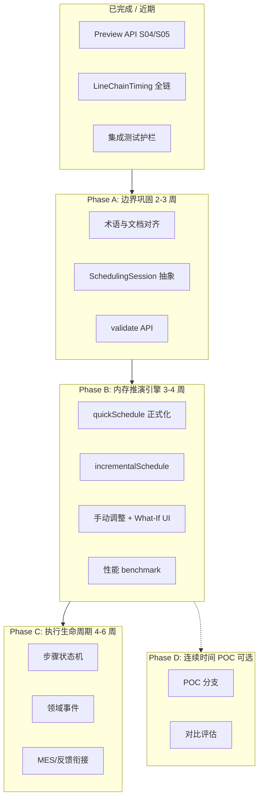

# 生产车间排程分层架构 — 可行性评估与推进计划

> **For agentic workers:** 本计划先完成评估与路线对齐；**Phase A 起**再按 superpowers:executing-plans 或 subagent-driven-development 逐步实施。步骤使用 `- [ ]` 跟踪。

**Goal:** 评估《生产车间排程系统_分层设计方案.md》与现有 Plant Operation Plan 的契合度，确定可演进路径，分阶段落地「业务模型自治 + 推演/优化分离 + 适配器防腐」，避免一次性重写 Timefold 模型。

**Architecture:** 计划员主场景；批次工序（Batch Process Step）为最小排产单元；**发布=RELEASED**；wall-clock 对外；主计划 TimeSlot **软约束**；目标求解为 **连续 LocalDateTime**；手动改：**预览→确认正式版**，改后 **增量推演**，Timefold **仅主动触发**。执行态见 §10 `production_task`。

**Tech Stack:** Quarkus, Timefold 3.x, H2/PostgreSQL, React；现有包 `com.plantops.scenario.planning` / `com.plantops.solver.detailschedule`；新增 `production_task`、连续时间 solver v2（并行演进）

**Spec:** `d:\OneDrive\桌面\生产车间排程系统_分层设计方案.md`（v1.0, 2026-06-02）

**Related:** [aps-planning-layer.md](../../aps-planning-layer.md)

**Locked decisions (2026-06-02):** 见 §10

---

## 1. Executive Summary（结论）

| 维度 | 结论 |
|------|------|
| **总体可行性** | **高（演进式）** / **中（一次性替换）** — 设计方向与现有 S04/S05 推演层高度一致，不宜推倒重来 |
| **已具备** | Context 推演、Mapper 防腐、可选 Timefold、Preview API、种子队列、工艺链赋时、约束预处理 |
| **最大差距** | ① 领域模型与 Timefold 实体未物理分离 ② S05 非「equipment + LocalDateTime」双变量连续时间 ③ 步骤生命周期/领域事件未建模 ④ 内存推演引擎未成体系（缺 incremental / validate 契约） |
| **建议策略** | **三轨并行、分阶段**：轨道 A 巩固边界与 API；轨道 B 内存推演引擎；轨道 C 执行态状态机；轨道 D（可选）连续时间 POC |
| **不建议现在做** | 全量替换为 `BatchProcessStep` + 连续时间 `startTime` PlanningVariable；Event Sourcing；多求解器抽象（V2.0） |

---

## 2. 设计文档 vs 现有实现 — 对照矩阵

### 2.1 分层映射

| 设计文档层 | 现有落点 | 契合度 | 说明 |
|-----------|---------|--------|------|
| **应用服务层** | `MasterPlanService`, `DetailScheduleService`, `PlanningOrchestrator`, `PlanningResource` | ✅ 高 | 用例编排、事务、REST 已有 |
| **业务模型层** | `*PlanningContext`, `*PlanningContextBuilder`, `OperationAssignment`（部分） | ⚠️ 中 | Context 已是推演快照，但 **solver 包内实体带 Timefold 注解**，非纯领域 |
| **适配器层** | `MasterPlanProblemMapper`, `DetailScheduleProblemMapper`, `DetailScheduleLineInitializer` | ✅ 高 | 正向投影 + 种子初始解 + 共享引用反写 |
| **求解引擎层** | `com.plantops.solver.*`, `SolverRuntimeFactory`, `*ConstraintProvider` | ✅ 高 | Timefold 隔离在 solver 包 |
| **基础设施层** | JPA Entity, Flyway, `ScheduleFeedbackService`, 前端 | ⚠️ 中 | 持久化是 **表模型** 非富领域；**领域事件** 未实现 |

### 2.2 S05 规划模型 — 关键差异（必读）

| 设计文档 | 当前实现 | 影响 |
|---------|---------|------|
| 单实体 `PlanningStep` | `OperationAssignment` + `ScheduleLine`（双实体） | 决策结构不同 |
| 变量：`equipment` + `startTime`（连续） | 变量：`ScheduleLine.assignedOperations`（**list**）；`startMinute` 为 **ShadowVariable** | 搜索空间、约束写法、性能特征完全不同 |
| `endTime` shadow | `LineChainTimingUtil` + `OperationStartTimeCalculator` 链式赋时 | 功能等价，机制不同 |
| 设备日历 → 可用时段硬约束 | `ResourceCalendarEntity` + 开线决策 + 产能分钟 | 有日历，**无**文档 §7 的「可用段列表 + 完全落在段内」细粒度约束 |
| 推演 < 100ms / 千级步骤 | `seedInitialQueues` + 赋时 **未** 性能基线；全量 Context 构建较重 | 需专项 benchmark |

### 2.3 已对齐的能力（可写进「设计已实现」）

```text
全局排程用例（设计 §3.4）:
  加载 Context → seed 初始队列 → [可选] Timefold → assignStartTimes → 反写 → [可选] 持久化
  ↔ DetailScheduleService.previewPlanning / solveWithPlanningContext

快速推演 / What-If（部分）:
  preview(solve=false) 仅诊断
  preview(seedInitialQueues=true) 内存可行态甘特
  preview(solve=true, persist=false) 内存优化，不落库
  ↔ 设计中的「克隆上下文 + 推演 + 不持久化」— 缺显式 clone API 与 incremental

约束映射（部分）:
  并行工序 / 连续生产 → P4 预处理 designatedLineId / pairGroupId
  工艺链 → routingPredecessor + LineChainTimingUtil 全链传递
  主计划契约 → mpContract* 软约束
```

---

## 3. 可行性分项评估

### 3.1 业务模型自治 — ⚠️ 可行，需 refactor，非 greenfield

**现状：** `OperationAssignment` 位于 `com.plantops.solver.detailschedule`，含 `@PlanningEntity`、`@InverseRelationShadowVariable` 等。

**目标：** 纯领域 `BatchProcessStep` / `SchedulingContext` 零 Timefold 依赖。

**路径：**
1. 引入 `com.plantops.domain.schedule`（或 `scenario.domain`）纯 POJO：`ScheduleStep`, `ScheduleLineState`, `SchedulingContext`
2. Mapper 做 **Domain ↔ Solver DTO** 双向转换（今日是 Context 直接挂 solver 实体）
3. 求解结果回写 Domain，再投影到 API DTO / 持久化

**风险：** 中 — 共享引用反写是现架构优点，拆层后需明确「copy vs  mutable session」语义。

**建议：** Phase B 做 **「SchedulingSession」** 概念：一次推演/求解的工作副本，替代文档中的 `SchedulingContext.clone()`。

### 3.2 推演与优化分离 — ✅ 已基本实现

Preview API（S04/S05）即设计中的统一入口。缺口：
- 命名与文档统一到 `quickSchedule` / `optimize` 语义
- `validate()` 返回分级 `ConstraintViolation` 列表（今日分散在 diagnostics + score）

### 3.3 连续时间建模 — ⚠️ 可行但不应作为近期主路径

Timefold 支持 `LocalDateTime` ValueRange，但：
- 设备冲突从「同槽互斥」变为「区间重叠」— 约束更贵
- 与主计划 **离散 TimeSlot** 的衔接需新契约（槽 → 分钟窗口映射）
- 现有 list 变量在车间 **产线排队** 场景表现稳定

**建议：** Phase D 做 **2–4 周 POC**（单产线、≤50 工序），对比 score/耗时/可解释性，**不阻塞** Phase A–C。

### 3.4 步骤状态机 + 领域事件 — ✅ 可行，独立轨道

与 Timefold **正交**。可基于：
- `ProductionBatchEntity` / 未来 `BatchProcessStepEntity`
- 状态：`UNPLANNED → PLANNED → RELEASED → RUNNING → COMPLETED`
- 事件：`StepPlannedEvent` 等 — 先用 **应用内事件** + 可选 Outbox，不做 Event Sourcing

**与现有：** `dispatchStatus`、`ScheduleFeedback`、执行反馈部分重叠，需统一词汇表。

### 3.5 内存推演引擎（规则 / 增量）— ⚠️ 可行，Phase B 核心

| 能力 | 现状 | 差距 |
|------|------|------|
| 贪心 seed | `DetailScheduleLineInitializer` | 仅初始队列，非完整 quickSchedule |
| 链式赋时 | `LineChainTimingUtil` | 有 |
| 增量重算 | 无 | 需 `affectedSteps` 子图 + 拓扑传播 |
| validate | diagnostics collector | 非统一 `ConstraintViolation` API |
| 性能 SLA | 未测 | 需 benchmark |

---

## 4. 待决策事项（设计 §10）— 建议默认值

| # | 议题 | 建议（基于现网） | 决策截止 |
|---|------|-----------------|----------|
| 1 | 时间精度 | **分钟级**（与 `startMinute` 一致）；秒级仅执行反馈 | Phase B 前 |
| 2 | 跨班次拆分 | **禁止**步骤跨不可用日历段；不自动拆步骤（与文档硬约束一致） | Phase C |
| 3 | 多目标权重 | 继续 `ScheduleContractSettings` + 策略 JSON；UI 在计划参数 | 已有 |
| 4 | 并发 | **乐观锁**（`plan_version`）+ 预览不写库；正式 solve 串行 | Phase A |
| 5 | Event Sourcing | **否**；普通领域事件 + 审计表 | Phase C |
| 6 | 构造启发式 | 保持 seed + Timefold CH；可配置策略枚举后置 | Phase B |
| 7 | 时间舍入 | 回写 **不** 舍入；展示层可舍入 | Phase A |

---

## 5. 分阶段推进路线



### Phase A — 边界巩固（推荐 **下一步**）

**目标：** 不改编求解器，把设计文档 vocabulary 落到代码与 API。

| 任务 | 产出 |
|------|------|
| A.1 文档 | 更新 `aps-planning-layer.md`：list 变量模型、与设计方案映射表 |
| A.2 `SchedulingSession` | 包装 Context + 变更集；preview API 返回 sessionId（内存） |
| A.3 `ScheduleValidationService` | 统一 hard/medium/soft violations（工艺链、齐套、开线、契约） |
| A.4 前端 | 推演页展示 violations；手动调整入口（只改 session） |

### Phase B — 内存推演引擎

**目标：** 设计 §3.1.2 四项能力落地（quick / incremental / validate / what-if）。

| 任务 | 产出 |
|------|------|
| B.1 `DetailScheduleSimulationEngine` | 接口：`quickSchedule`, `incrementalSchedule`, `validate` |
| B.2 增量 | 输入 `affectedOperationIds`，仅重算子图 + 产线链 |
| B.3 What-If | `SchedulingSession.fork()` + diff DTO |
| B.4 Benchmark | JMH 或集成测试：100/500/1000 工序 seed+timing P95 |

### Phase C — 执行生命周期

**目标：** 设计 §3.1.3 状态机 + §3.5 事件。

| 任务 | 产出 |
|------|------|
| C.1 模型 | `StepExecutionState` 枚举 + 迁移 |
| C.2 用例 | confirm / start / complete 应用服务 |
| C.3 事件 | `StepPlannedEvent` 等 + 订阅（看板刷新） |
| C.4 完工级联 | complete → incrementalSchedule 下游 |

### Phase D — 连续时间 POC（可选）

**目标：** 验证设计 §5–§6 是否优于 list 变量。

| 任务 | 产出 |
|------|------|
| D.1 | `detailschedule-continuous` 实验包 |
| D.2 | 对比报告：可行率、score、耗时、约束解释 |

---

## 6. Phase A 详细任务（可立即开工）

### Task A.1: 架构映射文档

**Files:**
- Modify: `docs/aps-planning-layer.md` — 新增 §「与车间分层设计对照」
- Create: `docs/workshop-scheduling-layer-mapping.md` — 设计文档术语 ↔ 代码类名

- [ ] **Step 1:** 写入对照表（本文 §2 精简版）
- [ ] **Step 2:** 修正 S05「决策变量=line」描述为 **list variable + shadow time**
- [ ] **Step 3:** 在 `生产车间排程系统_分层设计方案.md` 加一节「与 Plant Operation Plan 现实现状」交叉引用（可选，用户 OneDrive 副本）

### Task A.2: ScheduleValidationService（统一约束验证）

**Files:**
- Create: `src/main/java/com/plantops/scenario/planning/ScheduleValidationService.java`
- Create: `src/main/java/com/plantops/scenario/planning/ScheduleConstraintViolation.java`
- Create: `src/test/java/com/plantops/scenario/planning/ScheduleValidationServiceTest.java`
- Modify: `DetailScheduleService.toPreviewDto` — 附加 `violations` 字段（或新 DTO 字段）

- [ ] **Step 1:** 定义 `ScheduleConstraintViolation(level, ruleCode, operationId, message)`
- [ ] **Step 2:** 实现验证规则（首批）：未开线、工艺链倒挂、齐套推后仍过早、并行对缺失
- [ ] **Step 3:** 单元测试 + 在 `preview(seedInitialQueues=true)` 响应中带 violations

### Task A.3: SchedulingSession（What-If 基础）

**Files:**
- Create: `src/main/java/com/plantops/scenario/planning/SchedulingSession.java`
- Modify: `DetailScheduleService.previewPlanning` — 可选返回 session 快照 id（UUID，内存 Map，TTL）

- [ ] **Step 1:** Session 持有 `DetailSchedulePlanningContext` 副本或深拷贝策略文档
- [ ] **Step 2:** `fork()` 用于 What-If（Phase B 前置）
- [ ] **Step 3:** REST 不暴露 session 持久化

---

## 7. 风险与缓解

| 风险 | 概率 | 缓解 |
|------|------|------|
| 连续时间重写导致回归 | 高 | 独立 POC，不动主分支 |
| 领域/求解拆分工作量超预期 | 中 | Phase A 仅加 Session/Validation，不搬实体 |
| 状态机与现有 dispatch/batch 冲突 | 中 | 统一词汇表 workshop；adapter 映射旧字段 |
| 性能 SLA 达不到 100ms | 中 | 先测再承诺；增量推演替代全量 |

---

## 8. Self-Review（计划自检）

| 设计文档章节 | 计划覆盖 |
|-------------|---------|
| §二 分层 | §2 映射 + Phase A–D |
| §3.1 业务模型 | Phase A/B/C |
| §3.2 适配器 | 已有 + Phase A 文档 |
| §3.3 求解器 | 保留 + Phase D POC |
| §3.4 用例 | Preview 已有；C 补执行用例 |
| §5–6 连续时间 | Phase D only |
| §7 设备日历 | Phase B 增强 validate；长期对齐 FactoryCalendar |
| §8 接口 | Phase A/B 逐步实现 |
| §9 演进路线 | §5 重新映射到 A–D |
| §10 待决策 | §4 建议默认值 |

**Placeholder scan:** 无 TBD 实现步骤；Phase B/C/D 任务在 Phase A 完成后再拆细粒度 TDD 步骤。

---

## 10. 已锁定业务决策与 StepExecutionState 规格

### 10.1 角色与名词

| 项 | 决定 |
|----|------|
| 核心用户 | **计划员**（排程、预览、发布）；**车间**仅执行反馈 |
| Batch Process Step | **批次 × 工艺工序**；`stepId = operationId`（`OP-{batchNo}-{seq}_0`） |
| 对外时间 | **wall-clock**（`LocalDateTime`） |
| 主计划槽位 | **软约束**（偏离惩罚，非硬卡槽） |
| 求解时间模型 | **连续 `LocalDateTime`**（equipment + startTime，目标态） |
| 手动修改 | 预览 session → **确认** → 正式 `plan_version`；之后 **增量推演**；**仅主动触发 Timefold** |
| **发布** | **= RELEASED**（发布即对车间可见，无单独「下发」步骤） |
| 已 RUNNING 再发版 | **不自动覆盖** planned；生成 **planning_conflict** 供计划员处理 |

### 10.2 状态机（`StepExecutionState`）

```text
UNPLANNED → RELEASED → RUNNING → COMPLETED
                ↓                      ↓
            ARCHIVED ←─────────────────┘（批次取消 / 不再跟踪）
```

| 状态 | 含义 | 进入条件 |
|------|------|---------|
| `UNPLANNED` | 批次工序存在，未出现在已发布细排程 | 默认 / 从未发布 |
| `RELEASED` | 已发布正式版本，有计划 wall-clock，车间可见 | 计划员 **confirmScheduleSession** |
| `RUNNING` | 车间反馈已开工 | `POST .../tasks/{stepId}/start` |
| `COMPLETED` | 车间反馈已完工 | `POST .../tasks/{stepId}/complete` |
| `ARCHIVED` | 不再跟踪 | 批次取消或业务归档 |

**注意：** 无独立 `PLANNED` 态；预览 session 内的安排 **不写** 执行态表。

### 10.3 数据模型：`production_task`

与不可变 `detail_schedule_operation`（版本快照）分离。

```sql
-- Flyway 新表（命名待定：production_task）
step_id              VARCHAR PK     -- OP-{batchNo}-{operationSeq}_0
batch_no, work_order_no, operation_seq, operation_name, product_code
line_id, resource_id
quantity               DECIMAL

planned_start_ts       TIMESTAMP    -- wall-clock
planned_end_ts         TIMESTAMP
plan_version_id        VARCHAR      -- 最近一次成功写入计划的 DS 版本

execution_state        VARCHAR      -- UNPLANNED|RELEASED|RUNNING|COMPLETED|ARCHIVED
released_ts            TIMESTAMP    -- = 确认发布时间
actual_start_ts        TIMESTAMP    -- 车间
actual_end_ts          TIMESTAMP    -- 车间

updated_ts
```

**发布（confirm）时服务逻辑：**

1. 持久化 `plan_version` + `detail_schedule_operation`（快照，只增）。
2. 对每个已排产 step：
   - 若 `execution_state` ∈ {`UNPLANNED`,`RELEASED`} → upsert，`RELEASED`，写入新 planned_* + `plan_version_id` + `released_ts`。
   - 若 `RUNNING` → **不改** planned_*；若新版本与该 step 安排不一致 → 插入 `planning_conflict`。
   - 若 `COMPLETED` → 忽略新版本对该 step 的排产变更。
3. 返回 `{ planVersionId, releasedCount, conflicts[] }`。

**`planning_conflict`（新表，简要）：**

```text
conflict_id, step_id, plan_version_id, reason_code, message, detected_ts, resolved
```

### 10.4 API 草图

| 方法 | 路径 | 说明 |
|------|------|------|
| POST | `/planning/schedule-sessions` | 从 masterPlanVersionId 创建 session |
| PATCH | `/planning/schedule-sessions/{id}/steps` | 手动改 line/start（wall-clock） |
| POST | `/planning/schedule-sessions/{id}/simulate` | 增量推演（默认） |
| POST | `/planning/schedule-sessions/{id}/optimize` | **主动** Timefold |
| POST | `/planning/schedule-sessions/{id}/confirm` | 发布 → 正式版 + **RELEASED** |
| GET | `/production-tasks` | 计划员/车间任务列表（wall-clock） |
| POST | `/production-tasks/{stepId}/start` | 车间 → RUNNING |
| POST | `/production-tasks/{stepId}/complete` | 车间 → COMPLETED |

### 10.5 修订后的推进顺序

| 序 | 内容 |
|----|------|
| **①** | `SchedulingSession` + confirm 发布（可先沿用 list 模型 + minute→wall-clock 换算） |
| **②** | `production_task` + `planning_conflict` + 生产任务 API |
| **③** | 增量推演 + validate（不跑 Timefold） |
| **④** | 连续时间 Timefold v2 + MP slot 软约束 |
| **⑤** | 车间 start/complete 反馈 UI / 对接 |

---

## 9. Execution Handoff

**Plan saved to:** `docs/superpowers/plans/2026-06-02-workshop-scheduling-layered-architecture.md`

**推荐下一步：** 执行 **① Session + confirm** 与 **② production_task**（可并行：表结构 + Session 骨架）。

**Two execution options:**

1. **Subagent-Driven（推荐）** — 每 Task 派生子 agent，Task 间审查
2. **Inline Execution** — 本会话连续实施 ①→②

**Which approach?**（用户确认后再写代码）

---

## Appendix: 设计文档 MVP/V1.0 与现网阶段对应

| 设计阶段 | 现网等价 | 下一里程碑 |
|---------|---------|-----------|
| MVP 业务模型+内存推演 | P0–P4 Context + seed 队列 | Phase B quick/incremental |
| V1.0 Timefold 闭环 | solve + persist + Mapper | Phase A validate + 文档 |
| V1.5 增量+事件 | 部分反馈滚动 | Phase C |
| V2.0 多求解器 | 未开始 | 不排期 |
