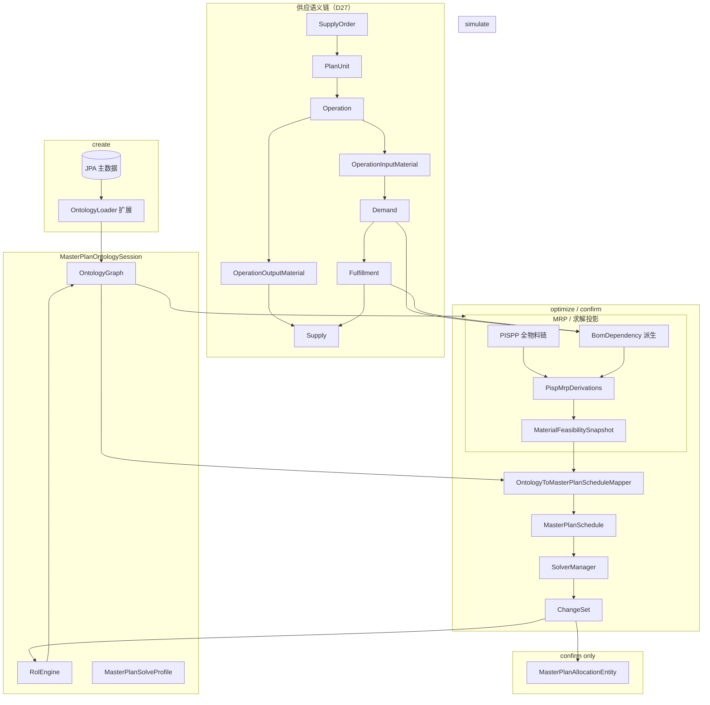
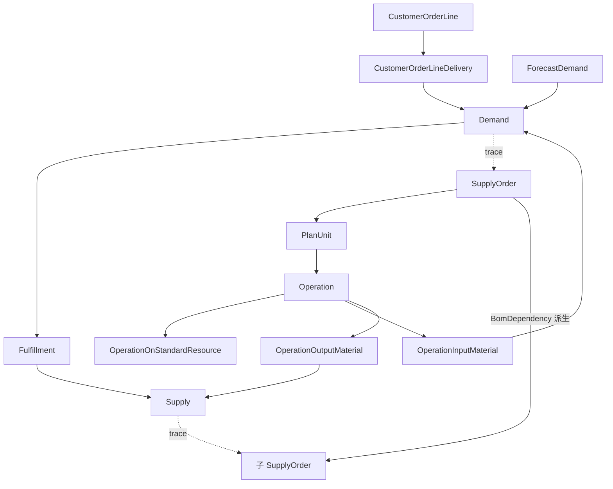

# OTD 主计划本体 M4 — 本体直驱 Timefold 求解（路线 B）

> **For agentic workers:** REQUIRED SUB-SKILL: Use superpowers:subagent-driven-development (recommended) or superpowers:executing-plans to implement this plan task-by-task. Steps use checkbox (`- [ ]`) syntax for tracking.

**Goal:** 在 M3 基础上，将 `OntologyGraph` 升级为 S04 主计划 Timefold 的**唯一问题事实来源**：Session 内 simulate 修改的供需/产能/时间窗可直接进入 `optimize`/`confirm` 求解；以 `OntologyToMasterPlanScheduleMapper` 替代（或旁路）`MasterPlanPlanningContextBuilder` → `MasterPlanProblemMapper` 的实体扫描链；通过对等性回归证明与现有路径 allocation + hard score 一致后，用 feature flag 切换默认求解入口。

**Architecture:** 分六层增量扩展本体（**供应语义链** → 时栅 → Operation/并行 → **PISPP 承载 MRP** → 规则/策略 → Mapper/切换）。**canonical 供应结构（D27）**：

```
【独立需求侧】
CustomerOrderLine → CustomerOrderLineDelivery → Demand
ForecastDemand ──────────────────────────────→ Demand

【制造供应侧】
SupplyOrder → PlanUnit → Operation → OperationInputMaterial → Demand（依赖需求）
                              ├── OperationOnStandardResource → StandardResource（resourceId）
                              └→ OperationOutputMaterial → Supply
Demand ←—— Fulfillment ——→ Supply
```

`BomDependency` **保留**为求解用边对象，但**不由** `WorkOrderBomDependencyEntity` 直接装载为真相源；改为：对每个父 `SupplyOrder` 上各 `Demand`，沿 `Fulfillment` 找到满足它的 `Supply`，再追溯到子 `SupplyOrder`，生成 `parentSupplyOrderId → childSupplyOrderId`（子先完工）。`SchedulingSlot` 委托 `TimeslotHorizonService`。物料库存语义仍在 **PISP/PISPP**；`MaterialFeasibilitySnapshot` 为 PISPP + `BomDependency` 的求解投影。`optimize`/`confirm` 读 Session 图；confirm 仍写 `MasterPlanAllocationEntity`（D4）。

**Tech Stack:** Java 21, Quarkus, Timefold 3.x, JUnit 5；React + 现有 `frontend/src`。

**Prerequisites（M3 完成 + D16 触发条件）：**

| # | 条件 | M4 对应 Epic |
|---|------|-------------|
| T1 | 时栅统一：`Period` 与求解 `TimeSlot` 共用 horizon/边界 | Epic A |
| T2 | MRP 闭合进 **PISPP**（全物料 PISP 链），非平行物料模型 | Epic C |
| T3 | 供应语义链 + Fulfillment 进图 | Epic B0 |
| T3b | Operation 完备（`OperationOnStandardResource`、拆段、并行） | Epic B |
| T4 | 换型/冻结/策略权重可挂 Session 或图 | Epic D |
| T5 | 对等性自动化回归 | Epic E |
| T6 | 产品诉求：simulate → optimize 不重扫 DB | Epic F |

**Locked decisions（继承 M1–M3 + M4 新增）：**

| # | 决策 | 值 |
|---|------|-----|
| D1–D17 | 见 M1/M2/M3 | 不变，**D16 由「维持复用」升级为「M4 实施直驱」** |
| D18 | 求解真相源 | Session 存活期内 **`OntologyGraph` 为 optimize/confirm 唯一输入**；JPA 仅在 `create` 装载与 `confirm` 持久化 |
| D19 | 时栅模型 | 新增 `ontology.scheduling.SchedulingSlot`（problem fact 投影类），由 `PeriodIndex` + `ResourceCalendarEntity` 按日展开；与 `com.plantops.solver.masterplan.TimeSlot` 字段 1:1 可映射；horizon 参数 `ontology_timeslot_horizon_days` 缺省对齐 `timeslot_horizon_days` |
| D20 | Period vs TimeSlot | **M4 阶段 1**：PISPP 仍用 `ontology_period_sequence` 混合桶；求解槽位仍用日/周 `TimeSlot`，由 `SchedulingSlotExpander` 从 period 边界 + 日历生成，**禁止**两套独立 horizon 配置长期并存（文档化单一 `planning_horizon_anchor`） |
| D21 | MRP 与 PISPP | **不**新增 `MaterialPeriod`。原料/组件/成品均为既有 **PISP → PISPP**；M4 扩展 `OntologyLoader` + `PispMrpDerivations`：BOM 展开需求、MRP 按日/按 period 供需写入各物料 PISPP，ROL 传播与 UI 库存链合一。`MaterialFeasibilitySnapshot`（`scenario.planning` 投影类）由 PISPP + `BomDependency` **derive**，字段对齐 `MaterialFeasibilityContext`；`materialFeasibleOnSlot` 读投影，不直查 `MaterialFeasibilityService`。首次实现可委托 `MaterialFeasibilityService` 做对等性黄金对照，达标后本体路径为真相源 |
| D27 | 供应语义链（canonical） | `SupplyOrder → PlanUnit → Operation → OperationInputMaterial → Demand`；`Operation → OperationOutputMaterial → Supply`；M4 新建 `PlanUnit`、`Demand`、`Supply`、`OperationInputMaterial`、`OperationOutputMaterial`、`Fulfillment` 本体类；`Operation` 挂 `planUnitId`（保留 `supplyOrderId` 便捷索引） |
| D28 | Fulfillment 语义 | `Fulfillment(demandId, supplyId, quantity, type)` 连接需求与供应；`type` 对齐现有 peg：`INVENTORY_PEG`、`WORK_ORDER_PEG`、`SHORTAGE_PEG` 等；装载逻辑**委托** `FulfillmentPeggingService` 的 peg 规则，结果固化进图 |
| D29 | BomDependency 来源 | **派生边**，非 JPA 直读真相源：`∀ parentSO, ∀ demand∈demands(parentSO), ∀ fulfillment→supply, childSO=supplyOrder(supply)` ⇒ `BomDependency(parentSO.id, childSO.id)`；与求解 `BomDependencyEdge(parentWO, childWO)` 投影一致（M1–M3 中 SO.id = workOrderNo）。`WorkOrderBomDependencyEntity` 仅作迁移期对照/回填，不作 Session 图装载入口 |
| D30 | PlanUnit 缺省 | M4 每个 `SupplyOrder` 先 **1:1** 生成一个 `PlanUnit`（id=`PU-{supplyOrderId}-0`，qty=SO.quantity）；拆批/合并在 M5 |
| D31 | 统一 Demand | 本体 `demand.Demand` 为 **Fulfillment/MRP 锚点**；来源分三类：`CUSTOMER_DELIVERY`（来自 COLD）、`FORECAST`（来自 ForecastDemand）、`BOM_COMPONENT`（来自 OperationInputMaterial）；字段 `sourceType` + `sourceId` 回指来源对象 |
| D33 | 销售订单交付链 | `CustomerOrderLine` **1:N** `CustomerOrderLineDelivery` **1:1** `Demand`；对齐 OTD「接单/断点主粒度 = Delivery」；JPA 映射 `SalesOrderLineEntity` → COL；**M4 阶段 1** 若无交付批次表则 **合成 1:1 COLD**（`deliveryId = {salesOrderNo}-{lineNo}-0`，qty=`orderQty`，date=`dueDate`） |
| D34 | 预测需求链 | `ForecastDemand` **1:1** `Demand`（`demandType=FORECAST`）；JPA **新建** `ForecastDemandEntity` 或 Excel/导入 DTO；写入 PISPP `plannedDemandQuantityTotal` 与 `Fulfillment` 缺口 peg；与 firm 订单 Demand 同级进入需求池 |
| D22 | Operation 扩展 | `Operation` 增：`planUnitId`、`durationMinutes`、`segmentIndex`/`lastSegment`、`parallelGroupId`、`locked`；**资源候选不在 Operation 上存列表**，见 D32 |
| D32 | OperationOnStandardResource | 新建 `supply.OperationOnStandardResource`：`Operation` **1:N** `OOSR`；字段 `operationId`, `standardResourceId`, `resourcePriority`, `setupTimeMinutes`, `processTimeSeconds`；装载自 `ProductResourceEntity` 同 `(productCode, operationName/sequenceNo)` 多行；`OrderAllocation.resourceId` / `allowedResourceIds` **派生**自 OOSR（priority 升序）；`Operation.productionTimeMinutes` 用**主资源**（priority 最小）工时计算 |
| D23 | 规则入图 | Session 级 `MasterPlanSolveProfile`（strategyId、feedbackCutoff、objectiveSettings 快照）；换型 `ChangeoverRuleSet` 自 `BusinessRuleScopeService` 装载一次挂图 |
| D24 | 切换策略 | 系统参数 `ontology_direct_solve_enabled`（workspace 级）；`false` = M3 实体路径；`true` = 直驱；对等性测试全绿后方可默认 `true` |
| D25 | confirm 语义 | confirm **必须**基于当前 Session 图求解结果持久化；禁止无条件 `MasterPlanService.solve()` 重扫 DB（修复 M3 断层） |
| D26 | 对等性 | 代表性 workspace（含 jinghua 种子）上：直驱 vs 实体路径 **hard score 相等** 且 allocation 集合在 `(workOrderNo, operationSeq, resourceId, slotDate)` 键上 **≥95% 一致**（允许周槽边界差异文档化例外） |

**M4 验收（约 8–12 周）：**

1. `ontology_direct_solve_enabled=true` 时，`optimize` 不调用 `MasterPlanPlanningContextBuilder`；simulate 改 PISPP supply 后 optimize 结果反映该修改
2. `SchedulingSlot`/`TimeSlot` 与 `TimeslotHorizonService` 在相同参数下 slot 数量与首尾日期一致（对等测试）
3. 全物料 PISPP 经 MRP derived 更新；`MaterialFeasibilitySnapshot` 由 PISPP 派生且与 `MaterialFeasibilityService` 对等；直驱路径 `materialFeasibleOnSlot` 可触发/满足
4. 供应语义链对象齐全；`OperationOnStandardResource` 装载且可派生 `OrderAllocation` 资源域；`BomDependency` 由 Fulfillment **派生**；Operation 含拆段/并行；边进入 `MasterPlanSchedule`
5. confirm 持久化 allocation 来自 Session 图求解，且 `planVersionId` 与 Session `basePlanVersionId` 关联可追溯
6. `OntologyDirectSolveParityTest`（或套件）CI 绿灯；`ontology_direct_solve_enabled` 默认仍为 `false` 直至 PO 签字
7. 前端：Operation 时间窗表 + simulate 扩展（SRP / needDate）；optimize/confirm 提示「基于沙盘求解」
8. `docs/otd-ontology-mapping.md` D16 更新为「M4 实现」；`docs/otd-ontology-direct-solve-evaluation.md` 增补「实施结果」章节

**Related:** [M3 计划](./2026-06-10-otd-ontology-master-plan-m3.md)、[直驱评估](../../otd-ontology-direct-solve-evaluation.md)、[otd-ontology-mapping.md](../../otd-ontology-mapping.md)

---

## Target architecture (M4)



---

## File structure (M4)

```
src/main/java/com/plantops/
  ontology/
    OntologyGraph.java                     (modify: schedulingSlots, bomEdges, solveProfile；PISPP 索引已覆盖全物料)
    OntologyLoader.java                    (modify: P0–P4 + PISPP MRP 装载；反灌 basePlanVersion allocations)
    OntologyIds.java                       (modify: schedulingSlotId, bomEdgeId)
    period/
      ProductInStockingPointPeriod.java    (modify: 可选 mrpClosingQty 等 MRP 辅助字段，或仅靠 derived 链)
    scheduling/
      SchedulingSlot.java                  (new: 本体侧槽位，可映射 solver TimeSlot)
      SchedulingSlotExpander.java          (new: Period + 日历 → slots)
      PeriodTimeSlotAlignment.java         (new: 与 TimeslotHorizonService 对齐校验)
      PispDailyClosingProjection.java      (new: PISPP 链 → 按日 NavigableMap，供 snapshot 与 slot 约束)
    supply/
      PlanUnit.java                          (new)
      Supply.java                            (new)
      OperationInputMaterial.java            (new)
      OperationOutputMaterial.java           (new)
      Operation.java                       (modify: planUnitId, durationMinutes, segment*, parallelGroupId, locked)
      OperationOnStandardResource.java   (new: Operation 1:N 标准资源候选)
      OperationResourceBinding.java      (new: primaryResourceId / allowedResourceIds 派生)
      BomDependency.java                   (new: 派生边；parent/child supplyOrderId)
    demand/
      CustomerOrderLine.java                 (new)
      CustomerOrderLineDelivery.java         (new)
      ForecastDemand.java                    (new)
      Demand.java                            (new: 统一锚点；sourceType/sourceId)
    fulfillment/
      Fulfillment.java                       (new)
      BomDependencyDerivation.java           (new: Demand→Fulfillment→Supply→SO 派生 BomDependency)
      SupplyChainLoader.java                 (new: 组装语义链；委托 FulfillmentPeggingService 规则)
    planning/
      MasterPlanSolveProfile.java          (new: Session 策略/冻结/目标快照)
      ChangeoverRuleSet.java               (new: 换型矩阵快照)
  rol/
    PispMrpDerivations.java                (new: BOM 展开 + MRP 供需写入 PISPP；注册进 withMasterPlanRules)
  scenario/planning/
    MaterialFeasibilitySnapshot.java       (new: 从 PISPP+BOM 派生；对齐 MaterialFeasibilityContext)
    MaterialFeasibilitySnapshotBuilder.java (new: graph → snapshot)
    OntologyToMasterPlanScheduleMapper.java (new: 核心直驱 mapper)
    OntologyAllocationBuilder.java         (new: 从 Operation 展开 OrderAllocation，含拆段)
    OntologyPlanningContextBridge.java     (new: 可选：图 ↔ 旧 Context 调试对比)
    MasterPlanOntologySessionService.java  (modify: optimize/confirm 直驱分支；simulate 扩展)
    MasterPlanOntologySession.java         (modify: solveProfile 字段)
    MasterPlanOntologyConfirmService.java  (modify: 从 Session 求解结果持久化)
    OntologyTimefoldMapper.java            (modify: 双向：allocation ↔ ChangeSet 已有；补 confirm 投影)
  scenario/
    MasterPlanService.java                 (modify: persistFromSchedule(schedule) 供 confirm 复用)
  config/
    OntologyDirectSolveFeature.java        (new: 读 ontology_direct_solve_enabled)

frontend/src/
  types/ontology.ts                        (modify: OperationSnapshot 扩展, simulate 请求)
  api/client.ts
  pages/MasterPlanOntologyPage.tsx         (modify: Operation 表, simulate SRP/needDate)
  components/OperationTimeWindowTable.tsx  (new)
  components/SimulateOntologyPanel.tsx     (new)

src/test/java/com/plantops/
  ontology/scheduling/SchedulingSlotExpanderTest.java
  ontology/scheduling/PeriodTimeSlotAlignmentTest.java
  rol/PispMrpDerivationTest.java
  ontology/scheduling/PispDailyClosingProjectionTest.java
  scenario/planning/MaterialFeasibilitySnapshotBuilderTest.java
  ontology/OntologyLoaderDirectSolveTest.java
  scenario/planning/OntologyToMasterPlanScheduleMapperTest.java
  scenario/planning/OntologyDirectSolveParityTest.java    (new: 核心对等性)
  scenario/planning/MasterPlanOntologySessionDirectSolveTest.java

docs/
  otd-ontology-mapping.md                  (modify: D16/D18–D26, 新对象表)
  otd-ontology-direct-solve-evaluation.md  (modify: §5 实施结果)
  aps-planning-layer.md                    (modify: §5.7 直驱路径)
```

---

## Epic A: 时栅统一（SchedulingSlot + Period 对齐）

> **依赖：** M3 `PeriodIndex` / `PeriodSequenceSpec`  
> **阻塞：** Epic B/C/D/E 的 slot 级约束

### Task A.1: SchedulingSlot 模型与 ID 规则

**Files:**
- Create: `src/main/java/com/plantops/ontology/scheduling/SchedulingSlot.java`
- Modify: `src/main/java/com/plantops/ontology/OntologyIds.java`
- Test: `src/test/java/com/plantops/ontology/scheduling/SchedulingSlotExpanderTest.java`

- [ ] **Step 1: Write failing test** — slot ID 与 `TimeslotHorizonService` 生成的 `resourceId-D{n}` 格式一致

- [ ] **Step 2: Implement `SchedulingSlot`**

字段对齐 `com.plantops.solver.masterplan.TimeSlot`：`id`, `index`, `date`, `periodEnd`, `granularity`, `shiftId`, `resourceId`, `capacityMinutes`

- [ ] **Step 3: `OntologyIds.schedulingSlotId(resourceId, date, shiftId)`**

- [ ] **Step 4: Run — PASS**

- [ ] **Step 5: Commit** — `feat(ontology): add SchedulingSlot aligned with solver TimeSlot`

### Task A.2: SchedulingSlotExpander — 从 Period + 日历展开

**Files:**
- Create: `src/main/java/com/plantops/ontology/scheduling/SchedulingSlotExpander.java`
- Modify: `src/main/java/com/plantops/ontology/OntologyLoader.java`
- Modify: `src/main/java/com/plantops/ontology/OntologyGraph.java`

- [ ] **Step 1: Write failing test** — 相同 `planningStart` + `timeslot_horizon_days=28` 时，slot 数量 = `TimeslotHorizonService.buildSlots(...).size()`

- [ ] **Step 2: Implement expander**

逻辑要点：
- 日槽：每个 period 内逐日 × `ProductionResourceEntity.routingResourceIds()`
- 周槽：按 `TimeslotHorizonService` 相同规则在 period 边界内生成（复用或委托 horizon 服务，**禁止复制第三套算法**）
- `capacityMinutes` 来自 `ResourceCalendarEntity` 当日/当周汇总

- [ ] **Step 3: Loader `buildGraph` 末尾 `builder.schedulingSlots(expander.expand(...))`**

- [ ] **Step 4: Run — PASS** `PeriodTimeSlotAlignmentTest`

- [ ] **Step 5: Commit** — `feat(ontology): expand scheduling slots from periods and calendar`

### Task A.3: PeriodTimeSlotAlignment 对等校验工具

**Files:**
- Create: `src/main/java/com/plantops/ontology/scheduling/PeriodTimeSlotAlignment.java`
- Test: `src/test/java/com/plantops/ontology/scheduling/PeriodTimeSlotAlignmentTest.java`

- [ ] **Step 1: Write failing test** — `assertAligned(ontologySlots, horizonSlots)` 在故意错位时失败

- [ ] **Step 2: Implement** — 比较 id 集合、index 单调、date 范围

- [ ] **Step 3: Commit** — `feat(ontology): add period-timeslot alignment checker`

### Task A.4: Horizon 参数统一（D20）

**Files:**
- Modify: `SystemParameterEntity` 种子或文档
- Modify: `OntologyLoader.buildPeriods` / expander 读参

- [ ] **Step 1:** 新增或对齐参数 `ontology_timeslot_horizon_days`；缺省读 `timeslot_horizon_days`

- [ ] **Step 2:** 混合桶 `ontology_period_sequence` 的末 period 结束日 ≥ horizon 末日

- [ ] **Step 3: Commit** — `feat(ontology): unify horizon parameters for direct solve`

---

## Epic B0: 供应语义链 + Fulfillment + BomDependency 派生

> **原则（D27–D31）：** 本体真相是 **Demand↔Supply 通过 Fulfillment 关联** 的链式结构；`BomDependency` 是该结构在 **工单级** 的派生视图，用于 Timefold `upstreamBeforeAssembly` 与 MRP 传播。

### 对象模型（锁定）



| 类 | 关键字段 | JPA / 服务对照（装载源） |
|----|----------|-------------------------|
| `CustomerOrderLine` | `id`, `customerCode`, `productCode`, `orderQty` | `SalesOrderLineEntity`（订单行头） |
| `CustomerOrderLineDelivery` | `id`, `customerOrderLineId`, `deliveryQty`, `requestedDate`, `latestDesiredDate`, `status` | **M4 合成**自 SO 行（1:1）；后续 `sales_order_delivery` 表 |
| `ForecastDemand` | `id`, `productCode`, `quantity`, `forecastPeriod`, `needDate`, `confidence` | **新建** `ForecastDemandEntity` 或导入 |
| `PlanUnit` | `id`, `supplyOrderId`, `quantity`, `sequenceNr` | 默认 1:1 `WorkOrderEntity.quantity` |
| `Demand` | `id`, `productCode`, `quantity`, `needDate`, `pispId`, `sourceType`, `sourceId`, `priority` | **派生/锚点**：COLD、ForecastDemand、OIM（BOM） |
| `Supply` | `id`, `productCode`, `quantity`, `pispId` | 工单产出、`InventoryEntity` 可用量 |
| `OperationInputMaterial` | `operationId`, `demandId`, `componentQty` | `BomComponentEntity`（父件=WO.productCode） |
| `OperationOutputMaterial` | `operationId`, `supplyId`, `outputQty` | 末道工序产出 = WO 成品 qty |
| `OperationOnStandardResource` | `operationId`, `standardResourceId`, `resourcePriority`, `setupTimeMinutes`, `processTimeSeconds` | `ProductResourceEntity` 同工序多行；对齐 `ProductRoutingSteps.ResourceOption` |
| `Fulfillment` | `demandId`, `supplyId`, `quantity`, `type` | `FulfillmentPeggingService.pegDemand` 边 |
| `BomDependency` | `parentSupplyOrderId`, `childSupplyOrderId` | **派生**（见 D29），投影 `BomDependencyEdge` |

### Task B0.1: 供应链 POJO + OntologyGraph 索引

**Files:**
- Create: `CustomerOrderLine`, `CustomerOrderLineDelivery`, `ForecastDemand`, `PlanUnit`, `Demand`, `Supply`, `OperationInputMaterial`, `OperationOutputMaterial`, `Fulfillment`
- Modify: `OntologyGraph`, `OntologyIds`, `Operation`（`planUnitId`）
- Test: `SupplyChainGraphTest.java`

- [ ] **Step 1: Write failing test** — 单 SO 装载后图含 1 PlanUnit、N Operation、末道 OOM→Supply、关键组件 OIM→Demand

- [ ] **Step 2: Implement POJO + graph builder 索引**（`demandsById`, `suppliesById`, `fulfillments`, `planUnitsForSupplyOrder`）

- [ ] **Step 3: Commit** — `feat(ontology): supply chain semantic objects on graph`

### Task B0.2: SupplyChainLoader — 从 WO/工艺/BOM 展开链

**Files:**
- Create: `ontology/fulfillment/SupplyChainLoader.java`
- Modify: `OntologyLoader` — 在 `loadOperations` 之后调用 `supplyChainLoader.expand(builder, supplyOrders)`

- [ ] **Step 1:** 每 `SupplyOrder` 创建默认 `PlanUnit`（D30）

- [ ] **Step 2:** 每 `Operation` 绑定 `planUnitId`；末道工序建 `Supply` + `OperationOutputMaterial`；非末道按 BOM 建 `OperationInputMaterial` → `Demand`

- [ ] **Step 3:** 装载 `CustomerOrderLine` ← `SalesOrderLineEntity`；每行合成或读取 `CustomerOrderLineDelivery` → 对应 `Demand`（`sourceType=CUSTOMER_DELIVERY`，D33）

- [ ] **Step 4:** 装载 `ForecastDemand` → `Demand`（`sourceType=FORECAST`，D34）；并入 PISPP 需求侧

- [ ] **Step 5: Commit** — `feat(ontology): expand supply chain and independent demand chains`

### Task B0.3: Fulfillment 装载（委托 peg 规则）

**Files:**
- Create: `FulfillmentLoader` 或在 `SupplyChainLoader` 内
- 参考: `FulfillmentPeggingService.pegDemand` / `expandWorkOrderNeeds`

- [ ] **Step 1: Write failing test** — 父 SO 组件需求经 `Fulfillment(WORK_ORDER_PEG)` 指向子 SO 的 `Supply`

- [ ] **Step 2: Implement** — 库存优先 `INVENTORY_PEG`；工单 `WORK_ORDER_PEG`；缺口 `SHORTAGE_PEG`；与现有 `PeggingGraph` 规则一致

- [ ] **Step 3: Commit** — `feat(ontology): load fulfillments linking demand and supply`

### Task B0.4: BomDependencyDerivation（D29）

**Files:**
- Create: `ontology/fulfillment/BomDependencyDerivation.java`
- Modify: `OntologyLoader` — 在 Fulfillment 装载后派生 `BomDependency` 列表

- [ ] **Step 1: Write failing test**

```java
// 父 SO 的 OperationInputMaterial→Demand 经 Fulfillment 指向子 SO 的 Supply
// ⇒ BomDependency(parentSupplyOrderId=父, childSupplyOrderId=子)
// 且与 WorkOrderBomDependencyEntity 行集对等（jinghua 种子）
```

- [ ] **Step 2: Implement 算法**

```
for (SupplyOrder parent : graph.supplyOrders()) {
  for (Demand demand : demandsReachableFrom(parent)) {
    for (Fulfillment f : fulfillmentsFor(demand)) {
      Supply supply = graph.supply(f.supplyId());
      SupplyOrder child = graph.supplyOrderOwning(supply); // Supply→OOM→Op→PU→SO
      if (child != null && !child.getId().equals(parent.getId())) {
        add BomDependency(parent.id, child.id);
      }
    }
  }
}
```

- [ ] **Step 3:** `OntologyToMasterPlanScheduleMapper` 投影 `BomDependency` → `BomDependencyEdge`（非直接读 `WorkOrderBomDependencyEntity`）

- [ ] **Step 4: Commit** — `feat(ontology): derive BomDependency from fulfillment supply chain`

### Task B0.5: 文档与映射表

- [ ] **Step 1:** 更新 `docs/otd-ontology-mapping.md` §1.2 供应语义链 + D27–D31

- [ ] **Step 2:** 标注 `WorkOrderBomDependencyEntity` 为**派生缓存/迁移对照**，非本体装载入口

- [ ] **Step 3: Commit** — `docs(ontology): canonical supply chain and BomDependency derivation`

---

## Epic B: Operation 完备 + 资源绑定 + 并行（BomDependency 已由 B0 派生）

### Task B.1: OperationOnStandardResource（D32）

**Files:**
- Create: `src/main/java/com/plantops/ontology/supply/OperationOnStandardResource.java`
- Modify: `OntologyIds.java`（`oosrId(operationId, standardResourceId)`）
- Modify: `OntologyGraph.java`（`operationsOnStandardResourceFor(operationId)`）
- Modify: `OntologyLoader` / `SupplyChainLoader` — 与 Operation 同时装载
- Test: `src/test/java/com/plantops/ontology/OntologyLoaderOperationOnStandardResourceTest.java`

- [ ] **Step 1: Write failing test** — 同工序 `ProductResourceEntity` 两行（不同 `resourceId`、`resourcePriority`）→ 一个 `Operation` 下 2 条 OOSR，priority 排序与 `ProductRoutingSteps` 一致

- [ ] **Step 2: Implement POJO**

```java
public class OperationOnStandardResource {
    private String id;
    private String operationId;
    private String standardResourceId;  // = ProductResourceEntity.resourceId
    private int resourcePriority;       // 越小越优先，默认 1
    private int setupTimeMinutes;
    private double processTimeSeconds;
}
```

- [ ] **Step 3: Loader** — 按 `productCode` + `operationName`（及 `sequenceNo`）关联到已建 `Operation`；**禁止**在 `Operation` 上冗余 `allowedResourceIds` 列表

- [ ] **Step 4: 派生辅助** — `OperationResourceBinding.primaryResourceId(op)`、`allowedResourceIds(op)` 供 `OntologyAllocationBuilder` 使用

- [ ] **Step 5: Commit** — `feat(ontology): OperationOnStandardResource from product routing`

### Task B.2: 扩展 Operation 求解字段

**Files:**
- Modify: `Operation.java`
- Test: 扩展 `OntologyLoaderOperationTest`

- [ ] **Step 1: Extend Operation** — `planUnitId`, `durationMinutes`, `segmentIndex`, `lastSegment`, `parallelGroupId`, `locked`（默认 false）

- [ ] **Step 2:** `productionTimeMinutes` / `durationMinutes` 由**主 OOSR**（最小 `resourcePriority`）× `PlanUnit.quantity` 计算，与 M3 公式对齐

- [ ] **Step 3: Commit** — `feat(ontology): extend Operation for solver-grade allocation`

### Task B.3: OntologyAllocationBuilder — Operation + OOSR → OrderAllocation（含拆段）

**Files:**
- Create: `src/main/java/com/plantops/scenario/planning/OntologyAllocationBuilder.java`
- Test: 对照 `MasterPlanAllocationBuilder` 代表性 WO 拆段结果

- [ ] **Step 1: Write failing test** — 同一 WO + 工艺，实体路径与本体路径 `OrderAllocation` 列表 size、`segmentIndex` 一致

- [ ] **Step 2: Implement** — 委托或逐行移植 `MasterPlanAllocationBuilder` 拆段规则（FINITE_CAPACITY 按日切分）

- [ ] **Step 3: 生成 `eligibleTimeSlots`** — 从图内 `SchedulingSlot` + **OOSR.standardResourceId** 过滤 + timing bounds（B.5）

- [ ] **Step 4:** `OrderAllocation.resourceId` = 主 OOSR；`allowedResourceIds` = 全部 OOSR 按 priority 排序

- [ ] **Step 5: Commit** — `feat(ontology): build OrderAllocations from operation resource bindings`

### Task B.4: Operation 时间窗升级（LocalDateTime + TimingService 桥接）

**Files:**
- Modify: `OperationTimeWindowDerivations.java`
- Modify: `WorkOrderTimingService` 桥接（只读）

- [ ] **Step 1:** M4 将 `earliestPossibleStart` / `latestPossibleEnd` 升级为 `LocalDateTime`（或并行字段 `earliestStartDateTime`），与 `WorkOrderTimingBoundsContext` 对齐

- [ ] **Step 2:** Loader 初始窗调用 `WorkOrderTimingService.buildMasterPlanBounds()` 写入 Operation

- [ ] **Step 3: Commit** — `feat(ontology): align operation time bounds with WorkOrderTimingService`

### Task B.5: 并行组

**Files:**
- Modify: `OntologyLoader` — 读 `MasterPlanParallelBindingService` 结果写入 `parallelGroupId`

- [ ] **Step 1: Write failing test** — 并行工序共享 `parallelGroupId`

- [ ] **Step 2: Implement**

- [ ] **Step 3: Commit** — `feat(ontology): load parallel operation groups into graph`

---

## Epic C: MRP 闭合进 PISPP（全物料 PISP 链）

> **原则（D21）：** 物料在默认库存点上 **就是 PISP**；按周期展开 **就是 PISPP**。M4 扩展 PISPP 的装载与 derived，使 MRP 语义落在本体层；`MaterialFeasibilitySnapshot` 仅为求解投影，非第二套物料模型。

### Task C.1: 扩展 Loader — 全物料 PISPP + BOM 需求展开

**Files:**
- Modify: `src/main/java/com/plantops/ontology/OntologyLoader.java`
- 依赖 Epic B0：`OperationInputMaterial→Demand` 已进图；PISPP 需求展开与 Fulfillment 链一致
- Test: `src/test/java/com/plantops/ontology/OntologyLoaderDirectSolveTest.java`

- [ ] **Step 1: Write failing test** — `BomComponentEntity` 父件 WO 存在时，组件 `productCode` 的 PISPP 在对应 period 的 `plannedDemandQuantityTotal` > 0

- [ ] **Step 2: Implement** — 在既有 `aggregateSupplyIntoPispp` / `aggregateSalesDemandIntoPispp` 之后：
  - 从 `BomComponentEntity` + 开放 WO 数量展开组件需求，按父件计划日期（或 needDate）写入组件 PISPP 的 `plannedDemandQuantityTotal`
  - 确保 `collectProductCodes()` 已含全部 BOM 组件码（已有 Material/Inventory 路径）

- [ ] **Step 3:** 各 PISPP 链末尾调用 `PispRolling.rollChain()`

- [ ] **Step 4: Commit** — `feat(ontology): BOM-exploded demand into component PISPP`

### Task C.2: PispMrpDerivations — ROL 注册 MRP 传播

**Files:**
- Create: `src/main/java/com/plantops/rol/PispMrpDerivations.java`
- Modify: `src/main/java/com/plantops/rol/RolEngine.java` — `withMasterPlanRules` 并入第四组（或合并进 PispPeriodDerivations 子集，二选一，禁止双注册）
- Test: `src/test/java/com/plantops/rol/PispMrpDerivationTest.java`

- [ ] **Step 1: Write failing test** — 修改成品 PISPP `plannedSupplyTotal` → 下游组件 PISPP 需求 derived 重算（经 BOM 边）

- [ ] **Step 2: Implement** — derivation 依赖边：`SupplyOrder` / 父件 PISPP supply 变更 → 组件 PISPP demand 重算；与 `PispRolling` 链式 `onHand` 协同

- [ ] **Step 3: Commit** — `feat(rol): PISPP MRP derivations for BOM-linked materials`

### Task C.3: PispDailyClosingProjection — PISPP → 按日闭合

**Files:**
- Create: `src/main/java/com/plantops/ontology/scheduling/PispDailyClosingProjection.java`
- Test: `src/test/java/com/plantops/ontology/scheduling/PispDailyClosingProjectionTest.java`

- [ ] **Step 1: Write failing test** — 给定 PISPP 链 + `PeriodIndex`，投影 `NavigableMap<LocalDate, BigDecimal>` 与 `MaterialFeasibilityService.closingByMaterial` 某物料序列一致（容差 1e-6）

- [ ] **Step 2: Implement** — period 桶内供需均匀或按 bucket 末日期计入（与 `MaterialFeasibilityService` 对齐策略写入测试注释）；支持 `SchedulingSlot.date` 的 `floorEntry` 查询

- [ ] **Step 3: Commit** — `feat(ontology): project PISPP chains to daily closing series`

### Task C.4: MaterialFeasibilitySnapshot — 求解投影（非本体真相）

**Files:**
- Create: `src/main/java/com/plantops/scenario/planning/MaterialFeasibilitySnapshot.java`
- Create: `src/main/java/com/plantops/scenario/planning/MaterialFeasibilitySnapshotBuilder.java`
- Test: `src/test/java/com/plantops/scenario/planning/MaterialFeasibilitySnapshotBuilderTest.java`

- [ ] **Step 1: Write failing test** — `MaterialFeasibilitySnapshotBuilder.fromGraph(graph)` 转 `MaterialFeasibilityContext` 后，`closingOn(code, date)` 与实体路径 `MaterialFeasibilityService.prepareContext()` 一致

- [ ] **Step 2: Implement snapshot** — 字段对齐 `MaterialFeasibilityContext`：
  - `closingByMaterial` ← `PispDailyClosingProjection` 聚合全 PISP
  - `bomByParent` / `bomByFinishedAndParent` ← 图内 `BomDependency` + `BomComponentEntity` 快照
  - `manufacturedProducts` ← `ProductResourceEntity` 产品集合

- [ ] **Step 3:** `OntologyToMasterPlanScheduleMapper` 调用 builder；**不**在 Loader 中缓存独立 `MaterialPeriod` 对象

- [ ] **Step 4: Commit** — `feat(ontology): material feasibility snapshot as PISPP projection`

### Task C.5: 文档 — PISPP 即 MRP 本体承载

- [ ] **Step 1:** 更新 `docs/otd-ontology-mapping.md` — 删除/避免 `MaterialPeriod` 行；增「PISPP MRP 展开」与「MaterialFeasibilitySnapshot 投影」说明

- [ ] **Step 2:** 更新 mapping §5 缺口「PISPP 未闭合 MRP」→ **M4 实现**

- [ ] **Step 3: Commit** — `docs(ontology): PISPP as MRP carrier, snapshot as solve projection`

---

## Epic D: 规则与策略入图

### Task D.1: MasterPlanSolveProfile（Session 级）

**Files:**
- Create: `ontology/planning/MasterPlanSolveProfile.java`
- Modify: `MasterPlanOntologySession`, `MasterPlanOntologySessionService.create`

- [ ] **Step 1:** create 时快照：`strategyId`, `MasterPlanObjectiveSettings`, `feedbackCutoff`, `MasterPlanCapacityStrategy`

- [ ] **Step 2:** simulate 可改 profile 字段（如 strategy）并触发 re-expand eligible slots

- [ ] **Step 3: Commit** — `feat(ontology): session solve profile snapshot`

### Task D.2: ChangeoverRuleSet + CapacityOverlay 快照

**Files:**
- Create: `ontology/planning/ChangeoverRuleSet.java`
- Modify: `OntologyLoader` — `BusinessRuleScopeService.loadMasterPlanChangeoverIndex()` 转快照
- Modify: 图内 `MasterPlanCapacityOverlay` 等价（`ScheduleFeedbackService` 固定负荷）

- [ ] **Step 1: Write failing test** — overlay `fixedMinutesBySlotId` 与实体路径一致

- [ ] **Step 2: Implement**

- [ ] **Step 3: Commit** — `feat(ontology): changeover and feedback overlay on graph`

### Task D.3: SupplyOrder 字段补全

- [ ] **Step 1:** `SupplyOrder` 增 `parentWorkOrderNo`, `salesOrderNo`, `salesOrderLineNo`, `priority`, `locked`

- [ ] **Step 2:** `WorkOrderSupplyOrderMapper` 扩展

- [ ] **Step 3: Commit** — `feat(ontology): complete supply order fields for allocation mapping`

---

## Epic E: OntologyToMasterPlanScheduleMapper + 对等性

### Task E.1: 核心 Mapper

**Files:**
- Create: `src/main/java/com/plantops/scenario/planning/OntologyToMasterPlanScheduleMapper.java`
- Test: `OntologyToMasterPlanScheduleMapperTest.java`

- [ ] **Step 1: Write failing test** — 给定 jinghua 种子图，`toSchedule(graph, profile)` 非空且 `orderAllocations` size > 0

- [ ] **Step 2: Implement** — 组装 `MasterPlanSchedule` 全部 problem facts：
  - `timeSlotRange` ← `SchedulingSlot` 转 `TimeSlot`
  - `orderAllocations` ← `OntologyAllocationBuilder`
  - `materialFeasibility` ← `MaterialFeasibilitySnapshotBuilder.fromGraph(graph).toContext()`
  - `bomDependencyEdges`, `operationPrecedenceEdges` ← 图边
  - `workOrderTimingBounds` ← Operation 聚合
  - `changeoverRuleIndex`, `capacityOverlay`, `objectiveSettings`, `planningSettings`

- [ ] **Step 3: Commit** — `feat(ontology): OntologyToMasterPlanScheduleMapper`

### Task E.2: OntologyDirectSolveParityTest（CI 门禁）

**Files:**
- Create: `src/test/java/com/plantops/scenario/planning/OntologyDirectSolveParityTest.java`

- [ ] **Step 1:** `@QuarkusTest` — 同一 workspace：
  1. 实体路径：`MasterPlanPlanningContextBuilder` → `MasterPlanProblemMapper` → solve
  2. 直驱路径：`OntologyLoader.loadForWorkspace` → `OntologyToMasterPlanScheduleMapper` → solve
  3. 断言 hard score 相等；allocation 键集合 Jaccard ≥ 0.95

- [ ] **Step 2:** 记录已知例外（周槽边界、混合桶月 period）到测试 `@Tag("known-diff")`

- [ ] **Step 3: Commit** — `test(ontology): direct solve parity suite`

### Task E.3: create 反灌 basePlanVersion allocations

**Files:**
- Modify: `OntologyLoader.loadForPlanVersion`

- [ ] **Step 1:** 读取 `MasterPlanAllocationEntity` 预填 Operation 已分配槽位（`locked=true`）或 SRP reserved

- [ ] **Step 2: Commit** — `feat(ontology): hydrate graph from published plan version`

---

## Epic F: Session optimize/confirm 切换 + Feature Flag

### Task F.1: OntologyDirectSolveFeature

**Files:**
- Create: `src/main/java/com/plantops/config/OntologyDirectSolveFeature.java`

- [ ] **Step 1:** 读 `SystemParameterEntity` `ontology_direct_solve_enabled`（per workspace）

- [ ] **Step 2: Commit** — `feat(config): ontology direct solve feature flag`

### Task F.2: optimize 直驱分支

**Files:**
- Modify: `MasterPlanOntologySessionService.optimize`

- [ ] **Step 1: Write failing test** — flag=true 时 simulate 提高 PISPP supply → optimize 后 plannedSupply 反映（不经 DB 重扫）

- [ ] **Step 2: Implement**

```java
if (directSolveFeature.enabled()) {
    MasterPlanSchedule problem = ontologyToMasterPlanScheduleMapper.toSchedule(session.graph(), session.solveProfile());
    MasterPlanSchedule solution = masterPlanService.solveProblem(problem);
    ChangeSet changeSet = ontologyTimefoldMapper.fromSolution(solution, session.graph()); // 新增或扩展
    rolTransaction.apply(changeSet, session.graph(), session.rolEngine());
    ...
} else {
    // M3 路径保留
}
```

- [ ] **Step 3: Commit** — `feat(ontology): direct solve optimize path`

### Task F.3: confirm 直驱 + 持久化（D25）

**Files:**
- Modify: `MasterPlanOntologySessionService.confirm`, `MasterPlanOntologyConfirmService`, `MasterPlanService`

- [ ] **Step 1: Write failing test** — confirm 后 allocation 来自 Session 求解，而非独立 solve()

- [ ] **Step 2:** `masterPlanService.persistFromSchedule(sessionId, solution, basePlanVersionId)` 提取持久化

- [ ] **Step 3:** flag=false 时 confirm 仍可走 M3 路径（deprecated 日志）

- [ ] **Step 4: Commit** — `feat(ontology): confirm persists session direct solve result`

### Task F.4: simulate API 扩展

**Files:**
- Modify: `SimulateMasterPlanSessionRequest`, `MasterPlanSessionResource`, `RolEngine`

- [ ] **Step 1:** 支持 targetType: `PISPP` | `SRP` | `SUPPLY_ORDER`（needDate）

- [ ] **Step 2: Commit** — `feat(api): extend ontology session simulate targets`

---

## Epic G: 前端与文档

### Task G.1: OperationTimeWindowTable + SimulateOntologyPanel

- [ ] **Step 1:** `GET .../operations` 展示工序链与时间窗、infeasible 标红

- [ ] **Step 2:** simulate 面板支持 SRP reserved、needDate

- [ ] **Step 3:** optimize/confirm 按钮旁显示直驱模式标识（读 API 或静态文案）

- [ ] **Step 4:** `npm run build` 通过

- [ ] **Step 5: Commit** — `feat(ui): ontology direct solve operation and simulate panels`

### Task G.2: 文档同步

- [ ] **Step 1:** 更新 `otd-ontology-mapping.md` — D16→M4 实现，新对象行，数据流图

- [ ] **Step 2:** 更新 `aps-planning-layer.md` §5.7

- [ ] **Step 3:** `otd-ontology-direct-solve-evaluation.md` 增补 §5 实施结果与对等性结论

- [ ] **Step 4: Commit** — `docs(ontology): sync M4 direct solve documentation`

### Task G.3: 全量回归

- [ ] **Step 1:** `.\mvnw.cmd test` — 对等性套件 + 既有 M2/M3 测试

- [ ] **Step 2:** 默认 `ontology_direct_solve_enabled=false` 直至 PO 验收

- [ ] **Step 3: Commit** — `chore(ontology): M4 regression green with flag off`

---

## 实施顺序与依赖

```
A.1 → A.2 → A.3 → A.4                    （时栅）
A.* → B0.1 → B0.2 → B0.3 → B0.4 → B0.5   （供应语义链 + Fulfillment + BomDependency 派生）
B0.* → B.1 → B.2 → B.4 → B.5 → B.3       （OOSR → Operation 字段 / 时间窗 / 并行 → Allocation）
B0.* + B.* → C.1 → C.2 → C.3 → C.4 → C.5 （PISPP MRP；需求来自 Demand/Fulfillment 链）
B.* + C.* → D.1 → D.2 → D.3    （规则/profile）
A–D → E.1 → E.2 → E.3          （Mapper + 对等性 + 反灌）
E.* → F.1 → F.2 → F.3 → F.4    （切换）
F.* + E.2 绿灯 → G.*           （前端 + 文档 + 回归）
```

**并行建议：** D.1/D.2 可与 C.1 并行；G.1 可在 F.2 完成后启动。

---

## 风险与缓解

| 风险 | 缓解 |
|------|------|
| 对等性长期达不到 95% | 分阶段 `@Tag` 例外；先日槽 workspace 绿灯，再混合桶 |
| 拆段/并行逻辑重复 | `OntologyAllocationBuilder` 单测必须引用 `MasterPlanAllocationBuilder` 黄金用例 |
| 性能：PISPP MRP 展开成本高 | create 时一次展开 + 日投影可懒构建；solve 读图内 PISPP，snapshot 在 mapper 入口 derive |
| PISPP period 桶 vs 按日 MRP 偏差 | `PispDailyClosingProjection` 与 `MaterialFeasibilityService` 对等测试门禁；策略写入 C.3 |
| 回退困难 | D24 feature flag；实体路径代码保留至 M4+1 版本 |
| simulate 与求解语义漂移 | E.2 对等性进 CI；simulate 改值必须进 `OntologyToMasterPlanScheduleMapper` 输入 |
| 8–12 周失控 | 每 Epic 结束可交付 flag=off 合并；F 阶段才接 optimize |

---

## Self-Review

| M4 目标（路线 B） | Epic |
|------------------|------|
| 时栅统一 | A |
| 供应语义链 + Fulfillment + BomDependency 派生 | B0 |
| OperationOnStandardResource + 并行 + 拆段 | B |
| MRP 闭合进 PISPP + 求解投影 | C |
| 规则/策略入图 | D |
| OntologyToMasterPlanScheduleMapper | E |
| optimize/confirm 读图 + feature flag | F |
| 前端 + 文档 + 回归 | G |

**D16 变更：** M3「维持复用」→ M4「实施直驱，flag 控制切换」。

**Out of scope（M4 不做）：**
- `ontology.material.MaterialPeriod` 或与 PISP 平级的第二套物料类
- S05 细排直驱（仍用 `DetailSchedule`）
- 废弃 `MasterPlanPlanningContextBuilder`（仅旁路，M5+ 再删）
- OTD Python 运行时引入

---

## Execution Handoff

**Plan saved to:** `docs/superpowers/plans/2026-06-10-otd-ontology-master-plan-m4.md`

**Two execution options:**

1. **Subagent-Driven（推荐）** — 按 Epic A→G 派子 agent，E.2 对等性绿灯前不合并 F
2. **Inline Execution** — 本会话连续实施

**建议首期里程碑（约 3–4 周）：** Epic A（✅）+ Epic B0.1–B0.4 骨架 + BomDependency 与 `WorkOrderBomDependencyEntity` 对等测试
