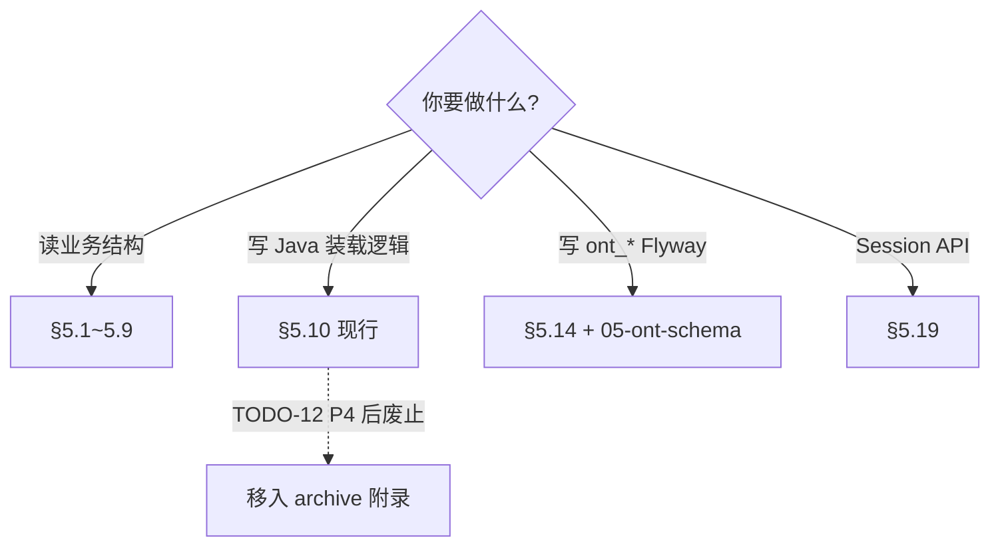
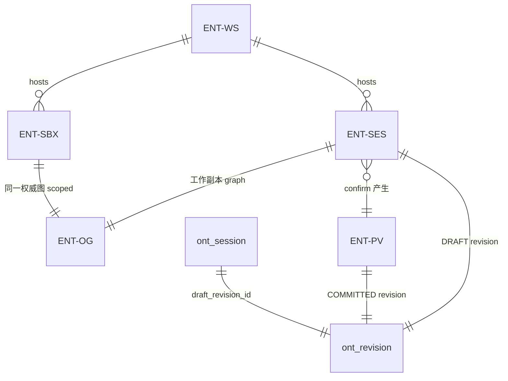
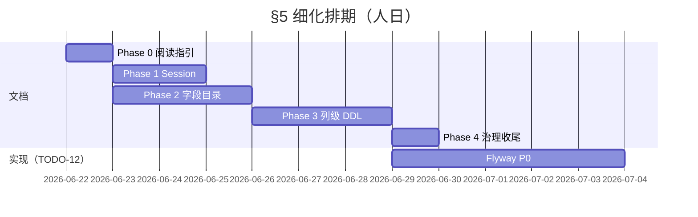

# §5 领域模型细化 Implementation Plan

> **For agentic workers:** REQUIRED SUB-SKILL: Use superpowers:subagent-driven-development (recommended) or superpowers:executing-plans to implement this plan task-by-task. Steps use checkbox (`- [ ]`) syntax for tracking.

**Goal:** 在不扩大 Ontology 业务范围（仍限 MOD-OCP / PROC-S04，见 TODO-20）的前提下，细化 SDD §5：补全平台 Session 模型、实体字段级目录、迁移期阅读指引，并与 TODO-12（ADR-09 `ont_*`）列级对齐，使规范可直接驱动 Flyway 与 `OntologyRestorer` 实现。

**Architecture:** 四块交付物分 **4 个 Phase**，Phase 0（阅读指引）先行；Phase 1（Session）与 Phase 2（字段目录）可并行；Phase 3（列级 DDL）依赖 Phase 2 的实体清单，且与 TODO-12 P0 Schema 同批交付。正文仍集中在 `05-domain-model.md`；列级明细体量过大时拆至 `docs/sdd/volumes/data/05-ont-schema.md` 并在 §5.14 引用。

**Tech Stack:** Markdown SDD · Mermaid · Java 源码对照（`com.plantops.ontology.*`）· Flyway（TODO-12 实现阶段消费本规范）

**跟踪 ID：** 规范待办 **TODO-22**（ADR-15 ENT-RCA）；§5 细化 **TODO-21**。Phase 3 与 **TODO-12 P0** 绑定。

---

## 范围与非目标

| 在范围内 | 不在范围内 |
|----------|------------|
| ENT-SES · ENT-SBX · ENT-PV · `ont_revision` / `ont_session` | MOD-SCH / MOD-SLT 本体（TODO-20） |
| §5.4~5.8 核心 ENT 字段目录 | 重写 §11/§12 external/md/txn 全文 |
| §5.10 vs §5.14 阅读指引 | IAM 用户模型（§18） |
| `ont_*` 列名 · 类型 · 可空 · 索引 | 求解器 Problem/Result（HOW 文档） |

---

## Phase 0：迁移期阅读指引（0.5 天）

**目的：** 新读者不再混读 §5.10（现行）与 §5.14（目标态）。

### Task 0.1：§5 文首增加「如何阅读本章」

**Files:**
- Modify: `docs/sdd/core/05-domain-model.md`（§ 标题下，现有「范围（现行）」之后）

- [ ] **Step 1:** 插入 `## 5.0 如何阅读本章` 小节，含下表：

| 读者意图 | 读哪节 | 何时有效 |
|----------|--------|----------|
| 理解计划本体结构 | §5.1~§5.9 | 始终 |
| 对照**当前代码**装载/confirm | §5.10 | TODO-12 P4 完成前 |
| 设计 **Flyway / Restorer** | §5.14~§5.18 | 目标态；实现以 TODO-12 为准 |
| Session / Sandbox API | §5.19（Phase 1 新增） | Phase 1 完成后 |
| 实体字段全集 | §5.20 附录（Phase 2 新增） | Phase 2 完成后 |
| SQL 列级 DDL | `05-ont-schema.md` 或 §5.14.2 扩展（Phase 3） | TODO-12 P0 |

- [ ] **Step 2:** 增加决策树 Mermaid：



- [ ] **Step 3:** 在 §5.10 标题下加 callout：`> ⚠️ **过渡章节**：TODO-12 P4 完成后收缩为「Legacy 对照表」，主路径改指 §5.14。`

- [ ] **Step 4:** 更新 `docs/sdd/core/00-meta.md` 变更日志一行。

**验收：** 任意评审者可仅凭 §5.0 选对章节，无需口头解释。

---

## Phase 1：平台 Session 模型（1~1.5 天）

**目的：** 统一 ENT-SES / ENT-SBX / ENT-PV 与 `ont_revision` / `ont_session` 的规范描述（现散落在 §2、§5.9、§5.14、§6）。

### Task 1.1：新增 §5.19 平台与 Session

**Files:**
- Modify: `docs/sdd/core/05-domain-model.md`（在 §5.18 之后、回指之前插入 §5.19）
- Modify: `docs/sdd/core/02-glossary.md`（ENT-SES/ENT-SBX/ENT-PV 行增加「详见 §5.19」）
- Modify: `docs/sdd/core/06-api-contracts.md`（API-SES-01~04 增加「领域模型 §5.19」回指）

- [ ] **Step 1:** 写 **§5.19.1 概念关系** Mermaid：



- [ ] **Step 2:** 写 **§5.19.2 ENT-SES（MasterPlanOntologySession）** 属性表（对照 `MasterPlanOntologySession.java`）：

| 字段 | 类型 | 规范说明 | 持久化（目标态） |
|------|------|----------|------------------|
| `sessionId` | `SES-{uuid}` | API 路径键 | `ont_session.session_id` |
| `workspaceId` | string | RULE-WS-01 | `ont_session.workspace_id` |
| `basePlanVersionId` | string? | fixedLoads 来源 | `ont_session.base_revision_id` → revision |
| `graph` | OntologyGraph | ADR-07 权威图工作副本 | DRAFT `ont_*` 行集 |
| `rolEngine` | RolEngine | simulate 用 | 不持久化 |
| `createdAt` / `expiresAt` | datetime | TTL 8h · §9 NFR | `ont_session.expires_at` |
| `solveProfile` | MasterPlanSolveProfile | optimize 参数 | JSON 或 `ont_session.solve_profile_json` |
| `lastOptimizerResult` | OptimizerResult | optimize 摘要 | `ont_session.optimizer_result_json` |
| `lastSolution` | MasterPlanSchedule | **过渡** Timefold 泄漏 | 目标态 **废止**，仅保留 OptimizerResult |

- [ ] **Step 3:** 写 **§5.19.3 ENT-SBX（DeliveryPlanningSandbox）** 属性表（对照 `DeliveryPlanningSandbox.java`）：

| 字段 | 类型 | 规范说明 |
|------|------|----------|
| `sandboxId` | `DPS-{uuid}` | 实现 `OntologySandbox.sessionId()` |
| `deliveryId` | COLD id | scope 根 |
| `baselinePlanVersionId` | string? | CTP fixedLoads |
| `trialRevision` | int | 0=JIT；optimize 递增 |
| `lastOptimizerResult` | OptimizerResult? | 同 SES |

- [ ] **Step 4:** 写 **§5.19.4 ENT-PV（PlanVersion）** 与 revision 绑定：

| 字段 | 说明 |
|------|------|
| `planVersionId` | confirm 产出；API `masterPlanVersionId` |
| `committedRevisionId` | `ont_revision.plan_version_id` 反查 |
| `optimizerScoreSummary` | §15 KPI-MP-TOT 人类可读摘要（TODO-16 结构化） |

- [ ] **Step 5:** 写 **§5.19.5 生命周期对照**（合并 §5.14.1 stateDiagram + API-SES）：

| 操作 | ENT-SES 内存 | ont_*（FULL） | API |
|------|--------------|---------------|-----|
| create | fork graph | fork DRAFT revision | API-SES-01 |
| simulate | ROL → graph | WAL + upsert | API-SES-02 |
| optimize | Optimizer → graph | upsert OP/SRP + WAL | API-SES-03 |
| confirm | persist | DRAFT→COMMITTED · HEAD | API-SES-04 |
| cancel / TTL | 丢弃 | ABANDONED | — |

- [ ] **Step 6:** 标注 **与 ENT-SBX 差异**：SBX 不单独 fork 第二张图（ADR-07）；scoped 子问题见 `PlanningProblem.scopedSupplyOrderIds`。

**验收：** §3 SCN-T01/T02 每条 Then 可在 §5.19 找到对应字段/状态。

---

## Phase 2：实体字段级目录（2~3 天）

**目的：** 把 §5.7 扩展字段表与 Java 源码、§16 规则字段合并为可检索的 **属性目录**。

### Task 2.1：定义目录模板

**Files:**
- Create: `docs/sdd/core/05-domain-model-appendix-fields.md`（若单文件超过 ~400 行则独立；否则作为 §5.20）

- [ ] **Step 1:** 统一表格列：

| 列 | 含义 |
|----|------|
| `属性` | Java 字段 / DB 列 |
| `类型` | Java 类型 · SQL 类型（Phase 3 填） |
| `必填` | Y/N |
| `来源` | `memory` · `md_*` · `txn_*` · `derived` · `solver` · `rol` |
| `RULE/SCN` | 规范锚点 |
| `现状` | `implemented` · `spec-only` · `legacy-only` |

- [ ] **Step 2:** 在 §5 增加 `## 5.20 实体属性目录` 索引表，链到各实体小节。

### Task 2.2：P0 实体目录（与 TODO-12 P0 表族一致）

**源码对照路径：**

| ENT | Java 类 |
|-----|---------|
| ENT-COLD | `ontology/demand/CustomerOrderLineDelivery.java` |
| ENT-DEM | `ontology/demand/Demand.java` |
| ENT-SO | `ontology/supply/SupplyOrder.java` |
| ENT-OP | `ontology/supply/Operation.java` |
| ENT-FF | `ontology/fulfillment/Fulfillment.java` |
| ENT-PISPP | `ontology/period/ProductInStockingPointPeriod.java` |
| ENT-SRP | `ontology/period/StandardResourcePeriod.java` |
| ENT-RS | `ontology/master/RoutingStep.java` |

- [ ] **Step 3:** 逐实体填写属性表。示例 **ENT-OP** 须包含（来自源码，不可遗漏）：

`id`, `supplyOrderId`, `planUnitId`, `sequenceNr`, `routingSequenceNo`, `operationName`, `productionDuration`, `preprocessingTime`, `postprocessingTime`, `segmentIndex`, `lastSegment`, `parallelGroupId`, `locked`, `earliestPossibleStartOwn/EndOwn`, `earliestPossibleStartTotal/EndTotal`, `latestDesiredStart/End`, `plannedStartTotal/EndTotal`, `infeasible`

- [ ] **Step 4:** 对 §5.7 / §16 已列但 **Java 尚未实现** 的字段（如 ENT-COLD 的 `confirmedDeliveryDate`、`targetDeliveryQuantity`）标 `spec-only`，并链到 TODO-10/11。

- [ ] **Step 5:** 补 **ENT-CO**、**ForecastDemand** 小节（当前 §5.4 偏薄）。

### Task 2.3：交叉引用

- [ ] **Step 6:** §4 各 RULE-MP/DEM/FF 增加「字段见 §5.20.x」回指（仅高频 RULE，避免全 §4 大改）。
- [ ] **Step 7:** §16 `BusinessRules` tab 字段与 §5.20 做 1:1 映射表（支撑 TODO-17）。

**验收：** 实现 TODO-12 P0 时，开发者无需再打开 Java 即可知道每张 `ont_*` 表应有哪些业务列（SQL 类型在 Phase 3 补）。

---

## Phase 3：TODO-12 列级对齐（2~3 天，与 TODO-12 P0 同 sprint）

**目的：** §5.14.2 从「表名清单」升级为 **Flyway 可执行的列级规范**。

### Task 3.1：Schema 附录文件

**Files:**
- Create: `docs/sdd/volumes/data/05-ont-schema.md`
- Modify: `docs/sdd/core/05-domain-model.md` §5.14.2 改为摘要 + 链接
- Modify: `docs/sdd/README.md` 文档结构表增加一行
- Modify: `docs/sdd/core/10-decisions-risks.md` TODO-12 P0 交付物增加「§5-ont-schema 列级规范」

### Task 3.2：公共列约定

- [ ] **Step 1:** 所有 `ont_*` 实体表公共列：

```text
workspace_id     VARCHAR(64)  NOT NULL
revision_id      VARCHAR(64)  NOT NULL  FK → ont_revision
entity_id        VARCHAR(128) NOT NULL
created_at       TIMESTAMP    NOT NULL
updated_at       TIMESTAMP    NOT NULL
PRIMARY KEY (workspace_id, revision_id, entity_id)
INDEX idx_{table}_rev (workspace_id, revision_id)
```

- [ ] **Step 2:** 容器表完整 DDL 规范（首批发版）：

| 表 | 优先级 |
|----|--------|
| `ont_revision` | P0 |
| `ont_revision_head` | P0 |
| `ont_change_log` | P0 |
| `ont_session` | P0 |
| `ont_demand` | P0 |
| `ont_supply_order` | P0 |
| `ont_operation` | P0 |
| `ont_fulfillment` | P0 |
| `ont_pispp` | P0 |
| `ont_srp` | P0 |
| `ont_scheduling_slot` | P1 |
| `ont_routing*` | P1 |
| `ont_bom_dependency` | P1 |

### Task 3.3：逐表列定义（示例：`ont_operation`）

- [ ] **Step 3:** 按 Phase 2 属性目录生成列映射表：

| 列名 | SQL 类型 | Java 字段 | 可空 | 说明 |
|------|----------|-----------|------|------|
| `supply_order_id` | VARCHAR(128) | supplyOrderId | N | FK 逻辑 |
| `routing_sequence_no` | INT | routingSequenceNo | N | RULE-MP-06 |
| `planned_start_total` | TIMESTAMP | plannedStartTotal | Y | optimize 写入 |
| `planned_end_total` | TIMESTAMP | plannedEndTotal | Y | optimize 写入 |
| `parallel_group_id` | VARCHAR(64) | parallelGroupId | Y | RULE-MP-08 |
| … | … | … | … | … |

- [ ] **Step 4:** 子表 `ont_operation_osr` / `ont_operation_im` / `ont_operation_om` 同样列级展开。

- [ ] **Step 5:** `ont_session` 列级对齐 §5.19.2：

| 列名 | 类型 | 对应 |
|------|------|------|
| `session_id` | VARCHAR | ENT-SES / DPS id |
| `draft_revision_id` | VARCHAR | FK |
| `base_revision_id` | VARCHAR | nullable |
| `expires_at` | TIMESTAMP | TTL |
| `optimizer_result_json` | JSON/CLOB | OptimizerResult |
| `trial_revision` | INT | SBX 专用；SES 可 0 |

### Task 3.4：视图与 AC 绑定

- [ ] **Step 6:** 将 §5.15 三个视图写成 **CREATE VIEW 规范**（列清单 + JOIN 键）：
  - `v_ont_workspace_head`
  - `v_ont_pispp_balance`（SCN-07a）
  - `v_ont_fulfillment_chain`

- [ ] **Step 7:** 在 §08 AC-PERS 各条增加「schema 对照 §05-ont-schema 表 x」。

**验收（对齐 TODO-12 P0）：**

| AC | 条件 |
|----|------|
| AC-PERS-01 | Restorer 读 P0 表集 ≡ 内存 OG（样本 fixture） |
| Schema review | 每张 P0 表在 `05-ont-schema.md` 有完整列定义，无 TBD 列 |

---

## Phase 4：治理与收尾（0.5 天）

### Task 4.1：TODO 与变更日志

- [ ] **Step 1:** 在 `docs/sdd/core/10-decisions-risks.md` 新增：

| ID | 项 | 负责人 |
|----|-----|--------|
| TODO-21 | **§5 领域模型细化**：§5.0 阅读指引 · §5.19 Session · §5.20 字段目录 · `05-ont-schema` 列级规范 | 架构+产品 |

- [ ] **Step 2:** TODO-12 P0 行末加注：「列级规范见 TODO-21 / `05-ont-schema.md`」。

- [ ] **Step 3:** 更新 `docs/sdd/core/00-meta.md` 变更日志。

### Task 4.2：Draw.io 同步（可选，0.5 天）

- [ ] **Step 4:** `docs/ontology-domain-model.drawio` 增加 Session/revision 泳道；或文首注明「ER 图仅含 ENT-OG 内实体，Session 见 §5.19」。

### Task 4.3：质量自检

- [ ] **Step 5:** 跑 `docs/sdd/README.md` 质量自检清单：
  - 术语在 §2 有定义
  - §5.20 属性名与 §2 ENT 一致
  - 无 `spec-only` 字段未标 TODO
  - §5.10 与 §5.14 无矛盾描述（矛盾处标「过渡」）

---

## 依赖与排期建议



| 阶段 | 人日 | 产出 | 阻塞 |
|------|------|------|------|
| Phase 0 | 0.5 | §5.0 | — |
| Phase 1 | 1~1.5 | §5.19 | Phase 0 |
| Phase 2 | 2~3 | §5.20 / appendix | Phase 0 |
| Phase 3 | 2~3 | `05-ont-schema.md` | Phase 2 P0 实体 |
| Phase 4 | 0.5 | TODO-21 · 交叉引用 | Phase 1~3 |

**建议顺序：** 0 →（1 ∥ 2）→ 3 → 4 → TODO-12 P0 编码。

---

## 风险与缓解

| 风险 | 缓解 |
|------|------|
| Java 字段与 §16 规则字段不一致 | Phase 2 用 `spec-only` / `implemented` 标注；产品确认后再改代码 |
| §5 单文件过长 | 字段目录与 DDL 拆至 appendix / `05-ont-schema.md` |
| TODO-12 与文档分叉 | Flyway PR 必须引用 `05-ont-schema.md` 表版本；AC-PERS 对照 |
| Session 过渡字段（`lastSolution`） | §5.19 标 **废止中**，避免写入 ont_* 规范 |

---

## Self-Review（计划自检）

| 规范需求 | 对应 Task |
|----------|-----------|
| 平台 Session 细化 | Phase 1 · Task 1.1 |
| 字段级目录 | Phase 2 · Task 2.1~2.3 |
| 迁移期阅读指引 | Phase 0 · Task 0.1 |
| TODO-12 列级对齐 | Phase 3 · Task 3.1~3.4 |
| TODO-20 范围边界 | 范围表 · 不扩 MOD-SCH/SLT |
| TODO-07 求解器 | 仅 §5.19 提 OptimizerResult，不展开 HOW |

无 TBD 步骤；列表示例已给出 `ont_operation` / `ont_session` 最小集。

---

**Plan complete and saved to `docs/superpowers/plans/2026-06-21-sdd-domain-model-refinement.md`.**

**Two execution options:**

1. **Subagent-Driven（recommended）** — 按 Phase 分派子任务，每 Phase 完成后评审再继续  
2. **Inline Execution** — 在本会话按 Phase 0→1→2→3→4 直接改 SDD 文件  

**Which approach?**
