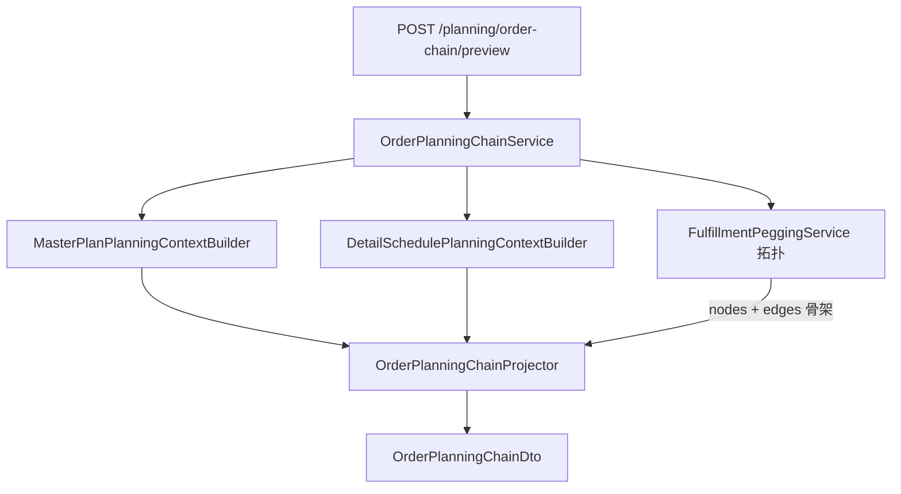

# 订单推演链（方案 B）设计

## 目标

在 **不求解 Timefold** 的前提下，基于 `MasterPlanPlanningContext` + `DetailSchedulePlanningContext`，为单条销售订单行生成 **全链条可视化数据**，并支持 **试算参数调整** 后与基准对比。

用户可在前端看到：需求 → BOM/物料 → 工单 → 工序 → 资源可行槽，以及每层推演信号（齐套、MRP、无槽、时窗回退、并行等）。

## 非目标（首期）

- 内存覆写交期/数量/库存（方案 C，后续 v3）
- 试算结果持久化为 plan version
- 替代现有 `FulfillmentPeggingService` 的全局 pegging 逻辑（首期与之并存，逐步迁移「需求满足」页数据源）
- 分钟级 S05 精确排程时间（试算阶段仅展示契约字段 + kitting/绑定信号，不求解 `line/startMinute`）

---

## 架构



### 职责划分

| 类 | 包 | 职责 |
|----|-----|------|
| `OrderPlanningChainService` | `scenario/planning` | 解析请求、构建双 Context、调用 Projector、可选加载基准求解窗口 |
| `OrderPlanningChainProjector` | `scenario/planning` | 将 Context + peg 拓扑投影为订单链 DTO；挂载 `planningSignals` |
| `OrderPlanningChainPreviewRequest` | `api/dto/planning` | REST 入参 |
| `OrderPlanningChainDto` | `api/dto/planning` | REST 出参（节点/边/摘要/对比） |
| `PlanningResource` | `api` | 新增 preview 端点 |

**原则**：拓扑（BOM peg、工单依赖边）复用 `FulfillmentPeggingService` 的图构建；**时间与风险**来自 PlanningContext，不再用 lead-time 启发式填充工单/工序条。

---

## REST API

### 试算预览

```http
POST /api/v1/planning/order-chain/preview
Content-Type: application/json
```

**Request**

```json
{
  "salesOrderNo": "SO-2024-001",
  "salesOrderLineNo": 1,
  "masterPlanStrategyId": "default-finite",
  "feedbackCutoff": "2026-05-28",
  "useFeedbackOverlay": true,
  "detailScheduleMasterPlanVersionId": "mp-v123",
  "baselineMasterPlanVersionId": "mp-v100"
}
```

| 字段 | 必填 | 说明 |
|------|------|------|
| `salesOrderNo` / `salesOrderLineNo` | 是 | 目标订单行 |
| `masterPlanStrategyId` | 否 | 同 diagnostics preview；缺省用当前策略 |
| `useFeedbackOverlay` + `feedbackCutoff` | 否 | 同主计划推演诊断 |
| `detailScheduleMasterPlanVersionId` | 否 | 非空则构建 S05 Context（契约来源） |
| `baselineMasterPlanVersionId` | 否 | 非空则在节点上附加 **求解后** 对比窗口（`solvedWindow`） |

**Response**：`OrderPlanningChainDto`（见下）

### 与现有 API 关系

| 现有 | 新 API |
|------|--------|
| `GET .../fulfillment-chain` | 保留；「需求满足」页逐步切换或提供 Tab「推演视图 / 满足视图」 |
| `GET .../diagnostics/preview` | 订单链节点可跳转/global 摘要仍用全局诊断 |
| `POST .../master-plan/solve` | 试算页「正式求解」按钮仍调用此接口 |

---

## 数据模型

### `OrderPlanningChainDto`

```java
record OrderPlanningChainDto(
    String salesOrderNo,
    int salesOrderLineNo,
    String productCode,
    LocalDate dueDate,
    LocalDate promiseDate,
    String overallStatus,           // OK | AT_RISK | BLOCKED
    OrderPlanningChainSummary summary,
    List<OrderPlanningChainNodeDto> nodes,
    List<FulfillmentPegEdgeDto> edges,   // 复用现有 peg 边 DTO
    OrderPlanningChainCompareDto compare   // nullable
)
```

### `OrderPlanningChainSummary`

| 字段 | 来源 |
|------|------|
| `capacityStrategy` | S04 Context |
| `inventorySnapshotId` | MaterialPlanningContext |
| `workOrderCount` | 链上工单数 |
| `operationCount` | S04 分配 + S05 工序数 |
| `issueCountBySeverity` | 该订单相关 diagnostics issue 聚合 |
| `computedAt` | 构建时间 |

### `OrderPlanningChainNodeDto`

在 `FulfillmentChainNodeDto` 基础上扩展（或组合），首期字段：

| 字段 | 说明 |
|------|------|
| `nodeId`, `nodeType`, `laneId`, `label`, `depth` | 与现有满足链一致 |
| `productCode`, `quantity` | |
| `windowStart`, `windowEnd` | **推演窗**：LocalDate（槽位 min/max 或契约窗） |
| `status` | `OK` / `WARN` / `BLOCKED` / `SKIPPED` |
| `planningLayer` | `PEG` / `S04` / `S05` |
| `planningSignals` | `List<PlanningSignalDto>` |
| `operations` | 工序子行（工单节点下） |
| `attributes` | workOrderNo、eligibleSlotCount、earliestFeasibleDate 等 |

### `PlanningSignalDto`

```java
record PlanningSignalDto(
    String severity,      // INFO | WARN | SKIP
    String reasonCode,    // PlanningDiagnosticCodes
    String message,
    String entityId       // allocationId / operationId
)
```

### `OrderPlanningChainCompareDto`（可选）

当传入 `baselineMasterPlanVersionId` 时：

| 字段 | 说明 |
|------|------|
| `baselineVersionId` | |
| `trialLabel` / `baselineLabel` | 前端展示用 |
| `nodeDeltas` | `{ nodeId, baselineStart, baselineEnd, trialStart, trialEnd, statusChanged }` |

---

## 节点类型与推演挂载规则

| nodeType | 拓扑来源 | 推演数据（S04） | 推演数据（S05） |
|----------|----------|-----------------|-----------------|
| `SALES_ORDER` | Pegging | 交期 vs 子树最早可行 | — |
| `MATERIAL` | Pegging | MRP：`MaterialFeasibilityContext` 该料号首次短缺日 | — |
| `WORK_ORDER` | Pegging | 该 WO 全部 `OrderAllocation`；WO 级 diagnostics | 该 WO 全部 `OperationAssignment` |
| `OPERATION` | Projector 展开 | eligible 槽 min/max date、parallelGroup、timing | kittingEligible、mpContract*、pairGroup |
| `RESOURCE_SLOT` | 可选 v1.1 | eligible 槽列表摘要（count + 首尾 date） | — |

### 时间窗计算（试算，非求解）

**工序 / 工单节点（S04）**

- `windowStart` = 所有相关 allocation 的 `eligibleTimeSlots` 日期 **min**（空则节点 `BLOCKED`）
- `windowEnd` = eligible 日期 **max**；若多段拆段则按 segment 分别展示在 `operations` 子行
- 若存在 diagnostics issue（`ALLOC_NO_RESOURCE_SLOTS` 等）→ `status` 降级

**工序节点（S05）**

- 有 `mpContractStartDate`/`mpContractEndDate` → 用作 window
- 否则 `mpTargetEndDate` 单日窗 + `WARN`（`OP_MP_TARGET_FALLBACK`）
- `kittingEligible=false` → 工序 `BLOCKED`

**整体 status**

- 任一节点 `BLOCKED` → 链 `BLOCKED`
- 否则任一 `WARN` → `AT_RISK`
- 否则 `OK`

### 与求解结果对比

传入 `baselineMasterPlanVersionId` 时，对链上 `WORK_ORDER` 节点调用现有 `MasterPlanService.resolveWorkOrderWindow`，写入 `attributes.solvedWindow` 与 `compare.nodeDeltas`。试算窗 vs 求解窗差异在前端高亮。

---

## 服务流程

```text
1. 校验 salesOrderLine 存在
2. 解析 masterPlanStrategy → build MasterPlanPlanningContext
    （共享 MaterialPlanningContext；可选 feedback overlay）
3. 若 detailScheduleMasterPlanVersionId 非空
     → build DetailSchedulePlanningContext(same material context)
4. FulfillmentPeggingService.build(order, kittingStatus, null)
     → 仅取 nodes/edges 拓扑（忽略其内部时间推算）
5. OrderPlanningChainProjector.project(topology, mpCtx, dsCtx, orderLine)
     → 填充 window、signals、operations
6. 从 mpCtx.diagnostics().issues 过滤 workOrderNo ∈ 链上 WO
7. 可选 baseline 对比
8. 返回 DTO
```

**性能**：单次 rebuild Context 与全局 diagnostics preview 同级（毫秒～百毫秒）；不做 Timefold。

---

## 前端

### 入口

**计划分析 → 需求满足** 增加视图切换：

- **满足视图**（默认）：现有 `FulfillmentPeggingService` + 求解版本叠加
- **推演视图**（新）：调用 `order-chain/preview`

或独立路由：`/master-plan/analysis/order-chain`（推荐，避免单页过挤）。

### 布局

```
┌─────────────────────────────────────────────────────────┐
│ 订单选择 │ 策略 │ □反馈overlay │ 截止日 │ [刷新试算] [正式求解] │
├──────────────────┬──────────────────────────────────────┤
│ 节点树 / 信号列表  │ FulfillmentChainSyncView（复用）        │
│ （选中节点详情）   │ + 推演徽章 WARN/BLOCKED               │
├──────────────────┴──────────────────────────────────────┤
│ 可选：与 baseline 版本对比条（trial vs solved 色差）      │
└─────────────────────────────────────────────────────────┘
```

### 组件

| 组件 | 说明 |
|------|------|
| `OrderPlanningChainPage` | 新页面：参数栏 + 试算逻辑 |
| `PlanningSignalBadge` | reasonCode → 中文标签（复用 `planningDiagnosticsModel`） |
| `OrderChainNodeDetail` | 侧栏：eligible 槽数量、契约字段、issue 列表 |
| `FulfillmentChainSyncView` | **复用**；`tasks` 由 `orderPlanningChainToGanttTasks()` 生成 |

### 试算交互（v1）

- 改策略 / overlay → 自动或手动刷新 preview
- 选中节点 → 侧栏展示 `planningSignals`
- 「正式求解」→ 现有 `solveMasterPlan` + 刷新 PlanContext

---

## 实现分期

### Phase 1 — 后端 MVP（核心）

- [ ] DTO：`OrderPlanningChainPreviewRequest`, `OrderPlanningChainDto`, `PlanningSignalDto`, …
- [ ] `OrderPlanningChainProjector`：SO + WO + OPERATION 节点；S04 eligible 窗 + signals
- [ ] `OrderPlanningChainService` + `PlanningResource` POST 端点
- [ ] 单元测试：Projector 对 fixture Context 的 window/status 断言
- [ ] 集成测试：sample 数据下一订单 preview 200

### Phase 2 — 前端推演页

- [ ] `api.orderChainPreview`
- [ ] `OrderPlanningChainPage` + 路由 + Layout 导航
- [ ] Gantt 适配器 `orderPlanningChainToGanttTasks`
- [ ] 信号徽章 + 节点详情侧栏

### Phase 3 — S05 + 对比

- [ ] Projector 挂载 S05 kitting / mpContract
- [ ] `baselineMasterPlanVersionId` 对比 UI
- [ ] 与全局「推演诊断」页 cross-link（点击 issue 跳转订单链）

### Phase 4 — 文档

- [ ] `aps-planning-layer.md` 新增 §8.5 订单推演链
- [ ] 更新 §4.2 并行描述（与实现一致）

---

## 测试要点

| 场景 | 期望 |
|------|------|
| 正常订单 | 链 OK；工序 window = eligible min/max |
| 无工艺 WO | WO 节点 SKIP + `WO_NO_ROUTING` |
| 无 eligible 槽 | 工序 BLOCKED + `ALLOC_NO_RESOURCE_SLOTS` |
| 时窗回退 | WARN + `ALLOC_TIMING_FALLBACK`；仍有 window |
| 齐套失败 | S05 工序 BLOCKED + `WO_KITTING_SHORT` |
| 改策略试算 | window/signals 变化；compare 可选 |
| 无 baseline | `compare` 为 null |

---

## 开放问题（实现前默认）

1. **MATERIAL 节点 MRP 信号**：v1 仅标记首次短缺日；不按日展开曲线（避免与「物料需求」页重复）。
2. **RESOURCE_SLOT 子节点**：v1 不展开；仅在 operation attributes 中给 `eligibleSlotCount` + date range。
3. **需求满足页**：v1 保留双视图；v2 再考虑默认切到推演视图。

---

## 修订记录

| 日期 | 说明 |
|------|------|
| 2026-05-30 | 初版：方案 B 订单推演链 API + 前端推演页 |
