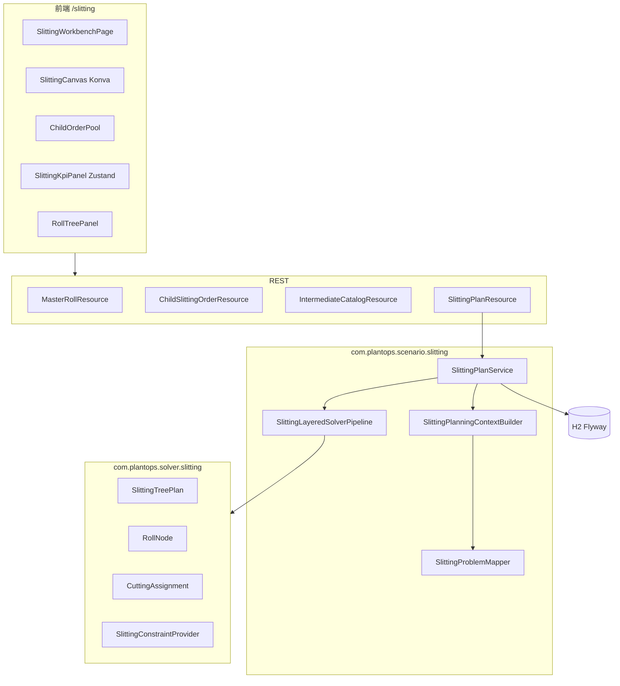
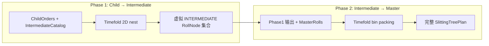

# 分切排样（Tree-Structured Cutting Stock）设计

## 目标

在 Plant Operation Plan 中新增 **分切排样** 垂直模块，解决薄膜/纸张/金属卷材的多层级嵌套切割下料问题（Tree-Structured Cutting Stock Problem）。

首版（v1）交付：

1. **P0** — 领域持久化、CRUD API、APS 外键预留、Demo 数据
2. **P1** — Timefold 单层 2D 装箱（硬约束 + 基础软约束）
3. **P2** — Konva 交互画板（拖放、SAT 碰撞、余料着色、实时 KPI）
4. **P3** — 三层树 MASTER → INTERMEDIATE → CHILD，自底向上两阶段求解

**v1 不含（P4，下一迭代）：** 锁定区域 + 局部 Timefold 重算、Auto-Nest Session API、从 S01 一键导入子订单。

---

## 已确认决策

| 项 | 结论 |
|----|------|
| 与 APS 关系 | **方案 C** — 独立模块；P0 预留 `sales_order_no` + `sales_order_line_no` + `work_order_no` 外键（均可 NULL） |
| 首版范围 | **P0 + P1 + P2 + P3**（不含 P4） |
| 尺寸单位 | 全部 **毫米（mm）**，库内 `DECIMAL(18,4)` 或整数 mm |
| 切型枚举 | `LONGITUDINAL` / `TRANSVERSE` / `LASER` 均保留；v1 约束与刀缝模型共用，不做激光路径特殊逻辑 |
| Canvas 库 | `konva` + `react-konva` |
| 画板状态 | `zustand`（仅此模块引入） |
| 求解引擎 | Timefold 2.0（与现有 S04/S05 一致） |
|  workspace | 所有表继承 `workspace_id`，与现有多租户模式一致 |

---

## 域边界

| 属于分切排样域 | 不属于 / v1 不改动 |
|----------------|-------------------|
| 母卷池、子订单、中间卷规格、方案版本 | S04 主计划、S05 详细排程求解逻辑 |
| `SlittingTreePlan` / 分层 Pipeline | MRP、齐套、批次拆批 |
| Konva 画板与 assignments 持久化 | 真实 MES 下发 |
| 外键字段预留 | 强制 DB 级 FK 到 `sales_order_line` / `work_order` |

**原则：** 分切排样可独立运行（手工录入母卷与子订单）；与 APS 的挂接通过可空外键字段与后续导入 API 实现，v1 不要求打通 S01/S05 流水线。

---

## 逻辑架构

沿用项目 **L1 持久化 → L2 推演 Context → L3 Timefold** 分层（见 `docs/scheduling-domain-model.md`、`docs/aps-planning-layer.md`）。



### 建议包结构

```text
com.plantops.persistence.entity/     MasterRollEntity, ChildSlittingOrderEntity, ...
com.plantops.api/                      SlittingPlanResource, MasterRollResource, ...
com.plantops.api.dto.slitting/         Java record DTOs
com.plantops.scenario.slitting/        SlittingPlanService, ContextBuilder, ProblemMapper, Pipeline
com.plantops.solver.slitting/          SlittingTreePlan, RollNode, CuttingAssignment, ConstraintProvider
frontend/src/pages/slitting/           页面
frontend/src/components/slitting/      画板组件
frontend/src/store/slitting/           Zustand store
```

导航：在 `Layout.tsx` 新增 **「分切排样」** 分组，路由前缀 `/slitting/`。

---

## 数据模型（P0）

### Flyway

- `V49__slitting_nest.sql` — 表结构
- `V49_1__slitting_nest_seq.sql` — 序列（若需业务编号）

### 表：`master_roll`

| 列 | 类型 | 说明 |
|----|------|------|
| `id` | BIGSERIAL PK | |
| `workspace_id` | VARCHAR(64) NOT NULL | |
| `roll_code` | VARCHAR(128) NOT NULL | 业务编号，workspace 内唯一 |
| `width_mm` | DECIMAL(18,4) NOT NULL | 纵切方向宽度 |
| `length_mm` | DECIMAL(18,4) NOT NULL | 横切方向长度 |
| `thickness_mm` | DECIMAL(18,4) | 可选 |
| `material_code` | VARCHAR(64) | 物料编码 |
| `kerf_longitudinal_mm` | DECIMAL(18,4) NOT NULL DEFAULT 0 | 纵切刀缝 |
| `kerf_transverse_mm` | DECIMAL(18,4) NOT NULL DEFAULT 0 | 横切刀缝 |
| `status` | VARCHAR(32) NOT NULL DEFAULT 'AVAILABLE' | `AVAILABLE` / `CONSUMED` / `ARCHIVED` |
| `created_ts` | TIMESTAMP NOT NULL DEFAULT CURRENT_TIMESTAMP | |

唯一约束：`(workspace_id, roll_code)`

### 表：`child_slitting_order`

| 列 | 类型 | 说明 |
|----|------|------|
| `id` | BIGSERIAL PK | |
| `workspace_id` | VARCHAR(64) NOT NULL | |
| `order_code` | VARCHAR(128) NOT NULL | workspace 内唯一 |
| `width_mm` | DECIMAL(18,4) NOT NULL | 成品宽 |
| `length_mm` | DECIMAL(18,4) NOT NULL | 成品长 |
| `thickness_mm` | DECIMAL(18,4) | |
| `quantity` | INT NOT NULL DEFAULT 1 | 相同规格件数（展开为多个 CHILD 节点或 quantity 字段） |
| `priority` | INT NOT NULL DEFAULT 0 | 求解优先级 |
| `sales_order_no` | VARCHAR(128) NULL | **预留** APS 挂接 |
| `sales_order_line_no` | INT NULL | **预留** APS 挂接 |
| `work_order_no` | VARCHAR(128) NULL | **预留** APS 挂接 |
| `status` | VARCHAR(32) NOT NULL DEFAULT 'OPEN' | `OPEN` / `PLANNED` / `ARCHIVED` |
| `created_ts` | TIMESTAMP NOT NULL DEFAULT CURRENT_TIMESTAMP | |

唯一约束：`(workspace_id, order_code)`

索引：`(workspace_id, sales_order_no, sales_order_line_no)`、`(workspace_id, work_order_no)`

**外键约定：** 不设 DB 级 FK；应用层校验引用存在性（导入 API 时使用）。

### 表：`intermediate_roll_catalog`

| 列 | 类型 | 说明 |
|----|------|------|
| `id` | BIGSERIAL PK | |
| `workspace_id` | VARCHAR(64) NOT NULL | |
| `spec_code` | VARCHAR(128) NOT NULL | 标准规格编码 |
| `width_mm` | DECIMAL(18,4) NOT NULL | |
| `length_mm` | DECIMAL(18,4) NOT NULL | |
| `cutting_method` | VARCHAR(32) NOT NULL | `LONGITUDINAL` / `TRANSVERSE` / `LASER` |
| `kerf_mm` | DECIMAL(18,4) NOT NULL DEFAULT 0 | |
| `active` | BOOLEAN NOT NULL DEFAULT TRUE | |

唯一约束：`(workspace_id, spec_code)`

### 表：`slitting_plan_version`

| 列 | 类型 | 说明 |
|----|------|------|
| `id` | BIGSERIAL PK | |
| `workspace_id` | VARCHAR(64) NOT NULL | |
| `plan_version_id` | VARCHAR(64) NOT NULL | 业务 ID，类似 `plan_version` |
| `name` | VARCHAR(256) | |
| `status` | VARCHAR(32) NOT NULL | `DRAFT` / `SOLVED` / `ARCHIVED` |
| `score` | VARCHAR(64) | Timefold score 字符串 |
| `utilization_pct` | DECIMAL(8,4) | 材料利用率 0–100 |
| `solve_duration_ms` | BIGINT | |
| `solver_phase` | VARCHAR(32) | 最后完成阶段：`PHASE1` / `PHASE2` / `COMPLETE` |
| `created_ts` | TIMESTAMP NOT NULL DEFAULT CURRENT_TIMESTAMP | |

唯一约束：`(workspace_id, plan_version_id)`

### 表：`slitting_plan_master_roll`（方案选用的母卷）

| 列 | 说明 |
|----|------|
| `plan_version_id` | FK 逻辑关联 |
| `master_roll_id` | 选用的母卷 |

### 表：`slitting_plan_child_order`（方案选用的子订单）

| 列 | 说明 |
|----|------|
| `plan_version_id` | |
| `child_slitting_order_id` | |

### 表：`slitting_roll_node`

| 列 | 类型 | 说明 |
|----|------|------|
| `id` | BIGSERIAL PK | |
| `workspace_id` | VARCHAR(64) NOT NULL | |
| `plan_version_id` | VARCHAR(64) NOT NULL | |
| `node_id` | VARCHAR(64) NOT NULL | 树内唯一 |
| `node_type` | VARCHAR(32) NOT NULL | `MASTER` / `INTERMEDIATE` / `CHILD` |
| `parent_node_id` | VARCHAR(64) NULL | 根为 NULL |
| `width_mm` | DECIMAL(18,4) NOT NULL | |
| `length_mm` | DECIMAL(18,4) NOT NULL | |
| `thickness_mm` | DECIMAL(18,4) | |
| `cutting_method` | VARCHAR(32) | |
| `kerf_mm` | DECIMAL(18,4) | 该节点下刀缝 |
| `source_spec_code` | VARCHAR(128) NULL | INTERMEDIATE 匹配 catalog 时填写 |
| `source_child_order_id` | BIGINT NULL | CHILD 来源订单 |
| `source_master_roll_id` | BIGINT NULL | MASTER 来源母卷 |

唯一约束：`(workspace_id, plan_version_id, node_id)`

### 表：`slitting_assignment`

| 列 | 类型 | 说明 |
|----|------|------|
| `id` | BIGSERIAL PK | |
| `workspace_id` | VARCHAR(64) NOT NULL | |
| `plan_version_id` | VARCHAR(64) NOT NULL | |
| `assignment_id` | VARCHAR(64) NOT NULL | |
| `child_node_id` | VARCHAR(64) NOT NULL | 被放置节点（CHILD 或 INTERMEDIATE 块） |
| `parent_node_id` | VARCHAR(64) NOT NULL | 容器节点 |
| `pos_x_mm` | DECIMAL(18,4) NOT NULL | |
| `pos_y_mm` | DECIMAL(18,4) NOT NULL | |
| `rotated` | BOOLEAN NOT NULL DEFAULT FALSE | |
| `sequence` | INT | 加工顺序 |

唯一约束：`(workspace_id, plan_version_id, assignment_id)`

### Demo 数据

Seed 或 `sample-data` 补充：

- 2 张母卷（如 1200×5000 mm，刀缝 2 mm）
- 8–12 条子订单（多种宽高）
- 3–5 条标准 INTERMEDIATE 规格

---

## 领域模型与 Timefold（P1 + P3）

### 枚举与值对象

```java
enum RollType { MASTER, INTERMEDIATE, CHILD }
enum CuttingMethod { LONGITUDINAL, TRANSVERSE, LASER }
record Dimensions(double widthMm, double lengthMm, double thicknessMm) { ... }
```

### 核心类

| 类 | 注解/角色 |
|----|-----------|
| `RollNode` | Problem Fact；`nodeId`, `type`, `dimensions`, `cuttingMethod`, `kerfWidth`, `parent`, `children` |
| `CuttingAssignment` | `@PlanningEntity`；`childNode`, `parentNode`, `positionX`, `positionY`, `isRotated`, `sequence` |
| `SlittingTreePlan` | `@PlanningSolution`；`masterRolls`, `requiredChildOrders`, `intermediateCatalog`, `assignments`, `score` |
| `SlittingProblemFacts` | 层级废料权重、求解参数 |
| `SlittingConstraintProvider` | Constraint Streams 硬/软约束 |

**派生逻辑（非持久化）：**

- `getTotalChildrenWidth()` — 子节点宽度 + 刀缝累加
- `calculateWaste()` — 父容器面积 − 已放置子块面积

### 分层求解流水线（P3）

放弃单一大一统 `@PlanningSolution` 全局树搜索，采用 **两阶段 Pipeline**：



**Phase 1 — Child → Intermediate**

- 输入：全部 CHILD 需求（按 `quantity` 展开）+ `intermediate_roll_catalog`
- 求解：将 CHILD 装入候选 INTERMEDIATE 容器（可旋转）；容器尺寸优先匹配 catalog
- 输出：一组 INTERMEDIATE `RollNode`，每个带已分配 CHILD 的 assignments
- 非标容器：允许求解器生成非 catalog 尺寸，软约束 `nonStandardIntermediatePenalty` 惩罚

**Phase 2 — Intermediate → Master**

- 输入：Phase 1 的 INTERMEDIATE 矩形块 + 真实 MASTER 母卷
- 求解：INTERMEDIATE 作为整体块装入 MASTER（二维 AABB）
- 输出：完整树 + 全局 score + utilization

每阶段独立 `SolverManager` 配置，默认时限各 30s（可写入 `system_parameter` 或方案级参数）。

**构造启发式：** 两阶段均使用 FFD（按面积降序）初始化。

### 约束流

#### 硬约束

| 约束名 | 规则 |
|--------|------|
| `capacityWidthExceeded` | 同 parent 下 `Sum(child.effectiveWidth + kerf) ≤ parent.width`（纵切累加方向） |
| `boundaryOverflow` | `posX + width ≤ parent.width` 且 `posY + length ≤ parent.length` |
| `noOverlap` | 同 parent 下任意两 assignment 的 AABB 不相交 |
| `childMustBeLeaf` | CHILD 的 parent 必须为 INTERMEDIATE |
| `intermediateMustHangOnMaster` | INTERMEDIATE 的 parent 必须为 MASTER |

#### 软约束（v1）

| 约束名 | 说明 |
|--------|------|
| `wasteAreaByDepth` | MASTER 层未利用面积权重 > INTERMEDIATE 层 |
| `nonStandardIntermediatePenalty` | INTERMEDIATE 尺寸偏离 catalog |
| `toolingChangePenalty` | 同 parent 下相邻 assignment 的 `cuttingMethod` 不同 |

#### 增量分数

启用 Timefold 默认增量计分；assignment 变更时仅重算受影响 parent 子树。

---

## 应用层 API

Base path: `/api/slitting`

| 方法 | 路径 | 说明 |
|------|------|------|
| GET | `/master-rolls` | 列表 |
| POST | `/master-rolls` | 创建 |
| PUT | `/master-rolls/{rollCode}` | 更新 |
| DELETE | `/master-rolls/{rollCode}` | 删除/归档 |
| GET | `/child-orders` | 列表 |
| POST | `/child-orders` | 创建（外键可空） |
| PUT | `/child-orders/{orderCode}` | 更新 |
| DELETE | `/child-orders/{orderCode}` | 删除/归档 |
| GET | `/intermediate-catalog` | 标准规格列表 |
| POST | `/intermediate-catalog` | 创建 |
| PUT | `/intermediate-catalog/{specCode}` | 更新 |
| DELETE | `/intermediate-catalog/{specCode}` | 删除 |
| GET | `/plans` | 方案版本列表 |
| POST | `/plans` | 创建方案 `{ name, masterRollCodes[], childOrderCodes[] }` |
| GET | `/plans/{planVersionId}` | 详情（score、utilization、status） |
| GET | `/plans/{planVersionId}/tree` | 树 + assignments（画板） |
| POST | `/plans/{planVersionId}/solve` | 触发分层求解 |
| PUT | `/plans/{planVersionId}/assignments` | 保存手工调整（不求解） |

**v1 stub（接口定义、实现可返回 501）：**

- `POST /child-orders/from-demand` — 从销售订单行批量生成

### `SlittingPlanService` 流程

1. `createPlan(request)` — 持久化 DRAFT 方案 + 选用母卷/子订单
2. `buildContext(planVersionId)` → `SlittingPlanningContext`
3. `layeredSolverPipeline.solve(context)` → `SlittingTreePlan`
4. `persistResult(planVersionId, nodes, assignments, score, utilizationPct)`
5. 返回 `SlittingPlanResultDto`

---

## 前端设计（P2）

### 路由

| 路径 | 页面 |
|------|------|
| `/slitting/master-data` | 母卷、中间卷规格、子订单管理 |
| `/slitting/workbench` | 画板工作台 |
| `/slitting/plans` | 方案列表 |

### 画板布局

```
┌─────────────────────────────────────────────────────────┐
│ 工具栏：选择方案 | 求解 | 保存 | 缩放 | 旋转(R) | KPI  │
├──────────┬──────────────────────────────┬───────────────┤
│ 订单池   │  Konva Stage                 │  树形结构     │
│ (DragSource) │ 母卷边界 / 块 / 余料着色 │  MASTER       │
│          │  SAT 碰撞红色预警            │   └ INTER...  │
└──────────┴──────────────────────────────┴───────────────┘
```

### 状态与数据流

- `useSlittingWorkbenchStore`（Zustand）：`planVersionId`, `nodes`, `assignments`, `activeParentNodeId`, `utilizationPct`, `wastePct`
- 加载：`GET /plans/{id}/tree`
- 拖放：本地 SAT → 更新 assignments → 重算 KPI
- 保存：`PUT /assignments`
- 求解：`POST /solve` → 刷新 store

### KPI（前端本地，毫秒级）

```
utilizationPct = sum(placedChildArea) / sum(masterRollArea) × 100
wastePct = 100 - utilizationPct
```

### 多层可视化

- 默认画布：MASTER 层，显示 INTERMEDIATE 块
- 点击 INTERMEDIATE：切换 `activeParentNodeId`，画布展示该节点下 CHILD 布局
- 树面板与画布节点双向高亮

### 依赖

```json
"konva": "^9.x",
"react-konva": "^18.x",
"zustand": "^5.x"
```

---

## 实施顺序（6 Sprint）

| Sprint | 交付 | 验收 |
|--------|------|------|
| **S1** | P0：Flyway、Entity、CRUD API、Demo 数据 | Postman/测试可 CRUD；外键字段可 NULL |
| **S2** | P1a：单 MASTER + CHILD Timefold、硬约束、单元测试 | Demo 数据 hard score = 0 |
| **S3** | P1b：`SlittingPlanService.solve`、结果持久化 | `POST /solve` 返回 utilization |
| **S4** | P3：Phase1 + Phase2 Pipeline、软约束 | 三层树持久化正确 |
| **S5** | P2a：画板骨架、母卷渲染、拖放、SAT | 本地 KPI 与碰撞预警 |
| **S6** | P2b：多层钻取、树面板、求解/保存闭环 | 端到端演示路径通 |

S4 与 S5 可部分并行（前后端分工）。

---

## 测试策略

| 层 | 内容 |
|----|------|
| `SlittingConstraintProviderTest` | 硬约束违规/满足用例 |
| `SlittingLayeredSolverPipelineTest` | Demo 数据可行解、utilization > 0 |
| `@QuarkusTest` | REST CRUD + solve 集成 |
| 前端 | `satCollision.test.ts` 纯函数；画板手工验收清单 |

---

## 风险与缓解

| 风险 | 缓解 |
|------|------|
| 两阶段求解次优 | v1 接受；P4 可加 Session 局部 refinement |
| 树约束实现复杂 | 分 Phase，每 Phase 仅两层父子 |
| 非标 INTERMEDIATE 组合爆炸 | catalog 软约束 + 求解时限 |
| Konva 多层 UX | 单 Stage + `activeParentNodeId` 钻取 |

---

## 后续迭代（P4+）

- `SlittingSessionService`（参考 `DetailScheduleSessionService`）：锁定 assignments、pinned 重算
- Auto-Nest：空白区域填充
- `POST /child-orders/from-demand` 完整实现
- 方案版本对比、与工单下发衔接

---

## 参考

- 业务设计 PDF：Tree-Structured Cutting Stock（1780504342596）
- 现有 Timefold 模式：`MasterPlanSchedule`、`DetailSchedule`
- 人机 Session 参考：`DetailScheduleSessionService`、`ScheduleSessionWorkbench`
- 项目分层：`docs/scheduling-domain-model.md`、`docs/aps-planning-layer.md`
